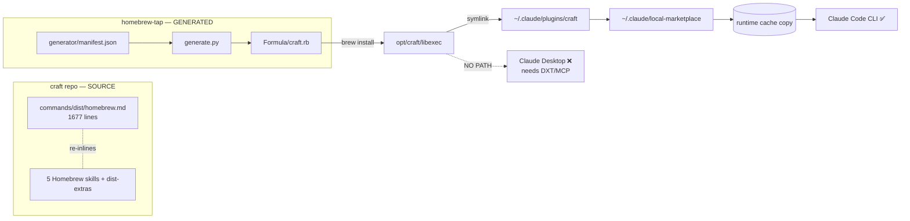

# BRAINSTORM: Distribution-Surface Hardening

- **Date:** 2026-07-01 · **Depth/Focus:** Default · arch · **Via:** `/craft:workflow:brainstorm --refine`
- **Spec:** [`docs/specs/SPEC-dist-surface-hardening-2026-07-01.md`](docs/specs/SPEC-dist-surface-hardening-2026-07-01.md)

## Trigger

"Investigate craft's Homebrew command + skills; map plugin distribution for Claude Code vs
Claude Chat Desktop; then spec → goals → implement via dynamic workflow."

## What the 3-agent investigation found

```
A · Source-surface hygiene   craft's dist docs are STALE (counts, auth, phantom formula, bad
                             manifest example) and Desktop is invisible in the 5 hb skills
B · Code-CLI robustness      the tap install path SILENTLY fails (jq optional-but-required,
                             no-op when claude off PATH, version drift, cache accretion,
                             success-reported-while-absent)
C · Desktop gap              FORMAT INCOMPATIBLE — Code = prompt assets, Desktop = runnable
                             MCP server (DXT); craft can't install on Desktop without a bridge
```

## Architecture view



## Decisions locked (brainstorm)

- Scope: **A + B implement**, **C document + defer**.
- Fix order: cheapest-first (counts → manifest example → phantom refs → auth → Desktop xref → tap hardening).
- Constraint: tap formula is GENERATED — all B fixes go through `generate.py`, never hand-edit `.rb`.

## Open forks (→ grill)

1. **jq**: promote to a real Homebrew dependency, or keep optional + hard-fail message? (affects every claude-plugin formula)
2. **A7 de-inline** the 1677-line command → references: this pass or a separate refactor?
3. Two independent PRs (craft-A, tap-B) vs one coordinated — recommend independent.

## Next

Verify fixes adversarially → grill → two-workstream dynamic workflow → implement.
