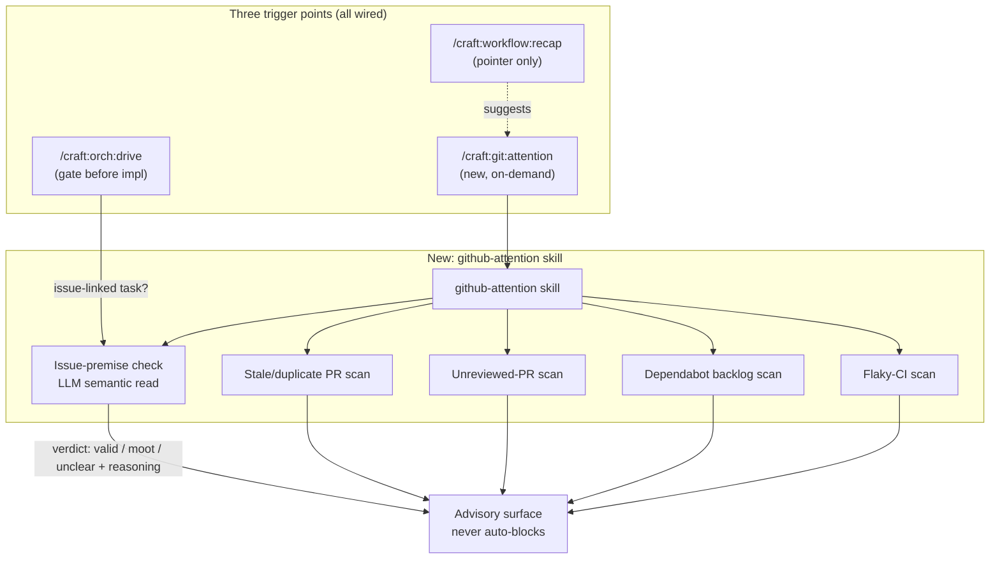

# BRAINSTORM: GitHub-Attention Triage (issue-premise-check + broader skill)

**Date:** 2026-07-14 · **Depth:** deep · **Focus:** architecture
**Branch:** dev · **Categories:** tech, risks, existing, scope

## Origin

Seed request: "Before implementing a requested fix from an open GitHub issue,
check whether the issue's own premise still holds against current code — it
may already be moot." User then widened scope mid-question ("how about a new
skill that does this for everything in GitHub that needs my attention?") and
asked whether `/craft:workflow:recap` should absorb it instead. Both were
folded into this single brainstorm rather than run as separate ones.

## Context Scan

- No existing command/skill covers issue-premise verification. `grep` for
  `github.*attention|stale.*issue|issue.*premise` across `docs/specs/` and
  `docs/plans/` returned only unrelated planning-refactor hits — this is
  genuinely new territory, not a rediscovery of dropped scope.
- `skills/workflow/adhd-workflow/SKILL.md` (recap's home) already runs
  `gh pr list --author @me --state open` and `gh issue list --assignee @me`
  as a **raw listing** step (Context Restoration, no judgment applied).
- `commands/ci/triage.md` is the closest structural precedent — a
  find→classify→suggest-fix skeleton — but for CI failures, not GitHub
  issues/PRs. Decision below: build separately, don't force-fit.
- `commands/orch/drive.md` (`/craft:orch:drive`) drives an approved SPEC to
  completion; it's the natural gate point for an issue-linked implementation
  task, since it already sits between "task accepted" and "code written."

## Locked Decisions

| # | Question | Decision |
|---|---|---|
| 1 | Check method | **LLM semantic read** — agent reads issue body + current relevant code/tests, judges applicability. Not literal-repro-only (many issues have no runnable repro). |
| 2 | Trigger point(s) | **All three, not one**: (a) gate inside `/craft:orch:drive` when the driven SPEC/task is issue-linked, (b) a standalone triage command runnable on-demand, (c) a pointer from `/recap`. |
| 3 | Failure mode | **Advisory only, never blocks.** Always surface verdict + reasoning; never auto-skip implementation or auto-close the issue. Human makes the call. |
| 4 | v1 scope | **Broader GitHub-attention skill**, not issue-premise-only — covers stale/duplicate PRs, unreviewed PRs, dependabot backlog, flaky CI, in addition to issue-premise-check. |
| 5 | Reuse `ci:triage` skeleton? | **No — build separately.** Issue-premise-check needs code-reading judgment (semantic), not log parsing (syntactic); forcing the same skeleton would distort both. |
| 6 | Recap integration | **Recap gets a pointer, not an inline call.** Recap's existing `gh issue list`/`gh pr list` stays a cheap raw listing; recap's output text suggests running the new skill when items are present. Keeps recap fast. |

## Architecture

**Naming note (open for grill):** standalone command name is a placeholder
(`/craft:git:attention` shown above) — the `git:` namespace fits since
`commands/git/status.md` and `commands/git/clean.md` already live there
post-folio-split, but a root-level promotion (like `/craft:next`) is also
plausible given how central "what needs my attention" framing is elsewhere
in craft's ADHD-workflow language.

## Why This Shape (not the alternatives)

- **Not folded fully into recap**: recap's whole design principle (per its
  own skill doc) is "cheapest first, offer follow-ups" — inlining an LLM
  judgment call per listed issue would blow that budget on every recap
  invocation, most of which don't touch GitHub issues at all.
- **Not reusing `ci:triage`'s skeleton**: that skeleton's core loop is
  "parse log → pattern-match failure type → suggest fix." Issue-premise
  checking's core loop is "read issue prose → read current code → judge
  whether the described problem still exists" — a fundamentally different
  operation (semantic comprehension vs. log pattern-matching), and forcing
  parity would mean building comprehension logic UNDER a name that implies
  log-parsing.
- **Advisory-only, not a gate**: this codebase's own git-workflow rules
  (`~/.claude/rules/pr-watch-and-merge-protocol.md`) draw a hard line
  between "agent self-polices, prompts suggest" and "hook enforces" —
  a premise-check that could silently block implementation on a false
  negative would need to earn hook-enforcement status through evidence
  first, same bar as everything else in that family of rules.

## Risks / Open Questions (flagged for grill, not resolved here)

- False-negative cost: if the LLM judges "still valid" on a genuinely-moot
  issue, work proceeds as normal today (no regression) — but if it judges
  "moot" on a genuinely-valid issue and the human trusts it without
  checking, real work silently doesn't happen. Advisory-only mitigates but
  doesn't eliminate this.
- Cost/latency: reading issue + relevant code with an LLM on every
  `orch:drive` invocation for issue-linked tasks adds a step — needs a
  cheap pre-filter (e.g., only run when the task metadata actually
  references a `#NNN` issue) to avoid tax on non-issue-linked work.
- Scope-broadening risk: five sub-scans (issue-premise, stale PR, unreviewed
  PR, dependabot, flaky CI) in v1 is a wide first cut for a brand-new skill
  with zero existing tooling to build from — worth grilling whether v1
  should actually ship narrower and the skill's *architecture* just leaves
  room for the other four scans later.

## Test-Plan Scaffold (default-on)

Tier inferred: **new skill + new command** → full suite tier.

- Unit: issue-premise verdict classifier returns one of
  {valid, moot, unclear} with a reasoning string; never throws on malformed
  `gh issue view` JSON.
- E2E: standalone command run against a fixture repo with (a) a genuinely
  moot issue (feature already shipped), (b) a still-valid issue, (c) an
  issue with no reproducible premise (opinion/discussion) → confirms
  `unclear` is a valid third state, not forced into valid/moot.
- Dogfood: run against craft's own **currently open issues** (if any) as
  a real-world smoke test before merge.
- Non-goal test: confirm the check **never** calls `gh issue close` or
  mutates any GitHub state — advisory-only is a testable invariant, not
  just documentation.

## Next Steps

Per your "grill me" — proceeding directly into `/craft:grill` on this
BRAINSTORM to adversarially interrogate the six locked decisions and the
open risks above (particularly the "5 sub-scans in v1" scope question)
before any implementation starts.
