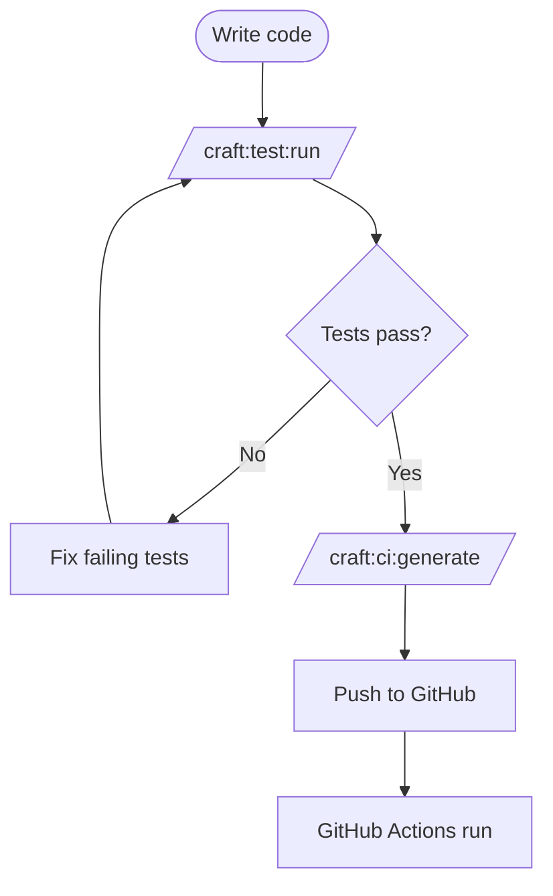
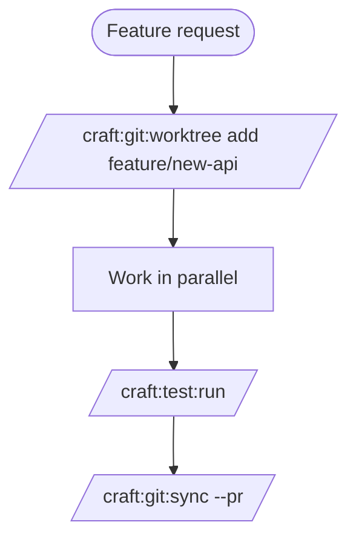
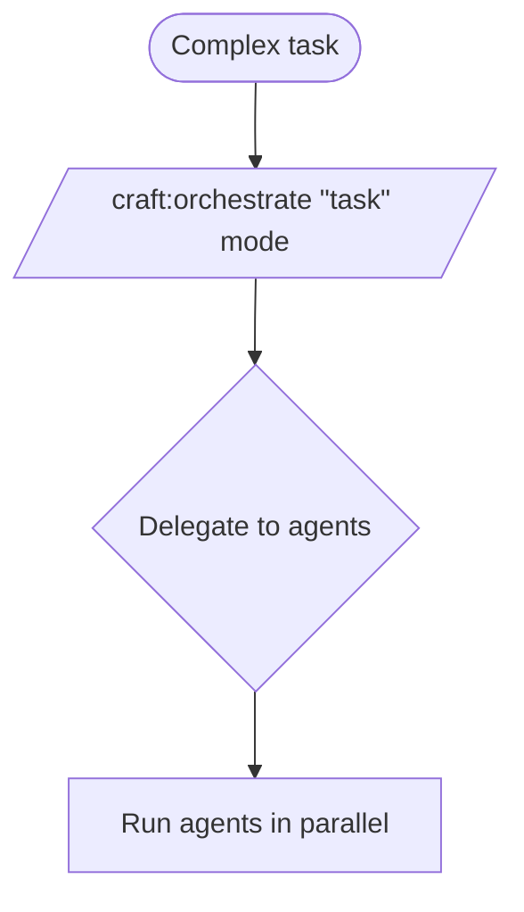

# Duplicate Content Analysis

**Date:** 2026-01-16
**Auditor:** Claude Sonnet 4.5

---

## Summary

```
┌─────────────────────────────────────────────────────────────┐
│ 🔗 DUPLICATE CONTENT ANALYSIS                               │
├─────────────────────────────────────────────────────────────┤
│                                                             │
│ Files Analyzed: 4                                           │
│   • WORKFLOWS.md vs workflows/index.md                      │
│   • orchestrator.md vs guide/orchestrator.md                │
│                                                             │
│ Findings:                                                   │
│   ✅ 1 pair: Different purposes (keep both with clarity)    │
│   🗑️ 1 pair: True duplicate (delete one)                   │
│                                                             │
│ Recommendation:                                             │
│   • Delete WORKFLOWS.md (superseded by workflows/index.md)  │
│   • Keep both orchestrator files (different audiences)      │
│   • Update orchestrator.md with clarity notice              │
│                                                             │
└─────────────────────────────────────────────────────────────┘
```

---

## Pair 1: WORKFLOWS.md vs workflows/index.md

### File Comparison

| Attribute | WORKFLOWS.md | workflows/index.md |
|-----------|-------------|-------------------|
| **Lines** | 248 | 332 |
| **In Nav** | ❌ No | ✅ Yes (📊 Visual Workflows) |
| **Quality** | Good | Better |
| **Interactive** | No | Yes (click handlers on diagrams) |
| **Content** | 6 workflows | 5 workflows |

### Content Overlap

**Both files contain:**

- Documentation Workflow
- Site Creation Workflow
- Release Workflow
- Quick reference sections
- Next steps

**Only in WORKFLOWS.md:**

- Testing Workflow
- Git Worktree Workflow
- Orchestrator Workflow

**Only in workflows/index.md:**

- Development Workflow
- AI Routing Workflow
- Pro tips and callouts
- Interactive click handlers on Mermaid diagrams
- Better formatting and structure

### Analysis

**Duplicate Level:** 🔴 **High (70% overlap)**

The files serve the same purpose - visual workflow guides. However:

1. **workflows/index.md is superior:**
   - More comprehensive (332 vs 248 lines)
   - In navigation (discoverable)
   - Interactive diagrams with click handlers
   - Better structured with pro tips
   - More polished presentation

2. **WORKFLOWS.md has unique content:**
   - Testing Workflow
   - Git Worktree Workflow
   - Orchestrator Workflow

3. **Recommendation:** 🗑️ **Delete WORKFLOWS.md**

**Action Plan:**

1. Extract unique workflows from WORKFLOWS.md
2. Add them to workflows/index.md OR create separate workflow pages
3. Delete WORKFLOWS.md
4. Verify no broken links

### Unique Content to Preserve

From WORKFLOWS.md, these workflows should be preserved:

#### 1. Testing Workflow (lines 90-130)



#### 2. Git Worktree Workflow (lines 150-190)



#### 3. Orchestrator Workflow (lines 210-245)



**Recommendation:** Add these as separate workflow pages:

- `workflows/testing-workflow.md`
- `workflows/git-worktree-workflow.md` (exists but different content)
- `workflows/orchestrator-workflow.md`

---

## Pair 2: orchestrator.md vs guide/orchestrator.md

### File Comparison

| Attribute | orchestrator.md | guide/orchestrator.md |
|-----------|----------------|----------------------|
| **Lines** | 284 | 134 |
| **In Nav** | ✅ Yes (Architecture & Reference) | ✅ Yes (Guide → Orchestrator) |
| **Audience** | Reference/Technical | User guide/Tutorial |
| **Focus** | Implementation details | How-to guide |

### Content Comparison

#### orchestrator.md (Reference)

- Comprehensive technical documentation
- Agent coordination details
- Monitoring & status implementation
- Result synthesis architecture
- Advanced features
- Best practices for developers

**Sections:**

1. Overview
2. Basic Usage
3. Modes (detailed)
4. Agent Coordination
5. Monitoring & Status
6. Result Synthesis
7. Advanced Features
8. Best Practices
9. See Also

#### guide/orchestrator.md (Tutorial)

- User-focused tutorial
- Quick start examples
- Practical mode usage
- Resuming sessions
- ADHD-optimized features
- Next steps for users

**Sections:**

1. Overview
2. Basic Usage
3. Modes (simple)
4. Monitoring
5. Resuming Sessions
6. ADHD-Optimized Features
7. Next Steps

### Analysis

**Duplicate Level:** 🟡 **Medium (30% overlap)**

These files serve **different purposes for different audiences:**

1. **orchestrator.md** = **Reference documentation**
   - For developers/advanced users
   - Technical implementation details
   - Comprehensive API reference

2. **guide/orchestrator.md** = **User guide**
   - For end users
   - Practical how-to examples
   - ADHD-friendly quick start

### Recommendation: ✅ **Keep Both**

**But add clarity:**

Add a notice at the top of each file to differentiate:

**orchestrator.md:**

```markdown
# Orchestrator Reference

> 📚 **Reference Documentation** - For technical details and advanced usage.
> New to orchestrator? Start with the [User Guide](guide/orchestrator.md) instead.
```

**guide/orchestrator.md:**

```markdown
# Orchestrator Mode

> 🎓 **User Guide** - Quick start and practical examples.
> Looking for technical details? See the [Orchestrator Reference](../orchestrator.md).
```

---

## Recommendations Summary

### Immediate Actions

1. **Delete WORKFLOWS.md** 🗑️
   - File: `docs/WORKFLOWS.md`
   - Reason: Superseded by `workflows/index.md`
   - Preserve unique content first

2. **Extract unique workflows** 📄
   - Add Testing Workflow to workflows/
   - Update Git Worktree Workflow
   - Add Orchestrator Workflow

3. **Add clarity notices** 📝
   - Update orchestrator.md header
   - Update guide/orchestrator.md header
   - Cross-link between them

### Commands

```bash
# 1. Check for links to WORKFLOWS.md
grep -r "WORKFLOWS.md" docs/ --include="*.md"

# 2. After confirming no links, delete
git rm docs/WORKFLOWS.md

# 3. Update orchestrator files
# (Manual edits needed for clarity notices)
```

---

## Impact Analysis

### Before Resolution

- 2 duplicate file pairs
- User confusion about which file to read
- WORKFLOWS.md hidden from navigation
- No clear distinction between reference and guide

### After Resolution

- 1 duplicate removed
- Clear purpose for each orchestrator file
- All workflows accessible via navigation
- Better user experience

---

## Verification Checklist

Before deleting WORKFLOWS.md:

- [ ] Extract unique workflows (Testing, Git Worktree, Orchestrator)
- [ ] Search for any links to WORKFLOWS.md
- [ ] Verify workflows/index.md has all essential content
- [ ] Update mkdocs.yml if needed
- [ ] Test site build

After changes:

- [ ] Add clarity notices to both orchestrator files
- [ ] Cross-link orchestrator reference ↔ guide
- [ ] Rebuild and deploy site
- [ ] Update AUDIT-CONTENT-INVENTORY.md

---

**Generated by:** `/craft:site:audit duplicates`
**Date:** 2026-01-16
**Next:** Implement recommendations and verify
