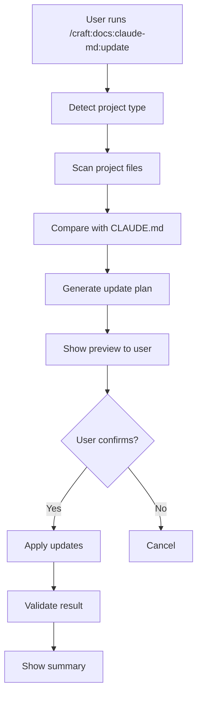

# SPEC: Claude-MD Command Porting to Craft Plugin

**Version:** 1.0.0
**Date:** 2026-01-29
**Status:** Draft
**Author:** DT (via Claude Sonnet 4.5)

---

## Executive Summary

Port 7 claude-md subcommands (~2,142 lines) from local Claude Code (`~/.claude/commands/claude-md/`) to craft plugin as nested commands under `/craft:docs:claude-md:*` namespace.

**Scope:** Start with update command (Phase 1), expand to full suite (Phases 2-4)
**Timeline:** 6 days (relaxed pace)
**Testing:** 55-69 tests, 85-90% coverage target

---

## Motivation

### Problem Statement

Currently, CLAUDE.md management exists in two separate locations:

1. **Local Claude Code:** 7 sophisticated commands in `~/.claude/commands/claude-md/`
   - audit, edit, fix, help, scaffold, tutorial, update
   - Well-tested, comprehensive workflows
   - Generic project type detection

2. **Craft Plugin:** Single basic command in `commands/docs/claude-md.md`
   - Limited to update functionality
   - Missing validation, scaffolding, interactive editing
   - No craft-specific project types

This creates:

- **Duplication risk:** Two implementations diverging over time
- **Feature gap:** Craft users missing valuable claude-md capabilities
- **Maintenance burden:** Updating two separate codebases

### Goals

1. **Consolidate:** Bring proven local command functionality into craft
2. **Enhance:** Add craft-specific project type detection (plugins, teaching, R packages)
3. **Integrate:** Coordinate with existing craft workflows (`/craft:check`, `/craft:docs:update`)
4. **Standardize:** Follow craft's "Show Steps First" pattern with dry-run support

### Non-Goals

- Modify local Claude Code commands (keep as reference implementation)
- Port all 7 commands immediately (phased approach)
- Create new CLAUDE.md features (port existing functionality first)

---

## User Stories

### As a craft plugin developer

**Story 1: Quick CLAUDE.md setup**

```
GIVEN I've created a new craft plugin
WHEN I run /craft:docs:claude-md:scaffold
THEN it detects plugin type and generates CLAUDE.md with:
  - Auto-discovered commands from commands/
  - Auto-discovered skills from skills/
  - Auto-discovered agents from agents/
  - Project structure from filesystem
  - Version from .claude-plugin/plugin.json
```

**Story 2: Maintenance after feature release**

```
GIVEN I've added 3 new commands to my plugin
WHEN I run /craft:docs:claude-md:update
THEN it:
  - Scans commands/ directory
  - Detects 3 new commands
  - Shows preview of changes
  - Asks for confirmation
  - Updates Quick Reference section
  - Validates all links
```

**Story 3: Pre-commit validation**

```
GIVEN I'm about to commit changes
WHEN I run /craft:check
THEN it includes CLAUDE.md validation:
  - Version matches plugin.json
  - All commands documented
  - No broken links
  - All sections present
```

### As a teaching site maintainer

**Story 4: Course site documentation**

```
GIVEN I've created a Quarto course website
WHEN I run /craft:docs:claude-md:scaffold
THEN it detects teaching site and generates CLAUDE.md with:
  - Course metadata from _quarto.yml
  - Week structure from filesystem
  - Assignment tracking
  - Publish workflow
```

### As an R package developer

**Story 5: Package documentation**

```
GIVEN I'm working on an R package in mediationverse
WHEN I run /craft:docs:claude-md:scaffold
THEN it detects R package and generates CLAUDE.md with:
  - Package metadata from DESCRIPTION
  - devtools workflow
  - pkgdown configuration
  - testthat structure
  - Ecosystem dependencies
```

---

## Architecture

### Command Structure

```
/craft:docs:claude-md:*
├── update          # Sync CLAUDE.md with project state
├── audit           # Validate completeness and accuracy
├── fix             # Auto-fix common issues
├── scaffold        # Create from template
└── edit            # Interactive section editing
```

### Directory Structure

```
craft/
├── commands/
│   └── docs/
│       └── claude-md/
│           ├── update.md       # Phase 1
│           ├── audit.md        # Phase 2
│           ├── fix.md          # Phase 2
│           ├── scaffold.md     # Phase 3
│           └── edit.md         # Phase 3
├── templates/
│   └── claude-md/
│       ├── plugin-template.md      # Craft plugin
│       ├── teaching-template.md    # Quarto course
│       ├── r-package-template.md   # R package
│       └── mcp-template.md         # MCP server
├── utils/
│   └── claude_md_detector.py   # Project type detection
├── tests/
│   ├── test_claude_md_update.py    # 15-20 tests
│   ├── test_claude_md_audit.py     # 10-12 tests
│   ├── test_claude_md_fix.py       # 8-10 tests
│   ├── test_claude_md_scaffold.py  # 12-15 tests
│   ├── test_claude_md_edit.py      # 10-12 tests
│   └── test_claude_md_integration.py  # 5-8 tests
└── docs/
    ├── tutorials/
    │   └── claude-md-workflows.md  # Phase 4
    └── commands/
        └── docs/
            └── claude-md.md        # Phase 4
```

### Data Flow



---

## Technical Specification

### Phase 1: Update Command

#### File: `commands/docs/claude-md/update.md`

**Frontmatter:**

```yaml
---
description: Update CLAUDE.md from project state with validation and optimization
category: docs
arguments:
  - name: dry-run
    description: Preview changes without executing
    required: false
    default: false
    alias: -n
  - name: interactive
    description: Prompt for each section update
    required: false
    default: false
    alias: -i
  - name: optimize
    description: Also condense verbose sections
    required: false
    default: false
    alias: -o
tags: [documentation, claude-md, project-analysis]
version: 1.0.0
---
```

**Workflow:**

1. **Detection** - Identify project type

   ```python
   def detect_project_type(directory: str) -> ProjectType:
       # Check for craft plugin
       if Path(".claude-plugin/plugin.json").exists():
           return ProjectType.CRAFT_PLUGIN

       # Check for teaching site
       if Path("_quarto.yml").exists() and Path("course.yml").exists():
           return ProjectType.TEACHING

       # Check for R package
       if Path("DESCRIPTION").exists() and "Package:" in read_file("DESCRIPTION"):
           return ProjectType.R_PACKAGE

       # Fallback to generic detection
       return detect_generic_type()
   ```

2. **Scanning** - Gather project info

   ```python
   def scan_project(project_type: ProjectType) -> ProjectInfo:
       if project_type == ProjectType.CRAFT_PLUGIN:
           return {
               "version": get_version_from_plugin_json(),
               "commands": scan_commands_directory(),
               "skills": scan_skills_directory(),
               "agents": scan_agents_directory(),
               "tests": count_tests(),
           }
       elif project_type == ProjectType.TEACHING:
           return {
               "course": parse_quarto_yml(),
               "weeks": scan_weeks_directory(),
               "assignments": scan_assignments(),
           }
       # ... other types
   ```

3. **Comparison** - Identify changes

   ```python
   def compare_with_claude_md(project_info: ProjectInfo, claude_md: str) -> Changes:
       changes = Changes()

       # Version mismatch?
       if project_info["version"] != extract_version(claude_md):
           changes.add(VersionChange(
               current=extract_version(claude_md),
               actual=project_info["version"]
           ))

       # New commands?
       documented_commands = extract_commands(claude_md)
       for cmd in project_info["commands"]:
           if cmd not in documented_commands:
               changes.add(NewCommand(cmd))

       # ... other comparisons
       return changes
   ```

4. **Preview** - Show plan (mandatory "Show Steps First")

   ```
   ╭─ CLAUDE.md Update Plan ──────────────────────────╮
   │ Project: craft (plugin)                          │
   │ Type: Craft Plugin                               │
   ├──────────────────────────────────────────────────┤
   │                                                  │
   │ Changes Detected:                                │
   │                                                  │
   │ 1. Version Mismatch                              │
   │    Current: v2.8.1                               │
   │    Actual:  v2.9.0 ⚠️                             │
   │                                                  │
   │ 2. New Commands (3)                              │
   │    + /craft:docs:claude-md:audit                 │
   │    + /craft:docs:claude-md:fix                   │
   │    + /craft:docs:claude-md:scaffold              │
   │                                                  │
   │ 3. Test Count Update                             │
   │    Current: 770 tests                            │
   │    Actual:  847 tests (+77)                      │
   │                                                  │
   │ Net Changes: +15 lines, -8 lines                 │
   │                                                  │
   ├──────────────────────────────────────────────────┤
   │ Proceed with these updates? (y/n/select)         │
   ╰──────────────────────────────────────────────────╯
   ```

5. **Execution** - Apply changes (if confirmed)
6. **Validation** - Verify result quality
7. **Summary** - Report what changed

**Testing:**

```python
# tests/test_claude_md_update.py

def test_update_detects_craft_plugin():
    """Verify craft plugin detection."""
    with temp_plugin_project() as project:
        result = detect_project_type(project)
        assert result == ProjectType.CRAFT_PLUGIN

def test_update_syncs_version_from_plugin_json():
    """Verify version syncing."""
    with temp_plugin_project(version="1.2.3") as project:
        update_claude_md(project)
        claude_md = read_file(project / "CLAUDE.md")
        assert "v1.2.3" in claude_md

def test_update_discovers_new_commands():
    """Verify command discovery."""
    with temp_plugin_project() as project:
        create_command(project, "docs/test.md")
        changes = scan_for_changes(project)
        assert "docs/test.md" in changes.new_commands

def test_update_dry_run_no_changes():
    """Verify dry-run doesn't modify files."""
    with temp_plugin_project() as project:
        before = read_file(project / "CLAUDE.md")
        update_claude_md(project, dry_run=True)
        after = read_file(project / "CLAUDE.md")
        assert before == after

def test_update_interactive_prompts_per_section():
    """Verify interactive mode."""
    with temp_plugin_project() as project:
        with mock_user_input(["y", "n", "y"]) as inputs:
            update_claude_md(project, interactive=True)
            assert len(inputs.calls) == 3  # Asked 3 times
```

---

### Phase 2: Audit & Fix Commands

#### File: `commands/docs/claude-md/audit.md`

**Validation Checks:**

```python
class CLAUDEMDAuditor:
    def __init__(self, claude_md_path: Path):
        self.path = claude_md_path
        self.content = self.path.read_text()
        self.issues = []

    def run_all_checks(self) -> AuditReport:
        """Run all validation checks."""
        self.check_version_sync()
        self.check_command_coverage()
        self.check_broken_links()
        self.check_required_sections()
        self.check_status_sync()
        return AuditReport(self.issues)

    def check_version_sync(self):
        """Verify version matches source."""
        claude_version = extract_version(self.content)
        actual_version = get_version_from_source()

        if claude_version != actual_version:
            self.issues.append(Issue(
                severity=Severity.WARNING,
                category="version_mismatch",
                message=f"Version mismatch: {claude_version} vs {actual_version}",
                line_number=find_version_line(self.content),
                fixable=True
            ))

    def check_command_coverage(self):
        """Verify all commands documented."""
        documented = extract_commands(self.content)
        actual = scan_commands_directory()

        missing = actual - documented
        stale = documented - actual

        for cmd in missing:
            self.issues.append(Issue(
                severity=Severity.INFO,
                category="missing_command",
                message=f"Undocumented command: {cmd}",
                fixable=False  # Needs description
            ))

        for cmd in stale:
            self.issues.append(Issue(
                severity=Severity.ERROR,
                category="stale_command",
                message=f"Command no longer exists: {cmd}",
                line_number=find_command_line(self.content, cmd),
                fixable=True
            ))
```

**Output Format:**

```
╭─ CLAUDE.md Audit Report ─────────────────────────╮
│ File: /Users/dt/projects/dev-tools/craft/CLAUDE.md│
│ Lines: 329                                        │
│ Last modified: 2 days ago                         │
├───────────────────────────────────────────────────┤
│                                                   │
│ 🔴 Errors (2) - Must Fix                          │
│                                                   │
│ 1. Stale Command Reference                        │
│    Line 45: /craft:deploy:heroku                  │
│    Status: Command removed in v2.0.0              │
│    Fix: /craft:docs:claude-md:fix                 │
│                                                   │
│ 2. Dead Link                                      │
│    Line 112: See src/legacy/deploy.ts             │
│    Status: File deleted                           │
│    Fix: /craft:docs:claude-md:fix                 │
│                                                   │
│ ⚠️  Warnings (3) - Should Fix                     │
│                                                   │
│ 1. Version Mismatch                               │
│    CLAUDE.md: v2.8.1                              │
│    Actual: v2.9.0                                 │
│    Fix: /craft:docs:claude-md:fix                 │
│                                                   │
│ 2. Progress Out of Sync                           │
│    CLAUDE.md: 95%                                 │
│    .STATUS: 98%                                   │
│    Fix: /craft:docs:claude-md:fix                 │
│                                                   │
│ 3. Missing Section                                │
│    Template expects "Contributing" section        │
│    Fix: Manual edit required                      │
│                                                   │
│ 📝 Info (2) - Optional                            │
│                                                   │
│ 1. Undocumented Commands (3)                      │
│    - /craft:docs:claude-md:audit                  │
│    - /craft:docs:claude-md:fix                    │
│    - /craft:docs:claude-md:scaffold               │
│    Fix: /craft:docs:claude-md:update              │
│                                                   │
│ 2. Optimization Opportunity                       │
│    "Architecture" section is verbose (45 lines)   │
│    Could condense to ~25 lines                    │
│    Fix: /craft:docs:claude-md:update --optimize   │
│                                                   │
├───────────────────────────────────────────────────┤
│ Summary:                                          │
│   🔴 Errors:   2 (auto-fixable)                   │
│   ⚠️  Warnings: 3 (2 auto-fixable, 1 manual)      │
│   📝 Info:     2 (optional)                       │
│                                                   │
│ Next: /craft:docs:claude-md:fix                   │
╰───────────────────────────────────────────────────╯
```

#### File: `commands/docs/claude-md/fix.md`

**Auto-Fix Logic:**

```python
class CLAUDEMDFixer:
    def __init__(self, audit_report: AuditReport):
        self.report = audit_report
        self.fixes_applied = []

    def fix_all_auto_fixable(self, dry_run: bool = False) -> FixReport:
        """Apply all auto-fixable issues."""
        fixable = [i for i in self.report.issues if i.fixable]

        for issue in fixable:
            if issue.category == "version_mismatch":
                self.fix_version_mismatch(issue, dry_run)
            elif issue.category == "stale_command":
                self.fix_stale_command(issue, dry_run)
            elif issue.category == "broken_link":
                self.fix_broken_link(issue, dry_run)
            elif issue.category == "status_sync":
                self.fix_status_sync(issue, dry_run)

        return FixReport(self.fixes_applied)

    def fix_version_mismatch(self, issue: Issue, dry_run: bool):
        """Update version to match source."""
        actual_version = get_version_from_source()

        if dry_run:
            self.fixes_applied.append(DryRunFix(
                issue=issue,
                action=f"Update version to {actual_version}"
            ))
        else:
            content = read_claude_md()
            updated = replace_version(content, actual_version)
            write_claude_md(updated)
            self.fixes_applied.append(AppliedFix(
                issue=issue,
                action=f"Updated version to {actual_version}"
            ))
```

---

### Phase 3: Scaffold & Edit Commands

#### Craft-Specific Templates

**Template: `templates/claude-md/plugin-template.md`**

```markdown
# CLAUDE.md - {plugin_name}

**{command_count} commands** · **{skill_count} skills** · **{agent_count} agents** · [Documentation]({docs_url}) · [GitHub]({repo_url})

**Current Version:** v{version} (released {release_date})
**Documentation Status:** {docs_percent}% complete | **Tests:** {test_count}

## Quick Commands

| Task | Command |
|------|---------|
{command_table}

## Project Structure

```text
{plugin_name}/
├── .claude-plugin/
│   └── plugin.json
├── commands/
{command_dirs}
├── skills/
{skill_dirs}
├── agents/
{agent_dirs}
└── tests/
{test_dirs}
```

## Key Files

{key_files}

## Development Workflow

1. Make changes in relevant directory (commands/skills/agents)
2. Add tests in tests/
3. Run validation: `/craft:check`
4. Update docs: `/craft:docs:update`
5. Commit and push

## Testing

```bash
# Run all tests
python3 tests/test_{plugin_name}.py

# Run specific test
python3 tests/test_{plugin_name}.py -k test_name
```

**Test Coverage:** {coverage}%

## Related Commands

{related_commands}

```

**Template Variables:**

```python
def populate_plugin_template(plugin_dir: Path) -> dict:
    """Extract template variables from plugin."""
    plugin_json = json.loads((plugin_dir / ".claude-plugin/plugin.json").read_text())

    return {
        "plugin_name": plugin_json["name"],
        "version": plugin_json["version"],
        "command_count": len(scan_commands(plugin_dir)),
        "skill_count": len(scan_skills(plugin_dir)),
        "agent_count": len(scan_agents(plugin_dir)),
        "test_count": count_tests(plugin_dir),
        "docs_url": plugin_json.get("repository", {}).get("docs", ""),
        "repo_url": plugin_json.get("repository", {}).get("url", ""),
        "command_table": generate_command_table(plugin_dir),
        "command_dirs": generate_dir_tree(plugin_dir / "commands"),
        # ... other variables
    }
```

---

## Integration Points

### 1. `/craft:check` Integration

Add CLAUDE.md validation to pre-flight checks:

```bash
# commands/check.md enhancement

## Step 4: Documentation Validation (NEW)

if [[ -f CLAUDE.md ]]; then
    echo "Validating CLAUDE.md..."
    /craft:docs:claude-md:audit

    if [[ $? -ne 0 ]]; then
        echo "⚠️  CLAUDE.md has issues"
        echo "Fix: /craft:docs:claude-md:fix"
        exit 1
    fi
fi
```

### 2. `/craft:docs:update` Coordination

```bash
# commands/docs/update.md enhancement

## Phase 5: CLAUDE.md Sync (NEW)

After updating other documentation:

if [[ -f CLAUDE.md ]]; then
    /craft:docs:claude-md:update --dry-run

    if [[ has changes ]]; then
        echo "CLAUDE.md needs updating"
        /craft:docs:claude-md:update
    fi
fi
```

### 3. `/craft:git:worktree` Integration

```bash
# commands/git/worktree.md enhancement

## finish action - Step 5: Update CLAUDE.md (NEW)

After tests pass and before creating PR:

/craft:docs:claude-md:update
git add CLAUDE.md
git commit -m "docs: update CLAUDE.md for feature"
```

---

## Testing Strategy

### Test Categories

1. **Unit Tests** - Individual functions
2. **Integration Tests** - Command interactions
3. **E2E Tests** - Full workflows
4. **Regression Tests** - Preserve local command behavior

### Test Coverage Goals

| Phase | Tests | Coverage |
|-------|-------|----------|
| Phase 1 | 15-20 | 90%+ |
| Phase 2 | 18-22 | 85%+ |
| Phase 3 | 22-27 | 85%+ |
| Phase 4 | 5-8 | Documentation |
| **Total** | **60-77** | **85-90%** |

### Example Integration Test

```python
# tests/test_claude_md_integration.py

def test_full_workflow_new_plugin():
    """Test complete workflow: scaffold → edit → update → audit."""
    with temp_plugin_project() as project:
        # Step 1: Scaffold
        scaffold_claude_md(project)
        assert (project / "CLAUDE.md").exists()

        # Step 2: Add commands
        create_command(project, "test/hello.md")
        create_command(project, "test/goodbye.md")

        # Step 3: Update
        update_claude_md(project)
        claude_md = read_file(project / "CLAUDE.md")
        assert "test/hello" in claude_md
        assert "test/goodbye" in claude_md

        # Step 4: Audit
        report = audit_claude_md(project)
        assert len(report.errors) == 0
        assert len(report.warnings) == 0
```

---

## Success Metrics

### Functional Metrics

- [ ] All 5 core commands working (update, audit, fix, scaffold, edit)
- [ ] 55+ tests passing
- [ ] 85%+ test coverage
- [ ] 3 craft-specific templates created
- [ ] Integration with 3 craft commands working

### Quality Metrics

- [ ] All commands follow "Show Steps First" pattern
- [ ] All commands support dry-run mode
- [ ] All commands have comprehensive help
- [ ] Hub integration working (command discovery)
- [ ] Documentation complete (tutorial + reference)

### User Experience Metrics

- [ ] New plugin setup takes < 2 minutes
- [ ] Update command detects changes in < 5 seconds
- [ ] Audit command completes in < 3 seconds
- [ ] Fix command auto-fixes 80%+ of issues
- [ ] Scaffold generates valid CLAUDE.md on first try

---

## Migration Plan

### Phase 1: Parallel Operation

- Keep local commands intact
- Deploy craft commands in parallel
- User can use either

### Phase 2: Testing & Validation

- Test ported commands with real projects
- Validate feature parity
- Gather user feedback

### Phase 3: Recommendation

- Document ported commands as preferred
- Update global CLAUDE.md to reference craft versions
- Keep local commands as backup

### Phase 4: Deprecation (Optional)

- After 3+ months of stable operation
- Add deprecation notices to local commands
- Provide migration guide

---

## Risk Assessment

### Risk 1: Template Complexity

**Probability:** Medium
**Impact:** Medium

**Mitigation:**

- Start with 3 core templates (plugin, teaching, r-package)
- Expand incrementally based on usage
- Allow custom templates via config

### Risk 2: Detection Accuracy

**Probability:** Low
**Impact:** High

**Mitigation:**

- Leverage existing `project-detector` skill (22 types)
- Add fallback to generic template
- Provide override flag: `--type=plugin`

### Risk 3: Integration Conflicts

**Probability:** Low
**Impact:** Medium

**Mitigation:**

- Test integration points early (Phase 1-2)
- Use dry-run mode for validation
- Document integration requirements

### Risk 4: Test Coverage

**Probability:** Low
**Impact:** Medium

**Mitigation:**

- Write tests alongside implementation
- Use TDD for complex logic
- Review coverage after each phase

---

## Timeline

### Week 1: Foundation + Validation

| Day | Phase | Tasks | Deliverables |
|-----|-------|-------|--------------|
| 1 | Phase 1 | Update command implementation | `commands/docs/claude-md/update.md` |
| 2 | Phase 1 | Testing + refinement | 15+ tests passing |
| 3 | Phase 2 | Audit command | `commands/docs/claude-md/audit.md` |
| 4 | Phase 2 | Fix command | `commands/docs/claude-md/fix.md` |
| 5 | Validation | Integration testing | All Phase 1-2 tests passing |

### Week 2: Generation + Documentation

| Day | Phase | Tasks | Deliverables |
|-----|-------|-------|--------------|
| 1 | Phase 3 | Scaffold command | `commands/docs/claude-md/scaffold.md` |
| 2 | Phase 3 | Templates | 3 craft templates |
| 3 | Phase 3 | Edit command | `commands/docs/claude-md/edit.md` |
| 4 | Phase 4 | Tutorial | `docs/tutorials/claude-md-workflows.md` |
| 5 | Phase 4 | Reference | `docs/commands/docs/claude-md.md` |

### Week 3: Polish + Release

| Day | Tasks |
|-----|-------|
| 1-2 | Integration with craft commands |
| 3 | End-to-end testing |
| 4 | Documentation review |
| 5 | Release preparation |

---

## Acceptance Criteria

### Phase 1 Complete

- [ ] Update command replaces existing `commands/docs/claude-md.md`
- [ ] Detects craft plugin projects correctly
- [ ] Shows preview before making changes
- [ ] Supports dry-run mode
- [ ] 15+ tests passing with 90%+ coverage

### Phase 2 Complete

- [ ] Audit command validates CLAUDE.md completeness
- [ ] Fix command auto-corrects fixable issues
- [ ] Integration with `/craft:check` working
- [ ] 18+ tests passing with 85%+ coverage

### Phase 3 Complete

- [ ] Scaffold generates from templates
- [ ] 3 craft templates created (plugin, teaching, r-package)
- [ ] Edit command allows interactive editing
- [ ] 22+ tests passing with 85%+ coverage

### Phase 4 Complete

- [ ] Tutorial covers all workflows
- [ ] Reference documentation complete
- [ ] Hub integration working
- [ ] All examples tested

### Overall Complete

- [ ] All acceptance criteria met
- [ ] 55+ tests passing
- [ ] Documentation complete
- [ ] Integration points tested
- [ ] User feedback positive

---

## Appendices

### Appendix A: Command Frontmatter Schema

```yaml
---
description: string (required)
category: string (required) # "docs"
arguments:
  - name: string (required)
    description: string (required)
    required: boolean (default: false)
    default: any (optional)
    alias: string (optional)
tags: string[] (optional)
version: string (required) # semver
---
```

### Appendix B: Project Type Detection Rules

```python
PROJECT_TYPES = {
    "craft-plugin": {
        "files": [".claude-plugin/plugin.json"],
        "directories": ["commands/"],
        "template": "plugin-template.md"
    },
    "teaching-site": {
        "files": ["_quarto.yml", "course.yml"],
        "directories": ["weeks/"],
        "template": "teaching-template.md"
    },
    "r-package": {
        "files": ["DESCRIPTION"],
        "contains": {"DESCRIPTION": "Package:"},
        "directories": ["R/", "tests/testthat/"],
        "template": "r-package-template.md"
    },
    "mcp-server": {
        "directories": ["mcp-server/"],
        "files": ["src/index.ts"],
        "template": "mcp-template.md"
    }
}
```

### Appendix C: Template Variable Reference

| Variable | Type | Source | Example |
|----------|------|--------|---------|
| `plugin_name` | string | plugin.json | "craft" |
| `version` | string | plugin.json | "v2.9.0" |
| `command_count` | int | commands/ scan | 100 |
| `skill_count` | int | skills/ scan | 21 |
| `agent_count` | int | agents/ scan | 8 |
| `test_count` | int | tests/ scan | 847 |
| `docs_percent` | int | calculated | 98 |
| `command_table` | string | generated | "\| cmd \| desc \|" |
| `command_dirs` | string | fs tree | "├── docs/" |

---

## References

- **Implementation Plan:** `/private/tmp/claude-501/-Users-dt-projects-dev-tools-craft/tasks/a659dde.output`
- **Local Commands:** `~/.claude/commands/claude-md/`
- **Craft Plugin:** `~/projects/dev-tools/craft/`
- **Project Detector:** `~/projects/dev-tools/craft/skills/ci/project-detector.md`
- **Craft Hub:** `~/projects/dev-tools/craft/commands/hub.md`

---

**Version History:**

| Version | Date | Changes |
|---------|------|---------|
| 1.0.0 | 2026-01-29 | Initial specification |
