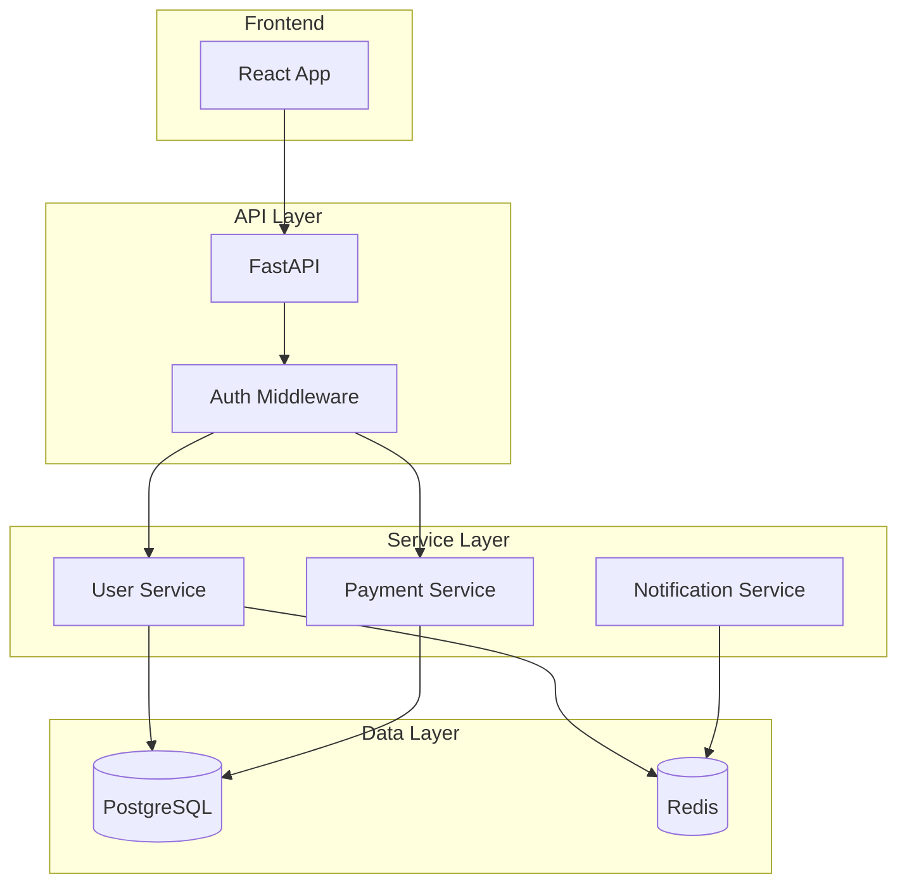

# Architecture Diagrams

Generate architecture diagrams from code or descriptions.

## Usage

```bash
/craft:arch:diagram [type] [options]
```

## What This Does

1. **Analyzes codebase** or description
2. **Generates diagrams** in Mermaid format
3. **Exports to formats** (SVG, PNG, PDF)
4. **Embeds in documentation** automatically

## Diagram Types

| Type | Description |
|------|-------------|
| `component` | High-level component diagram |
| `class` | Class/module relationships |
| `sequence` | Request/response flows |
| `er` | Entity-relationship diagram |
| `flow` | Data/process flow |
| `deployment` | Infrastructure layout |

## Options

- `--from <source>` - Generate from code, plan, or description
- `--format <fmt>` - Output format: mermaid, svg, png
- `--output <file>` - Save to file
- `--style <theme>` - Diagram theme

## Examples

```bash
# Component diagram from code
/craft:arch:diagram component

# Sequence diagram for auth flow
/craft:arch:diagram sequence --from "user login flow"

# ER diagram from models
/craft:arch:diagram er --from src/models/

# Export as SVG
/craft:arch:diagram component --format svg --output arch.svg
```

## Output

```
Generating component diagram...



Diagram saved to: docs/architecture.md
```

## Diagram Templates

### Component Diagram
```bash
/craft:arch:diagram component
# Generates high-level system view
```

### Sequence Diagram
```bash
/craft:arch:diagram sequence --from "API request handling"
# Generates request flow diagram
```

### ER Diagram
```bash
/craft:arch:diagram er
# Generates database schema diagram
```

## Integration

Works with:
- `/craft:arch:analyze` - Analysis data
- `/craft:arch:plan` - Visualize plans
- `/craft:docs:sync` - Embed in docs
