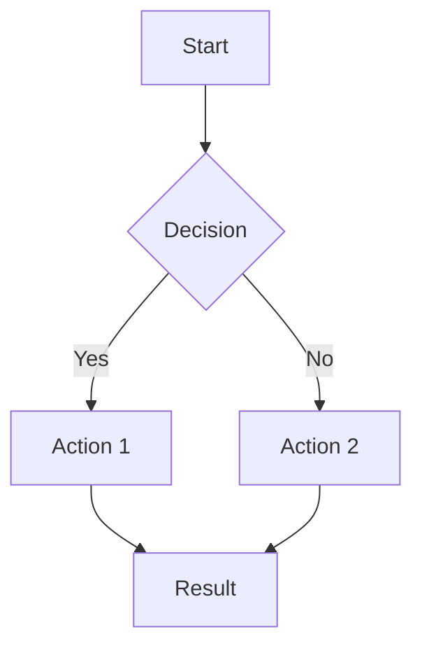
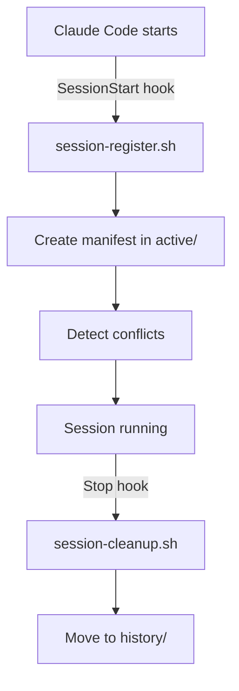
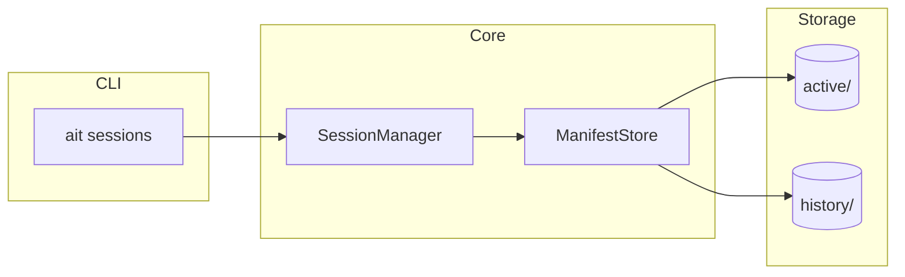
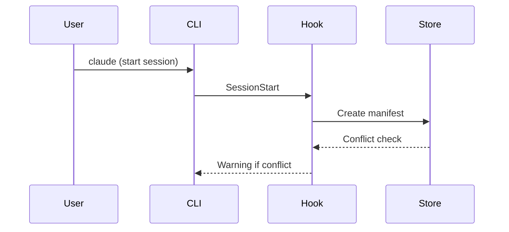

# /craft:docs:guide - Orchestrated Guide Generator

You are a documentation orchestrator. Create complete feature guides with mermaid diagrams, GIF demos, and refcards.

## Purpose

**One command to generate complete feature documentation:**

1. Analyze what documentation is needed
2. Generate guide with proper structure
3. Create VHS tape for GIF demo
4. Add mermaid diagrams
5. Generate domain refcard (if needed)
6. Update navigation
7. Provide next steps

## Usage

```bash
/craft:docs:guide "session tracking"           # Generate complete guide
/craft:docs:guide "sessions" --no-demo         # Skip GIF generation
/craft:docs:guide "sessions" --no-mermaid      # Skip diagrams
/craft:docs:guide "sessions" --no-refcard      # Skip refcard generation
/craft:docs:guide "sessions" --refcard-only    # Only generate refcard
/craft:docs:guide "sessions" --dry-run         # Preview without writing
```

## When Invoked

### Phase 1: ANALYZE

First, gather intelligence about the feature:

```
┌─────────────────────────────────────────────────────────────┐
│ Phase 1/7: ANALYZING FEATURE                                 │
├─────────────────────────────────────────────────────────────┤
│                                                              │
│ Running /craft:docs:analyze "session tracking"...            │
│                                                              │
│ ✓ Found 5 CLI commands                                       │
│ ✓ Found 2 hooks                                              │
│ ✓ Found 1 new module                                         │
│ ✓ 15 commits analyzed                                        │
│                                                              │
└─────────────────────────────────────────────────────────────┘
```

**Actions:**

- Run `/craft:docs:analyze` internally
- Extract feature scope
- Determine what to generate

### Phase 2: SHOW PLAN

Present what will be created:

```
┌─────────────────────────────────────────────────────────────┐
│ Phase 2/7: GENERATION PLAN                                   │
├─────────────────────────────────────────────────────────────┤
│                                                              │
│ 📦 Feature: Session Tracking                                 │
│                                                              │
│ Will create:                                                 │
│   1. ✓ docs/guide/sessions.md         (guide)                │
│   2. ✓ docs/demos/sessions.tape       (VHS tape)             │
│   3. ✓ Mermaid workflow diagram       (embedded in guide)    │
│   4. ✓ docs/reference/REFCARD-SESSIONS.md (domain refcard)   │
│   5. ✓ mkdocs.yml update              (navigation)           │
│                                                              │
│ Guide sections:                                              │
│   - Overview                                                 │
│   - Quick Start                                              │
│   - How It Works (+ mermaid)                                 │
│   - Commands (5 commands)                                    │
│   - Configuration                                            │
│   - Troubleshooting                                          │
│                                                              │
│ Proceed? (y/n)                                               │
└─────────────────────────────────────────────────────────────┘
```

### Phase 3: GENERATE GUIDE

Create the guide document using structured template:

```markdown
# [Feature Name]

[One-sentence description of what this feature does.]

---


---

## Overview

[2-3 sentences explaining the feature's purpose and value.]

When [using this feature], you can:

- **[Benefit 1]** - [brief explanation]
- **[Benefit 2]** - [brief explanation]
- **[Benefit 3]** - [brief explanation]

## Quick Start

```bash
# [Essential setup command]
[command 1]

# [Primary usage command]
[command 2]

# [Common follow-up]
[command 3]
```

## How It Works

[Mermaid diagram inserted here]



[Explanation of the workflow/architecture]

## Commands

### `[command 1]`

[Description of what this command does.]

```bash
$ [example invocation]

[example output]
```

### `[command 2]`

[Description]

```bash
[example]
```

[Repeat for each command]

## Configuration

[If applicable - config files, environment variables, settings]

```json
{
  "setting": "value"
}
```

## Troubleshooting

### [Common Issue 1]

[How to diagnose and fix]

### [Common Issue 2]

[How to diagnose and fix]

## Related

- [Link to related guide 1]
- [Link to related command reference]
- [Link to refcard]

```

**Progress output:**

```

┌─────────────────────────────────────────────────────────────┐
│ Phase 3/7: GENERATING GUIDE                                  │
├─────────────────────────────────────────────────────────────┤
│                                                              │
│ Writing docs/guide/sessions.md...                            │
│                                                              │
│ ✓ Overview section                                           │
│ ✓ Quick Start section                                        │
│ ✓ How It Works section                                       │
│ ✓ Commands section (5 commands)                              │
│ ✓ Configuration section                                      │
│ ✓ Troubleshooting section                                    │
│ ✓ Related links                                              │
│                                                              │
│ Created: docs/guide/sessions.md (275 lines)                  │
│                                                              │
└─────────────────────────────────────────────────────────────┘

```

### Phase 4: GENERATE VHS TAPE

Create the demo tape file:

```

┌─────────────────────────────────────────────────────────────┐
│ Phase 4/7: GENERATING VHS TAPE                               │
├─────────────────────────────────────────────────────────────┤
│                                                              │
│ Running /craft:docs:demo "sessions"...                       │
│                                                              │
│ Template: command-showcase                                   │
│ Commands: ait sessions live, current, conflicts, history     │
│                                                              │
│ Created: docs/demos/sessions.tape                            │
│ Est. duration: ~25 seconds                                   │
│                                                              │
└─────────────────────────────────────────────────────────────┘

```

### Phase 5: GENERATE REFCARD

Generate domain-specific quick reference (if 3+ commands):

```

┌─────────────────────────────────────────────────────────────┐
│ Phase 5/7: GENERATING REFCARD                                │
├─────────────────────────────────────────────────────────────┤
│                                                              │
│ Creating docs/reference/REFCARD-SESSIONS.md...               │
│                                                              │
│ ✓ Header section                                             │
│ ✓ Essential Commands table (5 commands)                      │
│ ✓ Common Workflows section                                   │
│ ✓ Quick Examples                                             │
│ ✓ Troubleshooting shortcuts                                  │
│                                                              │
│ Created: docs/reference/REFCARD-SESSIONS.md (85 lines)       │
│                                                              │
└─────────────────────────────────────────────────────────────┘

```

**Refcard Template:**

```markdown
# [Feature Name] Quick Reference

> One-page reference for [feature] commands

## Essential Commands

| Command | Action |
|---------|--------|
| `[cmd1]` | [brief action] |
| `[cmd2]` | [brief action] |
| `[cmd3]` | [brief action] |

## Common Workflows

### [Workflow 1 Name]
```bash
[command sequence]
```

### [Workflow 2 Name]

```bash
[command sequence]
```

## Quick Examples

```bash
# [Use case 1]
[command]

# [Use case 2]
[command]
```

## Troubleshooting

| Issue | Solution |
|-------|----------|
| [Problem 1] | `[fix command]` |
| [Problem 2] | `[fix command]` |

## See Also

- [Full Guide](../guide/[feature].md)
- [Commands Reference](./commands.md)

```

### Phase 6: UPDATE NAVIGATION

Add to mkdocs.yml:

```

┌─────────────────────────────────────────────────────────────┐
│ Phase 6/7: UPDATING NAVIGATION                               │
├─────────────────────────────────────────────────────────────┤
│                                                              │
│ Running /craft:docs:nav-update...                            │
│                                                              │
│ ✓ Added: guide/sessions.md → "Session Coordination"          │
│ ✓ Added: reference/REFCARD-SESSIONS.md → "Sessions Refcard"  │
│ ✓ Updated: mkdocs.yml                                        │
│                                                              │
└─────────────────────────────────────────────────────────────┘

```

### Phase 7: SUMMARY

Final output with next steps:

```

┌─────────────────────────────────────────────────────────────┐
│ ✅ DOCUMENTATION GENERATION COMPLETE                         │
├─────────────────────────────────────────────────────────────┤
│                                                              │
│ 📦 Feature: Session Tracking                                 │
│                                                              │
│ Created:                                                     │
│   1. ✓ docs/guide/sessions.md              (275 lines)       │
│   2. ✓ docs/demos/sessions.tape            (34 lines)        │
│   3. ✓ Mermaid diagram                     (embedded)        │
│   4. ✓ docs/reference/REFCARD-SESSIONS.md  (85 lines)        │
│   5. ✓ mkdocs.yml                          (updated)         │
│                                                              │
│ ──────────────────────────────────────────────────────────── │
│                                                              │
│ NEXT STEPS:                                                  │
│                                                              │
│ 1. Generate GIF demo:                                        │
│    cd docs/demos && vhs sessions.tape                        │
│                                                              │
│ 2. Optimize GIF:                                             │
│    gifsicle -O3 --lossy=80 sessions.gif -o sessions.gif      │
│                                                              │
│ 3. Preview docs:                                             │
│    mkdocs serve                                              │
│                                                              │
│ 4. Commit changes:                                           │
│    git add docs/ mkdocs.yml                                  │
│    git commit -m "docs: add session tracking documentation"  │
│                                                              │
└─────────────────────────────────────────────────────────────┘

```

## Mermaid Diagram Types

Based on feature type, generate appropriate diagram:

### Workflow Diagram (hook-based features)



### Architecture Diagram (module features)



### Sequence Diagram (multi-step workflows)



## Integration Points

**Uses these commands internally:**

- `/craft:docs:analyze` - Feature classification
- `/craft:docs:demo` - VHS tape generation
- `/craft:docs:mermaid` - Diagram templates
- `/craft:docs:nav-update` - Navigation updates

**Uses these agents:**

- `tutorial-engineer` - Guide structure
- `mermaid-expert` - Diagram generation

## ADHD-Friendly Design

1. **Single command** - No multi-step process to remember
2. **Visual progress** - See each phase completing
3. **Smart defaults** - Works without options
4. **Clear next steps** - Know exactly what to do
5. **Dry-run option** - Preview before commitment

## Options Reference

| Flag | Effect |
|------|--------|
| `--no-demo` | Skip VHS tape generation |
| `--no-mermaid` | Skip diagram generation |
| `--no-refcard` | Skip refcard generation |
| `--no-nav` | Skip mkdocs.yml update |
| `--refcard-only` | Only generate refcard (skip guide/demo) |
| `--dry-run` | Preview without writing files |
| `--template TYPE` | Guide template (default, api, cli) |
| `--output PATH` | Custom output path |
