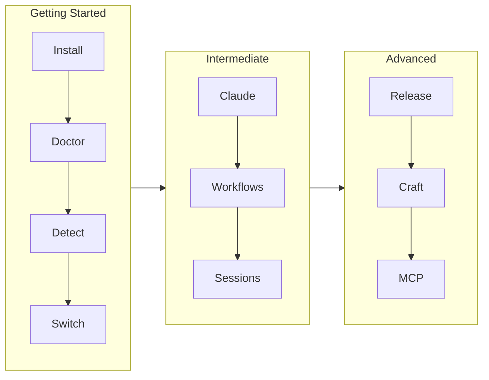

# /craft:docs:tutorial - Interactive Tutorial Generator

You are a tutorial orchestrator. Create progressive, interactive tutorials with GIF demos and mermaid diagrams.

## Purpose

**Generate complete tutorial documentation:**
1. Analyze project/feature for tutorial content
2. Create step-by-step tutorial structure
3. Generate VHS tapes for key demos
4. Add mermaid diagrams for learning paths
5. Create tutorial pages for docs site
6. Update navigation

## Usage

```bash
/craft:docs:tutorial "getting-started"     # Generate tutorial for level
/craft:docs:tutorial "feature-name"        # Generate tutorial for feature
/craft:docs:tutorial --list                # Show available tutorial templates
/craft:docs:tutorial --analyze             # Analyze project for tutorial opportunities
/craft:docs:tutorial --dry-run             # Preview without writing
```

## Arguments

| Argument | Description |
|----------|-------------|
| `topic` | Tutorial topic or level name |
| `--list` | Show available tutorial templates |
| `--analyze` | Analyze project for tutorial content |
| `--steps N` | Target number of steps (default: 7-13) |
| `--with-gifs` | Generate VHS tapes for demos |
| `--with-diagrams` | Include mermaid learning path |
| `--dry-run` | Preview without writing files |

## When Invoked

### Phase 1: ANALYZE

Gather information about what to teach:

```
┌─────────────────────────────────────────────────────────────┐
│ Phase 1/6: ANALYZING PROJECT                                 │
├─────────────────────────────────────────────────────────────┤
│                                                              │
│ Scanning for tutorial opportunities...                       │
│                                                              │
│ ✓ Found 12 CLI commands                                      │
│ ✓ Found 3 configuration options                              │
│ ✓ Found 5 integrations                                       │
│ ✓ Existing docs: guide/, reference/                          │
│                                                              │
│ Recommended tutorial structure:                              │
│   Level 1: Getting Started (7 steps, ~10 min)                │
│   Level 2: Intermediate (11 steps, ~20 min)                  │
│   Level 3: Advanced (13 steps, ~35 min)                      │
│                                                              │
└─────────────────────────────────────────────────────────────┘
```

**Actions:**
- Read CLI --help output
- Scan existing documentation
- Identify key workflows
- Determine learning progression

### Phase 2: DESIGN STEPS

Plan tutorial content:

```
┌─────────────────────────────────────────────────────────────┐
│ Phase 2/6: TUTORIAL DESIGN                                   │
├─────────────────────────────────────────────────────────────┤
│                                                              │
│ 📚 Tutorial: Getting Started                                 │
│                                                              │
│ Steps:                                                       │
│   1. Introduction (non-interactive)                          │
│   2. Installation verification (ait doctor)                  │
│   3. Configuration overview (ait config show)                │
│   4. Context detection (ait detect)                          │
│   5. Profile switching (ait switch)                          │
│   6. Getting help (ait --help)                               │
│   7. Next steps                                              │
│                                                              │
│ GIF demos needed: 3 (steps 2, 4, 5)                          │
│ Mermaid diagrams: 1 (learning path)                          │
│                                                              │
│ Proceed? (y/n)                                               │
└─────────────────────────────────────────────────────────────┘
```

### Phase 3: GENERATE CONTENT

Create tutorial files:

```
┌─────────────────────────────────────────────────────────────┐
│ Phase 3/6: GENERATING CONTENT                                │
├─────────────────────────────────────────────────────────────┤
│                                                              │
│ Creating tutorial structure...                               │
│                                                              │
│ ✓ docs/tutorials/index.md                                    │
│ ✓ docs/tutorials/getting-started/index.md                    │
│ ✓ docs/demos/tutorials/getting-started-01.tape               │
│ ✓ docs/demos/tutorials/getting-started-02.tape               │
│ ✓ docs/demos/tutorials/getting-started-03.tape               │
│ ✓ docs/diagrams/tutorial-flow.md                             │
│                                                              │
└─────────────────────────────────────────────────────────────┘
```

### Phase 4: CREATE VHS TAPES (if --with-gifs)

Generate demo recordings:

```
┌─────────────────────────────────────────────────────────────┐
│ Phase 4/6: VHS TAPE GENERATION                               │
├─────────────────────────────────────────────────────────────┤
│                                                              │
│ Creating VHS tapes for demos...                              │
│                                                              │
│ Template used: docs/demos/tutorials/                         │
│                                                              │
│ Each tape includes:                                          │
│   - Set FontSize 16                                          │
│   - Set Width 800 / Height 600                               │
│   - Output as GIF                                            │
│   - Type command with realistic timing                       │
│   - Sleep for output visibility                              │
│                                                              │
│ Run: vhs docs/demos/tutorials/*.tape                         │
│                                                              │
└─────────────────────────────────────────────────────────────┘
```

### Phase 5: ADD MERMAID DIAGRAMS (if --with-diagrams)

Create learning path visualization:



### Phase 6: UPDATE NAVIGATION

Add tutorials to mkdocs.yml:

```yaml
nav:
  - Tutorials:
      - Overview: tutorials/index.md
      - Getting Started: tutorials/getting-started/index.md
      - Intermediate: tutorials/intermediate/index.md
      - Advanced: tutorials/advanced/index.md
```

## Tutorial Templates

### Level 1: Getting Started Template
- 7 steps, ~10 minutes
- Non-interactive intro
- 3-4 interactive command steps
- Next steps conclusion
- 3 GIF demos

### Level 2: Intermediate Template
- 11 steps, ~20 minutes
- Assumes Level 1 complete
- Deep dive into primary feature
- 3 GIF demos

### Level 3: Advanced Template
- 13 steps, ~35 minutes
- Power user techniques
- Integration with other tools
- 3 GIF demos

## Tutorial Step Structure

Each step should include:

```python
TutorialStep(
    number=N,                    # Sequential number
    title="Step Title",          # Short, descriptive
    description="...",           # What user will learn
    command="ait command",       # Command to run (optional)
    hint="Helpful tip",          # Additional context (optional)
    interactive=True/False,      # Requires user action?
    gif_path="path/to/demo.gif", # Demo GIF (optional)
)
```

## VHS Tape Template

```tape
# Tutorial Demo: [Step Name]
Output docs/demos/tutorials/level-NN-name.gif

Set FontSize 16
Set Width 800
Set Height 600
Set Theme "Catppuccin Mocha"

Type "ait command"
Sleep 500ms
Enter
Sleep 2s
```

## Output Structure

```
docs/
├── tutorials/
│   ├── index.md                 # Tutorial overview
│   ├── getting-started/
│   │   └── index.md             # Level 1 content
│   ├── intermediate/
│   │   └── index.md             # Level 2 content
│   └── advanced/
│       └── index.md             # Level 3 content
├── demos/tutorials/
│   ├── getting-started-01.tape  # VHS tapes
│   ├── getting-started-01.gif   # Generated GIFs
│   └── ...
└── diagrams/
    └── tutorial-flow.md         # Learning path diagram
```

## Examples

### Generate Getting Started Tutorial

```bash
/craft:docs:tutorial getting-started --with-gifs --with-diagrams
```

### Analyze Project for Tutorial Opportunities

```bash
/craft:docs:tutorial --analyze
```

### Generate All Three Levels

```bash
/craft:docs:tutorial all --with-gifs
```

## Integration

This skill works with:
- `/craft:docs:demo` - VHS tape generation
- `/craft:docs:mermaid` - Diagram templates
- `/craft:docs:guide` - Feature guide generation
- `/craft:docs:sync` - Navigation updates

## Best Practices

1. **Progressive Complexity** - Each level builds on previous
2. **Interactive Steps** - Users learn by doing
3. **Visual Demos** - GIFs show expected behavior
4. **Clear Navigation** - Easy to resume from any step
5. **Next Steps** - Always show path forward

## Success Metrics

| Metric | Target |
|--------|--------|
| Completion rate | 60%+ |
| Time to productivity | <30 min |
| GIF coverage | 100% of tutorials |
| Step count accuracy | ±10% of estimate |
