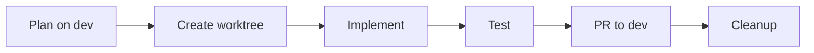

# /craft:docs:workflow - Workflow Documentation Generator

Generate task-focused workflow documentation for multi-step processes.

## Purpose

**Document how users accomplish real tasks:**
- Analyzes code for multi-step processes
- Detects hooks, events, and command chains
- Uses `WORKFLOW-TEMPLATE.md` for consistent structure
- Generates step-by-step instructions with alternatives

## Usage

```bash
# Generate workflow for a topic
/craft:docs:workflow "git"            # Git workflow documentation
/craft:docs:workflow "documentation"  # Docs workflow
/craft:docs:workflow "release"        # Release process workflow

# From brainstorm specs (NEW - recommended)
/craft:docs:workflow "auth" --from-spec   # Uses docs/specs/SPEC-auth-*.md

# From existing code patterns
/craft:docs:workflow --detect         # Auto-detect workflows in codebase
/craft:docs:workflow --from-commits   # Generate from recent commit patterns

# Options
/craft:docs:workflow "auth" --output docs/workflows/
/craft:docs:workflow "auth" --format terminal
/craft:docs:workflow "auth" --dry-run
```

## Input Sources

| Source | Flag | Description |
|--------|------|-------------|
| **Brainstorm Specs** | `--from-spec` | Uses `docs/specs/SPEC-[topic]-*.md` for requirements |
| **Code Analysis** | (default) | Analyzes codebase for patterns |
| **Auto-detect** | `--detect` | Finds workflows in code |
| **Commit Patterns** | `--from-commits` | Extracts from git history |

### From Brainstorm Specs (Recommended)

When `--from-spec` is provided, the command:

1. **Searches** for matching spec in `docs/specs/`:
   ```bash
   ls docs/specs/SPEC-*[topic]*.md
   ```

2. **Extracts** workflow information from spec sections:
   | Spec Section | Workflow Section |
   |--------------|------------------|
   | User Stories | "When to Use" scenarios |
   | Technical Requirements | Prerequisites |
   | Architecture | Basic Workflow steps |
   | Implementation Notes | Variations |
   | Open Questions | Troubleshooting |

3. **Generates** implementation workflow with spec references

**Example:**
```bash
# After brainstorming
/brainstorm d f s "authentication"
→ Saves: docs/specs/SPEC-authentication-2026-01-14.md

# Generate workflow from spec
/craft:docs:workflow "authentication" --from-spec
→ Reads: docs/specs/SPEC-authentication-2026-01-14.md
→ Creates: docs/workflows/authentication-workflow.md
```

**Spec → Workflow Mapping:**
```
SPEC-auth-2026-01-14.md
├── Overview → Workflow description
├── User Stories → When to Use
├── Acceptance Criteria → Success checklist
├── Architecture → Step diagram
├── API Design → Implementation steps
└── Dependencies → Prerequisites
```

## When Invoked

### Step 1: Analyze Topic

```
┌─────────────────────────────────────────────────────────────┐
│ Step 1/4: ANALYZING TOPIC                                   │
├─────────────────────────────────────────────────────────────┤
│                                                             │
│ Topic: "git"                                                │
│                                                             │
│ Detected patterns:                                          │
│   • Branch workflow (dev → feature → PR)                    │
│   • Worktree management                                     │
│   • Commit conventions                                      │
│   • Release process                                         │
│                                                             │
│ Related commands:                                           │
│   • /craft:git:worktree                                     │
│   • /craft:git:clean                                        │
│   • /commit                                                 │
│                                                             │
└─────────────────────────────────────────────────────────────┘
```

### Step 2: Map Workflow Steps

Identify the sequence of actions:

```
┌─────────────────────────────────────────────────────────────┐
│ Step 2/4: MAPPING WORKFLOW                                  │
├─────────────────────────────────────────────────────────────┤
│                                                             │
│ Workflow: Feature Development                               │
│                                                             │
│ Steps identified:                                           │
│   1. Plan on dev branch                                     │
│   2. Create worktree for isolation                          │
│   3. Implement with atomic commits                          │
│   4. Test and validate                                      │
│   5. Create PR to dev                                       │
│   6. Merge and cleanup                                      │
│                                                             │
│ Variations:                                                 │
│   • Hotfix path (from main)                                 │
│   • Quick fix path (no worktree)                            │
│                                                             │
└─────────────────────────────────────────────────────────────┘
```

### Step 3: Generate Documentation

```
┌─────────────────────────────────────────────────────────────┐
│ Step 3/4: GENERATING WORKFLOW DOC                           │
├─────────────────────────────────────────────────────────────┤
│                                                             │
│ Template: templates/docs/WORKFLOW-TEMPLATE.md               │
│                                                             │
│ Sections generated:                                         │
│   ✓ When to Use (3 scenarios)                               │
│   ✓ Prerequisites (checklist)                               │
│   ✓ Basic Workflow (6 steps)                                │
│   ✓ Variations (2 alternative paths)                        │
│   ✓ Mermaid Diagram (flowchart)                             │
│   ✓ Troubleshooting (5 common issues)                       │
│   ✓ Quick Reference (command summary)                       │
│                                                             │
│ Output: docs/workflows/git-workflow.md (180 lines)          │
│                                                             │
└─────────────────────────────────────────────────────────────┘
```

### Step 4: Validate & Link

```
┌─────────────────────────────────────────────────────────────┐
│ Step 4/4: VALIDATING                                        │
├─────────────────────────────────────────────────────────────┤
│                                                             │
│ ✓ All commands verified                                     │
│ ✓ Mermaid diagram valid                                     │
│ ✓ Added to mkdocs.yml navigation                            │
│                                                             │
└─────────────────────────────────────────────────────────────┘
```

## Output Structure

Generated workflow follows this structure:

```markdown
# Git Feature Development Workflow

> **Scenario:** Developing a new feature with proper isolation and PR workflow
> **Time:** 15-30 minutes
> **Difficulty:** 🔧 Medium

---

## When to Use This Workflow

Use this workflow when you need to:

- Add a new feature to the codebase
- Work on isolated changes without affecting dev
- Collaborate via pull requests

---

## Prerequisites

- [x] Git configured with remote
- [x] On `dev` branch and up to date

**Quick check:**
```bash
git branch --show-current  # Should be: dev
git status                 # Should be: clean
```

---

## Basic Workflow



### Step 1: Plan on dev

```bash
git checkout dev
git pull origin dev
# Analyze requirements, wait for approval
```

### Step 2: Create Worktree

```bash
/craft:git:worktree feature/my-feature
cd ~/.git-worktrees/project/my-feature
```

[... more steps ...]

---

## Variations

### Hotfix (from main)

```bash
git checkout main
/craft:git:worktree hotfix/fix-name
# Fix, test, PR to main
```

---

## Troubleshooting

| Issue | Solution |
|-------|----------|
| Worktree conflict | `git worktree prune` |
| Rebase fails | `git rebase --abort && git merge` |

---

## Quick Reference

| Action | Command |
|--------|---------|
| Create worktree | `/craft:git:worktree feature/name` |
| Clean branches | `/craft:git:clean` |
| Create PR | `gh pr create --base dev` |
```

## Flags Reference

| Flag | Effect |
|------|--------|
| (none) | Generate workflow to docs/workflows/ |
| `--from-spec` | Use brainstorm spec as input source (recommended) |
| `--detect` | Auto-detect workflows in codebase |
| `--from-commits` | Generate from recent commit patterns |
| `--output PATH` | Custom output directory |
| `--format terminal` | Preview in terminal only |
| `--dry-run` | Show plan without generating |
| `--no-diagram` | Skip Mermaid diagram |
| `--no-nav` | Skip mkdocs.yml update |

## Integration

**Uses template:** `templates/docs/WORKFLOW-TEMPLATE.md`

**Called by:**
- `/workflow:brainstorm` → Step 6 (after spec capture)
- `/craft:docs:update --with-workflow`
- `/craft:docs:update` (when score >= 3 for workflow type)

**Input from:**
- Brainstorm specs (`docs/specs/SPEC-*.md`) via `--from-spec` flag

**Outputs to:**
- `docs/workflows/[topic]-workflow.md` (default)
- Custom path with `--output`

## Workflow Detection

When using `--detect`, analyzes:

| Source | What it finds |
|--------|---------------|
| Command chains | Commands that call other commands |
| Hook systems | Event-driven workflows |
| Git patterns | Branch/merge strategies |
| CI/CD files | Build and deploy workflows |
| README sections | Documented processes |

## ADHD-Friendly Design

1. **Task-focused** - One real task per workflow
2. **Visual diagrams** - Mermaid flowcharts for overview
3. **Copy-paste ready** - Actual commands to run
4. **Multiple paths** - Variations for different scenarios
5. **Troubleshooting** - Common issues right there
