# /workflow:brainstorm - Enhanced Brainstorm

ADHD-friendly brainstorming with smart mode detection, time budgets, agent delegation, and **spec capture for implementation**.

## Arguments (v2.3.0 - Three-Layer System)

```
/brainstorm [depth] [focus] [action] "topic"
            ↑       ↑       ↑
            │       │       └── s|save (capture as spec)
            │       └────────── f|feat|a|arch|x|ux|b|api|u|ui|o|ops
            └────────────────── q|quick|d|deep|m|max
```

### Depth Layer

| Full | Short | Single | Time | Description |
|------|-------|--------|------|-------------|
| (default) | - | - | < 5 min | Balanced, 2 questions + "ask more?" |
| quick | quick | q | < 1 min | Fast, 0 questions + "ask more?" |
| deep | deep | d | < 10 min | Expert questions (8), no agents |
| max | max | m | < 30 min | Expert questions + 2 agents |

**Note:** `thorough` is deprecated alias for `max`

### Focus Layer

| Full | Short | Single | What it brainstorms |
|------|-------|--------|---------------------|
| (auto) | - | - | Auto-detect from context |
| feature | feat | f | User stories, MVP scope, acceptance criteria |
| architecture | arch | a | System design, scalability, component diagrams |
| ux | ux | x | UI/UX wireframes, accessibility, user flows |
| api | api | b | API endpoints, database schema, auth patterns |
| ui | ui | u | Component tree, state management, performance |
| ops | ops | o | CI/CD pipelines, deployment, infrastructure |

**Synonyms:** `design` → `ux`, `backend` → `api`, `frontend` → `ui`, `devops` → `ops`

### Action Layer

| Full | Short | Single | What it does |
|------|-------|--------|--------------|
| (none) | - | - | Output BRAINSTORM.md only |
| save | save | s | Output SPEC.md (replaces --save-spec) |

**Synonym:** `spec` → `save`

### Quick Examples

```bash
# Minimal
/brainstorm "auth"              # Default everything

# With focus
/brainstorm feat "auth"         # Feature focus
/brainstorm f "auth"            # Same (single letter)

# With action
/brainstorm save "auth"         # Save as spec
/brainstorm s "auth"            # Same (single letter)

# Combined
/brainstorm feat save "auth"    # Feature + spec
/brainstorm f s "auth"          # Same (ultra-short)

# Full control
/brainstorm deep feat save "auth"   # Deep + feature + spec
/brainstorm d f s "auth"            # Power user mode

# Maximum depth
/brainstorm max arch save "auth"    # Max + architecture + spec
/brainstorm m a s "auth"            # Same (ultra-short)
```

### Backward Compatibility

| Old Syntax (v2.2.0) | New Syntax (v2.3.0) | Status |
|---------------------|---------------------|--------|
| `--save-spec` | `save` or `s` | Deprecated but works |
| `--save-spec=full` | `save` (default is full) | Deprecated but works |
| `--save-spec=quick` | `q save` | Deprecated but works |
| `feature` | `feat` or `f` | Both work |
| `architecture` | `arch` or `a` | Both work |
| `thorough` | `max` or `m` | `thorough` deprecated |

## When Invoked

### Step 0: Parse Arguments (v2.3.0)

**Parsing Rules:**
1. Keywords can appear in any order before topic
2. Last quoted string is always the topic
3. Unquoted words are parsed using lookup tables

**Argument Mapping Tables:**

```python
# Normalize shortcuts
DEPTH_MAP = {
    'q': 'quick', 'quick': 'quick',
    'd': 'deep', 'deep': 'deep',
    'm': 'max', 'max': 'max',
    't': 'max', 'thorough': 'max'  # deprecated aliases
}

FOCUS_MAP = {
    'f': 'feat', 'feat': 'feat', 'feature': 'feat',
    'a': 'arch', 'arch': 'arch', 'architecture': 'arch',
    'x': 'ux', 'ux': 'ux', 'design': 'ux',
    'b': 'api', 'api': 'api', 'backend': 'api',
    'u': 'ui', 'ui': 'ui', 'frontend': 'ui',
    'o': 'ops', 'ops': 'ops', 'devops': 'ops'
}

ACTION_MAP = {
    's': 'save', 'save': 'save', 'spec': 'save'
}
```

**Decision Logic:**
```
Topic provided?       → Show "Ask More?" then execute
Depth + Topic?        → Skip menus, show "Ask More?" then execute
Depth + Focus + Topic? → Skip menus, show "Ask More?" then execute
Full args (+ action)? → Execute directly (action bypasses "capture?" prompt)
No arguments?         → Smart context detection (Step 0.5)
```

**Examples (v2.3.0):**
| Input | Depth | Focus | Action | Behavior |
|-------|-------|-------|--------|----------|
| `/brainstorm "auth"` | default | auto | none | "Ask More?" → execute |
| `/brainstorm f "auth"` | default | feat | none | "Ask More?" → execute |
| `/brainstorm d "auth"` | deep | auto | none | 8 questions → "Ask More?" → execute |
| `/brainstorm d f "auth"` | deep | feat | none | 8 feat questions → "Ask More?" → execute |
| `/brainstorm d f s "auth"` | deep | feat | save | 8 feat questions → "Ask More?" → SPEC.md |
| `/brainstorm q f s "auth"` | quick | feat | save | "Ask More?" → SPEC.md |
| `/brainstorm` | - | - | - | Smart detect → menus → execute |

### Step 0.5: Smart Context Detection (No Arguments)

When no arguments provided, automatically detect topic from context:

#### New Session Detection

If this is a **new session** (no prior conversation), first check for resumable sessions:

```
1. Check if conversation history is empty (new session)
2. If new session → Invoke /resume behavior
3. Show recent sessions from before current session started
4. Let user pick a session to continue, or start fresh
```

```
AskUserQuestion:
  question: "Continue from a previous session or start fresh?"
  header: "Session"
  multiSelect: false
  options:
    - label: "Resume: [latest session topic]"
      description: "[project] - [time ago]"
    - label: "Resume: [2nd latest session]"
      description: "[project] - [time ago]"
    - label: "Start fresh"
      description: "New brainstorm in current context"
```

If user selects a previous session → load that context, then proceed to Q1: Depth.
If user selects "Start fresh" → proceed with normal detection below.

#### Detection Sources

| Source | What to look for | Priority |
|--------|------------------|----------|
| **Previous sessions** | Recent brainstorm sessions (new session only) | Highest |
| **Conversation** | Topics discussed, problems mentioned, features planned | High |
| **Git branch** | Branch name (e.g., `feature/oauth-login`) | Medium |
| **Recent commits** | Commit messages from last 24h | Medium |
| **Project .STATUS** | Current task, next steps | High |
| **Open discussion** | Questions asked, decisions pending | High |

#### Decision Logic

```python
topics = detect_topics_from_context()

if len(topics) == 1:
    # Clear single topic - use it directly
    topic = topics[0]
    → Proceed to Q1: Depth

elif len(topics) >= 2 and len(topics) <= 4:
    # Multiple topics - ask user to pick
    → AskUserQuestion: "Which topic?"
      options: [topic1, topic2, ..., "Other"]
    → Proceed to Q1: Depth

else:  # 0 topics or too many
    # No clear context - ask free-form
    → "What would you like to brainstorm?"
    → Proceed to Q1: Depth
```

#### Context Detection AskUserQuestion

When multiple topics detected:

```
AskUserQuestion:
  question: "Which topic should we brainstorm?"
  header: "Topic"
  multiSelect: false
  options:
    - label: "[Topic from conversation]"
      description: "Mentioned earlier in chat"
    - label: "[Topic from git branch]"
      description: "Current branch: feature/xyz"
    - label: "[Topic from .STATUS]"
      description: "Current project focus"
```

#### Example: Clear Context

```
[Earlier in conversation]
User: "I need to add user notifications to the app"

[Later]
User: /brainstorm

Claude: (detects single topic: "user notifications")
  → Skips topic question
  → Shows Q1: Depth
  → Shows Q2: Focus
  → Executes brainstorm for "user notifications"
```

#### Example: Multiple Topics

```
[Earlier in conversation]
User: "Working on OAuth and also need to refactor the DB"

[Later]
User: /brainstorm

Claude: [AskUserQuestion - Topic]
  "Which topic should we brainstorm?"
  ○ OAuth integration - Mentioned in conversation
  ○ Database refactoring - Mentioned in conversation
  ○ feature/auth-system - Current git branch

User: Selects "OAuth integration"

Claude: [Q1: Depth] → [Q2: Focus] → Execute
```

#### Example: No Context

```
[New conversation, no prior discussion]
User: /brainstorm

Claude: "What would you like to brainstorm?"
User: "A new caching layer"

Claude: [Q1: Depth] → [Q2: Focus] → Execute
```

### Step 1: Interactive Menu (Topic Provided, No Mode)

When topic is provided but no mode, show **two sequential AskUserQuestion calls** (max 4 options each).

#### Question 1: Depth Selection

```
AskUserQuestion:
  question: "How deep should the analysis be?"
  header: "Depth"
  multiSelect: false
  options:
    - label: "default (Recommended)"
      description: "< 5 min, comprehensive with options"
    - label: "quick"
      description: "< 1 min, fast ideation, no agents"
    - label: "thorough"
      description: "< 30 min, 2-4 agents for deep analysis"
```

#### Question 2: Focus Area Selection

```
AskUserQuestion:
  question: "What's the focus area?"
  header: "Focus"
  multiSelect: false
  options:
    - label: "auto-detect (Recommended)"
      description: "Detect from project context"
    - label: "feature"
      description: "User stories, MVP scope"
    - label: "architecture"
      description: "System design, diagrams"
    - label: "backend"
      description: "API, database, auth"
```

**Note:** Users wanting `frontend`, `design`, or `devops` select "Other" and type the mode name.

#### Menu Constraints

| Constraint | Value |
|------------|-------|
| **Max options per question** | 4 (AskUserQuestion limit) |
| **Max questions per call** | 4 |
| **Order** | Depth first, then Focus |
| **Default** | "(Recommended)" suffix on first option |
| **Overflow** | "Other" allows typing any mode |

#### Example Flow

```
User: /brainstorm "new auth system"

Claude: [AskUserQuestion - Depth]
  "How deep should the analysis be?"
  ○ default (Recommended) - < 5 min, comprehensive
  ○ quick - < 1 min, fast ideation
  ○ thorough - < 30 min, deep analysis

User: Selects "quick"

Claude: [AskUserQuestion - Focus]
  "What's the focus area?"
  ○ auto-detect (Recommended) - Detect from context
  ○ feature - User stories, MVP scope
  ○ architecture - System design, diagrams
  ○ backend - API, database, auth

User: Selects "feature"

Claude: Executes quick + feature brainstorm for "new auth system"
```

#### Direct Invocation (Skip Menus)

```bash
/brainstorm quick feature auth     # Explicit: depth + focus + topic
/brainstorm feature auth           # Focus + topic (default depth)
/brainstorm "my topic"             # Topic only (auto-detect all)
```

---

## ⏱️ Time Budget Guarantees

| Depth | Time Budget | Questions | Agents | Output |
|-------|-------------|-----------|--------|--------|
| **quick (q)** | < 60s | 0 + "ask more?" | None | 5-7 ideas, quick wins |
| **default** | < 300s | 2 + "ask more?" | None | Comprehensive with options |
| **deep (d)** | < 600s | 8 + "ask more?" | None | Expert-level analysis |
| **max (m)** | < 1800s | 8 + agent Qs | 2 per focus | Deep analysis with synthesis |

---

### Step 1.5: "Ask More?" Feature (All Depths)

After base questions complete for ANY depth, offer escape hatch to go deeper or proceed:

#### For quick (0 questions)

```
Claude: ⚡ Ready to quick-brainstorm: [topic] ([focus] focus)

AskUserQuestion:
  question: "Dive straight in or gather context first?"
  header: "Start"
  multiSelect: false
  options:
    - label: "Go! - Start brainstorming (Recommended)"
      description: "Generate ideas immediately"
    - label: "Ask 2 questions first"
      description: "Quick context gathering"
    - label: "Switch to deep (8 questions)"
      description: "Detailed requirements gathering"
    - label: "Switch to max (8 + agents)"
      description: "Comprehensive analysis with agents"
```

#### For default (2 questions)

```
Claude: Quick context gathered!

[Shows summary of 2 answers]

AskUserQuestion:
  question: "Need more detail before brainstorming?"
  header: "Continue"
  multiSelect: false
  options:
    - label: "No - Start brainstorming (Recommended)"
      description: "Proceed with current context"
    - label: "Yes - 2 more questions"
      description: "Gather a bit more context"
    - label: "Yes - Switch to deep (8 questions)"
      description: "Full requirements gathering"
    - label: "Yes - Switch to max (8 + agents)"
      description: "Comprehensive with agents"
```

#### For deep (8 questions)

```
Claude: Detailed requirements gathered!

[Shows summary of 8 answers]

AskUserQuestion:
  question: "Ready to brainstorm or need more?"
  header: "Continue"
  multiSelect: false
  options:
    - label: "Ready - Start brainstorming (Recommended)"
      description: "Proceed with detailed context"
    - label: "Yes - 2 more questions"
      description: "Clarify specific points"
    - label: "Yes - Switch to max (add agents)"
      description: "Add expert agent analysis"
```

#### For max (8 questions + agent analysis)

```
Claude: Comprehensive analysis complete!

[Shows summary + agent findings]

AskUserQuestion:
  question: "Proceed with brainstorm?"
  header: "Continue"
  multiSelect: false
  options:
    - label: "Yes - Generate comprehensive plan (Recommended)"
      description: "Synthesize all findings"
    - label: "Wait - 2 more questions first"
      description: "Clarify before generating"
    - label: "Re-run agents with different focus"
      description: "Try different agent perspectives"
```

**Design Rationale:**
- **ADHD-friendly**: Always offer escape hatch, never feel trapped
- **Progressive disclosure**: Easy path forward, but depth available if needed
- **Consistent UX**: Same pattern at every depth level
- **No dead ends**: Can always go deeper OR proceed

---

### Step 2: Gather Context

If topic not provided, analyze conversation context:

```bash
# Detect project type
ls DESCRIPTION package.json pyproject.toml go.mod 2>/dev/null

# Get current directory context
pwd
git branch --show-current 2>/dev/null
```

### Step 3: Execute Brainstorm

Based on selected mode + depth:

---

#### Mode: Feature

**Focus:** User value, functionality, MVP scope
**Default Depth:** default (< 5 min)
**Agent (thorough):** product-strategist

Output includes:
- User stories with acceptance criteria
- MVP vs Nice-to-have split
- Quick wins vs Long-term features
- Recommended implementation order

---

#### Mode: Architecture

**Focus:** System design, scalability, technical trade-offs
**Default Depth:** default or thorough
**Agents (thorough):** backend-architect, database-architect

Output includes:
- Component diagram (Mermaid)
- Data flow analysis
- Scalability considerations
- Trade-offs table

---

#### Mode: Design

**Focus:** UI/UX, accessibility, user experience
**Default Depth:** default
**Agent (thorough):** ux-ui-designer

Output includes:
- Wireframes (ASCII art)
- Component structure
- Accessibility checklist
- User flow diagram

---

#### Mode: Backend

**Focus:** API design, database schema, auth patterns
**Default Depth:** default
**Agents (thorough):** backend-architect, security-specialist

Output includes:
- API endpoints
- Schema design
- Security checklist
- Integration patterns

---

#### Mode: Frontend

**Focus:** Component architecture, state management, performance
**Default Depth:** default
**Agents (thorough):** frontend-specialist, performance-engineer

Output includes:
- Component tree
- State management strategy
- Bundle optimization
- Performance budget

---

#### Mode: DevOps

**Focus:** CI/CD, deployment, infrastructure
**Default Depth:** quick or default
**Agent (thorough):** devops-engineer

Output includes:
- Deployment pipeline
- Platform recommendations
- Cost estimates
- Monitoring strategy

---

### Step 4: Format Output

**Terminal Format (Default):**
```
┌─────────────────────────────────────────────────────────────┐
│ 🧠 BRAINSTORM: [Topic]                                      │
│ Mode: [mode] │ Depth: [depth] │ Duration: [time]            │
├─────────────────────────────────────────────────────────────┤
│                                                             │
│ ## Quick Wins (< 30 min each)                               │
│   ⚡ [Action 1] - [Benefit]                                  │
│   ⚡ [Action 2] - [Benefit]                                  │
│                                                             │
│ ## Medium Effort (1-2 hours)                                │
│   □ [Task with clear outcome]                               │
│                                                             │
│ ## Long-term (Future sessions)                              │
│   □ [Strategic item]                                        │
│                                                             │
│ ## Recommended Path                                         │
│   → [Clear recommendation with reasoning]                   │
│                                                             │
├─────────────────────────────────────────────────────────────┤
│ ✅ Completed in [time]s (within [depth] budget)             │
└─────────────────────────────────────────────────────────────┘
```

**JSON Format (`--format json`):**
```json
{
  "metadata": {
    "timestamp": "2024-12-24T10:30:00Z",
    "mode": "feature",
    "depth": "quick",
    "duration_seconds": 45,
    "agents_used": []
  },
  "content": {
    "topic": "User notifications",
    "quick_wins": [],
    "medium_effort": [],
    "long_term": []
  },
  "recommendations": {
    "recommended_path": "...",
    "next_steps": []
  }
}
```

**Markdown Format (`--format markdown`):**
Saves to `BRAINSTORM-[topic]-[date].md`

---

### Step 5: Save & Show Results

Always save output to file:
- **Location:** Project root or `~/brainstorms/`
- **Filename:** `BRAINSTORM-[topic]-[date].md` or `.json`

Show footer:
```
┌─────────────────────────────────────────────────────────────┐
│ ✅ Done: [summary of brainstorm]                            │
├─────────────────────────────────────────────────────────────┤
│                                                             │
│ 💡 Quick tip:                                               │
│    /workflow:brainstorm quick auth  ← skip menu             │
│                                                             │
│ 🔗 Related commands:                                        │
│    /workflow:focus       ← start focused work               │
│    /workflow:next        ← get next step                    │
│    /workflow:done        ← complete session                 │
│                                                             │
│ 📄 Files:                                                   │
│    BRAINSTORM-[topic]-[date].md  ← saved output             │
│                                                             │
└─────────────────────────────────────────────────────────────┘
```

---

### Step 5.5: Spec Capture (v2.3.0)

After showing results, capture as spec if `save` action was used, or prompt if certain focus modes.

#### When to Trigger

| Condition | Trigger |
|-----------|---------|
| `save` action provided (`s`, `save`, `spec`) | Always capture (no prompt) |
| Focus is `feat`, `arch`, `api` and no action | Prompt to capture |
| Depth is `quick` and no action | Skip prompt (too brief) |
| `--save-spec` flag (deprecated) | Always capture (backward compat) |

**v2.3.0 Change:** When `save` action is explicit, skip the "capture?" prompt entirely.

#### Spec Capture Question (Only When No Action)

```
AskUserQuestion:
  question: "Capture this brainstorm as a formal spec for implementation?"
  header: "Spec"
  multiSelect: false
  options:
    - label: "Yes - Full Spec (Recommended)"
      description: "User stories, technical requirements, UI/UX specs"
    - label: "Yes - Quick Spec"
      description: "User stories + key requirements only"
    - label: "No - Keep as Brainstorm"
      description: "Save brainstorm file only"
```

#### If User Selects Yes

Ask clarifying questions to fill spec template:

```
AskUserQuestion:
  question: "Who is the primary user for this feature?"
  header: "User Type"
  multiSelect: false
  options:
    - label: "Developer"
      description: "Building/integrating the feature"
    - label: "End User"
      description: "Using the feature directly"
    - label: "Admin"
      description: "Managing/configuring the feature"
```

Then ask for acceptance criteria:

```
AskUserQuestion:
  question: "What's the primary acceptance criterion?"
  header: "Acceptance"
  multiSelect: false
  options:
    - label: "Feature works as described"
      description: "Basic functionality complete"
    - label: "Tests pass"
      description: "Automated tests validate behavior"
    - label: "Documentation complete"
      description: "Usage docs available"
    - label: "Custom criterion"
      description: "Enter your own"
```

#### Generate Spec

**IMPORTANT: Generate comprehensive specs with ALL template sections. Mark sections as "N/A - Not applicable for this feature" if they don't apply.**

1. Load spec template from `workflow/templates/SPEC-TEMPLATE.md`
2. Fill in ALL sections from brainstorm output + user answers:

**Required Sections (Always Include):**

| Section | Content Source |
|---------|----------------|
| **Metadata** | Status: draft, Created: today, From Brainstorm: link |
| **Overview** | From brainstorm summary (2-3 sentences) |
| **Primary User Story** | From user type question + brainstorm goals |
| **Acceptance Criteria** | From brainstorm quick wins + requirements |
| **Secondary User Stories** | Additional user perspectives, or "N/A" |
| **Architecture** | Mermaid diagram from brainstorm structure |
| **API Design** | Endpoint table from backend requirements, or "N/A - No API changes" |
| **Data Models** | Schema from data requirements, or "N/A - No data model changes" |
| **Dependencies** | Libraries/tools from implementation plan |
| **UI/UX Specifications** | User flow, wireframes (ASCII), accessibility checklist, or "N/A - CLI only" |
| **Open Questions** | Unresolved items from brainstorm |
| **Review Checklist** | Standard checklist (always include) |
| **Implementation Notes** | Key considerations from brainstorm |
| **History** | Initial entry with today's date |

3. For each section:
   - If applicable: Fill with brainstorm content
   - If not applicable: Include section header with "N/A - [reason]"
   - Never omit sections entirely

4. Save to `docs/specs/SPEC-[topic]-[date].md`
5. Create `docs/specs/` directory if needed
6. Show confirmation with section summary

#### Spec Capture Output

```
┌─────────────────────────────────────────────────────────────┐
│ 📋 SPEC CAPTURED (Comprehensive)                            │
├─────────────────────────────────────────────────────────────┤
│                                                             │
│ Spec: SPEC-auth-system-2025-12-30.md                        │
│ Type: Full Spec (all sections)                              │
│ From: BRAINSTORM-auth-system-2025-12-30.md                  │
│                                                             │
│ Sections:                                                   │
│   ✓ Overview                                                │
│   ✓ User Stories (1 primary, 2 secondary)                   │
│   ✓ Technical Requirements                                  │
│       ✓ Architecture (with diagram)                         │
│       ✓ API Design (table)                                  │
│       ✓ Data Models                                         │
│       ✓ Dependencies                                        │
│   ✓ UI/UX Specifications                                    │
│       ✓ User Flow (diagram)                                 │
│       ✓ Wireframes (ASCII)                                  │
│       ✓ Accessibility Checklist                             │
│   ⚠ Open Questions (2 items)                                │
│   ✓ Review Checklist                                        │
│   ✓ Implementation Notes                                    │
│   ✓ History                                                 │
│                                                             │
│ Status: draft                                               │
│                                                             │
├─────────────────────────────────────────────────────────────┤
│ 🔗 Next steps:                                              │
│    /spec:review auth-system   ← review & approve spec       │
│    /craft:do "implement auth" ← will use this spec          │
│                                                             │
└─────────────────────────────────────────────────────────────┘
```

**Section Status Legend:**
- `✓` = Section filled with content
- `⚠` = Section needs review/has items
- `N/A` = Section marked not applicable (but still present)

#### Skip Spec Capture

If user selects "No" or mode is `quick`:
- Save only the brainstorm file
- Show standard footer (Step 5)

---

## Agent Delegation (Max Mode)

When depth is `max` (or deprecated `thorough`), launch relevant agents in background:

```python
# When max mode is active
if depth == "max":
    # Launch agents in background (non-blocking)
    backend_analysis = Task(
        subagent_type="backend-architect",
        prompt="Analyze backend architecture for [topic]",
        run_in_background=True,
        description="Backend analysis"
    )

    ux_analysis = Task(
        subagent_type="ux-ui-designer",
        prompt="Review UX design for [topic]",
        run_in_background=True,
        description="UX analysis"
    )

    # Continue with initial brainstorm while agents work
    initial_ideas = generate_initial_ideas()

    # Wait for agents to complete, then synthesize
    backend_results = TaskOutput(backend_analysis.task_id, block=True, timeout=1200000)
    ux_results = TaskOutput(ux_analysis.task_id, block=True, timeout=1200000)

    # Synthesize comprehensive plan
    synthesize_comprehensive_plan(initial_ideas, backend_results, ux_results)
```

### Agent Selection by Mode

| Mode | Agents Launched |
|------|-----------------|
| feature | product-strategist |
| architecture | backend-architect, database-architect |
| design | ux-ui-designer |
| backend | backend-architect, security-specialist |
| frontend | frontend-specialist, performance-engineer |
| devops | devops-engineer |

---

## Examples

### Example 1: Interactive Mode Selection

```
User: /workflow:brainstorm

Claude: Shows mode menu...
User: Selects "Feature (Recommended)"

Claude: Shows depth menu...
User: Selects "Quick (Recommended)"

Claude: "What topic would you like to brainstorm?"
User: "user authentication"

→ Runs feature + quick brainstorm for auth
→ Completes in 42s
→ Saves to BRAINSTORM-user-auth-2024-12-24.md
```

### Example 2: Direct Invocation (Skip Menu)

```
User: /workflow:brainstorm quick feature auth

→ Skips menus entirely
→ Runs feature mode with quick depth
→ Completes in 38s
```

### Example 3: Thorough Architecture Analysis

```
User: /workflow:brainstorm thorough architecture "multi-tenant SaaS"

→ Launches backend-architect agent (background)
→ Launches database-architect agent (background)
→ Generates initial ideas while agents work
→ Synthesizes comprehensive plan
→ Completes in 3m 24s
→ Saves detailed analysis with agent findings
```

### Example 4: JSON Output

```
User: /workflow:brainstorm feature notifications --format json

→ Runs feature brainstorm
→ Outputs JSON structure
→ Saves to BRAINSTORM-notifications-2024-12-24.json
```

---

## Mode Selection Flowchart

```mermaid
flowchart TD
    Start["/brainstorm"] --> HasArgs{Arguments?}

    HasArgs -->|None| NewSession{New session?}
    HasArgs -->|Topic only| DepthQ["🔘 Q1: Depth?"]
    HasArgs -->|Topic + mode| Execute
    HasArgs -->|Full args| Execute

    NewSession -->|Yes| ResumeQ["🔘 Q-1: Resume session?"]
    NewSession -->|No| SmartDetect["🔍 Smart Context Detection"]

    ResumeQ --> ResumeChoice{User selects}
    ResumeChoice -->|Resume session| LoadSession["Load previous context"]
    ResumeChoice -->|Start fresh| SmartDetect

    LoadSession --> DepthQ

    SmartDetect --> HowMany{Topics found?}
    HowMany -->|1 topic| AutoTopic["Use detected topic"]
    HowMany -->|2-4 topics| TopicQ["🔘 Q0: Which topic?"]
    HowMany -->|0 or 5+| AskTopic["Ask: What to brainstorm?"]

    AutoTopic --> DepthQ
    TopicQ --> DepthQ
    AskTopic --> DepthQ

    DepthQ --> SelectDepth{User selects}
    SelectDepth -->|default| DefaultDepth[default < 5 min]
    SelectDepth -->|quick| QuickDepth[quick < 1 min]
    SelectDepth -->|thorough| ThoroughDepth[thorough < 30 min]
    SelectDepth -->|Other| CustomDepth[Custom input]

    DefaultDepth --> FocusQ["🔘 Q2: Focus?<br/>(auto/feature/arch/backend)"]
    QuickDepth --> FocusQ
    ThoroughDepth --> FocusQ
    CustomDepth --> FocusQ

    FocusQ --> SelectFocus{User selects}
    SelectFocus -->|auto-detect| AutoFocus[Detect from context]
    SelectFocus -->|feature| FeatureFocus[Feature mode]
    SelectFocus -->|architecture| ArchFocus[Architecture mode]
    SelectFocus -->|backend| BackendFocus[Backend mode]
    SelectFocus -->|Other| CustomFocus[frontend/design/devops]

    ParseArgs --> Execute
    AutoFocus --> Execute
    FeatureFocus --> Execute
    ArchFocus --> Execute
    BackendFocus --> Execute
    CustomFocus --> Execute

    Execute[Execute Brainstorm] --> Format{Output format?}
    Format -->|terminal| Terminal[Rich output]
    Format -->|json| JSON[JSON file]
    Format -->|markdown| Markdown[Markdown file]

    Terminal --> Save[Save to file]
    JSON --> Save
    Markdown --> Save

    Save --> SpecQ{Spec capture?}
    SpecQ -->|--save-spec| SpecCapture[Capture as spec]
    SpecQ -->|feature/arch/backend| SpecPrompt["🔘 Q3: Capture as spec?"]
    SpecQ -->|quick/no| Report["Report time + next steps"]

    SpecPrompt -->|Yes - Full| SpecCapture
    SpecPrompt -->|Yes - Quick| QuickSpec[Quick spec capture]
    SpecPrompt -->|No| Report

    SpecCapture --> UserQ["🔘 Q4: User type?"]
    QuickSpec --> UserQ
    UserQ --> AcceptQ["🔘 Q5: Acceptance criterion?"]
    AcceptQ --> GenSpec[Generate SPEC.md]
    GenSpec --> SaveSpec[Save to docs/specs/]
    SaveSpec --> SpecReport[Spec capture report]
    SpecReport --> Report

    Report --> End[Complete]
```



---

## Version History

### v2.3.1 (Current)

**Comprehensive Spec Generation Fix:**
- ✅ Fixed: Generated specs now include ALL template sections
- ✅ Added explicit section mapping table in Generate Spec step
- ✅ Non-applicable sections marked as "N/A - [reason]" (never omitted)
- ✅ Updated Spec Capture Output to show all sections
- ✅ Added section status legend (✓/⚠/N/A)

**Sections Now Always Included:**
- Overview, User Stories (primary + secondary)
- Architecture (with Mermaid diagram)
- API Design (table), Data Models, Dependencies
- UI/UX Specifications (User Flow, Wireframes, Accessibility)
- Open Questions, Review Checklist
- Implementation Notes, History

### v2.3.0

**Three-Layer Argument System:**
- ✅ New syntax: `/brainstorm [depth] [focus] [action] "topic"`
- ✅ Depth layer: `q|quick`, `d|deep`, `m|max` (thorough deprecated)
- ✅ Focus layer: `f|feat`, `a|arch`, `x|ux`, `b|api`, `u|ui`, `o|ops`
- ✅ Action layer: `s|save` (replaces `--save-spec`)
- ✅ Single-letter shortcuts: `/brainstorm d f s "auth"`

**"Ask More?" Feature (All Depths):**
- ✅ Escape hatch at every depth level
- ✅ Can upgrade from quick → default → deep → max
- ✅ Can add 2 more questions at any depth
- ✅ ADHD-friendly: never feel trapped

**Enhanced Parsing:**
- ✅ Keywords can appear in any order
- ✅ Mapping tables for all aliases and synonyms
- ✅ Backward compatible with v2.2.0 syntax

**Migration from v2.2.0:**
```bash
# Old syntax (still works)
/brainstorm --save-spec "auth"
/brainstorm feature "auth"

# New syntax (recommended)
/brainstorm save "auth"          # or: /brainstorm s "auth"
/brainstorm feat "auth"          # or: /brainstorm f "auth"
/brainstorm d f s "auth"         # deep + feat + save
```

### v2.2.0

**Spec Capture Integration:**
- ✅ Added `--save-spec` flag for automatic spec capture
- ✅ Step 5.5: Spec capture flow after brainstorm
- ✅ Prompts for Full Spec or Quick Spec
- ✅ User type and acceptance criteria questions
- ✅ Saves to `docs/specs/SPEC-[topic]-[date].md`
- ✅ Links to `/spec:review` for approval workflow
- ✅ Updated flowchart with spec capture branch

**Triggers:**
- `--save-spec` flag → always capture
- `feature`, `architecture`, `backend` modes → prompt to capture
- `quick` mode → skip (too brief)

### v2.1.3

**AskUserQuestion Compliance:**
- ✅ Two-question flow (max 4 options each)
- ✅ Q1: Depth (default/quick/thorough)
- ✅ Q2: Focus (auto-detect/feature/architecture/backend)
- ✅ "Other" option for overflow modes (frontend/design/devops)
- ✅ Updated flowchart to match implementation

### v2.1.2

**Tab-Completion Menu Spec:**
- Tab-completion dropdown design (aspirational)
- Menu navigation spec

### v2.1.0

**Interactive Menu UX:**
- ✅ Two-step mode selection (depth + focus)
- ✅ Separated "depth" from "mode" for clarity
- ✅ Quick tip showing direct invocation
- ✅ Related commands in footer

**Backward Compatible:**
- ✅ All v2.0 direct invocations work unchanged
- ✅ `quick` and `thorough` still work as modes
- ✅ Default behavior preserved

**Migration:**
```bash
# Direct invocation (skip menus)
/brainstorm quick feature auth     # Explicit: depth + focus + topic
/brainstorm feature auth           # Focus + topic (default depth)
/brainstorm "my topic"             # Topic only (auto-detect all)

# Interactive (shows menus)
/brainstorm                        # Q1: Depth → Q2: Focus → Execute
```

---

## Integration

**Part of workflow command family:**
- `/workflow:brainstorm` - Brainstorm ideas ← this command
- `/workflow:focus` - Start focused work session
- `/workflow:next` - Get next step
- `/workflow:stuck` - Get unstuck help
- `/workflow:done` - Complete session

**Uses:**
- AskUserQuestion for mode and depth selection
- Task tool for agent delegation (thorough mode)
- Write tool for saving output
- Read tool for context gathering
