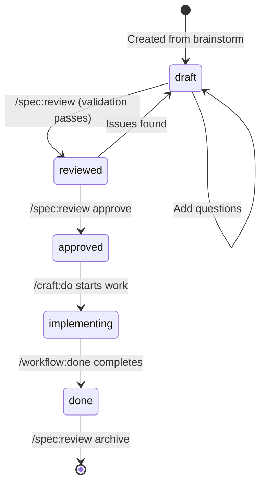

# /spec:review - Spec Review & Management

Interactive review of formal specs with validation, status updates, and archival.

## Arguments

| Argument | What it does |
|----------|--------------|
| (none) | List all specs in project |
| `[topic]` | Review specific spec |
| `list` | List all specs with status |
| `show [topic]` | Display spec content |
| `review [topic]` | Interactive review with validation |
| `approve [topic]` | Mark spec as approved |
| `archive [topic]` | Move to archive (completed) |

## When Invoked

### Step 1: Locate Specs

```bash
# Find specs in project
find docs/specs -name "SPEC-*.md" -type f 2>/dev/null

# If no specs directory, check root
find . -maxdepth 1 -name "SPEC-*.md" -type f 2>/dev/null
```

### Step 2: Parse Action

| Input | Behavior |
|-------|----------|
| `/spec:review` | List all specs, then ask which to review |
| `/spec:review auth` | Review spec matching "auth" |
| `/spec:review list` | Show all specs with status |
| `/spec:review approve auth` | Mark auth spec as approved |

---

## Actions

### Action: list

Show all specs with their status:

```
┌─────────────────────────────────────────────────────────────┐
│ 📋 SPECS IN PROJECT                                         │
├─────────────────────────────────────────────────────────────┤
│                                                             │
│ Active Specs:                                               │
│   📝 SPEC-auth-system-2025-12-30.md                         │
│      Status: draft │ Created: 2025-12-30                    │
│      Open Questions: 2                                      │
│                                                             │
│   ✅ SPEC-notifications-2025-12-28.md                       │
│      Status: approved │ Created: 2025-12-28                 │
│      Ready for implementation                               │
│                                                             │
│   🔧 SPEC-cache-layer-2025-12-25.md                         │
│      Status: implementing │ Created: 2025-12-25             │
│      In progress                                            │
│                                                             │
│ Archived: 3 specs in docs/specs/_archive/                   │
│                                                             │
├─────────────────────────────────────────────────────────────┤
│ 🔗 Actions:                                                 │
│    /spec:review [topic]     ← review a spec                 │
│    /spec:review approve [t] ← mark as approved              │
│                                                             │
└─────────────────────────────────────────────────────────────┘
```

### Action: show

Display spec content:

```bash
# Read and display spec
cat docs/specs/SPEC-[topic]-*.md

# Highlight sections:
# - Overview
# - User Stories + Acceptance Criteria
# - Technical Requirements
# - Open Questions
# - Review Checklist
```

### Action: review (Default)

Interactive review with validation checks:

#### Step 1: Show Spec Summary

```
┌─────────────────────────────────────────────────────────────┐
│ 📋 REVIEWING: SPEC-auth-system-2025-12-30.md                │
├─────────────────────────────────────────────────────────────┤
│                                                             │
│ Topic: Authentication System                                │
│ Status: draft                                               │
│ Created: 2025-12-30                                         │
│ From Brainstorm: BRAINSTORM-auth-2025-12-30.md              │
│                                                             │
│ ─────────────────────────────────────────────────────────── │
│                                                             │
│ Sections:                                                   │
│   ✅ Overview - Complete                                    │
│   ✅ User Stories - 1 primary, 2 secondary                  │
│   ⚠️ Technical Requirements - Missing API endpoints         │
│   ✅ UI/UX Specifications - Complete                        │
│   ❌ Open Questions - 2 unresolved                          │
│                                                             │
└─────────────────────────────────────────────────────────────┘
```

#### Step 2: Run Validation Checks

| Check | Status | Description |
|-------|--------|-------------|
| Acceptance criteria testable | ✅/⚠️/❌ | Each criterion can be verified |
| Technical requirements complete | ✅/⚠️/❌ | APIs, data models defined |
| Dependencies identified | ✅/⚠️/❌ | All deps listed |
| No blocking questions | ✅/⚠️/❌ | Open questions resolved |

#### Step 3: Ask Review Action

```
AskUserQuestion:
  question: "What would you like to do with this spec?"
  header: "Action"
  multiSelect: false
  options:
    - label: "Approve - Ready for implementation"
      description: "Mark status as 'approved'"
    - label: "Update - Add missing information"
      description: "Edit spec to fill gaps"
    - label: "Add Questions - Note concerns"
      description: "Add to Open Questions section"
    - label: "Keep as Draft - Not ready yet"
      description: "Leave status unchanged"
```

#### Step 4: Execute Action

**If Approve:**

1. Update spec status to `approved`
2. Update timestamp
3. Show confirmation

**If Update:**

1. Show which sections need work
2. Ask clarifying questions
3. Update spec file

**If Add Questions:**

1. Ask for question text
2. Append to Open Questions section
3. Keep status as draft

### Action: approve

Quick approval without full review:

```
AskUserQuestion:
  question: "Confirm approval of this spec?"
  header: "Approve"
  multiSelect: false
  options:
    - label: "Yes - Approve for implementation"
      description: "Status → approved"
    - label: "No - Review first"
      description: "Run full review"
```

If confirmed:

1. Update status to `approved`
2. Update timestamp
3. Show confirmation with next steps

### Action: archive

Move completed spec to archive:

```
AskUserQuestion:
  question: "Archive this spec?"
  header: "Archive"
  multiSelect: false
  options:
    - label: "Yes - Implementation complete"
      description: "Move to docs/specs/_archive/"
    - label: "Yes - Superseded by new spec"
      description: "Archive as replaced"
    - label: "No - Keep active"
      description: "Don't archive"
```

If confirmed:

1. Move to `docs/specs/_archive/`
2. Update status to `done`
3. Update timestamp
4. Show confirmation

---

## Validation Rules

### Acceptance Criteria Check

```python
def validate_acceptance_criteria(spec):
    criteria = extract_criteria(spec)
    issues = []

    for criterion in criteria:
        # Check if testable (contains action verb)
        if not has_action_verb(criterion):
            issues.append(f"Criterion not testable: {criterion}")

        # Check if measurable
        if not has_measurable_outcome(criterion):
            issues.append(f"Criterion not measurable: {criterion}")

    return issues
```

### Technical Requirements Check

```python
def validate_technical_requirements(spec):
    issues = []

    # Check for API endpoints
    if "| Endpoint |" not in spec and "API" in spec:
        issues.append("API mentioned but no endpoints defined")

    # Check for data models
    if "Model:" not in spec and ("database" in spec.lower() or "data" in spec.lower()):
        issues.append("Data mentioned but no models defined")

    # Check for dependencies
    if "Dependencies" not in spec:
        issues.append("No dependencies section")

    return issues
```

### Open Questions Check

```python
def validate_open_questions(spec):
    questions = extract_open_questions(spec)
    unchecked = [q for q in questions if q.startswith("- [ ]")]

    if unchecked:
        return f"{len(unchecked)} unresolved questions"
    return None
```

---

## Status Workflow



---

## Output Formats

### Terminal (Default)

Rich formatted output with colors, boxes, and status indicators.

### JSON (`--format json`)

```json
{
  "specs": [
    {
      "file": "SPEC-auth-system-2025-12-30.md",
      "topic": "auth-system",
      "status": "draft",
      "created": "2025-12-30",
      "updated": "2025-12-30",
      "validation": {
        "acceptance_criteria": "pass",
        "technical_requirements": "warning",
        "open_questions": "fail"
      },
      "open_questions_count": 2
    }
  ]
}
```

---

## Integration

**Called by:**

- `/workflow:brainstorm` - Suggests review after spec capture
- `/craft:do` - Checks for relevant spec before implementation

**Works with:**

- `/workflow:done` - Offers to archive completed specs
- `/craft:docs:update` - Can generate docs from approved specs

---

## Examples

### Example 1: List All Specs

```
User: /spec:review

Claude: Shows list of all specs in project
        → 3 active, 2 archived
        → User selects "auth-system" to review
```

### Example 2: Review Specific Spec

```
User: /spec:review auth

Claude: Finds SPEC-auth-system-2025-12-30.md
        → Shows summary with validation results
        → Asks for action (approve/update/add questions/keep draft)
```

### Example 3: Quick Approve

```
User: /spec:review approve notifications

Claude: Confirms approval
        → Updates status to "approved"
        → Shows next steps (/craft:do "implement notifications")
```

### Example 4: Archive Completed

```
User: /spec:review archive cache-layer

Claude: Confirms archive
        → Moves to docs/specs/_archive/
        → Updates status to "done"
```

---

## Version History

### v1.0.0 (Current)

**Initial Release:**

- ✅ List, show, review, approve, archive actions
- ✅ Validation checks (acceptance, technical, questions)
- ✅ Status workflow (draft → reviewed → approved → implementing → done)
- ✅ AskUserQuestion integration for actions
- ✅ JSON output format for automation
