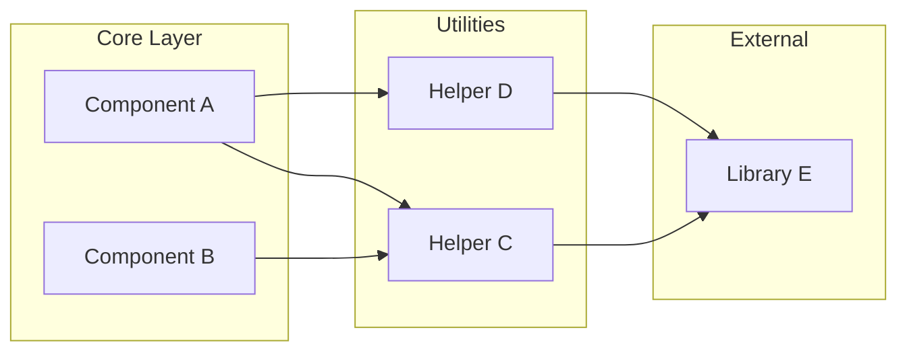
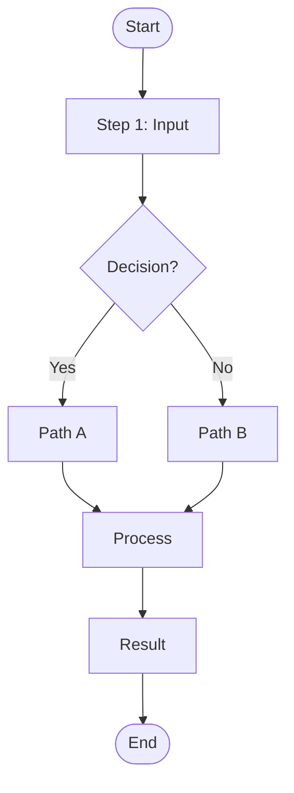
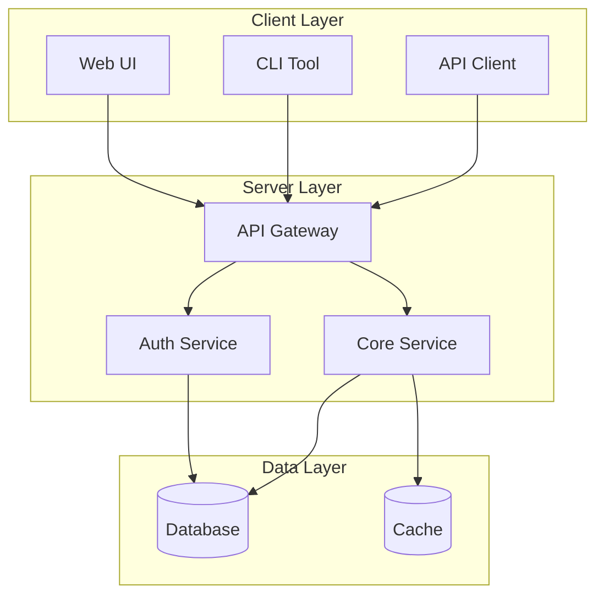
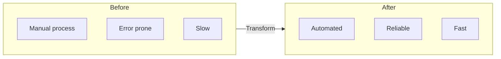
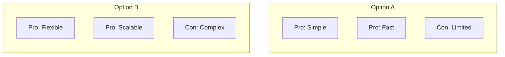
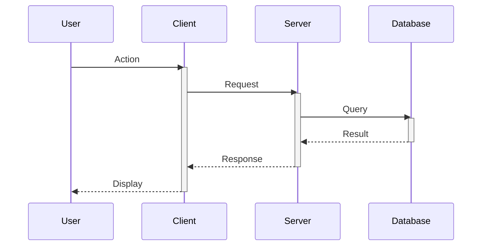
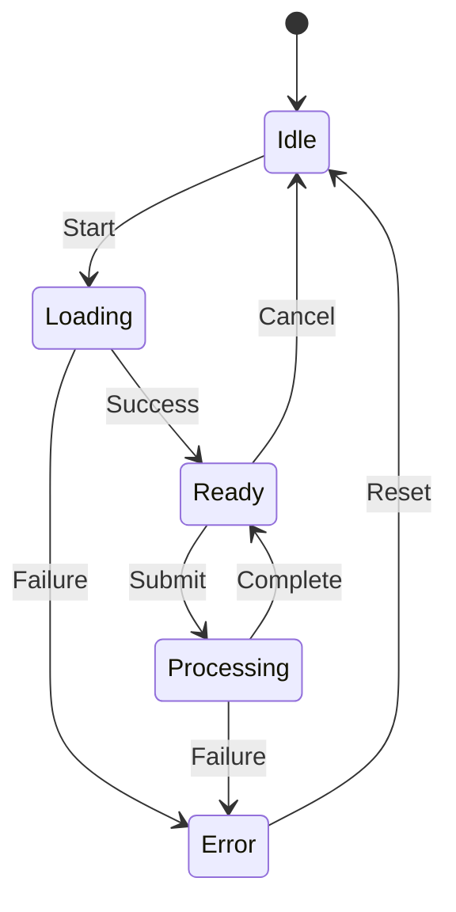
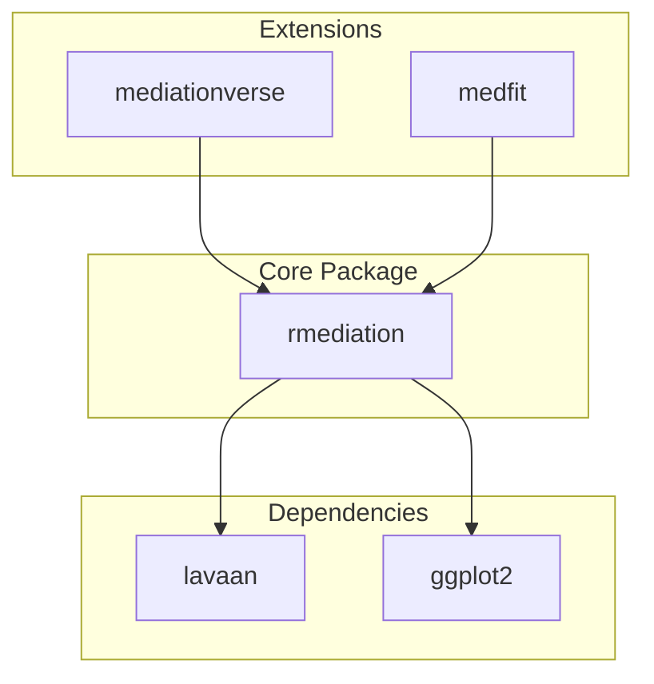
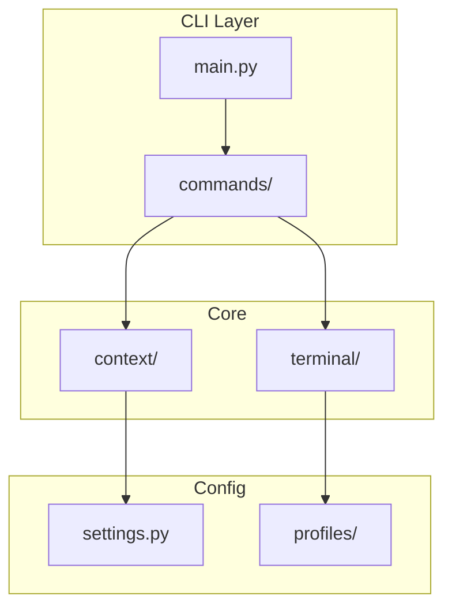
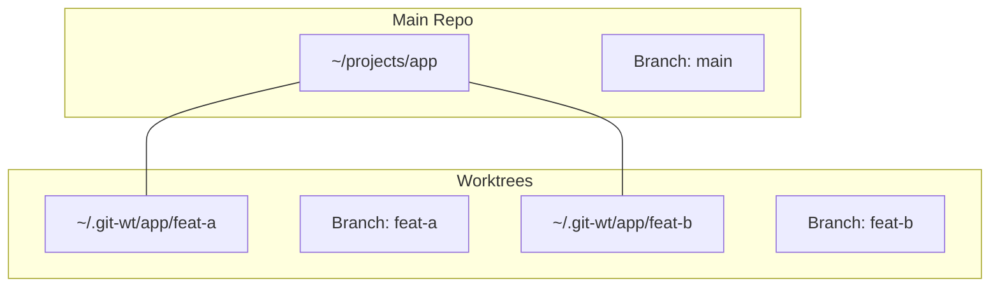

# /craft:docs:mermaid - Mermaid Diagram Templates

Generate production-ready Mermaid diagram templates following best practices.

## Why Templates?

- **Consistent styling** across all documentation
- **Proper text lengths** to prevent overflow
- **Tested patterns** that render correctly
- **Quick start** for common diagram types

## Usage

```bash
/craft:docs:mermaid                    # Show all templates
/craft:docs:mermaid dependency         # Dependency graph template
/craft:docs:mermaid workflow           # Workflow/process template
/craft:docs:mermaid architecture       # System architecture template
/craft:docs:mermaid comparison         # Side-by-side comparison
/craft:docs:mermaid sequence           # Sequence diagram template
/craft:docs:mermaid state              # State machine template
/craft:docs:mermaid all --output docs/diagrams/templates.md
```

## Templates

### dependency - Dependency Graph

Shows relationships between components, packages, or systems.



**Use for:**
- Package dependencies
- Module relationships
- Service connections
- Import hierarchies

**Customization points:**
- Replace subgraph names with your layers
- Add/remove nodes as needed
- Change arrow directions for data flow

---

### workflow - Process Flow

Shows step-by-step processes with decisions.



**Use for:**
- User workflows
- CI/CD pipelines
- Decision trees
- Installation steps

**Node shapes:**
- `([text])` - Start/End (stadium)
- `[text]` - Process (rectangle)
- `{text}` - Decision (diamond)
- `[[text]]` - Subroutine

---

### architecture - System Architecture

Shows system components and their interactions.



**Use for:**
- System overviews
- Microservices
- Infrastructure diagrams
- Component relationships

**Node shapes:**
- `[(text)]` - Database (cylinder)
- `[text]` - Service (rectangle)
- `((text))` - Circle (for actors)

---

### comparison - Side-by-Side

Shows two approaches or states for comparison.



**Alternative: Two-column comparison**



**Use for:**
- Before/After states
- Feature comparisons
- Trade-off analysis
- Migration plans

---

### sequence - Sequence Diagram

Shows interactions between components over time.



**Use for:**
- API interactions
- Authentication flows
- Message passing
- Protocol documentation

**Arrow types:**
- `->>` Solid with arrowhead
- `-->>` Dotted with arrowhead
- `-x` Solid with X (async)
- `--x` Dotted with X

---

### state - State Machine

Shows states and transitions.



**Use for:**
- UI states
- Order workflows
- Session lifecycles
- Connection states

---

## Best Practices (Built Into Templates)

### Use Markdown Strings (Not `<br/>` tags)

Per [official Mermaid docs](https://mermaid.js.org/syntax/flowchart.html), use markdown string syntax for multi-line text:

**❌ Avoid:**
```mermaid
flowchart TD
    A[Getting Started<br/>7 steps]    ❌ Manual line breaks
```

**✅ Recommended:**
```mermaid
flowchart TD
    A["`**Getting Started**
    7 steps · 10 minutes`"]           ✅ Auto-wraps, supports **bold**
```

**Benefits:**
- Automatic text wrapping at node width
- Supports **bold**, *italic*, `code` formatting
- Better mobile responsiveness
- More maintainable code

### Text Length Rules

| Element | Max | Example |
|---------|-----|---------|
| Node labels (single line) | 15 chars | `"Auth Service"` |
| Edge labels | 10 chars | `"creates"` |
| Subgraph titles | 20 chars | `"Client Layer"` |

### Abbreviation Patterns

```mermaid
%% BAD - Too long
graph LR
    A["~/projects/dev-tools/aiterm/feature-branch/"]

%% GOOD - Abbreviated
graph LR
    A["~/.../feature-branch"]
```

### Common Abbreviations

| Full | Abbreviated |
|------|-------------|
| `~/projects/dev-tools/` | `~/...dev-tools/` |
| `~/.git-worktrees/project/branch` | `~/.git-wt/.../branch` |
| `Authentication Service` | `Auth Service` |
| `Configuration Manager` | `Config Mgr` |
| `automatically creates` | `creates` |

---

## Output Format

When running without `--output`:

```
╭─ Mermaid Templates ─────────────────────────────────╮
│                                                     │
│ Available templates:                                │
│   • dependency  - Package/module relationships      │
│   • workflow    - Process flows with decisions      │
│   • architecture - System component diagrams        │
│   • comparison  - Before/after, option A vs B       │
│   • sequence    - Time-based interactions           │
│   • state       - State machine transitions         │
│                                                     │
│ Usage:                                              │
│   /craft:docs:mermaid <type>                        │
│   /craft:docs:mermaid all --output docs/templates.md│
│                                                     │
╰─────────────────────────────────────────────────────╯
```

When running with a type:

```
╭─ Dependency Graph Template ─────────────────────────╮
│                                                     │
│ Copy this template and customize:                   │
│                                                     │
│ ```mermaid                                          │
│ graph LR                                            │
│     subgraph CORE["Core Layer"]                     │
│         A["Component A"]                            │
│         B["Component B"]                            │
│     end                                             │
│     ...                                             │
│ ```                                                 │
│                                                     │
│ Customization tips:                                 │
│   • Replace subgraph names with your layers         │
│   • Keep node labels under 15 characters            │
│   • Use LR for wide, TB for tall diagrams           │
│                                                     │
╰─────────────────────────────────────────────────────╯
```

---

## Project-Specific Templates

### R Package Ecosystem



### CLI Tool Architecture



### Git Worktree Structure



---

## Integration

**Related commands:**
- `/craft:docs:generate diagram` - Routes to mermaid-expert agent
- `/craft:site:status` - Validates Mermaid configuration

**Uses skill:**
- `mermaid-linter` - Validates diagram syntax and text length

**mkdocs.yml requirements:**
```yaml
markdown_extensions:
  - pymdownx.superfences:
      custom_fences:
        - name: mermaid
          class: mermaid
          format: !!python/name:pymdownx.superfences.fence_code_format

# NO extra_javascript needed - Material handles Mermaid natively!
# Per https://squidfunk.github.io/mkdocs-material/reference/diagrams/
```

---

## Quick Reference

| Template | Direction | Best For |
|----------|-----------|----------|
| `dependency` | LR | Package relationships |
| `workflow` | TD | Process flows |
| `architecture` | TB | System diagrams |
| `comparison` | LR | Before/after |
| `sequence` | - | API interactions |
| `state` | - | State machines |

**Direction keywords:**
- `LR` - Left to Right (wide)
- `RL` - Right to Left
- `TB` or `TD` - Top to Bottom (tall)
- `BT` - Bottom to Top
