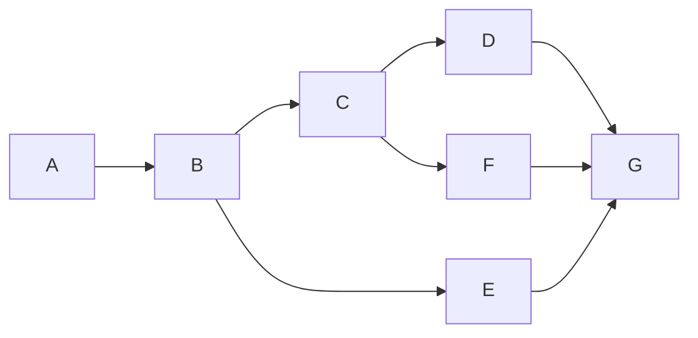
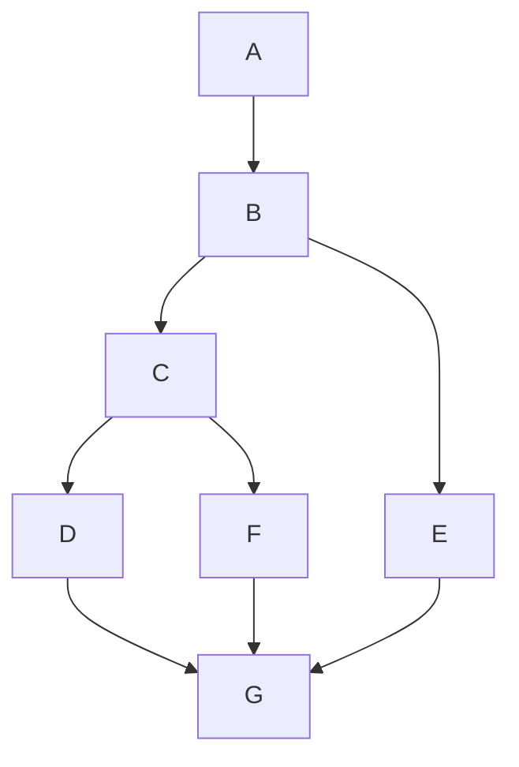

# Mermaid Diagram Linter

Validate Mermaid diagrams in markdown files for syntax errors, text overflow issues, and configuration requirements.

## When to Use

- Before deploying documentation sites
- When diagrams appear as raw code instead of rendered
- To validate diagram text length (prevents overflow)
- Part of documentation quality checks

## Validation Checks

### 1. Configuration Validation (mkdocs.yml)

Check that MkDocs is properly configured for Mermaid:

```yaml
# Required in mkdocs.yml
markdown_extensions:
  - pymdownx.superfences:
      custom_fences:
        - name: mermaid
          class: mermaid
          format: !!python/name:pymdownx.superfences.fence_code_format

extra_javascript:
  - https://unpkg.com/mermaid@10/dist/mermaid.min.js
```

**Missing custom_fences?** Diagrams will render as code blocks!

### 2. CSS Validation

Check for Mermaid overflow CSS in stylesheets:

```css
/* Required for proper rendering */
.mermaid {
  overflow-x: auto;
  text-align: center;
}

.mermaid svg {
  max-width: 100%;
  height: auto;
}

.mermaid .nodeLabel {
  font-size: 12px !important;
}
```

### 3. Syntax Validation

Check each mermaid block for valid syntax:

- Valid diagram types: `graph`, `flowchart`, `sequenceDiagram`, `classDiagram`, `stateDiagram`, `erDiagram`, `gantt`, `pie`, `mindmap`
- Proper directional keywords: `LR`, `RL`, `TB`, `BT`, `TD`
- Matching brackets and quotes
- Valid node definitions

### 4. Text Length Validation

**Critical for preventing overflow:**

| Element | Max Length | Recommendation |
|---------|------------|----------------|
| Node text | 15 chars | Use abbreviations, `...` for paths |
| Edge labels | 10 chars | Keep brief |
| Subgraph titles | 20 chars | Short descriptive names |

**Examples of good vs bad:**

```mermaid
%% BAD: Text too long, will overflow
graph LR
    A["~/.git-worktrees/aiterm/feature-mcp/"] --> B

%% GOOD: Abbreviated
graph LR
    A["~/.git-worktrees/.../feature-mcp"] --> B
```

### 5. Layout Direction Best Practices

**Prefer vertical layouts (TD/TB) over horizontal (LR/RL) for complex diagrams:**

| Layout | Best For | Avoid For |
|--------|----------|-----------|
| `flowchart TD` | Complex workflows, decision trees, multi-branch flows | - |
| `flowchart LR` | Simple linear flows (< 5 nodes), system architecture | Complex workflows, parallel processes |

**Why vertical layouts render better:**
- Better spacing on mobile/narrow screens
- Reduced text overlap in decision diamonds
- Clearer visualization of parallel processes using subgraphs
- More readable for ADHD-friendly documentation

**Examples:**





**When to use subgraphs (always with TD):**
- Parallel worktree workflows
- Multi-path decision flows
- Feature development pipelines

### 6. Diagram Count Report

Report all mermaid diagrams found:
- Total count per file
- Diagram types used
- Files with most diagrams

## Validation Commands

```bash
# Check all docs
grep -r "^\`\`\`mermaid" docs/ | wc -l

# Find long node text (> 20 chars between quotes)
grep -E '\["[^"]{20,}"\]' docs/**/*.md

# Check for custom_fences config
grep -A5 "superfences" mkdocs.yml | grep -q "custom_fences"
```

## Output Format

```
MERMAID DIAGRAM VALIDATION
==========================

Configuration:
  ✅ custom_fences configured in mkdocs.yml
  ✅ mermaid.js CDN in extra_javascript
  ⚠️  No Mermaid CSS found in stylesheets

Diagrams Found: 15 total
  docs/guides/GIT-WORKTREES-GUIDE.md: 12 diagrams
  docs/architecture/AITERM-ARCHITECTURE.md: 3 diagrams

Syntax Validation:
  ✅ All 15 diagrams have valid syntax

Text Length Issues:
  ⚠️  docs/guides/GIT-WORKTREES-GUIDE.md:156
      Node text "~/.git-worktrees/aiterm/feature-mcp/" is 38 chars (max 15)
      Suggestion: Use "~/.git-worktrees/.../feature-mcp"

Summary:
  Passed: 14/15
  Warnings: 1 (text length)
  Errors: 0 (syntax)
  Config: 2/3 (missing CSS)

Recommendations:
  1. Add Mermaid CSS to docs/stylesheets/extra.css
  2. Shorten node text in GIT-WORKTREES-GUIDE.md line 156
```

## Integration

**Called by:**
- `/craft:site:status --check` - Site health check
- `/craft:docs:validate` - Documentation validation
- `/craft:check commit` - Pre-commit checks

**Related:**
- `/craft:site:status` - Quick Mermaid config check
- `/craft:docs:generate` - Includes Mermaid guidelines

## Best Practices

1. **Keep text short** - Use abbreviations, ellipsis for long paths
2. **Test locally** - Run `mkdocs serve` to preview diagrams
3. **Use subgraphs** - Group related nodes for clarity
4. **Consistent styling** - Use same diagram type throughout a doc
5. **Add CSS early** - Include Mermaid CSS in every docs site

## Common Issues

| Issue | Cause | Fix |
|-------|-------|-----|
| Diagrams show as code | Missing custom_fences | Add to mkdocs.yml |
| Text overflows boxes | Node labels too long | Shorten to < 15 chars |
| Diagrams don't appear | Missing mermaid.js | Add CDN to extra_javascript |
| Layout broken | Missing CSS | Add overflow CSS |
