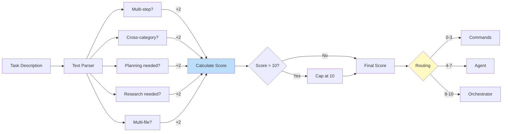
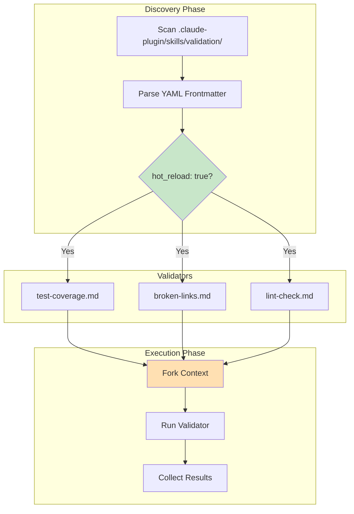
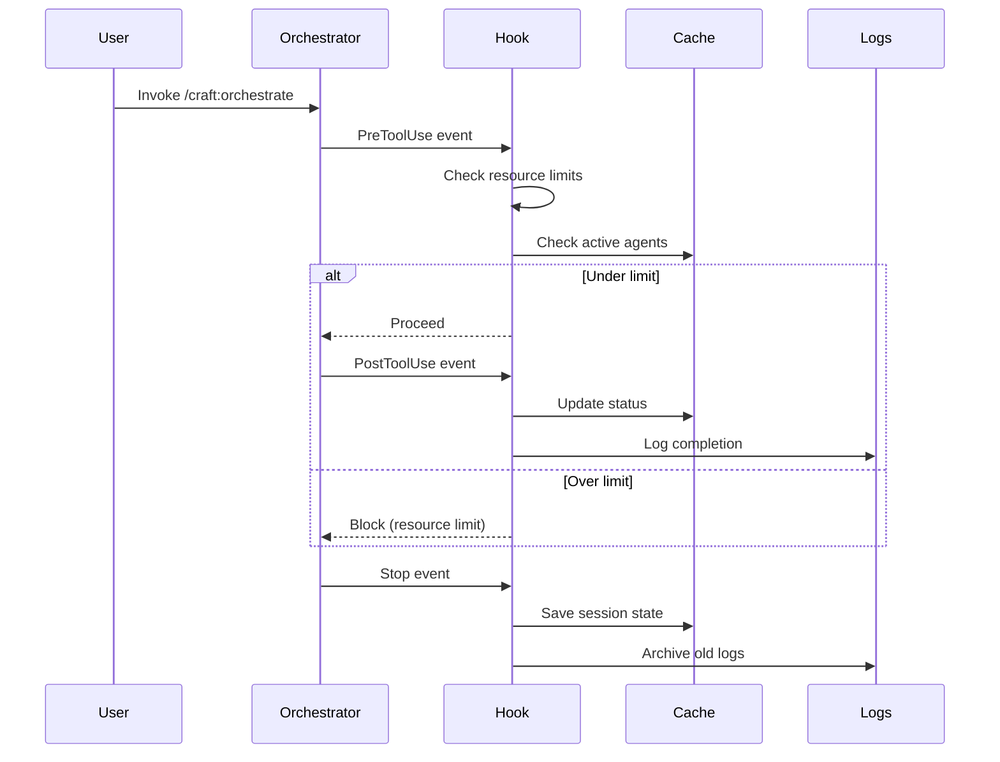
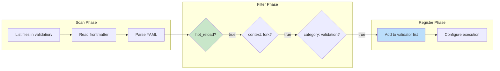
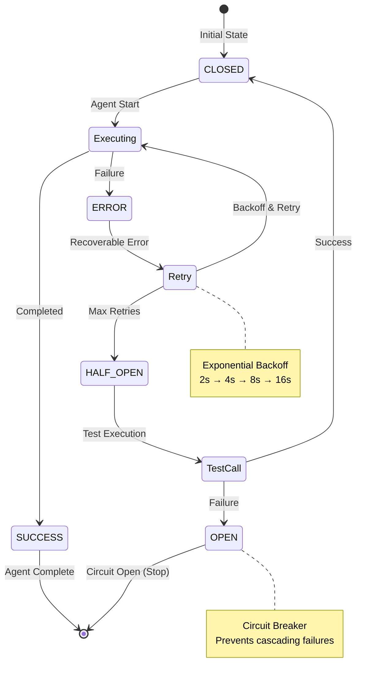
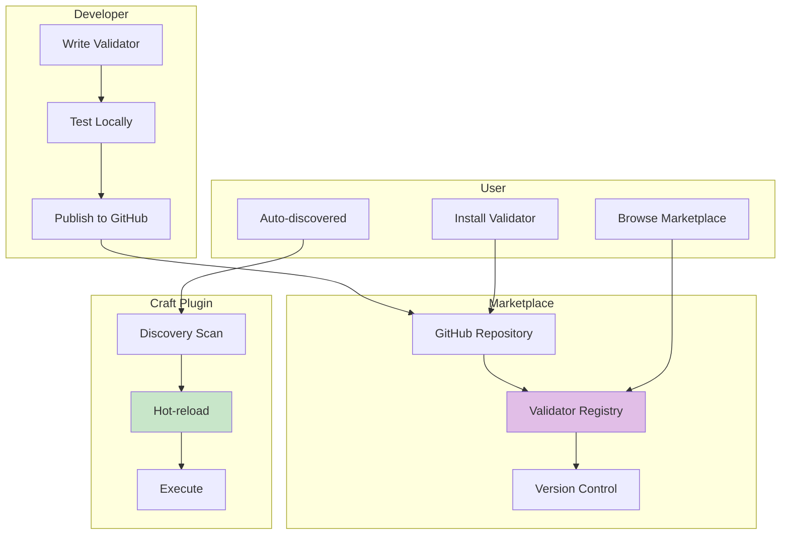
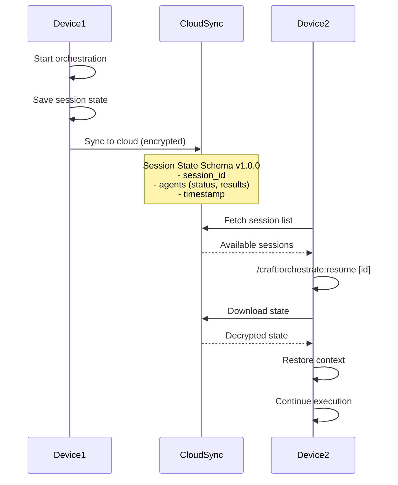
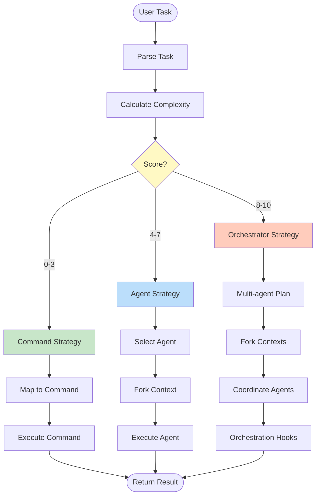
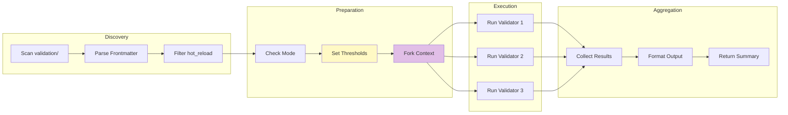

# Claude Code 2.1.0 Integration - Architecture

**Version**: 1.0.0
**Last Updated**: 2026-01-17

## System Overview

The Claude Code 2.1.0 integration enhances the Craft plugin with intelligent task routing, hot-reload validation, and agent orchestration capabilities across 4 implementation waves.

```mermaid
graph TB
    subgraph "User Interface"
        User[User Task]
    end

    subgraph "Wave 1: Foundation"
        Do[/craft:do Command]
        Scorer[Complexity Scorer]
        Check[/craft:check Command]
        Validators[Hot-Reload Validators]
        Hooks[Orchestration Hooks]
    end

    subgraph "Wave 2: Intelligence"
        Router{Routing Decision}
        Commands[Craft Commands]
        Agent[Specialized Agent]
        Orchestrator[Orchestrator-v2]
        Discovery[Validator Discovery]
    end

    subgraph "Wave 3: Scale"
        Resilience[Agent Resilience]
        Ecosystem[Validator Ecosystem]
        Teleport[Session Teleportation]
    end

    subgraph "Infrastructure"
        Cache[".craft/cache/"]
        Logs[".craft/logs/"]
        State["Session State (JSON)"]
    end

    User --> Do
    User --> Check

    Do --> Scorer
    Scorer --> Router

    Router -->|Score 0-3| Commands
    Router -->|Score 4-7| Agent
    Router -->|Score 8-10| Orchestrator

    Check --> Discovery
    Discovery --> Validators

    Orchestrator --> Hooks
    Hooks --> Cache
    Hooks --> Logs
    Hooks --> State

    Orchestrator --> Resilience
    Validators --> Ecosystem
    State --> Teleport

    style Wave1 fill:#e1f5ff
    style Wave2 fill:#fff4e1
    style Wave3 fill:#e8f5e9
```

---

## Component Architecture

### Wave 1: Foundation Layer

#### 1. Complexity Scoring Engine

**Purpose**: Analyze task complexity and recommend routing strategy



**Implementation**: `utils/complexity_scorer.py`

**Key Functions**:

- `calculate_complexity_score(task)` - Returns 0-10 score
- `get_routing_decision(score)` - Maps score to strategy
- `explain_score(task)` - Detailed breakdown

---

#### 2. Hot-Reload Validation System

**Purpose**: Auto-discover and execute validators without restart



**Features**:

- **Auto-discovery**: Scans `validation/` directory
- **YAML parsing**: Extracts `hot_reload` flag
- **Forked execution**: Isolated context per validator
- **Mode-aware**: Different thresholds per execution mode

---

#### 3. Orchestration Hooks

**Purpose**: Lifecycle management for agent orchestration



**Events**:

- **PreToolUse**: Resource limit checking
- **PostToolUse**: Status tracking, duration logging
- **Stop**: Session state persistence, log archival

**Mode-Aware Limits**:

```bash
debug:    MAX_AGENTS=1
default:  MAX_AGENTS=2
optimize: MAX_AGENTS=4
release:  MAX_AGENTS=4
```

---

### Wave 2: Intelligence Layer

#### 4. Smart Routing System

**Purpose**: Route tasks to optimal execution strategy

```mermaid
graph TB
    Task[User Task] --> Score[Complexity Scorer]

    Score --> R0_3{Score 0-3}
    Score --> R4_7{Score 4-7}
    Score --> R8_10{Score 8-10}

    R0_3 -->|Simple| Map1[Map to Command]
    Map1 --> Exec1[/craft:code:lint]
    Map1 --> Exec2[/craft:test:run]
    Map1 --> Exec3[/craft:git:status]

    R4_7 -->|Medium| Map2[Select Agent]
    Map2 --> A1[code-quality agent]
    Map2 --> A2[testing-specialist agent]
    Map2 --> A3[docs-architect agent]

    R8_10 -->|Complex| Map3[Orchestrator]
    Map3 --> O1[orchestrator-v2]
    O1 --> Multi[Multi-agent coordination]

    style R0_3 fill:#c8e6c9
    style R4_7 fill:#fff9c4
    style R8_10 fill:#ffccbc
```

**Routing Table**:

| Score Range | Strategy | Example |
|-------------|----------|---------|
| 0-3 | Direct command | "lint code" → `/craft:code:lint` |
| 4-7 | Single agent | "lint and test" → code-quality agent |
| 8-10 | Orchestrator | "design auth with OAuth2, tests, docs" → orchestrator-v2 |

---

#### 5. Validator Discovery Engine

**Purpose**: Dynamic validator loading without restart



**Discovery Criteria**:

1. Location: `.claude-plugin/skills/validation/*.md`
2. Frontmatter: `hot_reload: true`
3. Context: `context: fork`
4. Category: `category: validation`

---

### Wave 3: Scale Layer

#### 6. Agent Resilience Patterns

**Purpose**: Ensure reliable agent execution with auto-recovery



**Recovery Strategies**:

1. **Retry with Backoff**: Exponential delay (2s, 4s, 8s, 16s)
2. **Circuit Breaker**: CLOSED → HALF_OPEN → OPEN states
3. **Graceful Degradation**: Fall back to simpler strategy
4. **Timeout Protection**: Max execution time per mode
5. **Error Categorization**: 5 types (transient, permanent, etc.)

---

#### 7. Validator Ecosystem

**Purpose**: Community-contributed validators marketplace



**Features**:

- `/craft:check:gen-validator` - Template generator
- Best practices guide (715 lines)
- GitHub marketplace integration
- Semantic versioning
- Hot-reload support

---

#### 8. Session Teleportation

**Purpose**: Resume orchestration sessions across devices



**Session State Schema** (JSON v1.0.0):

```json
{
  "session_id": "uuid",
  "timestamp": "ISO-8601",
  "mode": "default|debug|optimize|release",
  "agents": [
    {
      "name": "agent-name",
      "status": "completed|in_progress|failed",
      "results": "agent output",
      "duration_ms": 1234
    }
  ]
}
```

---

## Data Flow Architecture

### Task Routing Flow



---

### Validator Execution Flow



---

## Deployment Architecture

### File Structure

```
craft/
├── .claude-plugin/
│   ├── hooks/
│   │   └── orchestrate-hooks.sh       # Orchestration lifecycle
│   └── skills/
│       └── validation/
│           ├── test-coverage.md       # Hot-reload validator
│           ├── broken-links.md        # Hot-reload validator
│           └── lint-check.md          # Hot-reload validator
├── commands/
│   ├── do.md                          # Smart routing
│   ├── check.md                       # Validator discovery
│   └── orchestrate.md                 # Multi-agent coordination
├── utils/
│   └── complexity_scorer.py           # Scoring algorithm
├── tests/
│   ├── test_complexity_scoring.py     # 15 tests
│   ├── test_hot_reload_validators.py  # 9 tests
│   └── test_agent_hooks.py            # 13 tests
└── docs/
    ├── TESTING-CLAUDE-CODE-2.1.md     # Test guide
    ├── API-REFERENCE-CLAUDE-CODE-2.1.md   # This file
    └── ARCHITECTURE-CLAUDE-CODE-2.1.md    # Architecture docs
```

---

### Runtime Directories

```
.craft/
├── cache/
│   ├── agent-*.status                 # Agent status tracking
│   └── session-state.json             # Session persistence
└── logs/
    └── orchestration.log              # Timestamped logs
```

---

## Integration Points

### 1. Command Layer Integration

**Entry Points**:

- `/craft:do <task>` - Invokes complexity scorer
- `/craft:check` - Invokes validator discovery

**Dependencies**:

- `utils/complexity_scorer.py`
- `.claude-plugin/skills/validation/*.md`

---

### 2. Agent Layer Integration

**Agents Enhanced**:

- `orchestrator-v2` - Version 2.1.0 → 2.3.0
  - Forked context execution
  - Resilience patterns
  - Session teleportation

**Hook Integration**:

- PreToolUse: Resource limit checking
- PostToolUse: Status updates, logging
- Stop: Session state persistence

---

### 3. Infrastructure Integration

**Directories Created**:

- `.craft/cache/` - Agent status, session state
- `.craft/logs/` - Timestamped orchestration logs

**State Management**:

- Session state: JSON schema v1.0.0
- Agent status: File-based tracking
- Log archival: Keep last 10 sessions

---

## Performance Considerations

### Execution Times

| Operation | Time | Notes |
|-----------|------|-------|
| Complexity scoring | < 1ms | In-memory calculation |
| Validator discovery | < 10ms | Filesystem scan + YAML parse |
| Agent hook execution | < 5ms | Shell script overhead |
| Session state save | < 2ms | JSON serialization |

### Resource Limits

| Mode | Max Agents | Coverage | Timeout |
|------|------------|----------|---------|
| debug | 1 | 60% | 120s |
| default | 2 | 70% | 10s |
| optimize | 4 | 75% | 180s |
| release | 4 | 90% | 300s |

---

## Security Considerations

### 1. Validator Execution

- **Forked context**: Isolated execution environment
- **No shell injection**: Pure Python/Bash validation
- **Sandboxed**: Limited filesystem access

### 2. Session State

- **Encrypted sync**: Cloud synchronization encrypted
- **Local-only default**: No network by default
- **Schema validation**: JSON schema v1.0.0 enforcement

### 3. Hook Execution

- **Syntax validation**: `bash -n` check before execution
- **Error handling**: `set -e` for fail-fast
- **Resource limits**: Mode-aware agent caps

---

## Scalability

### Horizontal Scaling

**Multi-agent Coordination**:

- Parallel execution (mode-dependent limits)
- Independent forked contexts
- No shared state between agents

**Validator Ecosystem**:

- Unlimited validators (discovery-based)
- Community contributions
- No central registry dependency

### Vertical Scaling

**Performance Optimization**:

- Complexity scoring: O(n) where n = task length
- Validator discovery: O(m) where m = validator count
- Hook execution: O(1) constant time

---

## Future Enhancements

### Planned Features

1. **E2E Tests** (12 planned)
   - Command routing integration
   - Validator discovery flows
   - Orchestrator resilience patterns

2. **Dogfooding Tests** (3 planned)
   - Real-world feature workflows
   - Pre-commit validation
   - Multi-step orchestration

3. **Performance Monitoring**
   - Execution time tracking
   - Resource usage metrics
   - Agent performance analytics

---

## Related Documentation

- [API Reference](./API-REFERENCE-CLAUDE-CODE-2.1.md) - Complete API documentation
- [Testing Guide](./TESTING-CLAUDE-CODE-2.1.md) - Test suite documentation
- [.STATUS](../.STATUS) - Implementation status
- [CLAUDE.md](https://github.com/Data-Wise/craft/blob/main/CLAUDE.md) - Project overview

---

**Last Updated**: 2026-01-17
**Integration Version**: Claude Code 2.1.0
**Architecture Version**: 1.0.0
