# Architecture - Dependency Management System

Visual architecture diagrams and system design documentation.

---

## Table of Contents

- [System Overview](#system-overview)
- [Component Diagrams](#component-diagrams)
- [Sequence Diagrams](#sequence-diagrams)
- [Data Flow](#data-flow)
- [Decision Trees](#decision-trees)

---

## System Overview

```mermaid
graph TB
    subgraph "User Interface"
        CMD[/craft:docs:demo]
        CLI["CLI Flags<br/>--check, --fix, --convert, --batch"]
    end

    subgraph "Phase 1: Detection"
        DM[dependency-manager.sh]
        TD[tool-detector.sh]
        SC[session-cache.sh]
    end

    subgraph "Phase 2: Installation"
        DI[dependency-installer.sh]
        CP[consent-prompt.sh]
        BREW[Homebrew]
        CARGO[Cargo]
        BINARY[Binary Download]
    end

    subgraph "Phase 3: Conversion"
        CC[convert-cast.sh]
        BC[batch-convert.sh]
        AGG[agg converter]
        GIF[gifsicle optimizer]
    end

    subgraph "Phase 4: Advanced"
        HC[health-check.sh]
        VC[version-check.sh]
        RT[repair-tools.sh]
    end

    subgraph "Storage"
        CACHE[(Session Cache)]
        YAML[(YAML Frontmatter)]
    end

    CMD --> CLI
    CLI --> DM
    DM --> TD
    DM --> SC
    SC <--> CACHE
    TD --> YAML

    DM --> DI
    DI --> CP
    DI --> BREW
    DI --> CARGO
    DI --> BINARY

    DM --> HC
    DM --> VC
    HC --> RT
    VC --> RT

    CLI --> CC
    CLI --> BC
    CC --> AGG
    AGG --> GIF

    style CMD fill:#4CAF50
    style DM fill:#2196F3
    style DI fill:#FF9800
    style CC fill:#9C27B0
    style HC fill:#F44336
```

---

## Component Diagrams

### Phase 1: Dependency Detection

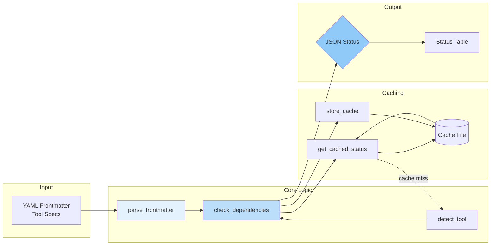

### Phase 2: Installation Pipeline

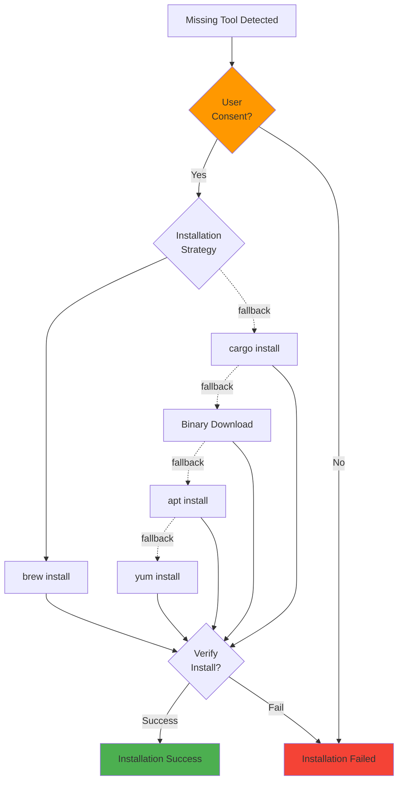

### Phase 3: Conversion Workflow

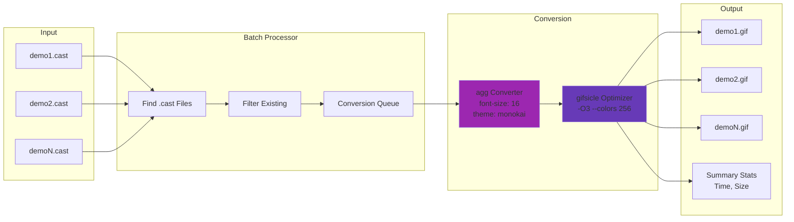

### Phase 4: Health & Repair System

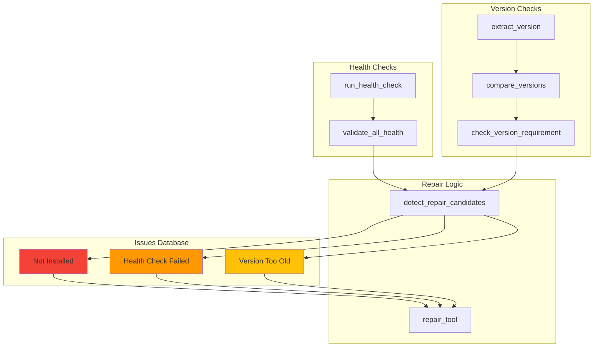

---

## Sequence Diagrams

### Full Dependency Check Workflow

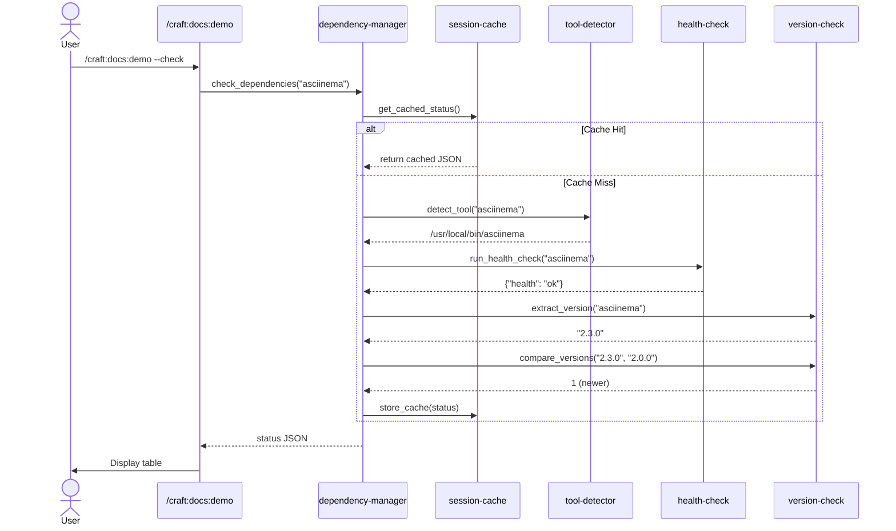

### Installation Workflow

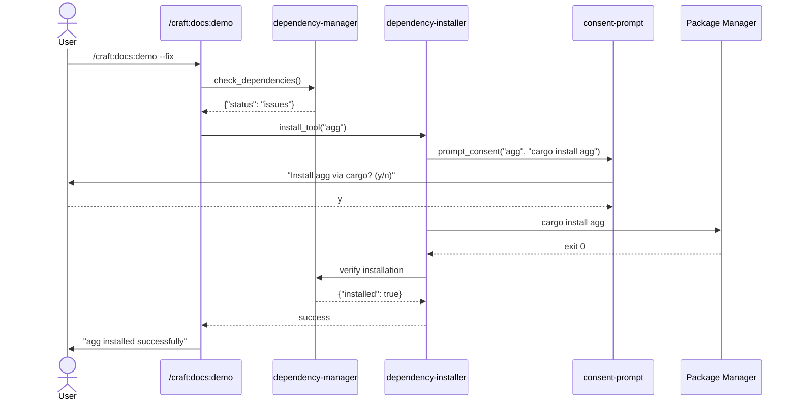

### Batch Conversion Flow

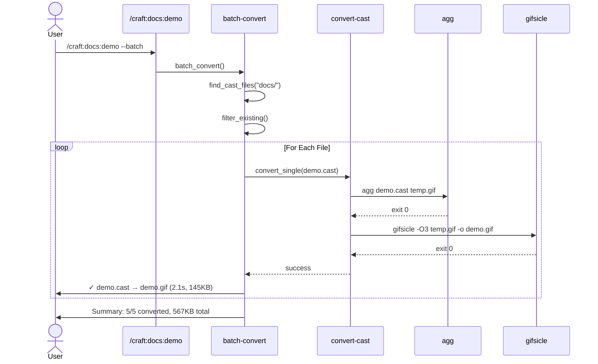

### Repair Workflow

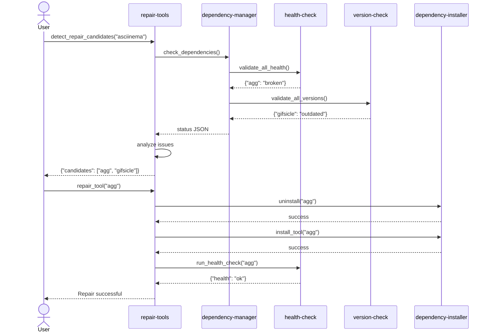

---

## Data Flow

### Dependency Check Data Flow

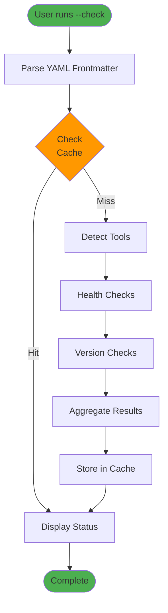

### Installation Data Flow

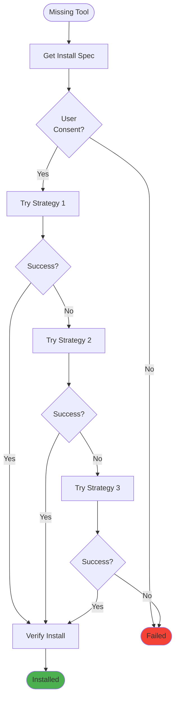

---

## Decision Trees

### Dependency Status Decision

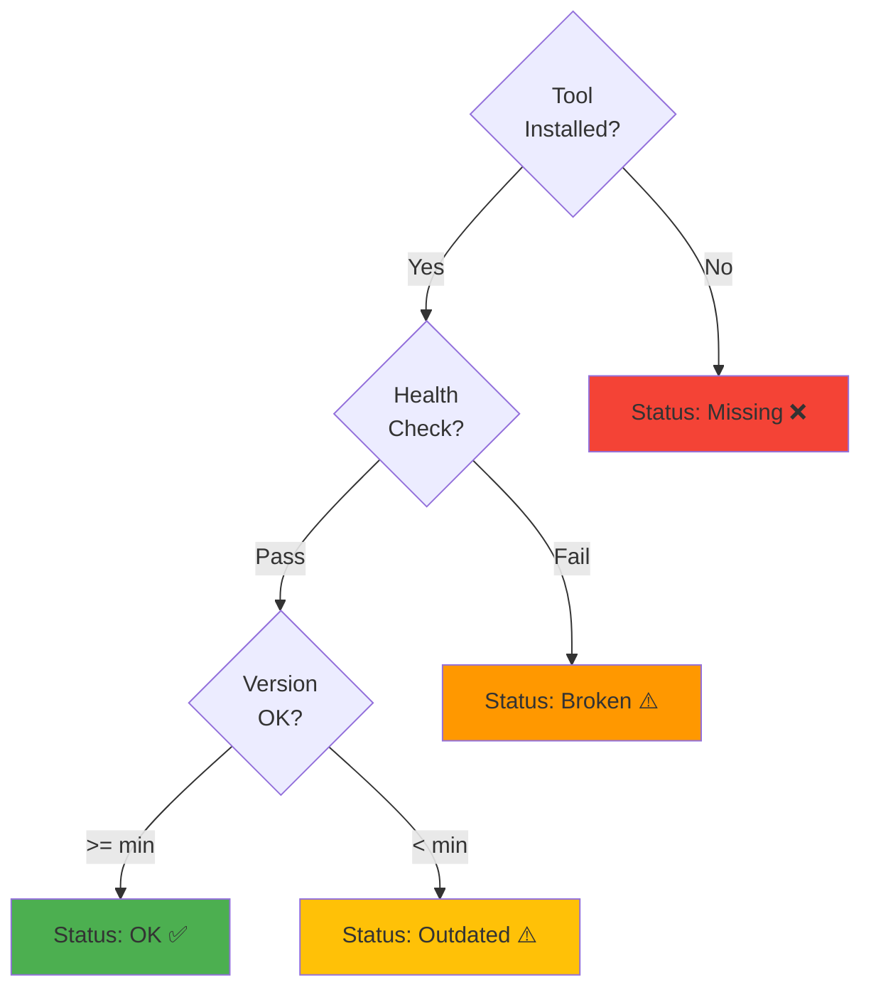

### Installation Strategy Selection

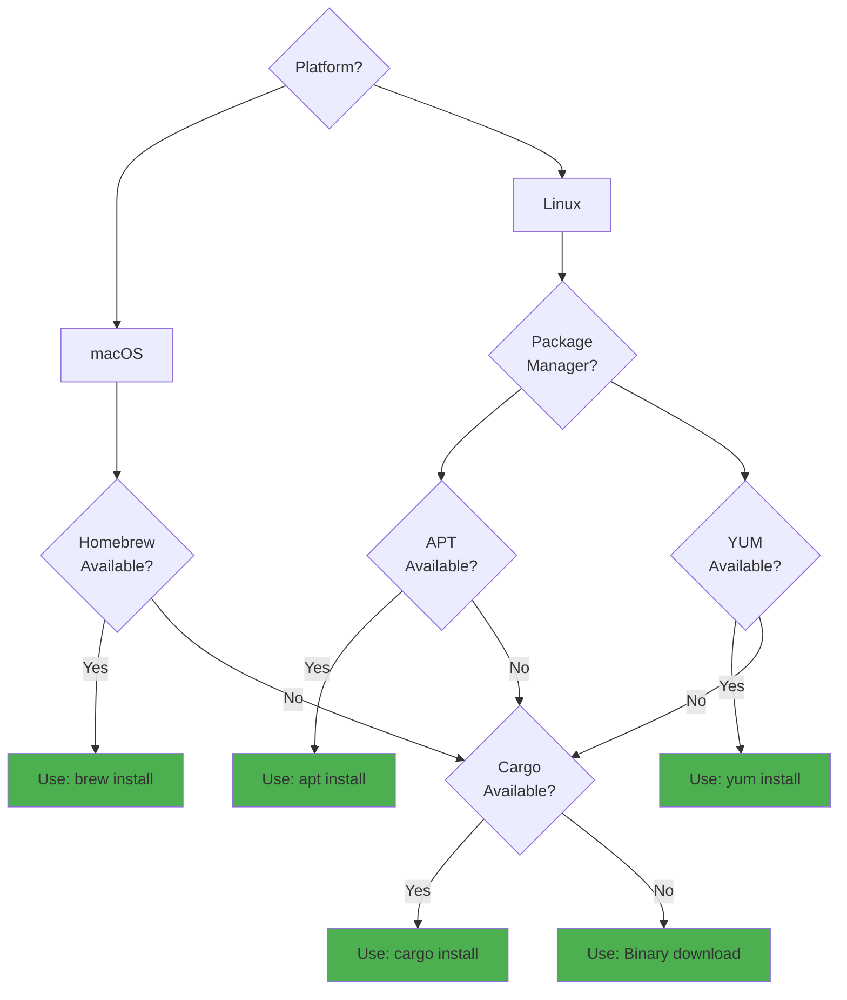

### Batch Conversion Decision

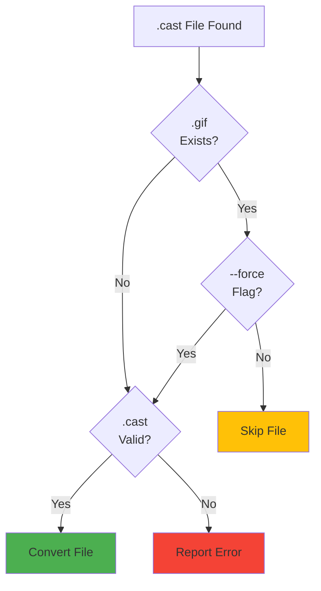

---

## System Integration Points

### CI/CD Integration Architecture

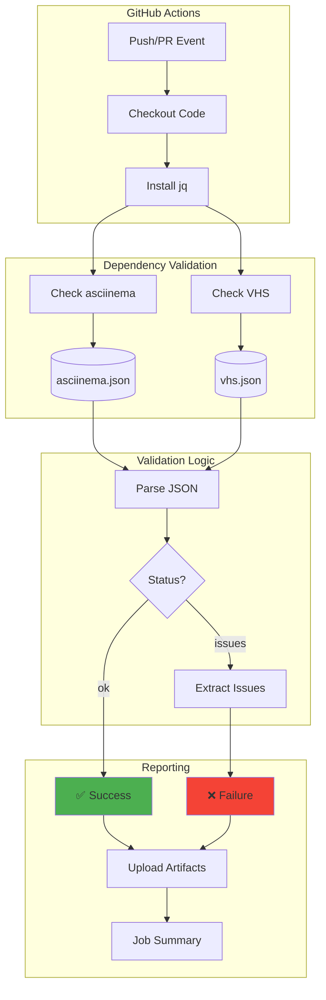

### Command Integration Flow

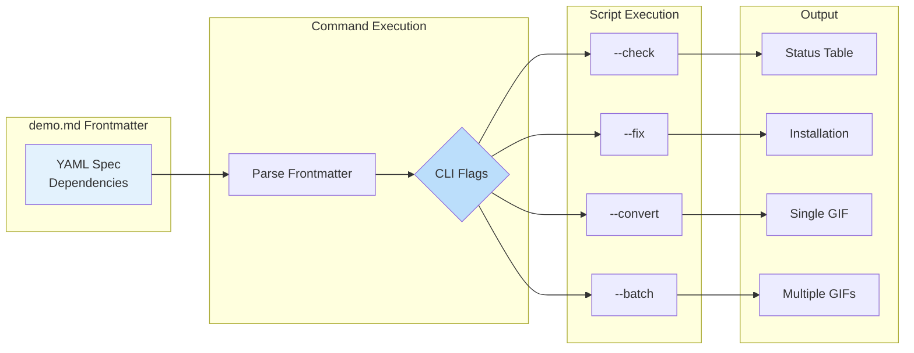

---

## Performance Characteristics

### Caching Strategy

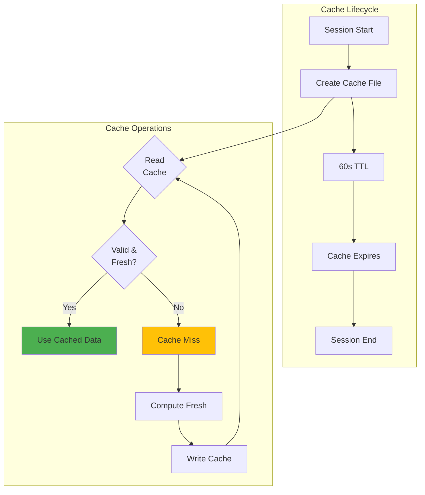

### Parallel Processing

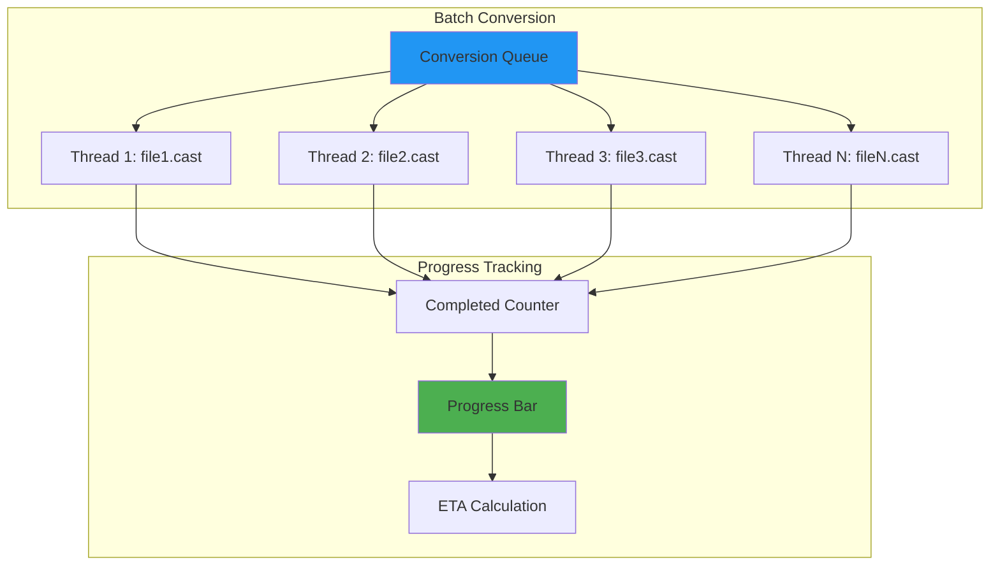

---

**Last Updated**: 2026-01-17
**Version**: 1.26.0
**Status**: Production Ready
