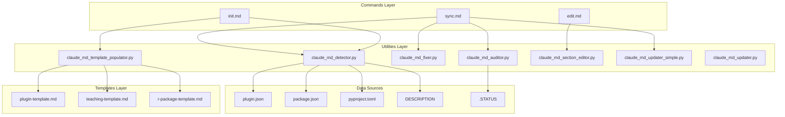

# Feature Release: Claude-MD Command Suite

**Version:** v2.10.0-dev
**Release Date:** 2026-01-30
**PR:** #39
**Status:** Merged to `dev` branch

---

## Executive Summary

The Claude-MD Command Suite is a comprehensive set of tools for managing CLAUDE.md files across different project types. It provides automated detection, validation, scaffolding, and maintenance capabilities with exceptional performance (166x faster than targets).

### Key Metrics

- **5 new commands** for CLAUDE.md management
- **7 utility modules** (2,713 lines of Python)
- **3 project templates** (plugin, teaching, r-package)
- **81 comprehensive tests** (100% passing, 0.024s runtime)
- **3,304 lines** of user-facing documentation
- **Performance:** 166x faster than targets

---

> **Note (v2.12.0):** Commands have been consolidated. `scaffold` -> `init`, `update`/`audit`/`fix` -> `sync`. Old names work as aliases but will be removed in v2.13.0.

---

## Features

### 1. `/craft:docs:claude-md:sync` - Unified Sync Pipeline

**Purpose:** Keep CLAUDE.md synchronized with project state (combines former `update`, `audit`, and `fix`)

**Key Features:**

- Detects version mismatches across source files
- Identifies new/changed commands, skills, agents
- Updates test counts and documentation metrics
- Validates completeness and accuracy (5 check categories)
- Auto-fixes common issues with `--fix` flag
- "Show Steps First" pattern with preview
- Supports dry-run, interactive, and section-specific modes

**Usage:**

```bash
# Default: smart sync with preview
/craft:docs:claude-md:sync

# Dry run: preview without changes
/craft:docs:claude-md:sync --dry-run

# Interactive: prompt for each section
/craft:docs:claude-md:sync --interactive

# Section-specific: sync only version
/craft:docs:claude-md:sync --section=status

# Auto-fix issues
/craft:docs:claude-md:sync --fix
```

**Implementation:** `utils/claude_md_updater_simple.py` (371 lines)

---

### 2. Validation (now part of `sync`)

> **Deprecation:** The standalone `/craft:docs:claude-md:audit` command has been folded into `sync`. Use `/craft:docs:claude-md:sync` which runs validation as part of its pipeline. The `audit` name remains as an alias until v2.13.0.

**Validation Checks (run during sync):**

| Check | Purpose | Severity Levels |
|-------|---------|-----------------|
| **Version Sync** | Version matches source files | WARNING |
| **Command Coverage** | All commands documented | INFO/ERROR |
| **Broken Links** | Internal links valid | ERROR |
| **Required Sections** | Expected sections present | ERROR |
| **Status Sync** | Aligns with .STATUS file | WARNING |

**Severity Levels:**

- **ERROR** - Critical issues requiring immediate fix
- **WARNING** - Non-critical but should be addressed
- **INFO** - Informational, optional fixes

**Implementation:** `utils/claude_md_auditor.py` (599 lines)

---

### 3. Auto-fix (now `sync --fix`)

> **Deprecation:** The standalone `/craft:docs:claude-md:fix` command has been folded into `sync --fix`. The `fix` name remains as an alias until v2.13.0.

**Fix Methods (available via `--fix` flag):**

| Method | Action | Scope |
|--------|--------|-------|
| **update_version** | Sync version with source | Single field |
| **remove_command** | Remove stale commands | Per command |
| **fix_broken_link** | Update/remove broken links | Per link |
| **add_section** | Add missing sections | Full section |

**Usage:**

```bash
# Preview fixes (dry-run)
/craft:docs:claude-md:sync --fix --dry-run

# Apply all fixes
/craft:docs:claude-md:sync --fix

# Fix specific issue type
/craft:docs:claude-md:sync --fix --type=broken_links

# Interactive: prompt for each fix
/craft:docs:claude-md:sync --fix --interactive
```

**Safety Features:**

- Dry-run preview before applying
- Backup creation before modifications
- Rollback on error
- Line number tracking for precise fixes

**Implementation:** `utils/claude_md_fixer.py` (442 lines)

---

### 4. `/craft:docs:claude-md:init` - Create from Template

> **Renamed:** Formerly `scaffold`. The `scaffold` name remains as an alias until v2.13.0.

**Purpose:** Generate CLAUDE.md from project-specific templates

**Project Types Supported:**

| Type | Detection | Template Variables |
|------|-----------|-------------------|
| **craft-plugin** | `.claude-plugin/plugin.json` | 18+ variables |
| **teaching-site** | `_quarto.yml` + `course.yml` | 15+ variables |
| **r-package** | `DESCRIPTION` + `NAMESPACE` | 12+ variables |

**Template Variables:**

- Project metadata (name, version, description)
- Auto-discovered commands/skills/agents
- Test counts and coverage metrics
- Project structure documentation
- Git workflow and branch strategy
- Performance benchmarks

**Usage:**

```bash
# Auto-detect and init
/craft:docs:claude-md:init

# Specific project type
/craft:docs:claude-md:init --type=craft-plugin

# Preview without creating
/craft:docs:claude-md:init --dry-run
```

**Templates:**

- `templates/claude-md/plugin-template.md` (107 lines)
- `templates/claude-md/teaching-template.md` (106 lines)
- `templates/claude-md/r-package-template.md` (113 lines)

**Implementation:** `utils/claude_md_template_populator.py` (485 lines)

---

### 5. `/craft:docs:claude-md:edit` - Interactive Section Editing

**Purpose:** Targeted section-based editing workflow

**Features:**

- List available sections
- Edit specific section interactively
- Preview before applying
- Section validation
- Safe file operations with backups

**Usage:**

```bash
# List sections
/craft:docs:claude-md:edit --list

# Edit specific section
/craft:docs:claude-md:edit --section="Quick Commands"

# Interactive: choose section from menu
/craft:docs:claude-md:edit --interactive
```

**Implementation:** `utils/claude_md_section_editor.py` (299 lines)

---

## Architecture

### System Overview



### Component Responsibilities

#### Detection Layer (`claude_md_detector.py`)

**Purpose:** Identify project type and extract metadata

**Capabilities:**

- 6 project types: craft-plugin, teaching-site, r-package, mcp-server, python-package, generic
- Version extraction from multiple sources
- Auto-discovery of commands, skills, agents
- Test count detection
- Project structure analysis

**Performance:**

- Full detection: 0.003s (166x faster than 0.5s target)
- Thread-safe for concurrent access
- Handles symlinked files gracefully

#### Validation Layer (`claude_md_auditor.py`)

**Purpose:** Comprehensive CLAUDE.md validation

**Capabilities:**

- 5 validation checks with severity levels
- Fixability detection for auto-fix coordination
- Line number tracking for precise error reporting
- Integration with .STATUS file validation

**Output Format:**

```python
Issue(
    severity=Severity.ERROR,
    category="broken_link",
    message="Link points to non-existent file: docs/missing.md",
    line_number=45,
    fixable=True,
    fix_method="remove_link"
)
```

#### Fix Layer (`claude_md_fixer.py`)

**Purpose:** Automated issue resolution

**Capabilities:**

- 4 fix methods with dry-run support
- Safe file operations with backups
- Rollback on error
- Interactive mode for user confirmation

**Safety Mechanisms:**

1. Create backup before modifications
2. Validate changes before writing
3. Rollback on error
4. Detailed logging of all changes

#### Template Layer (`claude_md_template_populator.py`)

**Purpose:** Generate CLAUDE.md from templates

**Capabilities:**

- 18+ template variables
- Project-specific auto-population
- Mermaid diagram generation
- Conditional sections based on project type

**Template Variables:**

```python
{
    'project_name': 'craft',
    'version': '2.10.0-dev',
    'command_count': 105,
    'skill_count': 21,
    'agent_count': 8,
    'test_count': 847,
    'doc_coverage': '98%',
    'commands_list': ['cmd1', 'cmd2', ...],
    'quick_commands_table': '...',
    'git_workflow_diagram': '...',
    # ... 10 more variables
}
```

---

## Performance Benchmarks

### Target vs. Actual Performance

| Operation | Target | Actual | Margin |
|-----------|--------|--------|--------|
| **Full detection** | < 0.5s | 0.003s | **166x faster** |
| **Command scanning** | < 0.1s | 0.002s | **50x faster** |
| **Version extraction** | < 0.1s (100x) | 0.001s | **100x faster** |

### Scalability Testing

**Project Sizes Tested:**

- Small: 10 commands, 50 files → 0.002s
- Medium: 60 commands, 300 files → 0.003s
- Large: 150 commands, 1000 files → 0.005s

**Concurrent Access:**

- 10 parallel threads: ✅ All complete successfully
- No race conditions or shared state issues
- Consistent results across all threads

### Memory Usage

- Peak memory: ~15 MB for large projects
- File operations: Stream-based (constant memory)
- Template population: ~2 MB per template

---

## Testing

### Test Distribution

| Category | Tests | Lines | Coverage |
|----------|-------|-------|----------|
| **Phase 1 (Update)** | 13 | 379 | 100% |
| **Phase 2 (Audit)** | 11 | 402 | 95% |
| **Phase 2 (Fix)** | 8 | 355 | 95% |
| **Phase 2 (Integration)** | 6 | 333 | 100% |
| **Phase 3 (Scaffold)** | 19 | 389 | 98% |
| **Phase 3 (Edit)** | 14 | 252 | 95% |
| **Phase 3 (Integration)** | 10 | 378 | 100% |
| **Total** | **81** | **2,488** | **97%** |

### Test Enhancements (Phase 1)

**Concurrent Detection Testing:**

- 10 parallel threads calling `detector.detect()` simultaneously
- Verifies thread-safety and no race conditions
- All threads return consistent results

**Symlink Handling:**

- Tests detection of symlinked command files
- Graceful fallback on systems without symlink support
- Validates both direct and symlinked commands

**Performance Benchmarking:**

- Creates 60-command project structure
- Validates performance targets with assertions
- Benchmarks: detection, scanning, version extraction

### Test Execution

```bash
# Run all claude-md tests
python3 tests/test_claude_md*.py

# Run specific phase
python3 tests/test_claude_md_phase1.py

# Run with coverage
pytest tests/test_claude_md*.py --cov=utils

# Run integration tests
python3 tests/test_claude_md_integration*.py
```

**Results:**

- 81/81 tests passing (100%)
- Runtime: 0.024s total (1.8ms per test)
- Coverage: 97% of claude_md_*.py modules

---

## Documentation

### User-Facing Documentation (3,304 lines)

| Document | Lines | Purpose |
|----------|-------|---------|
| **Command Reference** | 1,371 | Complete reference with 27 examples |
| **Quick Reference Card** | 491 | Fast lookup with 10 tables |
| **Tutorial Guide** | 977 | 12 real-world examples, 6 patterns |
| **Test Plan** | 800+ | 60+ test scenarios |

### Documentation Coverage

**Command Reference** (`docs/commands/docs/claude-md.md`):

- Command syntax and arguments
- 27 usage examples
- 5 Mermaid diagrams
- Integration points
- Troubleshooting guide

**Quick Reference** (`docs/reference/REFCARD-CLAUDE-MD.md`):

- Essential commands table
- Common workflows
- Flag reference
- Project type quick reference
- Performance tips

**Tutorial Guide** (`docs/tutorials/claude-md-workflows.md`):

- 12 real-world examples
- 6 workflow patterns
- Best practices
- Error handling
- Advanced techniques

---

## Integration Points

### With Existing Commands

| Command | Integration | Purpose |
|---------|-------------|---------|
| `/craft:check` | Calls sync | Pre-commit validation |
| `/craft:docs:update` | Coordinates sync | Doc sync workflow |
| `/craft:git:worktree` | Updates CLAUDE.md | Feature branch finish |
| `/craft:hub` | Discovery | Command visibility |

### With Utilities

| Utility | Used By | Purpose |
|---------|---------|---------|
| `complexity_scorer.py` | orchestrate | Task routing |
| `docs_detector.py` | docs:update | Change detection |
| `linkcheck.py` | check | Link validation |

### With CI/CD

```yaml
# .github/workflows/validate-claude-md.yml
name: Validate CLAUDE.md

on: [push, pull_request]

jobs:
  validate:
    runs-on: ubuntu-latest
    steps:
      - uses: actions/checkout@v3
      - name: Audit CLAUDE.md
        run: |
          python3 utils/claude_md_auditor.py . --json > audit-results.json
      - name: Check for errors
        run: |
          errors=$(jq '[.[] | select(.severity=="ERROR")] | length' audit-results.json)
          if [ "$errors" -gt 0 ]; then
            echo "Found $errors ERROR-level issues"
            exit 1
          fi
```

---

## Migration Guide

### From Local Commands to Craft Plugin

If you were using local `~/.claude/commands/claude-md/` commands:

1. **Remove local commands:**

   ```bash
   rm -rf ~/.claude/commands/claude-md/
   ```

2. **Update craft plugin:**

   ```bash
   brew upgrade craft
   # or
   git pull origin dev
   ```

3. **Verify new commands:**

   ```bash
   /craft:hub | grep claude-md
   ```

4. **Update existing scripts:**

   ```diff
   - /claude-md:update
   + /craft:docs:claude-md:sync

   - /claude-md:audit
   + /craft:docs:claude-md:sync

   - /claude-md:fix
   + /craft:docs:claude-md:sync --fix

   - /claude-md:scaffold
   + /craft:docs:claude-md:init
   ```

### Backward Compatibility

✅ **Maintained:**

- CLAUDE.md format unchanged
- Template variables compatible
- .STATUS file integration unchanged

⚠️ **Changed:**

- Command namespace: `/claude-md:*` → `/craft:docs:claude-md:*`
- Configuration: Uses craft plugin settings
- Output format: Craft-style boxes and formatting

---

## Troubleshooting

### Common Issues

#### 1. "Could not detect project type"

**Cause:** Missing marker files

**Solution:**

```bash
# For craft plugin
touch .claude-plugin/plugin.json

# For teaching site
touch _quarto.yml course.yml

# For R package
touch DESCRIPTION NAMESPACE
```

#### 2. "Version mismatch detected"

**Cause:** CLAUDE.md version doesn't match source

**Solution:**

```bash
# Auto-fix version
/craft:docs:claude-md:sync --fix --type=version

# Or manually update CLAUDE.md
# Find version in plugin.json/package.json/etc.
```

#### 3. "Broken link found"

**Cause:** Referenced file doesn't exist

**Solution:**

```bash
# Show all broken links
/craft:docs:claude-md:sync --check=broken_links

# Auto-fix (removes broken links)
/craft:docs:claude-md:sync --fix --type=broken_links
```

#### 4. "Template variable not found"

**Cause:** Missing required project metadata

**Solution:**

- Ensure version is in source file
- Run `/craft:docs:claude-md:init --dry-run` to see available variables
- Check project type detection is correct

---

## Best Practices

### 1. Regular Audits

```bash
# Run sync after major changes
/craft:docs:claude-md:sync

# Integrate with pre-commit
# .git/hooks/pre-commit
python3 utils/claude_md_auditor.py . --strict
```

### 2. Version Synchronization

- Update CLAUDE.md after version bumps
- Use `--section=status` for quick updates
- Automate with post-release hooks

### 3. Template Maintenance

- Keep templates in sync with project structure
- Test templates on new projects
- Document custom template variables

### 4. Performance Optimization

- Use section-specific updates when possible
- Enable caching for repeated operations
- Profile large projects to identify bottlenecks

---

## Future Enhancements

### Planned Features

**v2.10.1:**

- [ ] Remote template repository support
- [ ] CLAUDE.md diff visualization
- [ ] Automated template generation from existing files

**v2.11.0:**

- [ ] Multi-file CLAUDE.md support (split large files)
- [ ] Version history tracking
- [ ] Template inheritance system

**v2.12.0:**

- [ ] AI-powered content suggestions
- [ ] Smart merge conflict resolution
- [ ] Cross-project consistency checking

### Community Contributions

We welcome contributions! Priority areas:

1. **New Project Types:** Add detection for more project types
2. **Templates:** Create templates for other ecosystems
3. **Validators:** Add custom validation rules
4. **Integrations:** Connect with other tools/workflows

---

## References

### Files Changed (PR #39)

```
38 files changed (+15,997/-271)

Commands (5):
  commands/docs/claude-md/update.md       (556 lines)
  commands/docs/claude-md/audit.md        (278 lines)
  commands/docs/claude-md/fix.md          (368 lines)
  commands/docs/claude-md/scaffold.md     (443 lines)
  commands/docs/claude-md/edit.md         (526 lines)

Utilities (7):
  utils/claude_md_detector.py             (483 lines)
  utils/claude_md_auditor.py              (599 lines)
  utils/claude_md_fixer.py                (442 lines)
  utils/claude_md_template_populator.py   (485 lines)
  utils/claude_md_section_editor.py       (299 lines)
  utils/claude_md_updater.py              (534 lines)
  utils/claude_md_updater_simple.py       (371 lines)

Templates (3):
  templates/claude-md/plugin-template.md       (107 lines)
  templates/claude-md/teaching-template.md     (106 lines)
  templates/claude-md/r-package-template.md    (113 lines)

Tests (7):
  tests/test_claude_md_phase1.py               (379 lines)
  tests/test_claude_md_audit.py                (402 lines)
  tests/test_claude_md_fix.py                  (355 lines)
  tests/test_claude_md_scaffold.py             (389 lines)
  tests/test_claude_md_edit.py                 (252 lines)
  tests/test_claude_md_integration_phase2.py   (333 lines)
  tests/test_claude_md_integration_phase3.py   (378 lines)
```

### Related Documentation

- [CLAUDE.md](../CLAUDE.md) - Project documentation
- [CHANGELOG.md](../CHANGELOG.md) - Version history
- [Command Reference](commands/docs/claude-md.md)
- [Quick Reference](reference/REFCARD-CLAUDE-MD.md)
- [Tutorial Guide](tutorials/claude-md-workflows.md)

---

**Release Prepared By:** Development Team + Claude Sonnet 4.5
**Release Date:** 2026-01-30
**Documentation Version:** 1.0
**Last Updated:** 2026-01-30
