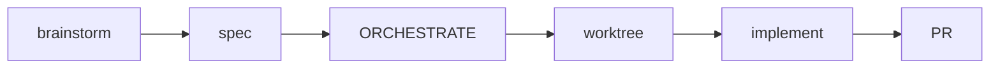
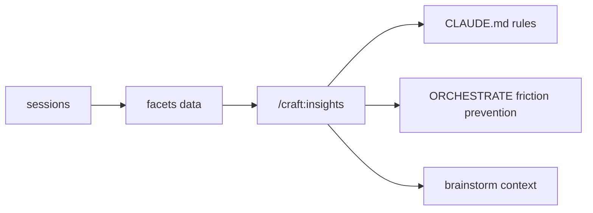

# Quick Reference

```
┌─────────────────────────────────────────────────────────────┐
│  CRAFT PLUGIN QUICK REFERENCE                               │
├─────────────────────────────────────────────────────────────┤
│  Version: 2.30.0 (released 2026-02-26)                       │
│  Commands: 107 | Agents: 8 | Skills: 26                     │
│  Documentation: 99% complete | Tests: 112 passing            │
│  Docs: https://data-wise.github.io/craft/                   │
│  v2.30.0: Unified release-watch v2, pinned markdownlint     │
└─────────────────────────────────────────────────────────────┘
```

## Essential Commands

### /craft:do \<task\>

**Purpose:** Universal smart routing - analyzes task complexity and delegates to the best workflow.

**How it works:**

1. Detects worktree context — skips branch prompts if in worktree (v2.31.0)
2. Memory lookup — checks MEMORY.md for relevant past learnings (v2.31.0)
3. Insights check — reviews recent friction patterns from facets (v2.31.0)
4. Analyzes your task description
5. Scores complexity (0-10 scale)
6. Pipeline suggestion — for features score >= 6, suggests brainstorm→spec→worktree (v2.31.0)
7. Routes to appropriate handler:
   - Simple (0-3): Direct command execution
   - Medium (4-7): Single specialized agent
   - Complex (8-10): Multi-agent orchestration
8. Auto-loads matching spec from `docs/specs/` as agent context (v2.31.0)

**Examples:**

```bash
# Simple task (score: 2) → Direct command
/craft:do "lint markdown files"
# Routes to: /craft:docs:lint

# Medium task (score: 6) → Single agent
/craft:do "add user authentication with JWT"
# Routes to: backend-architect agent

# Complex task (score: 9) → Orchestrator
/craft:do "prepare v2.0 release with tests, docs, and changelog"
# Routes to: orchestrator-v2 with release mode

# Preview routing decision (NEW v2.9.0)
/craft:do "add payment processing" --dry-run
# Shows: Complexity score, selected route, execution plan

# With orchestration mode
/craft:do "refactor database layer" --orch=optimize
# Forces orchestrator with optimize mode
```

**When to use:**

- ✅ When you're not sure which specific command to use
- ✅ For complex multi-step tasks
- ✅ When you want smart agent delegation
- ❌ For well-known simple tasks (use specific commands instead)

### /craft:check

**Purpose:** Pre-flight validation before commits, PRs, or releases.

**Modes:**

- `default` (auto-selected for commits): Quick checks, <10s
- `thorough` (auto-selected for PRs/releases): Comprehensive validation, <300s

**Examples:**

```bash
# Before committing
/craft:check
# Runs: lint, quick tests, basic validation
# Shows: Plan with steps, asks confirmation (v2.9.0)

# Before creating PR
/craft:check --mode=thorough
# Runs: full test suite, coverage, links, docs, dependencies
# Estimated: 2-5 minutes

# Preview what would run (v2.9.0)
/craft:check --dry-run
# Shows: Complete checklist for selected mode
# No actual validation runs

# Skip specific checks
/craft:check --skip=tests
# Useful when: tests are slow, already ran separately

# Run only specific checks
/craft:check --only=lint,docs
# Faster: focused validation

# Auto-fix safe issues
/craft:check --fix
# Fixes: formatting, markdown violations, safe updates

# Context-only mode (v2.18.0)
/craft:check --context
# Detects: dev phase (planning/implementing/testing/integrating)
# Shows: relevant context without running validators
```

**When to use:**

- ✅ Always before `git commit` (catches issues early)
- ✅ Before creating PR (ensures quality)
- ✅ Before merging to main (final validation)
- ✅ In CI/CD pipelines (use `/craft:check:ci`)

**See:** [REFCARD-CHECK.md](reference/REFCARD-CHECK.md) for complete reference

### /craft:help

**Purpose:** Context-aware help that suggests relevant commands based on your current situation.

**Examples:**

```bash
# General help
/craft:help
# Shows: Most common commands, recent commands, contextual suggestions

# Help for specific command
/craft:help check
# Shows: All check subcommands, flags, examples

# Help in specific context
# (in a Git repository with uncommitted changes)
/craft:help
# Suggests: /craft:check, /craft:git:status, /craft:git:sync

# (in a documentation directory)
/craft:help
# Suggests: /craft:docs:update, /craft:docs:check, /craft:docs:lint
```

**Smart suggestions based on:**

- Current directory (repo root, docs/, tests/)
- Git status (uncommitted changes, branch type)
- File types in current directory
- Recent command history

### /craft:hub

**Purpose:** Zero-maintenance command discovery with progressive disclosure (v2.4.0).

**Features:**

- Auto-discovers commands from YAML frontmatter
- 3-layer hierarchy: Main → Category → Detail
- Search and filtering
- Example commands
- Tutorial links
- Live counts from discovery engine (v2.31.0)
- .STATUS Next Action at top of hub (v2.31.0)
- Active worktree status with ahead/behind (v2.31.0)
- Recently used commands from session facets (v2.31.0)

**Examples:**

```bash
# Browse all commands
/craft:hub
# Shows: 8 categories (docs, site, code, test, git, arch, ci, dist)

# Filter by category
/craft:hub docs
# Shows: All 17 documentation commands

# Search for commands
/craft:hub "worktree"
# Shows: All worktree-related commands

# Show command details
/craft:hub git:worktree
# Shows: Description, arguments, examples, related commands
```

**Categories:**

- Smart Commands (do, check, orchestrate, hub)
- Documentation (25 commands)
- Site Management (16 commands)
- Code (12 commands) & Testing (2 commands)
- Git (11 commands) & CI (3 commands)
- Architecture (4 commands)
- Distribution (7 commands)
- Workflow (12 commands) & Planning (3 commands)

## Interactive Command Behavior

**"Show Steps First" Pattern** - All 4 most-used commands now show plan before executing:

```bash
/craft:check               # Shows: steps to run, asks confirmation
/craft:do "task"           # Shows: routing plan, asks confirmation
/craft:orchestrate "task"  # Shows: mode selection, wave plan, checkpoints
/craft:git:worktree create # Shows: scope detection, file generation plan
```

**Interactive Orchestration:**

- Mode selection via AskUserQuestion (default/debug/optimize/release)
- Wave checkpoints between agent groups
- Plan confirmation before execution
- Updated orchestrator-v2 with Claude Code constraints

**Worktree Auto-Setup:**

- Scope detection from branch patterns (feature/* → feature)
- Auto-creates ORCHESTRATE.md and SPEC.md in worktree
- Templates with phase breakdown and technical specs

**Post-Merge Pipeline:**

```bash
/craft:docs:update --post-merge   # 5-phase auto-fix after PR merge
```

- Phase 1: Auto-detect (9 categories)
- Phase 2: Auto-fix safe categories (no prompts)
- Phase 3: Prompt for manual categories
- Phase 4: Lint + validate
- Phase 5: Summary

**Check Step Preview:**

```bash
/craft:check                # Shows mode-specific checklist
/craft:check --mode=thorough # See all validation steps before running
```

**Testing:** 145 new tests added (93 e2e + 52 orch handler), all passing

**Documentation:** 6 new files (3,880 lines), tutorials + guides + reference cards

## Smart Documentation (17 commands)

### Core Documentation Commands

#### /craft:docs:lint

**Purpose:** Markdown linting with 24 rules + auto-fix (NEW v2.8.0)

**Examples:**

```bash
# Check all markdown files
/craft:docs:lint
# Checks: 24 rules (lists, headings, code blocks, links, whitespace)
# Reports: Violations with line numbers

# Auto-fix violations
/craft:docs:lint --fix
# Fixes: Blank lines, list markers, trailing whitespace
# Safe: Only applies non-destructive fixes

# Check specific directory
/craft:docs:lint docs/guide/
# Faster: Focused on subset of files

# Check specific file
/craft:docs:lint docs/REFCARD.md
# Useful: Before committing individual file

# Strict mode (exit on warnings)
/craft:docs:lint --strict
# For CI: Fails build on any violation
```

**Rules checked (24 total):**

- Lists: MD004, MD005, MD007, MD029, MD030, MD031, MD032
- Headings: MD003, MD022, MD023, MD025, MD036
- Code: MD040, MD046, MD048
- Links: MD042, MD045, MD052, MD056
- Whitespace: MD009, MD010, MD012
- Inline: MD034, MD049, MD050

**Integration:** Pre-commit hook auto-runs `--fix` on staged markdown files

#### /craft:docs:update

**Purpose:** Smart documentation generator with 9-category detection (v2.7.0)

**Modes:**

```bash
# Interactive mode (recommended first use)
/craft:docs:update --interactive
# Shows: Category-by-category prompts
# Preview: What would change in each category
# Control: Accept/skip each category

# Auto-apply everything (use after testing)
/craft:docs:update --auto-yes
# Fast: No prompts, applies all updates
# Dangerous: Review with --dry-run first

# Single category
/craft:docs:update --category=version_refs
# Updates: Only version number references
# Fast: Focused on one issue type

# Preview mode (v2.9.0)
/craft:docs:update --interactive --dry-run
# Shows: All planned changes
# Safe: No files modified

# Post-merge pipeline (NEW v2.9.0)
/craft:docs:update --post-merge
# Runs: 5-phase pipeline after PR merge
# Auto-fixes: Safe categories without prompts
# Prompts: Manual categories only
```

**9 Detection Categories:**

| Category           | Detects                        | Auto-Fix? | Example                     |
| ------------------ | ------------------------------ | --------- | --------------------------- |
| `version_refs`     | Old version numbers            | ✅ Yes    | v2.8.1 → v2.9.0             |
| `command_counts`   | Outdated command counts        | ✅ Yes    | "99 commands" → "100"       |
| `broken_links`     | Dead internal links            | ✅ Yes    | old.md → new.md             |
| `stale_examples`   | Outdated code snippets         | ⚠️ Partial | API calls with old syntax  |
| `missing_help`     | Commands without YAML          | ❌ No     | Need manual descriptions    |
| `outdated_status`  | Wrong status markers           | ⚠️ Partial | WIP → Complete             |
| `inconsistent_terms`| Terminology mismatches        | ⚠️ Partial | craft vs Craft             |
| `missing_xrefs`    | Missing cross-references       | ❌ No     | No "See also" sections      |
| `outdated_diagrams`| Stale Mermaid diagrams         | ❌ No     | Architecture changed        |

**Real-world example:**

```bash
# After adding 3 new commands
/craft:docs:update --interactive

# Output shows:
# ✓ Version references: 12 files need updating
# ✓ Command counts: 4 files (99 → 102)
# ✓ Missing help: 3 new commands
#
# Prompts:
# "Update version references? (19 files)"
# → Yes
#
# "Update command counts? (4 files)"
# → Yes
#
# "Generate help for 3 new commands?"
# → Yes (uses AI to generate descriptions)
#
# Result: 22 files updated in ~35 seconds
```

**See:** [REFCARD-DOCS-UPDATE.md](reference/REFCARD-DOCS-UPDATE.md) for complete reference

#### /craft:docs:sync

**Purpose:** Detect code changes and classify documentation impact.

**Examples:**

```bash
# Detect stale documentation
/craft:docs:sync
# Analyzes: git diff since last commit
# Reports: Which docs need updating
# Categories: Stale, missing, broken links

# Full project scan
/craft:docs:sync --full
# Scans: Entire codebase vs docs
# Time: ~30 seconds for medium projects

# Report-only mode (for CI)
/craft:docs:sync --report-only
# No modifications, just report
# Exit code: 1 if stale docs found
```

**Detection logic:**

1. Scans git diff for:
   - New functions/classes
   - Changed signatures
   - Moved/deleted files
   - New commands

2. Checks documentation for:
   - References to changed code
   - Examples using old syntax
   - Links to moved files
   - Missing entries

3. Reports impact:
   - High: Core functionality changed
   - Medium: Examples outdated
   - Low: Links need updating

**Headless Mode (NEW in v2.22.0):**

```bash
# Non-interactive (for CI/automation)
/craft:docs:sync --headless
# Auto-approves all changes, commits with standard message

# Preview what would change
/craft:docs:sync --headless --dry-run

# CI automation via GitHub Actions
# See: .github/workflows/docs-sync.yml
```

**Three-Layer Doc Sync:**

```text
Layer 1: /workflow:done     → catches drift at session end
Layer 2: --headless         → on-demand bulk sync
Layer 3: GitHub Actions     → safety net after merge to main
```

#### /craft:docs:check

**Purpose:** Comprehensive documentation validation.

**Examples:**

```bash
# Full validation
/craft:docs:check
# Checks: Links, nav structure, frontmatter
# Time: ~10 seconds

# With auto-fix
/craft:docs:check --fix
# Fixes: Broken internal links, nav structure

# Report-only (CI mode)
/craft:docs:check --report-only
# Exit: 1 if issues found
# Output: Machine-readable report

# Specific checks
/craft:docs:check --only=links
# Faster: Only link validation
```

**Validation categories:**

- Broken links (internal + external)
- Navigation structure (max 7 top-level)
- Required frontmatter (description, category)
- Cross-references consistency
- Code block syntax highlighting
- **Mermaid diagram validation** (Phase 5) — regex pre-checks + health score

#### /craft:docs:mermaid

**Purpose:** Mermaid diagrams — templates, NL creation, MCP validation, live preview.

**Examples:**

```bash
# Template selection
/craft:docs:mermaid workflow
/craft:docs:mermaid sequence

# NL creation (NEW)
/craft:docs:mermaid "show release pipeline from dev to main"
/craft:docs:mermaid "auth flow with OAuth2" --validate --preview

# Validation scripts
python3 scripts/mermaid-validate.py docs/ --health-score
python3 scripts/mermaid-validate.py docs/ --gate          # Release gate (>= 80)
python3 scripts/mermaid-autofix.py docs/ --fix             # Auto-fix safe patterns
```

**Mermaid health score:** `syntax*0.5 + practices*0.3 + rendering*0.2` (>= 80 to pass gate)

**Diagram types:**

1. **Flowchart** - Decision flows, process diagrams
2. **Sequence** - API interactions, message flows
3. **ER** - Database schemas, relationships
4. **Class** - Object-oriented design
5. **Gantt** - Project timelines, milestones
6. **State** - State machines, workflows

**Markdown Linting Execution Layer**

- Auto-detect `markdownlint-cli2` globally or use `npx` fallback
- Check markdown: `/craft:docs:lint` (30+ rules configured)
- Auto-fix: `/craft:docs:lint --fix` (apply safe fixes)
- Path targeting: `/craft:docs:lint docs/guide/` (check specific directories)
- Pre-commit integration: Auto-fix on staged markdown
- All 1432 tests passing (100%)
- [Release Notes](RELEASE-v2.8.0.md) | [Docs Command Reference](commands/docs.md)

**Interactive Documentation Update**

- 9-category detection (version refs, command counts, broken links, etc.)
- Category-level prompts for precise control
- 1,331 real issues detected in craft project
- Production-ready error handling (29/29 tests passing)
- Dry-run preview mode
- [Tutorial](tutorials/interactive-docs-update-tutorial.md) | [Reference](reference/REFCARD-DOCS-UPDATE.md)

## Site Commands (15 commands)

### Core Site Commands

#### /craft:site:create

**Purpose:** Interactive site creation wizard with 8 ADHD-friendly presets.

**Examples:**

```bash
# Interactive wizard (recommended)
/craft:site:create
# Prompts: Project type, color scheme, features
# Generates: Full site structure, config, theme

# Quick start with preset
/craft:site:create --preset data-wise
# Uses: DT's preferred colors (blue/orange)
# Includes: All standard features

# Ultra-quick (skip all prompts)
/craft:site:create --preset data-wise --quick
# Fastest: Uses all defaults
# Time: ~10 seconds

# Custom configuration
/craft:site:create --features docs,blog,search
# Selective: Only specified features

# Preview before creating
/craft:site:create --preset adhd-focus --dry-run
# Shows: What would be created
# Safe: No files written
```

**Available presets:**

| Preset       | Colors              | Best For                  |
| ------------ | ------------------- | ------------------------- |
| `data-wise`  | Blue/Orange         | DT's standard (energetic) |
| `adhd-focus` | Forest Green        | Calm, focused work        |
| `adhd-calm`  | Warm Earth Tones    | Reduced stimulation       |
| `adhd-dark`  | Dark Mode First     | Eye strain reduction      |
| `adhd-light` | Warm Light          | Never harsh white         |
| `academic`   | Navy/Gray           | Professional, formal      |
| `tech`       | Cyan/Purple         | Modern, technical         |
| `minimal`    | Black/White         | Clean, distraction-free   |

#### /craft:site:build

**Purpose:** Build documentation site (MkDocs, Quarto, pkgdown).

**Teaching-aware:** Auto-detects teaching mode from `.flow/teach-config.yml`

**Examples:**

```bash
# Standard build
/craft:site:build
# Detects: Project type (MkDocs/Quarto/pkgdown)
# Builds: To site/ directory
# Time: ~5 seconds

# Clean build (from scratch)
/craft:site:build --clean
# Removes: Previous build artifacts
# Slower: Full rebuild
# When: After major changes

# Watch mode (auto-rebuild)
/craft:site:build --watch
# Watches: Source files for changes
# Rebuilds: Automatically on save
# Useful: During active editing

# Strict mode (fail on warnings)
/craft:site:build --strict
# For CI: Fails on any warning
# Quality: Ensures no issues

# Teaching mode (auto-detected)
# If .flow/teach-config.yml exists:
/craft:site:build
# Shows: Semester progress
# Validates: Required content (syllabus, schedule)
# Warns: Missing weeks, incomplete assignments
```

**Build outputs:**

- MkDocs: `site/` directory
- Quarto: `_site/` directory
- pkgdown: `docs/` directory

#### /craft:site:publish (Teaching Mode)

**Purpose:** Safe publication workflow - Preview → Validate → Deploy.

**Teaching mode workflow:**

```bash
# Full publishing workflow
/craft:site:publish

# Step-by-step what happens:
# 1. Check current branch (must be on 'dev' for preview)
# 2. Build preview version
# 3. Validate content:
#    - Syllabus exists and complete
#    - Schedule has all weeks
#    - Assignments defined
#    - Links not broken
# 4. Prompt: "Ready to publish to main?"
# 5. If yes:
#    - Switch to main branch
#    - Merge changes from dev
#    - Build production version
#    - Deploy to GitHub Pages
#    - Switch back to dev
# 6. Confirm: "Published to https://..."

# Validate only (don't deploy)
/craft:site:publish --validate-only
# Runs: All validation checks
# Skips: Actual deployment
# Useful: Before committing

# Dry-run (show what would happen)
/craft:site:publish --dry-run
# Shows: Complete workflow plan
# Safe: No changes made

# Force publish (skip validation)
/craft:site:publish --force
# Dangerous: Skips safety checks
# Use: Only for urgent fixes
```

**Validation checks:**

- ✓ Syllabus file exists
- ✓ Schedule covers all weeks
- ✓ Current week ≤ total weeks
- ✓ All required pages present
- ✓ No broken internal links
- ✓ Git repo is clean (no uncommitted changes)

**Branch workflow:**

```
dev (preview branch)
  ↓ make changes
  ↓ test with /craft:site:build
  ↓ validate with /craft:site:publish --validate-only
  ↓ publish with /craft:site:publish
  ↓
main (production branch)
  ↓ auto-merged from dev
  ↓ deployed to GitHub Pages
```

#### /craft:site:progress (Teaching Mode)

**Purpose:** Semester progress dashboard.

**Examples:**

```bash
# Show progress dashboard
/craft:site:progress

# Output shows:
# ╭─ Semester Progress ─────────────────────────────╮
# │ Course: STAT 440 - Fall 2024                    │
# │ Week: 8 of 16 (50% complete)                    │
# │ Days remaining: 56                              │
# ├─────────────────────────────────────────────────┤
# │ Content Status:                                 │
# │   ✓ Weeks 1-7: Published                        │
# │   ✓ Week 8: Draft (current)                     │
# │   ⊘ Weeks 9-16: Not started                     │
# │                                                 │
# │ Assignments:                                    │
# │   ✓ HW1-HW4: Published                          │
# │   ! HW5: Due in 3 days (not published)          │
# │   ⊘ HW6-HW8: Not assigned                       │
# │                                                 │
# │ Exams:                                          │
# │   ✓ Midterm: Published (Week 8)                 │
# │   ⊘ Final: Not scheduled                        │
# ╰─────────────────────────────────────────────────╯

# Compact format (for quick check)
/craft:site:progress --compact
# Shows: One-line summary
# Example: "Week 8/16 (50%) • 3 assignments due soon"

# JSON output (for scripts)
/craft:site:progress --json
# Returns: Machine-readable progress data
```

**Requires:** `.flow/teach-config.yml` with semester configuration

#### /craft:site:deploy

**Purpose:** Deploy to GitHub Pages.

**Examples:**

```bash
# Deploy current build
/craft:site:deploy
# Pushes: site/ to gh-pages branch
# Time: ~10 seconds

# Build and deploy
/craft:site:deploy --build
# Runs: /craft:site:build first
# Then: Deploys result

# Deploy with custom message
/craft:site:deploy --message "Week 8 updates"
# Git commit message: Custom message

# Force push (overwrite remote)
/craft:site:deploy --force
# Dangerous: Overwrites remote history
# Use: After accidental bad push
```

**GitHub Pages setup:**

1. Repo Settings → Pages
2. Source: Deploy from branch
3. Branch: `gh-pages` / `/ (root)`
4. Save

**See:** [Teaching Workflow Guide](guide/teaching-workflow.md) | [REFCARD-TEACHING.md](reference/REFCARD-TEACHING.md)

## Check Commands (Pre-Flight Validation)

**Main Command:**

```bash
/craft:check                    # Smart mode selection (default/thorough)
/craft:check --mode=default     # Quick checks (<10s)
/craft:check --mode=thorough    # Comprehensive checks (<300s)
/craft:check --dry-run          # Preview steps without running
/craft:check --skip=tests       # Skip specific checks
/craft:check --context          # Context-only mode (no validators)
```

**Mode-Specific Checks:**

| Mode       | Checks Included                                           | Time  |
| ---------- | --------------------------------------------------------- | ----- |
| `default`  | Lint, quick tests, basic validation                      | <10s  |
| `thorough` | Full test suite, coverage, links, docs, dependencies      | <300s |

**Subcommands:**

| Command                | Description                  |
| ---------------------- | ---------------------------- |
| `/craft:check:quick`   | Essential checks only        |
| `/craft:check:full`    | All validation steps         |
| `/craft:check:ci`      | CI-optimized checks          |
| `/craft:check:deps`    | Dependency validation        |
| `/craft:check:docs`    | Documentation validation     |

**Friction Detection (NEW in v2.22.0):**

| Check | Script | What It Catches |
| ----- | ------ | --------------- |
| Version consistency | `scripts/version-sync.sh` | Manifest/docs/code version drift |
| Stale references | `scripts/stale-ref-scan.sh` | Renamed files still referenced in docs |
| Hook conflict audit | `scripts/hook-conflict-audit.sh` | Git hooks that block CI or releases |
| CLAUDE.md health | `scripts/claude-md-health.sh` | Stale counts, missing versions, line bloat |
| Docs staleness | `scripts/docs-staleness-check.sh` | Nav gaps, stale counts, undocumented items, cross-doc freshness |
| Post-release sweep | `scripts/post-release-sweep.sh` | Tier 2+ drift after release (`--fix` auto-corrects) |

**Belt-and-Suspenders (Version Sync):**

```text
Layer 1: PreToolUse hook  → warns during editing (soft)
Layer 2: pre-commit hook  → blocks commits with drift (hard)
Layer 3: /craft:check     → catches anything that slipped through
```

**Quick Examples:**

```bash
/craft:check                    # Before commit (includes friction detection)
/craft:check --mode=thorough    # Before PR
/craft:check --dry-run          # See what would run
/craft:check --for pr           # PR-specific checks (stale refs, hook conflicts)
```

**See:** [Check Command Mastery Guide](guide/check-command-mastery.md)

## Code & Testing (14 commands)

**Core Commands:**

| Command                | Modes | Description                 |
| ---------------------- | ----- | --------------------------- |
| `/craft:code:lint`     | all   | Linting with auto-fix       |
| `/craft:test`          | all   | Test runner with categories |
| `/craft:code:debug`    | ----- | Systematic debugging        |
| `/craft:code:refactor` | ----- | Refactoring guidance        |
| `/craft:code:review`   | ----- | Code review automation      |
| `/craft:code:format`   | ----- | Code formatting             |
| `/craft:code:deps`     | ----- | Dependency management       |

**Test Commands:**

| Command                  | Description                        |
| ------------------------ | ---------------------------------- |
| `/craft:test`            | Unified runner with categories     |
| `/craft:test:gen`        | Generate test suites (type-aware)  |
| `/craft:test:template`   | Manage Jinja2 test templates       |

**Modes:** `default` (<10s) | `debug` (<120s) | `optimize` (<180s) | `release` (<300s)

**Quick examples:**

```bash
/craft:code:lint optimize       # Parallel, fast
/craft:test debug               # Verbose with suggestions
/craft:test release --coverage  # Full coverage analysis
```

## Git Commands (10+ commands)

**Core Git Commands:**

| Command               | Description                                       |
| --------------------- | ------------------------------------------------- |
| `/craft:git:init`     | **NEW** Initialize repository with craft workflow |
| `/craft:git:worktree` | Parallel development with git worktrees           |
| `/craft:git:sync`     | Smart git sync                                    |
| `/craft:git:clean`    | Clean merged branches                             |
| `/craft:git:recap`    | Activity summary                                  |
| `/craft:git:branch`   | Branch management                                 |
| `/craft:git:status`   | Enhanced git status (teaching-aware)              |
| `/craft:git:protect`  | Re-enable branch protection                      |
| `/craft:git:unprotect`| Temporarily bypass branch protection              |

**Worktree Subcommands:**

```bash
/craft:git:worktree setup          # First-time folder creation
/craft:git:worktree create <name>  # Create worktree for branch
/craft:git:worktree move           # Move current branch to worktree
/craft:git:worktree list           # Show all worktrees
/craft:git:worktree clean          # Remove merged worktrees
/craft:git:worktree install        # Install deps in worktree
/craft:git:worktree finish         # Complete: tests → changelog → cleanup ORCHESTRATE → PR
/craft:git:worktree validate       # Check worktree health (v2.18.0)
```

**Complete Worktree Workflow Examples:**

**Example 1: New Feature Development**

```bash
# Starting point: On dev branch in main repo
git branch --show-current  # Output: dev

# Step 1: Create worktree for feature
/craft:git:worktree create feature/user-auth

# What happens (v2.9.0):
# - Creates ~/.git-worktrees/craft/feature-user-auth/
# - Branches from dev
# - Auto-detects scope: "authentication"
# - Generates ORCHESTRATE.md with phases
# - Generates SPEC.md with technical details
# - Installs dependencies (detects Node.js/Python/etc)
# - Output: "Ready at ~/.git-worktrees/craft/feature-user-auth"

# Step 2: Switch to worktree
cd ~/.git-worktrees/craft/feature-user-auth

# Step 3: Check auto-generated files
ls -la
# Shows: ORCHESTRATE.md, SPEC.md, all project files

cat ORCHESTRATE.md
# Contains: Phase breakdown, agent delegation, timeline

# Step 4: Start development
claude  # Or your preferred editor

# Step 5: Make changes, commit regularly
git commit -m "feat: add JWT authentication"
git commit -m "feat: add login endpoint"
git commit -m "test: add auth integration tests"

# Step 6: Finish feature
/craft:git:worktree finish

# What happens:
# - Runs tests (auto-detected: pytest/jest/etc)
# - Generates changelog entry from commits
# - Removes ORCHESTRATE-*.md files (merge cleanup)
# - Creates PR with AI-generated description
# - Output: PR URL

# Step 7: After PR is merged
/craft:git:worktree clean

# What happens:
# - Detects merged branches
# - Prompts: "Remove worktree for feature/user-auth?"
# - Removes worktree directory
# - Deletes local branch
# - Prunes git references
```

**Example 2: Moving Current Work to Worktree**

```bash
# Scenario: Working on feature in main repo, want to isolate it

# Current situation:
git branch --show-current  # Output: feature/payment-processing
git status                 # 15 files changed, 237 insertions

# Problem: Need to switch to main for urgent fix

# Solution: Move to worktree
/craft:git:worktree move

# What happens:
# - Stashes all uncommitted work (37 files)
# - Switches main repo to 'main' branch
# - Creates worktree at ~/.git-worktrees/craft/feature-payment-processing
# - Restores stashed work in worktree
# - Installs dependencies in worktree
# - Output: "Your 37 files are now in the worktree"

# Result:
# Main repo: Clean, on 'main' branch
# Worktree: All your work, on feature branch

# Now you can:
cd ~/projects/dev-tools/craft  # Main repo
git checkout -b hotfix/urgent-bug
# Work on urgent fix without losing feature work

# Later, continue feature:
cd ~/.git-worktrees/craft/feature-payment-processing
# All your changes are here
```

**Example 3: Multiple Parallel Features**

```bash
# Scenario: Working on 3 features simultaneously

# Feature 1: Authentication (in progress)
/craft:git:worktree create feature/auth
cd ~/.git-worktrees/craft/feature-auth
# ... work on auth ...

# Feature 2: Payments (in progress)
/craft:git:worktree create feature/payments
cd ~/.git-worktrees/craft/feature-payments
# ... work on payments ...

# Feature 3: Notifications (in progress)
/craft:git:worktree create feature/notifications
cd ~/.git-worktrees/craft/feature-notifications
# ... work on notifications ...

# List all worktrees
/craft:git:worktree list

# Output:
# ╭─ Git Worktrees ─────────────────────────────────╮
# │ Main: ~/projects/dev-tools/craft (main)         │
# │   ✓ Clean, no uncommitted changes               │
# │                                                 │
# │ feature-auth (3 days old)                       │
# │   ~/...git-worktrees/craft/feature-auth         │
# │   ⚠ 5 uncommitted changes                       │
# │                                                 │
# │ feature-payments (1 day old)                    │
# │   ~/...git-worktrees/craft/feature-payments     │
# │   ✓ Clean                                       │
# │                                                 │
# │ feature-notifications (2 hours old)             │
# │   ~/...git-worktrees/craft/feature-notifications│
# │   ⚠ 12 uncommitted changes                      │
# ╰─────────────────────────────────────────────────╯

# Switch between features easily:
cd ~/.git-worktrees/craft/feature-auth      # Work on auth
cd ~/.git-worktrees/craft/feature-payments  # Work on payments
# No git checkout needed!

# Cleanup after features merge:
/craft:git:worktree clean
# Prompts for each merged branch
# Removes all at once
```

**Example 4: Different Dependency Versions**

```bash
# Scenario: Testing with different Node.js versions

# Feature 1: Uses Node 18
/craft:git:worktree create feature/node18-test
cd ~/.git-worktrees/craft/feature/node18-test
nvm use 18
npm install
npm test

# Feature 2: Uses Node 20
/craft:git:worktree create feature/node20-test
cd ~/.git-worktrees/craft/feature-node20-test
nvm use 20
npm install
npm test

# Both can run simultaneously with different dependencies!
# Main repo remains unaffected
```

**Quick examples:**

```bash
/craft:git:init                      # Interactive wizard
/craft:git:init --dry-run            # Preview changes
/craft:git:worktree create feat/auth # Create feature worktree
/craft:git:worktree move             # Move current work to worktree
/craft:git:sync                      # Sync with remote
/craft:git:clean                     # Clean merged branches
```

**See:** [Git Worktree Reference](reference/REFCARD-GIT-WORKTREE.md) | [Advanced Patterns](guide/worktree-advanced-patterns.md)

## Architecture Commands (12 commands)

| Command                    | Description                          |
| -------------------------- | ------------------------------------ |
| `/craft:arch:analyze`      | Analyze codebase architecture        |
| `/craft:arch:diagram`      | Generate architecture diagrams       |
| `/craft:arch:dependencies` | Dependency analysis                  |
| `/craft:arch:layers`       | Layer visualization                  |
| `/craft:arch:modules`      | Module structure analysis            |
| `/craft:arch:review`       | Architecture review                  |

**Quick examples:**

```bash
/craft:arch:analyze optimize     # Fast architecture analysis
/craft:arch:diagram             # Generate Mermaid diagrams
/craft:arch:dependencies        # Analyze dependencies
```

## CI/CD Commands (8 commands)

| Command                  | Description                                   |
| ------------------------ | --------------------------------------------- |
| `/craft:ci:generate`     | **v2.9.0** Generate GitHub Actions CI workflow |
| `/craft:ci:status`       | **v2.22.1** Cross-repo CI status dashboard    |
| `/craft:ci:detect`       | Smart project type detection                  |
| `/craft:ci:validate`     | Validate existing CI workflow                 |
| `/craft:ci:update`       | Update CI configuration                       |
| `/craft:ci:test`         | Test CI locally                               |

**Quick examples:**

```bash
/craft:ci:generate              # Interactive CI generation
/craft:ci:generate --dry-run    # Preview workflow
/craft:ci:status                # Cross-repo CI dashboard
/craft:ci:status --json         # Machine-readable output
/craft:ci:detect                # Detect project type
/craft:ci:validate              # Validate existing CI
```

## Distribution Commands (7 commands)

| Command                        | Description                            |
| ------------------------------ | -------------------------------------- |
| `/craft:dist:marketplace`      | Marketplace init, validate, test, publish |
| `/craft:dist:package`          | Package for distribution               |
| `/craft:dist:homebrew`         | Generate Homebrew formula              |
| `/craft:dist:pypi`             | Package for PyPI                       |
| `/craft:dist:npm`              | Package for npm                        |
| `/craft:dist:curl-install`     | Generate curl installer                |

**Quick examples:**

```bash
/craft:dist:marketplace         # Validate marketplace config (default)
/craft:dist:marketplace init    # Generate marketplace.json
/craft:dist:homebrew            # Generate Homebrew formula
/craft:dist:pypi                # Package for PyPI
/craft:dist:curl-install        # Generate curl installer
```

## Orchestrator (Enhanced v2.1, v2.5.0, v2.9.0)

**Main Commands:**

```bash
# Interactive mode (v2.9.0) - Shows mode selection, wave plan, checkpoints
/craft:orchestrate "add auth"           # Interactive: pick mode + confirm plan
/craft:orchestrate "add auth" optimize  # Direct mode selection
/craft:orchestrate "large task" --swarm # Unlimited parallel agents (v2.18.0)

# Orchestrate specific commands with --orch flag (v2.5.0)
/craft:do "add auth" --orch=optimize      # Quick orchestration
/craft:check --orch=release               # Orchestrated validation
/craft:docs:sync --orch=default           # Orchestrated docs sync
/craft:ci:generate --orch=optimize        # Orchestrated CI generation
/craft:git:worktree "create feat" --orch  # Orchestrated worktree creation

# Session management
/craft:orchestrate status                 # Agent dashboard
/craft:orchestrate timeline               # Execution timeline
/craft:orchestrate continue               # Resume session
```

**Modes:**

| Mode         | Waves | Parallelism | Use Case                   |
| ------------ | ----- | ----------- | -------------------------- |
| `default`    | 2-3   | Medium      | Standard tasks             |
| `debug`      | 3-4   | Low         | Troubleshooting            |
| `optimize`   | 2     | High        | Fast parallel execution    |
| `release`    | 4-5   | Low         | Thorough audit             |
| `phase`      | N     | Sequential  | Phased implementation      |

**NEW v2.9.0 Features:**

- Interactive mode selection via AskUserQuestion
- Wave checkpoints between agent groups (confirm before next wave)
- Plan confirmation before execution (show all waves + agents)
- Updated orchestrator-v2 with Claude Code subagent constraints
- Better error handling and recovery

**Features:**

- Mode-aware execution (default/debug/optimize/release/phase)
- Subagent monitoring with progress tracking
- Chat compression for long sessions
- ADHD-optimized status tracking
- Wave-based parallelization
- **NEW (v2.5.0)** - --orch flag for quick orchestration
- **NEW (v2.9.0)** - Interactive mode selection and checkpoints

**See:** [Interactive Orchestration Tutorial](tutorials/interactive-orchestration.md) | [Orchestrator Modes Compared](tutorials/orchestrator-modes-compared.md)

### Orchestrate + Worktree Pipeline (v2.21.0)

The full pipeline connects brainstorming through to implementation:



**Pipeline steps:**

| Step | Command | Output |
|------|---------|--------|
| 1. Brainstorm | `/brainstorm d:8 "feature"` | `BRAINSTORM-feature.md` |
| 2. Capture spec | Brainstorm Step 5 (auto) | `docs/specs/SPEC-feature.md` |
| 3. Create orchestration | `/craft:orchestrate:plan` | `ORCHESTRATE-feature.md` + worktree |
| 4. Implement | Work in worktree | Commits on `feature/*` branch |
| 5. Integrate | `/craft:git:worktree finish` | PR to `dev` |

**Worktree Types:**

| Type | Created By | Lifetime | Branch Pattern | ORCHESTRATE |
|------|-----------|----------|---------------|-------------|
| **Manual** | `/craft:git:worktree create` | Long-lived | `feature/*` | Optional |
| **Pipeline** | `/craft:orchestrate:plan` or brainstorm | Long-lived | `feature/*` | Always |
| **Swarm** | `/craft:orchestrate --swarm` | Short-lived | `swarm-*` | Reads existing |
| **Cross-Repo** | Pipeline (multi-repo spec) | Long-lived | `feature/*` (same name) | Scoped per-repo |

**When to use what:**

| Scenario | Use | Why |
|----------|-----|-----|
| Quick feature, clear scope | Manual worktree | No orchestration overhead |
| Multi-phase feature from spec | Pipeline | Full traceability from brainstorm → PR |
| Parallel implementation of isolated tasks | Swarm | Agents work in separate worktrees |
| Feature spanning multiple repos | Cross-Repo | Enforces same branch name, paired worktrees |

**See:** [Getting Started — Complex Feature Workflow](guide/getting-started.md#complex-feature-workflow) | [Worktree Types Reference](reference/REFCARD-GIT-WORKTREE.md#worktree-types)

## Workflow Commands (Enhanced v2.4.0)

### /brainstorm (ADHD-Friendly Planning)

**Purpose:** Structured brainstorming with question control and automatic file saving.

**Question Control (v2.4.0):**

The colon notation `mode:count` gives precise control over questions:

**Modes:**

- `q` (quick): Minimal questions, fast start
- `d` (deep): Thorough exploration
- `m` (max): Maximum context gathering

**Examples:**

```bash
# Quick start (0-2 questions)
/brainstorm q:0 "add user authentication"
# Questions: None, straight to brainstorming
# Time: ~2 minutes
# Use: When you know exactly what you want

/brainstorm q:2 "refactor database"
# Questions: 2 quick clarifying questions
# Time: ~3 minutes
# Use: Small tweaks to direction

# Balanced (5-8 questions)
/brainstorm d:5 "design payment system"
# Questions: 5 carefully selected questions
# Time: ~10 minutes
# Use: Standard features, moderate complexity

/brainstorm d:8 "oauth integration"
# Questions: 8 questions covering all aspects
# Time: ~15 minutes
# Use: Complex features needing thorough planning

# Maximum context (12-20 questions)
/brainstorm m:12 "rewrite authentication"
# Questions: 12 comprehensive questions
# Time: ~20 minutes
# Use: Major architectural changes

/brainstorm d:20 "microservices migration"
# Questions: Unlimited mode (prompts every 4 questions)
# Time: ~30+ minutes
# Use: Project-level planning

# Category filtering (-C flag)
/brainstorm d:5 "caching layer" -C tech,risk
# Questions: Only technical + risk questions
# Categories available:
#   req (requirements), usr (users), scope,
#   tech (technical), timeline, risk (risks),
#   exist (existing), success (success criteria)

/brainstorm m:10 f "payment api" --categories req,tech,exist
# Flags:
#   f = feature (generates feature spec)
#   Categories: requirements, technical, existing systems

# Combined flags for full control
/brainstorm d:15 f s -C req,tech,success "user analytics"
# Flags:
#   d:15 = deep mode, 15 questions
#   f = feature spec output
#   s = spec document format
#   -C = filter to 3 categories
# Output: Feature spec + technical spec
```

**Question Categories (8 total):**

| Category       | Asks About                    | Example Questions                              |
| -------------- | ----------------------------- | ---------------------------------------------- |
| `req`          | Requirements                  | "What are the core requirements?"              |
| `usr`          | Users                         | "Who will use this feature?"                   |
| `scope`        | Scope                         | "What's in scope? What's explicitly out?"      |
| `tech`         | Technical                     | "Any technical constraints?"                   |
| `timeline`     | Timeline                      | "What's the timeline?"                         |
| `risk`         | Risks                         | "What are the main risks?"                     |
| `exist`        | Existing Systems              | "What existing code/systems are affected?"     |
| `success`      | Success Criteria              | "How will we measure success?"                 |

**Milestone Prompts:**

When asking many questions, brainstorm batches them:

```
After 8 questions:
╭─ Questions Complete ────────────────────────────╮
│ 8 of 12 questions answered                      │
│                                                 │
│ Continue with:                                  │
│   [D] Done - Start brainstorming now            │
│   [+4] Ask 4 more questions                     │
│   [+8] Ask all remaining questions              │
│   [K] Keep going mode (prompt every 4)          │
╰─────────────────────────────────────────────────╯
```

**Output Formats:**

```bash
# Default: Saved markdown file
/brainstorm d:5 "feature"
# Creates: BRAINSTORM-feature-2026-01-29.md
# Location: Current directory or ~/
# Opens: iA Writer (macOS) for review

# Feature spec format
/brainstorm d:8 f "oauth"
# Output: Feature specification structure
# Includes: Requirements, user stories, acceptance criteria

# Technical spec format
/brainstorm m:10 s "caching"
# Output: Technical specification structure
# Includes: Architecture, data flow, API design
```

**Real-World Examples:**

**Example 1: Quick Bug Fix Planning**

```bash
/brainstorm q:0 "fix login timeout issue"
# No questions, goes straight to brainstorming
# Generates: Problem analysis, potential causes, solutions
# Time: 2 minutes
# File: BRAINSTORM-fix-login-timeout-2026-01-29.md
```

**Example 2: New Feature Planning**

```bash
/brainstorm d:8 f "two-factor authentication"

# Asks 8 questions:
# 1. [requirements] What are the core requirements?
#    → SMS and app-based TOTP
# 2. [users] Who will use this?
#    → All users, optional for regular accounts, mandatory for admin
# 3. [scope] What's in scope?
#    → Setup flow, verification, backup codes
# 4. [technical] Technical constraints?
#    → Must support existing session system
# 5. [timeline] Timeline?
#    → 2 weeks for MVP
# 6. [risks] Main risks?
#    → SMS delivery reliability, user confusion
# 7. [existing] Affected systems?
#    → Login flow, user settings, database schema
# 8. [success] Success criteria?
#    → >80% adoption, <1% support tickets

# Generates feature spec:
# - User stories
# - Acceptance criteria
# - Technical approach (3 options)
# - Implementation phases
# - Testing strategy

# Saves to: BRAINSTORM-two-factor-auth-2026-01-29.md
# Opens in: iA Writer for review
```

**Example 3: Architecture Planning**

```bash
/brainstorm m:12 s "microservices migration" -C tech,exist,risk

# Filters to 3 categories, asks 12 questions:
# Technical (4 questions):
# - Current monolith size?
# - Performance requirements?
# - Technology stack preferences?
# - Infrastructure constraints?

# Existing (4 questions):
# - Current dependencies?
# - Team expertise?
# - Existing deployment pipeline?
# - Monitoring/observability setup?

# Risks (4 questions):
# - Data consistency concerns?
# - Migration strategy?
# - Rollback plan?
# - Timeline constraints?

# Generates technical spec:
# - Architecture diagrams (Mermaid)
# - Service boundaries
# - Data flow
# - Migration phases
# - Risk mitigation strategies

# Saves to: SPEC-microservices-migration-2026-01-29.md
```

**Auto-Open Behavior (macOS):**

After generating, brainstorm uses AppleScript to open files:

```bash
# Default: iA Writer (DT's preference)
osascript -e 'tell application "iA Writer"
    activate
    open POSIX file "/path/to/BRAINSTORM-feature.md"
end tell'

# Alternative editors can be configured
# Set in ~/.claude/settings.json:
{
  "brainstorm": {
    "editor": "code"  # VS Code, Cursor, Sublime, etc.
  }
}
```

**Insights (v2.21.0):**

```bash
# Generate session insights report
/craft:insights
# Aggregates: Friction patterns, goal categories, outcomes
# Suggests: CLAUDE.md rules to prevent recurring issues

# HTML report for sharing
/craft:insights --format html

# Last 7 days, specific project
/craft:insights --since 7 --project craft

# Apply suggestions to CLAUDE.md
/craft:insights-apply
```

**Insights Lifecycle:**



**Other Workflow Commands:**

```bash
# Start focused work session
/workflow:focus
# Sets: Timer, goal, distraction blocking
# Prompts: Every 25 minutes (Pomodoro)

# Get next step
/workflow:next
# Analyzes: Current state, recent changes
# Suggests: Next logical step

# Get unstuck
/workflow:stuck
# Asks: What's blocking you?
# Provides: 3-5 concrete solutions

# Complete session
/workflow:done
# Summarizes: What you accomplished
# Saves: Session notes
# Prompts: Next session goal
# NEW in v2.22.0: Doc drift detection
#   Cross-references changed files against docs
#   Offers to run /craft:docs:sync if drift found
# NEW in v2.31.0: Auto-git, CLAUDE.md sync, worktree status, learning loop
#   Option A auto-commits + pushes (skip on main, never force-push)
#   CLAUDE.md counts synced silently before commit
#   Worktree branch ahead/behind shown in summary
#   Memory capture: saves learnings to MEMORY.md (SKIP_MEMORY_UPDATE=1)
#   Insights capture: writes facet JSON for friction analysis (SKIP_INSIGHTS=1)
#   SKIP_GIT_SYNC=1 / SKIP_CLAUDE_MD_SYNC=1 to opt out
```

**See:** [Brainstorm Documentation](commands/workflow/brainstorm.md) for complete guide

## Skills (25 total)

Auto-triggered expertise:

| Skill                     | Triggers                                            |
| ------------------------- | --------------------------------------------------- |
| `release`                 | "release", "ship it", version publishing (CI monitoring in v2.22.0) |
| `guard-audit`             | "audit guard", "review branch protection" (v2.18.0) |
| `insights-apply`          | "apply insights", "update rules from insights" (v2.18.0) |
| `backend-designer`        | API, database, auth                                 |
| `frontend-designer`       | UI/UX, components                                   |
| `test-strategist`         | Test strategy                                       |
| `system-architect`        | System design                                       |
| `project-planner`         | Feature planning                                    |
| `distribution-strategist` | Homebrew, PyPI, packaging                           |
| `homebrew-formula-expert` | Homebrew formulas                                   |
| `doc-classifier`          | Documentation type detection                        |
| `mermaid-linter`          | Mermaid diagram validation                          |
| `session-state`           | Orchestrator state tracking                         |
| ...and 12 more            | See [Skills & Agents Guide](guide/skills-agents.md) |

## Agents (8 specialized)

| Agent               | Specialty                        |
| ------------------- | -------------------------------- |
| `orchestrator-v2`   | Mode-aware execution, monitoring |
| `backend-architect` | Scalable APIs, microservices     |
| `docs-architect`    | Technical documentation          |
| `api-documenter`    | OpenAPI, developer portals       |
| `tutorial-engineer` | Step-by-step tutorials           |
| `mermaid-expert`    | Diagram creation                 |
| `reference-builder` | API reference documentation      |
| `demo-engineer`     | VHS demo creation                |

## Configuration

### Mode System

| Mode         | Time  | Use Case              |
| ------------ | ----- | --------------------- |
| **default**  | <10s  | Quick checks          |
| **debug**    | <120s | Verbose output        |
| **optimize** | <180s | Parallel, performance |
| **release**  | <300s | Comprehensive audit   |

### ADHD-Friendly Presets

| Preset       | Description                    |
| ------------ | ------------------------------ |
| `data-wise`  | DT's standard (blue/orange)    |
| `adhd-focus` | Calm forest green              |
| `adhd-calm`  | Warm earth tones               |
| `adhd-dark`  | Dark-first, reduced eye strain |
| `adhd-light` | Warm light, never harsh white  |

## Troubleshooting

| Issue                | Solution                           |
| -------------------- | ---------------------------------- |
| Command not found    | Verify installation: `/craft:hub`  |
| Skill not triggering | Check skill definitions in plugin  |
| Build fails          | Run `/craft:check` for diagnostics |

## Technical Deep Dives

Comprehensive guides and references:

| Guide                                                                     | Diagrams  | Content                                                                                      |
| ------------------------------------------------------------------------- | --------- | -------------------------------------------------------------------------------------------- |
| **[Version History](VERSION-HISTORY.md)**                                 | --------- | Complete timeline v1.0.0 → v2.9.0 with feature evolution                                     |
| **[Claude Code 2.1 Integration](guide/claude-code-2.1-integration.md)**   | 9 Mermaid | Hot-reload validators, complexity scoring, orchestration hooks, agent delegation (610 lines) |
| **[Complexity Scoring Algorithm](guide/complexity-scoring-algorithm.md)** | 8 Mermaid | Technical documentation of 0-10 scoring system, decision trees, examples (571 lines)         |
| **[Interactive Commands](guide/interactive-commands.md)**                 | --------- | "Show Steps First" pattern, 4 commands with plan confirmation (170 lines)                    |
| **[Check Command Mastery](guide/check-command-mastery.md)**               | --------- | Complete guide to pre-flight validation, mode selection, scenarios (460 lines)               |
| **[Worktree Advanced Patterns](guide/worktree-advanced-patterns.md)**     | --------- | Multi-worktree management, complex workflows, recovery (575 lines)                           |
| **[Insights-Driven Improvements](guide/insights-improvements-guide.md)** | 7 Mermaid | Guard audit, insights apply, --context, --swarm, --autonomous, workflows (v2.18.0)           |

**Tutorials** (23 total — [full index](tutorials/index.md)):

| Tutorial | Content |
| --- | --- |
| **[First 10 Minutes](tutorials/TUTORIAL-first-10-minutes.md)** | Beginner walkthrough of craft essentials |
| **[Pre-Flight Checks](tutorials/check-tutorial-beginner.md)** | Step-by-step `/craft:check` validation guide |
| **[Smart Routing](tutorials/smart-routing-tutorial.md)** | AI-powered task routing with `/craft:do` |
| **[Worktree Setup](tutorials/TUTORIAL-worktree-setup.md)** | Beginner to intermediate worktree guide (795 lines) |
| **[Branch Guard](tutorials/TUTORIAL-branch-guard-setup.md)** | Teaching-first branch protection in 5 minutes |
| **[Version Sync](tutorials/TUTORIAL-version-sync-setup.md)** | Three-layer version drift protection |
| **[Testing Quickstart](tutorials/testing-quickstart.md)** | Unified test system — markers, generation, templates |
| **[CLAUDE.md Workflows](tutorials/claude-md-workflows.md)** | Create, maintain, audit, and sync CLAUDE.md files |
| **[Interactive Orchestration](tutorials/interactive-orchestration.md)** | Mode selection, wave checkpoints, plan confirmation |
| **[Orchestrator Modes](tutorials/orchestrator-modes-compared.md)** | Same task in 4 modes with performance metrics |
| **[Brainstorm Power User](tutorials/TUTORIAL-brainstorm-power-user.md)** | Advanced brainstorming patterns and expert workflows |
| **[Insights Workflow](tutorials/TUTORIAL-insights-workflow.md)** | v2.22.0: session insights, friction prevention, CI monitoring |
| **[Release Pipeline](tutorials/TUTORIAL-release-pipeline.md)** | End-to-end release from version bump to Homebrew |
| **[Homebrew Setup](tutorials/TUTORIAL-homebrew-setup.md)** | Automated Homebrew distribution setup |
| **[Post-Merge Pipeline](tutorials/TUTORIAL-post-merge-pipeline.md)** | 5-phase auto-fix workflow after PR merge |

**Reference Cards** (13 total):

| Reference Card | Focus |
| --- | --- |
| **[Main Reference](REFCARD.md)** | This document — all commands overview |
| **[Check](reference/REFCARD-CHECK.md)** | Pre-flight validation, modes, validators (720 lines) |
| **[CLAUDE.md](reference/REFCARD-CLAUDE-MD.md)** | CLAUDE.md management, layered architecture (529 lines) |
| **[Git Worktree](reference/REFCARD-GIT-WORKTREE.md)** | Worktree command reference (373 lines) |
| **[Claude Code 2.1](reference/REFCARD-claude-code-2.1-enhancements.md)** | Smart routing, orchestration hooks (341 lines) |
| **[Docs Update](reference/REFCARD-DOCS-UPDATE.md)** | Documentation update workflows (330 lines) |
| **[Interactive Commands](reference/REFCARD-INTERACTIVE-COMMANDS.md)** | "Show Steps First" pattern (261 lines) |
| **[Teaching](reference/REFCARD-TEACHING.md)** | Teaching mode workflows (247 lines) |
| **[Branch Guard](reference/REFCARD-BRANCH-GUARD.md)** | Branch protection rules and bypass (231 lines) |
| **[Release](reference/REFCARD-RELEASE.md)** | Release pipeline reference (211 lines) |
| **[Testing](reference/REFCARD-TESTING.md)** | Unified test system, markers, templates (183 lines) |
| **[Brainstorm](reference/REFCARD-BRAINSTORM.md)** | Brainstorming workflows (171 lines) |
| **[Formatting](reference/REFCARD-FORMATTING.md)** | Formatting library reference (161 lines) |
| **[Homebrew](reference/REFCARD-HOMEBREW.md)** | Homebrew distribution (108 lines) |

**Total:** 17+ Mermaid diagrams, 6 comprehensive guides, 23 step-by-step tutorials, 14 quick reference cards

## Links

- **[Full Documentation](guide/getting-started.md)** (99% complete)
- **[GitHub Issues](https://github.com/Data-Wise/craft/issues)**
- **[ROADMAP](https://github.com/Data-Wise/craft/blob/main/ROADMAP.md)**
