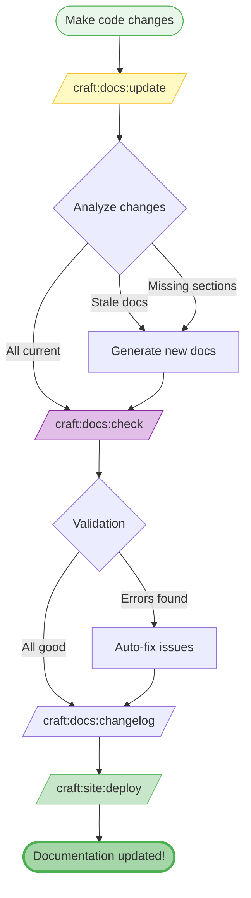
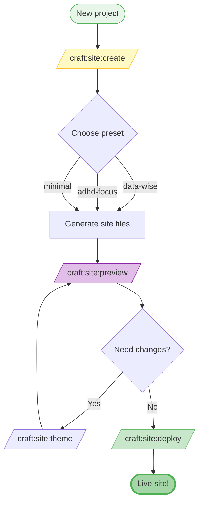
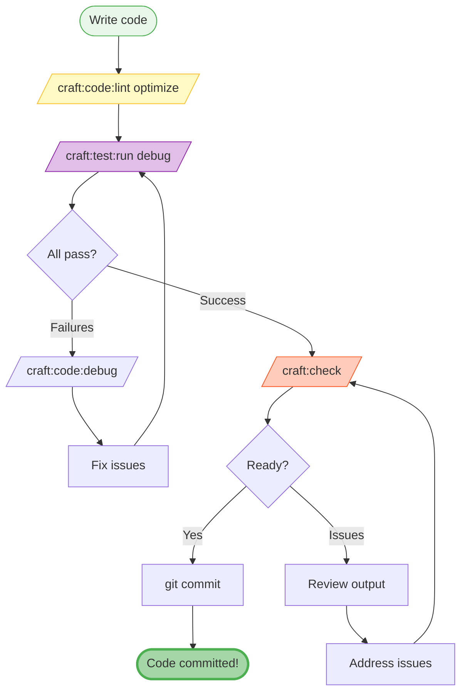
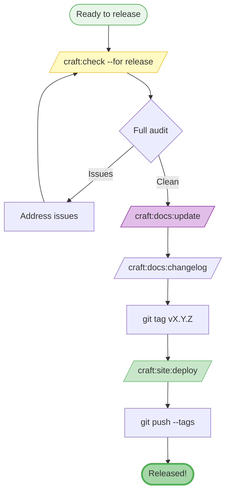
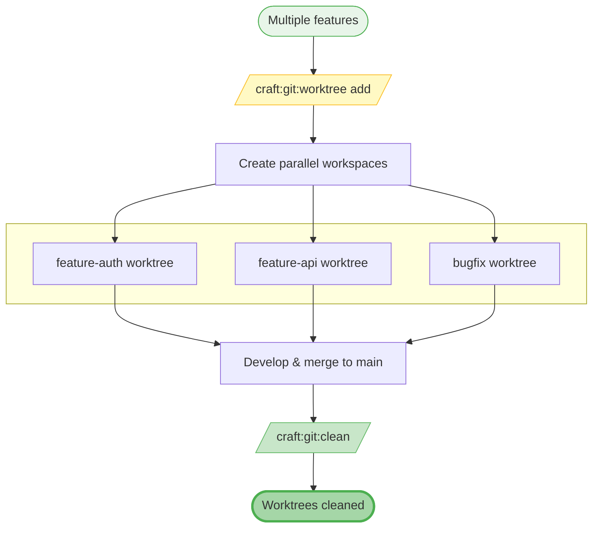
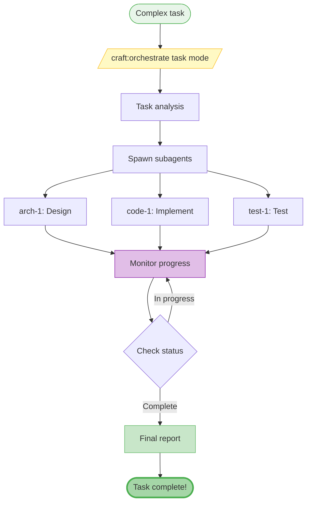

# Visual Workflows

⏱️ **5 minutes** • 🟢 Beginner • ✓ Understand craft workflows

> **TL;DR** (30 seconds)
>
> - **What:** Visual workflow diagrams showing how craft commands work together
> - **Why:** Quickly understand the flow from task to completion
> - **How:** Follow the mermaid diagrams for your use case
> - **Next:** Pick a workflow and try the commands in sequence

## Documentation Workflow

**Commands used:**
1. `/craft:docs:update` - Smart detection and generation
2. `/craft:docs:check` - Validation with auto-fix
3. `/craft:docs:changelog` - Update CHANGELOG.md
4. `/craft:site:deploy` - Deploy to GitHub Pages

---

## Site Creation Workflow

**Commands used:**
1. `/craft:site:create` - Full wizard with 8 presets
2. `/craft:site:preview` - Local preview
3. `/craft:site:theme` - Adjust colors/fonts
4. `/craft:site:deploy` - Push to GitHub Pages

---

## Testing Workflow

**Commands used:**
1. `/craft:code:lint optimize` - Fast parallel linting
2. `/craft:test:run debug` - Verbose test output
3. `/craft:code:debug` - Systematic debugging
4. `/craft:check` - Pre-commit validation

---

## Release Workflow

**Commands used:**
1. `/craft:check --for release` - Comprehensive audit
2. `/craft:docs:update` - Final docs update
3. `/craft:docs:changelog` - Generate release notes
4. `/craft:site:deploy` - Update documentation site

---

## Git Worktree Workflow

**Commands used:**
1. `/craft:git:worktree add <name>` - Create parallel workspace
2. `/craft:git:clean` - Remove merged worktrees

---

## Orchestrator Workflow

**Commands used:**
1. `/craft:orchestrate <task> <mode>` - Launch orchestrator
2. `status` - Check agent dashboard during execution
3. `timeline` - View execution timeline

---

## Quick Command Finder

| I want to... | Use this workflow |
|--------------|-------------------|
| Update docs after coding | [Documentation Workflow](#documentation-workflow) |
| Create a new site | [Site Creation Workflow](#site-creation-workflow) |
| Test before committing | [Testing Workflow](#testing-workflow) |
| Prepare a release | [Release Workflow](#release-workflow) |
| Work on multiple features | [Git Worktree Workflow](#git-worktree-workflow) |
| Handle complex tasks | [Orchestrator Workflow](#orchestrator-workflow) |

## Next Steps

- **Try a workflow:** Pick one above and follow the diagram
- **Learn commands:** [Commands Overview](commands/overview.md)
- **Advanced:** [Orchestrator Mode](guide/orchestrator.md)
