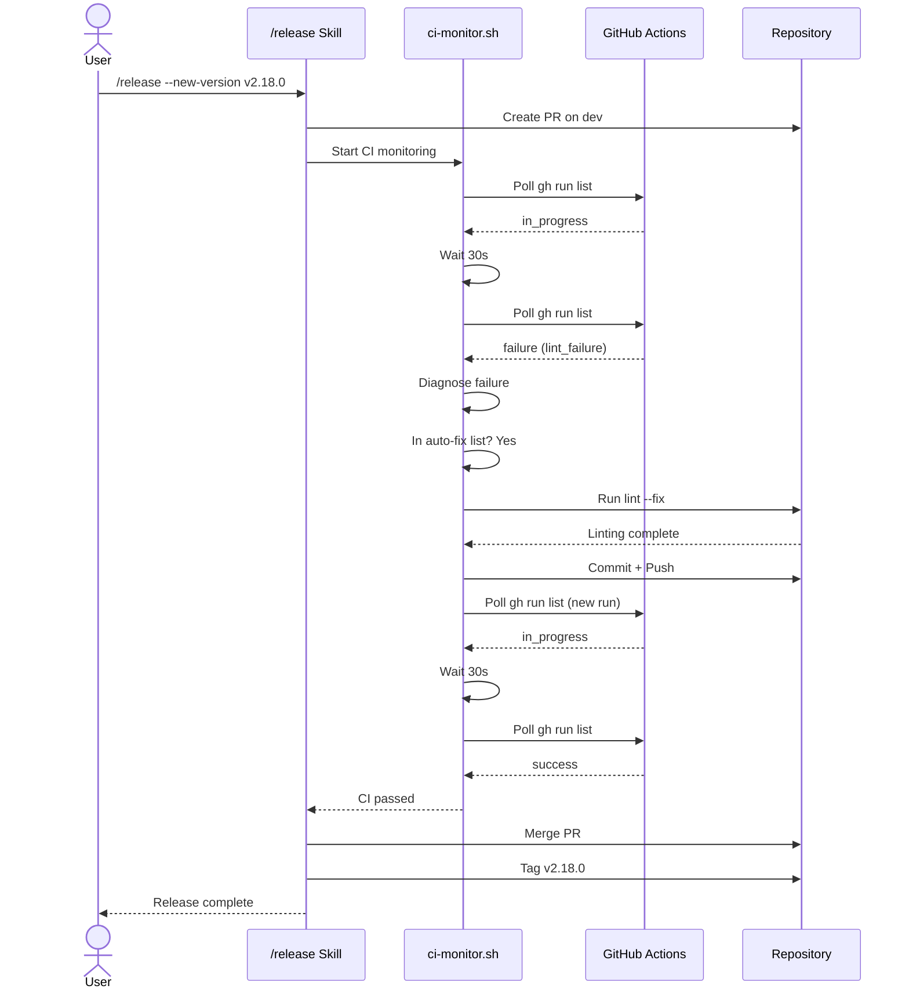

# CI Monitoring Architecture

## Overview

The CI monitoring loop (`scripts/ci-monitor.sh`) enables fully autonomous releases by polling GitHub Actions CI status after PR creation, diagnosing failures, and coordinating fix-retry cycles. The system operates between PR creation and merge, automatically detecting common failure patterns and applying known fixes without manual intervention.

**Key capability:** Fire-and-forget releases with smart diagnosis and conditional auto-remediation.

## Design Goals

- **Fire-and-forget releases** - No manual CI back-and-forth after release trigger
- **Safe auto-fixes** - Apply only to well-understood failure categories
- **User approval gates** - Require explicit approval for risky or complex fixes
- **Configurable timeouts** - Per-project CI timing and retry limits
- **Programmatic output** - JSON reports for automation pipelines
- **Audit trail** - Log all decisions and actions for review

## Architecture

### Polling Loop

The CI monitor implements a poll → check → diagnose → fix → retry cycle:

```
Start monitoring
    ↓
Poll gh run list (every N seconds)
    ↓
Parse status (success|failure|in_progress|pending|unknown)
    ↓
Status check
  ├─ success → stop polling, return to release pipeline
  ├─ in_progress → wait, re-poll
  ├─ failure → diagnose, attempt fix, re-poll
  └─ pending → wait, re-poll
    ↓
Retry with backoff until timeout or success
```

**Polling parameters:**

- `ci_poll_interval`: Time between polls (default: 30 seconds)
- `ci_timeout`: Maximum wait time before giving up (default: 600 seconds / 10 minutes)
- `ci_max_retries`: Maximum auto-fix attempts before asking user (default: 3)

**Status determination:**

- Query: `gh run list --repo <owner>/<repo> --branch <branch> --limit 1`
- Parse conclusion field: `success`, `failure`, `cancelled`, `skipped`, `timed_out`, `action_required`
- On success: all checks passed, safe to merge
- On failure: retrieve detailed logs and diagnose

### Failure Diagnosis

When CI returns failure status, the monitor retrieves logs and applies pattern matching:

```bash
gh run view <run-id> --log-failed > logs.txt
diagnose_failure logs.txt
```

**Failure categories and detection patterns:**

| Category | Pattern | Severity | Auto-fixable |
|----------|---------|----------|--------------|
| version_mismatch | `version.*mismatch\|expected.*v[0-9]` | High | Yes |
| lint_failure | `lint.*error\|eslint.*error\|ruff.*error` | Medium | Yes |
| changelog_format | `changelog.*invalid\|CHANGELOG.*format` | Medium | Yes |
| test_failure | `test.*fail\|FAILED\|AssertionError` | High | No |
| security_audit | `vulnerabilit\|CVE-` | Critical | No |
| build_failure | `build.*fail\|compilation.*error` | High | No |
| dependency_mismatch | `dependency.*not.*found\|package.*missing` | Medium | Yes |
| cache_stale | `cache.*invalid\|outdated.*artifacts` | Low | Yes |

Pattern matching is grepped against full CI log output to identify root cause. Multiple patterns may match; first match wins.

### Fix Strategy (Two-Tier)

The monitor applies different strategies based on risk level:

#### Auto-Fixable (Applied Without Approval)

These are low-risk, deterministic fixes with high success rates:

**version_mismatch**

- Trigger: `scripts/version-sync.sh --fix`
- Update all version files to match expected tag
- Commit message: `chore: sync version to {version}`
- Push and re-poll CI

**lint_failure**

- Trigger: `npm run lint -- --fix` or language-specific linter with `--fix` flag
- Auto-fix formatting issues (spacing, trailing commas, etc.)
- Commit message: `style: auto-fix linting errors`
- Push and re-poll CI

**changelog_format**

- Trigger: `scripts/format-changelog.sh`
- Reformat CHANGELOG.md to match project schema
- Validate with `scripts/validate-changelog.sh`
- Commit message: `docs: reformat CHANGELOG`
- Push and re-poll CI

**dependency_mismatch**

- Trigger: `npm install` or `pip install --upgrade`
- Resolve missing dependencies
- Commit message: `chore: resolve dependency versions`
- Push and re-poll CI

**cache_stale**

- Trigger: `rm -rf .cache/` and re-run build
- Clear workflow cache artifacts
- Push empty commit to trigger fresh build
- Commit message: `chore: invalidate build cache`

#### Ask-Before-Fix (Require User Approval)

These failures indicate potential real issues that need human judgment:

**test_failure**

- Indicates failing unit or integration tests
- May reflect real bugs or environment issues
- Fix: User reviews logs, determines if test is legitimate or flaky
- If flaky: isolate test and report
- If legitimate: user fixes code, we re-poll

**security_audit**

- Indicates vulnerability scan found issues
- CVEs need review before auto-patching
- Fix: User reviews CVE details, approves version bump
- Dangerous to auto-patch without understanding impact

**build_failure**

- Indicates compilation or bundling errors
- Root cause may be complex or environment-dependent
- Fix: User reviews build logs, determines if environment or code issue
- Usually requires manual debugging

When these occur, the monitor:

1. Logs failure details to JSON report
2. Prints human-readable summary
3. Returns control to release pipeline with `--needs-approval` flag
4. /release command prompts user for decision

### Configuration

**File:** `.claude/release-config.json`

**Schema:**

```json
{
  "ci_monitoring": {
    "enabled": true,
    "ci_poll_interval": 30,
    "ci_timeout": 600,
    "ci_max_retries": 3,
    "ci_auto_fix_categories": [
      "version_mismatch",
      "lint_failure",
      "changelog_format",
      "dependency_mismatch",
      "cache_stale"
    ],
    "ci_ask_before_fix": [
      "test_failure",
      "security_audit",
      "build_failure"
    ]
  }
}
```

**Configuration fields:**

- `enabled` (bool): Enable/disable CI monitoring
- `ci_poll_interval` (int): Seconds between status checks
- `ci_timeout` (int): Maximum seconds to wait for CI
- `ci_max_retries` (int): Maximum auto-fix attempts before asking user
- `ci_auto_fix_categories` (array): Categories to fix without asking
- `ci_ask_before_fix` (array): Categories requiring user approval

Projects can override defaults by creating `.claude/release-config.json` in repo root.

### Integration with /release

The CI monitor is called in Step 6.5 of the release pipeline:

```
Step 5: Create PR
   ↓
Step 6: Run pre-merge checks
   6.1: Lint & format
   6.2: Run test suite
   6.3: Update CHANGELOG
   6.4: Commit & push
   6.5: [CI MONITORING] Poll CI status ← You are here
         ├─ Success → continue to Step 7
         ├─ Auto-fixable → apply fix, re-poll, continue to Step 7
         └─ Needs approval → return to user with options
   ↓
Step 7: Merge PR
   ↓
Step 8: Tag release
```

Flow control:

- If CI succeeds: continue to merge
- If auto-fixable: apply fix, push, re-poll (up to `ci_max_retries`)
- If retry limit exceeded: return to user with diagnostic report
- If needs approval: pause and ask user for fix decision

## Sequence Diagram



## Known Failure Patterns

| Failure | Root Cause | Detection | Auto-fix | Fix Strategy |
|---------|-----------|-----------|----------|--------------|
| Version mismatch | CHANGELOG/package.json doesn't match tag | grep `version.*mismatch` | Yes | Run version-sync.sh |
| ESLint errors | Formatting inconsistencies | grep `eslint.*error` | Yes | npm run lint -- --fix |
| Python ruff errors | Formatting inconsistencies | grep `ruff.*error` | Yes | ruff check --fix |
| CHANGELOG format | Schema validation failed | grep `changelog.*invalid` | Yes | Reformat and validate |
| Missing dependencies | npm/pip install didn't complete | grep `dependency.*not.*found` | Yes | npm install / pip install |
| Test timeout | CI runner OOM or slow tests | grep `timeout\|TIMEOUT` | No | User reviews & optimizes |
| CVE found | Security vulnerability | grep `CVE-[0-9]` | No | User approves patch |
| Compilation error | Type errors or syntax | grep `error TS[0-9]\|SyntaxError` | No | User fixes code |
| Build cache stale | Build artifacts corrupted | grep `cache.*invalid` | Yes | Clear cache directory |
| Permission denied | File permissions issue | grep `permission denied` | No | User checks branch guard |

## Security Considerations

**Zero-trust for high-risk failures:**

- Security audit failures are NEVER auto-fixed
- CVE vulnerabilities require user review before patching
- No auto-acceptance of breaking version changes

**API key scope:**

- GitHub token used for CI monitoring should be read-only where possible
- If write access needed (pushing fixes), use personal token with narrowest scope
- Token rotation recommended quarterly

**Audit trail:**

- All auto-fixes logged to `.ci-monitor-log.json` with timestamp and diagnosis
- User decisions logged with rationale
- Merge override (`--admin`) recorded for compliance review

**Destructive operations:**

- Never auto-fix test failures (might mask real bugs)
- Never auto-fix build failures (might hide environment issues)
- Never auto-fix security issues (might introduce vulnerabilities)

## Extending

To add support for new failure categories:

### 1. Add Pattern to Diagnosis

Edit `scripts/ci-monitor.sh`, function `diagnose_failure()`:

```bash
diagnose_failure() {
    local log_file=$1

    if grep -q "your_pattern_here" "$log_file"; then
        echo "your_new_category"
        return 0
    fi
}
```

### 2. Add to Configuration

Add to `.claude/release-config.json`:

```json
{
  "ci_auto_fix_categories": [
    "your_new_category"
  ]
}
```

Or `ci_ask_before_fix` if it requires user review.

### 3. Implement Fix Strategy

Add function to `scripts/ci-monitor.sh`:

```bash
fix_your_new_category() {
    local repo=$1

    # Your fix logic here
    # Commands to remediate issue

    git add .
    git commit -m "chore: fix your_new_category"
    git push
    return $?
}
```

### 4. Wire Into Retry Loop

In `scripts/ci-monitor.sh`, main polling loop:

```bash
case "$failure_category" in
    "your_new_category")
        fix_your_new_category "$repo"
        ;;
esac
```

### 5. Add Unit Test

Create test in `tests/test_ci_monitor.sh`:

```bash
test_diagnose_your_new_category() {
    echo "your_pattern_here" > test_log.txt
    local result=$(diagnose_failure test_log.txt)
    assert_equals "$result" "your_new_category"
}
```

### 6. Document Failure Pattern

Update the known failures table in this document with detection logic and fix strategy.

## Performance Tuning

**Timeout vs. CI speed:**

- Default 600s assumes ~5 min CI run + buffer
- If CI typically takes 10+ min, increase `ci_timeout` to 720
- If CI is fast (< 2 min), reduce to 300

**Poll frequency:**

- Default 30s balances responsiveness with API rate limits
- GitHub Actions API allows 5000 requests/hour per user
- For multiple releases: space them 2+ minutes apart

**Retry backoff:**

- Linear retry currently: wait 30s between polls always
- For long-running tests: consider exponential backoff or jitter
- Configure max retries to prevent infinite loops

## Troubleshooting

| Issue | Diagnosis | Fix |
|-------|-----------|-----|
| Monitor hangs indefinitely | Check `ci_timeout` setting | Increase timeout or cancel with Ctrl+C |
| False positive diagnosis | Pattern too broad | Refine grep pattern to be more specific |
| Auto-fix broke something | Fix strategy incomplete | Review logs, revert commit, improve fix logic |
| GitHub API rate limit | Too many quick releases | Space releases 2+ min apart, batch monitor calls |
| Monitor not starting | Check script permissions | `chmod +x scripts/ci-monitor.sh` |

## Related Documentation

- `/release` skill: `skills/release/SKILL.md`
- Branch guard: `docs/architecture/branch-guard.md`
- Release pipeline: `ORCHESTRATE-release-pipeline.md`
- Configuration: `.claude/release-config.json` schema
