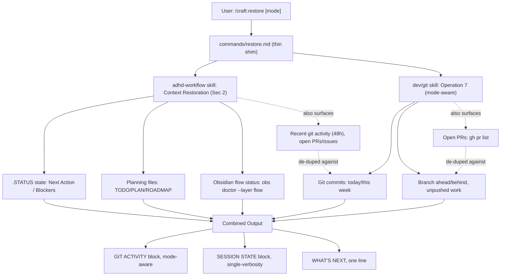
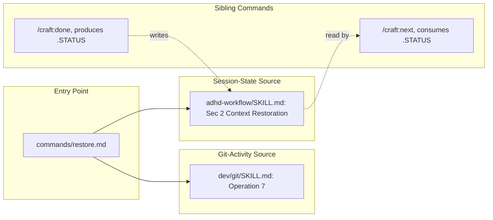

# /craft:restore Architecture

How `/craft:restore` combines git-activity and session-state recap into one
read-only output, and where each piece of logic actually lives.

## Pipeline Overview

The dotted edges mark the one deliberate overlap: both source skills independently
fetch recent commits and open PRs. The shim resolves this at presentation time —
one combined git-activity block sourced from `dev/git` (mode-aware), not two
separate printouts of the same commits.

## Component Map

## Why a Shim, Not a Reimplementation

`commands/restore.md` contains no recap logic of its own — every fact it
reports is computed by one of the two source skills. This mirrors the
`commands/done.md` convention already used across the plugin: the slash
command is a routing/discovery entry point; behavior changes happen in the
skill, never duplicated into the shim. See
[`SPEC-craft-restore-2026-07-17.md`](../specs/SPEC-craft-restore-2026-07-17.md)
for the decision record (combined output, no `--sync`, git-side-only modes).

## Boundaries (unchanged from the spec)

- **Read-only.** No `.STATUS` writes, no commits, no `--sync` flag.
- **No cross-plugin dispatch.** A `/restore` router forwarding to
  `savant:restore` for research projects was proposed alongside this command
  and confirmed structurally blocked — craft's `/do`/`/hub` routers cannot
  reach another plugin's namespace. Out of scope for this architecture.
- **Modes are git-side only.** `adhd-workflow`'s recap has no
  `default`/`detailed`/`summary` support today (verified before implementation,
  not assumed) — adding it is an open question in the spec, not shipped here.
