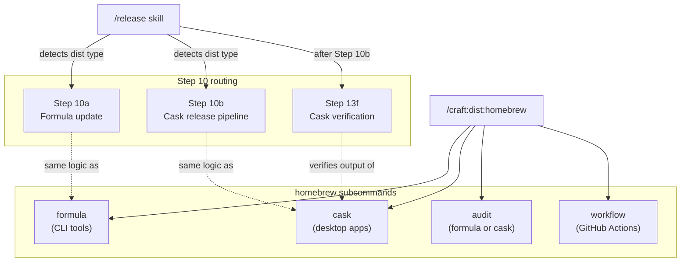
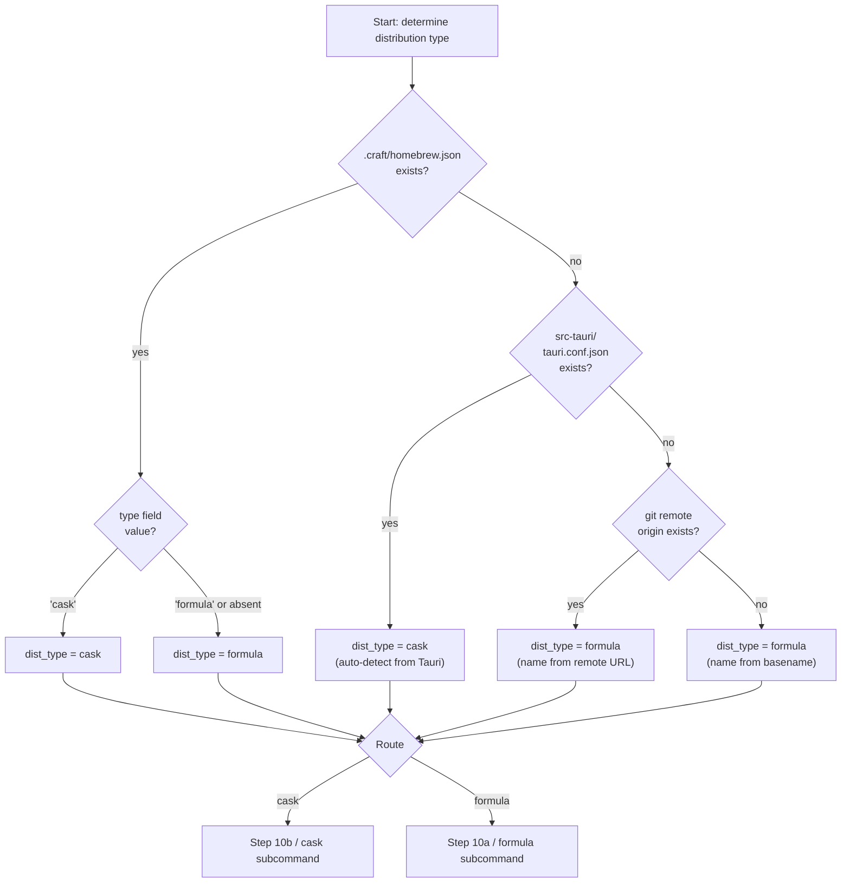
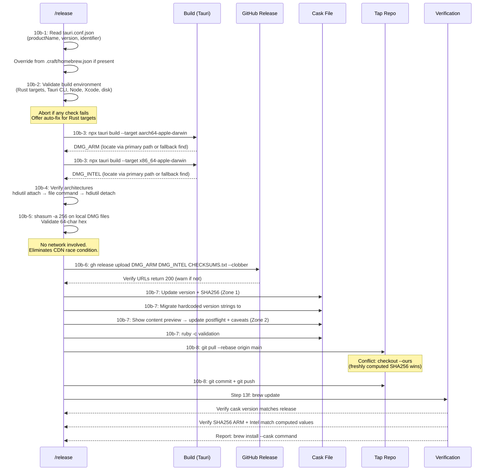
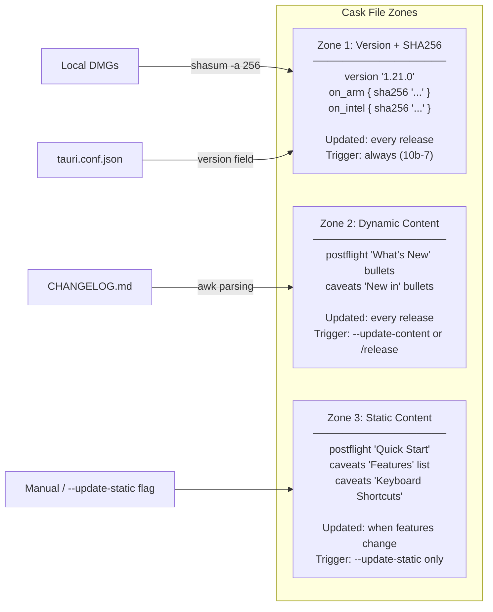
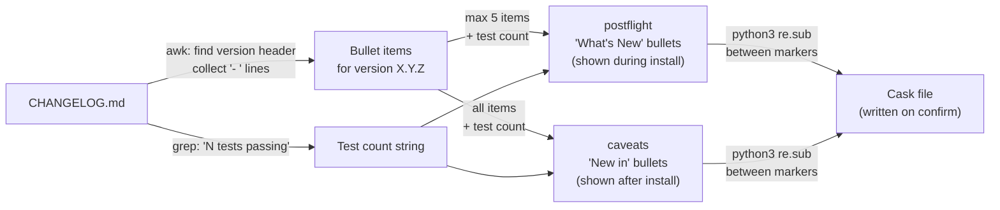
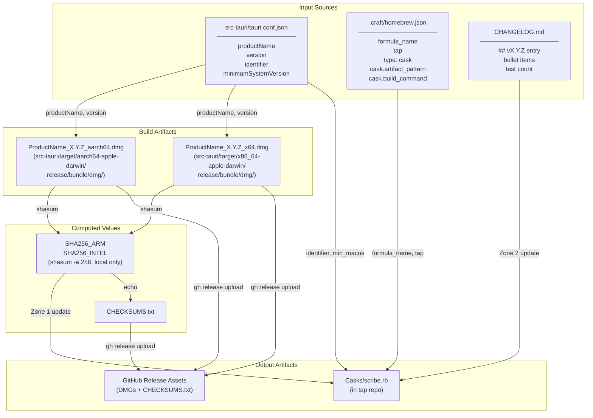
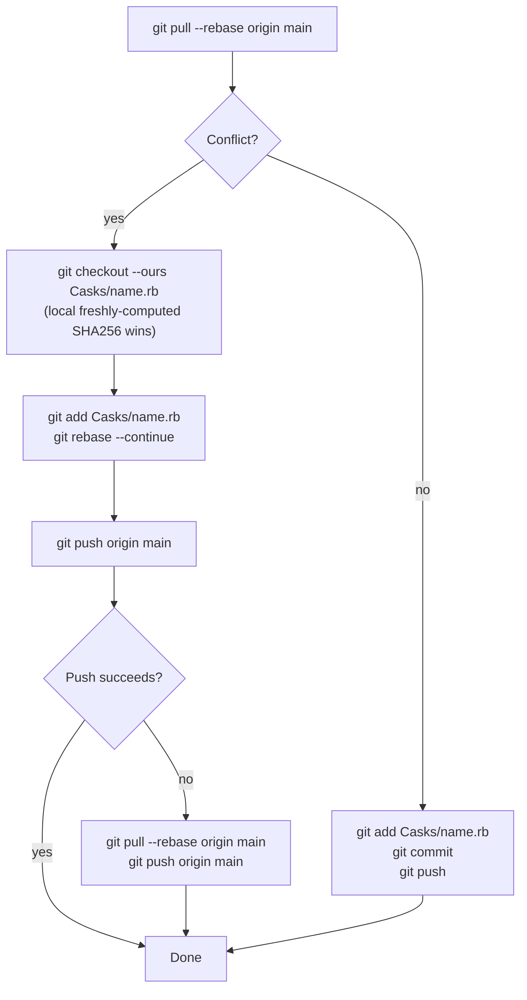
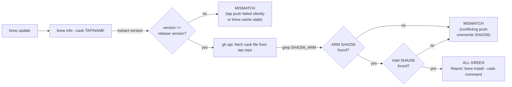

# Desktop Release Pipeline Architecture

> **Scope:** This document covers the architecture of the desktop app release pipeline — how `/release` auto-routes to Step 10b, how `/craft:dist:homebrew cask` works, and how the system's components fit together. For usage walkthroughs, see the [Desktop Release Guide](../guide/desktop-release.md). For command syntax, see the [Homebrew Quick Reference](../reference/REFCARD-HOMEBREW.md).

---

## 1. System Overview

The desktop release pipeline adds Homebrew Cask distribution for Tauri apps to an existing formula-only release system. The key design constraint was **backward compatibility**: formula-based projects must continue to work without any configuration changes.

The pipeline is implemented across two files:

- `skills/release/SKILL.md` — Step 10 routing logic, full Step 10b implementation, Step 13f verification
- `commands/dist/homebrew.md` — The `cask` subcommand with build orchestration, template generator, updater, content management, and audit support

---

## 2. Component Relationships



The `/release` skill and `/craft:dist:homebrew cask` share the same underlying pipeline logic. Running `/release` on a Tauri project is equivalent to running the cask subcommand in a release context, plus the surrounding pipeline steps (version bump, PR, GitHub release, etc.).

---

## 3. Detection Hierarchy

Both the `/release` skill (Step 10 routing) and `/craft:dist:homebrew` (subcommand selection) use the same four-level detection hierarchy.



**Why this ordering matters:** `.craft/homebrew.json` with `"type": "cask"` wins over everything, allowing explicit override of auto-detection. Tauri detection wins over the git remote fallback because desktop apps require fundamentally different distribution (Cask with pre-built DMGs vs Formula with source tarballs). The git remote and basename fallbacks both produce formula distribution, which is the safe default.

---

## 4. Step 10b Pipeline: Full Flow



---

## 5. Zone Architecture: The 3-Zone Cask Update Model

The cask updater treats a `.rb` cask file as having three distinct zones with different update frequencies and triggers.



**Design rationale for zone separation:** Zone 1 must always update (stale SHA256 breaks installations). Zone 2 should update every release to keep install-time messaging current, but the content comes from CHANGELOG so it needs parsing. Zone 3 rarely changes — shipping a broken Features list because a shortcut changed would be worse than leaving it slightly out of date, so it requires an explicit flag.

### Zone 2 Content Pipeline



The postflight limit of 5 items exists because postflight output appears during `brew install` / `brew upgrade` and should not overwhelm the terminal. Caveats appear in a separate block after install completes, so they can include the full list.

---

## 6. Data Flow



---

## 7. Multi-Architecture Build Strategy

```mermaid
gantt
    title Step 10b Build Sequence (serial, not parallel)
    dateFormat X
    axisFormat %s

    section Build
    Pre-flight validation        :a1, 0, 10
    aarch64 native build         :a2, after a1, 134
    Locate + verify ARM DMG      :a3, after a2, 5
    x86_64 cross-compile build   :a4, after a3, 271
    Locate + verify Intel DMG    :a5, after a4, 5

    section Post-build
    Architecture verification    :b1, after a5, 15
    SHA256 computation           :b2, after b1, 2
    GitHub upload                :b3, after b2, 30
    Cask update + tap push       :b4, after b3, 20
```



Builds run serially rather than in parallel because parallel Tauri builds on a developer machine cause memory exhaustion — each build compiles the full Rust + frontend dependency tree. Native architecture (aarch64) runs first so compilation errors surface quickly before committing to the longer cross-compile step.

---

## 8. Tap Conflict Resolution



**Why "ours" always wins:** During a release, the local cask file has SHA256 hashes freshly computed from local build artifacts. Any remote SHA256 values are stale by definition — they cannot be more current than what was just built and hashed locally. This strategy was adopted after SHA256 mismatches caused tap conflicts in earlier Scribe releases.

---

## 9. Step 13f Verification

Step 13f runs only when Step 10b was executed. It verifies the tap push actually propagated.



**What 13f catches that tap push logging misses:** The tap push may report success but a concurrent push (e.g., from CI) can overwrite the cask file immediately after. Verifying the live tap content against the locally-computed hashes catches this race condition.

---

## 10. Formula vs Cask: Architectural Differences

| Dimension | Step 10a (Formula) | Step 10b (Cask) |
|-----------|-------------------|-----------------|
| **Artifact** | Source tarball (`.tar.gz`) from GitHub | Pre-built DMGs (2 per release) |
| **SHA256 source** | Downloaded from GitHub CDN | Computed from local build output |
| **Build required** | No (user builds from source) | Yes (2 Tauri builds per release) |
| **Architecture** | Source is arch-agnostic | Separate binary per arch (aarch64, x86_64) |
| **Tap file** | `Formula/{name}.rb` | `Casks/{name}.rb` |
| **Content management** | Not applicable | 3-zone model (version, dynamic, static) |
| **CDN race condition** | Possible (must wait for GitHub CDN) | Eliminated (local artifacts) |
| **Conflict resolution** | Simple push | Rebase with "ours" strategy |
| **Post-release verification** | Step 13d | Step 13f |
| **Time cost** | ~1 minute | ~8-12 minutes (build-dominated) |

---

## 11. Configuration Schema Summary

```
.craft/homebrew.json
├── formula_name    (string, required)   — name in tap
├── tap             (string, required)   — "org/name" format
├── type            (string, optional)   — "formula" | "cask", default "formula"
└── cask            (object, optional)   — only when type = "cask"
    ├── app_name         — "Scribe.app" (default: productName + .app)
    ├── identifier       — "com.scribe.app" (default: from tauri.conf.json)
    ├── min_macos        — "catalina" (default: from minimumSystemVersion)
    ├── architectures    — ["aarch64", "x64"] (default)
    ├── artifact_pattern — "{name}_{version}_{arch}.dmg" (default)
    ├── build_command    — "npx tauri build --target {target}" (default)
    ├── targets          — {"aarch64": "aarch64-apple-darwin", "x64": "x86_64-apple-darwin"}
    ├── postflight_template — "changelog" | "none"
    └── caveats_template    — "full" | "minimal" | "none"
```

Fields not present in `.craft/homebrew.json` fall back to auto-detection from `src-tauri/tauri.conf.json`. The `cask` object is optional even when `type = "cask"` — all fields within it have defaults derived from Tauri's config.

---

## See Also

- [Desktop Release Guide](../guide/desktop-release.md) — Step-by-step usage walkthrough
- [Homebrew Quick Reference](../reference/REFCARD-HOMEBREW.md) — Command syntax and flags
- `/craft:dist:homebrew` command — Full command specification (see `commands/dist/homebrew.md`)
- `/release` skill — Complete pipeline specification (see `skills/release/SKILL.md`)
