# /craft:git:init - Architecture & Flow Diagrams

## Command Execution Flow

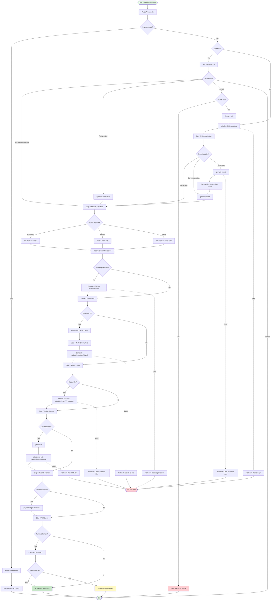

## Workflow Patterns Architecture

### Pattern 1: Main + Dev (Default)

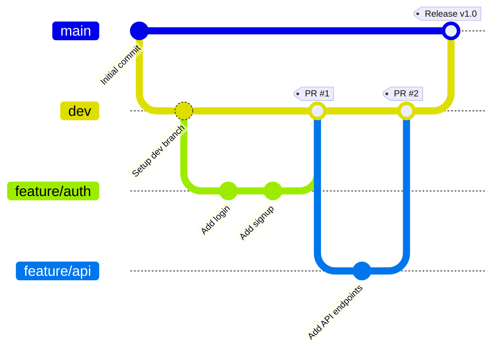

**Branch Flow:**
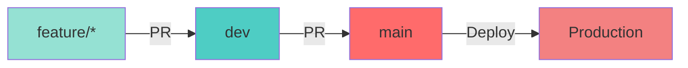

### Pattern 2: Simple

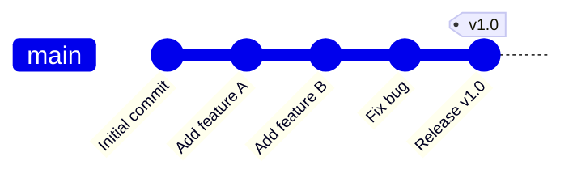

**Branch Flow:**
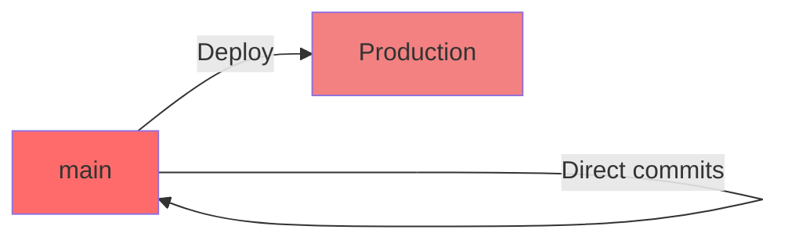

### Pattern 3: GitFlow

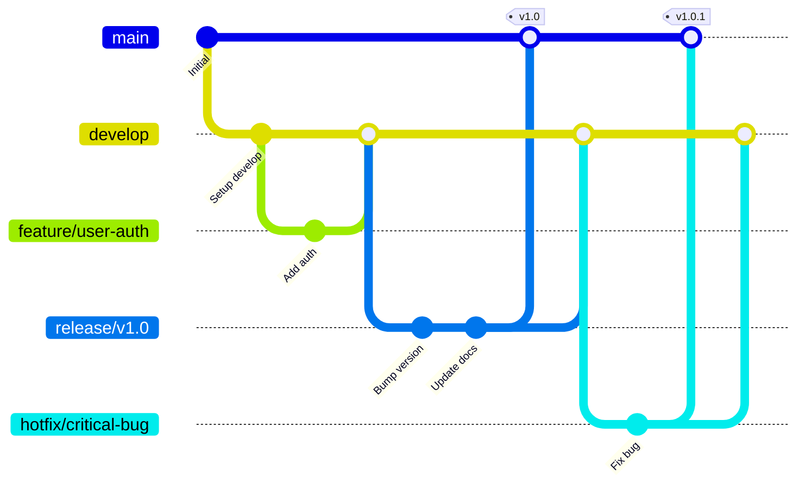

**Branch Flow:**
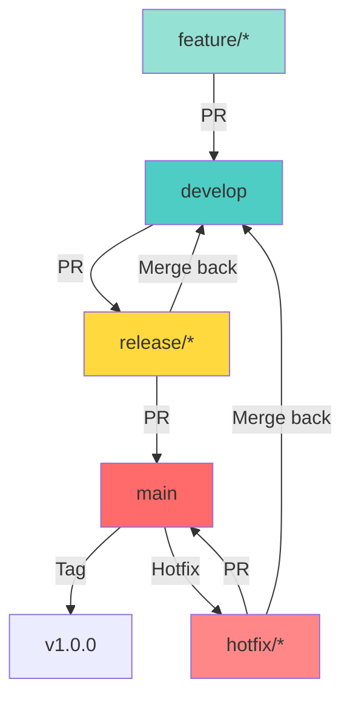

## Component Architecture

```mermaid
graph TB
    subgraph "User Interface"
        CLI["/craft:git:init CLI"]
        SmartRouter["/craft:do Smart Router"]
    end

    subgraph "Wizard Engine"
        StepController[Step Controller]
        AskQuestion[AskUserQuestion]
        ProgressTracker[Progress Tracker]
    end

    subgraph "Core Operations"
        GitOps[Git Operations]
        GHOps[GitHub Operations]
        FileOps[File Operations]
        CIOps[CI Generation]
    end

    subgraph "Templates"
        StatusTemplate[.STATUS Template]
        ClaudeTemplate[CLAUDE.md Template]
        PRTemplate[PR Template]
        CITemplates[CI Templates]
    end

    subgraph "Validation"
        DryRun[Dry-run Validator]
        Check[/craft:check Integration]
        Rollback[Rollback Engine]
    end

    CLI --> StepController
    SmartRouter --> StepController
    StepController --> AskQuestion
    StepController --> ProgressTracker
    StepController --> GitOps
    StepController --> GHOps
    StepController --> FileOps
    StepController --> CIOps

    GitOps --> DryRun
    GHOps --> DryRun
    FileOps --> Templates
    CIOps --> CITemplates

    GitOps -.->|Error| Rollback
    GHOps -.->|Error| Rollback
    FileOps -.->|Error| Rollback

    StepController --> Check

    style CLI fill:#e3f2fd
    style SmartRouter fill:#e3f2fd
    style StepController fill:#fff3e0
    style Rollback fill:#ffebee
    style Check fill:#e8f5e9
```

## Data Flow

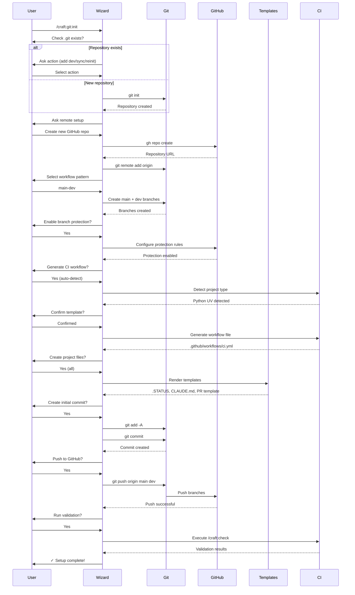

## Error Handling Flow

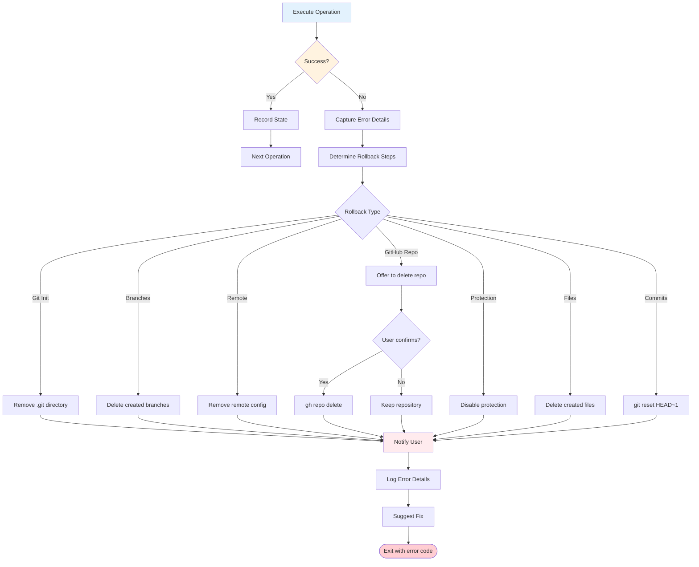

## Template Processing

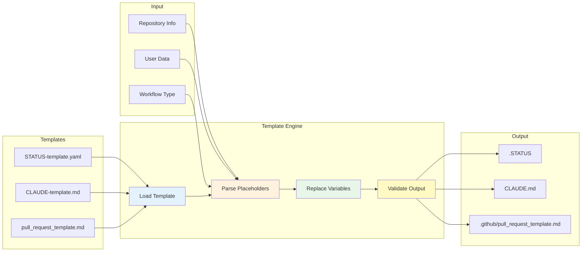

## Integration Points

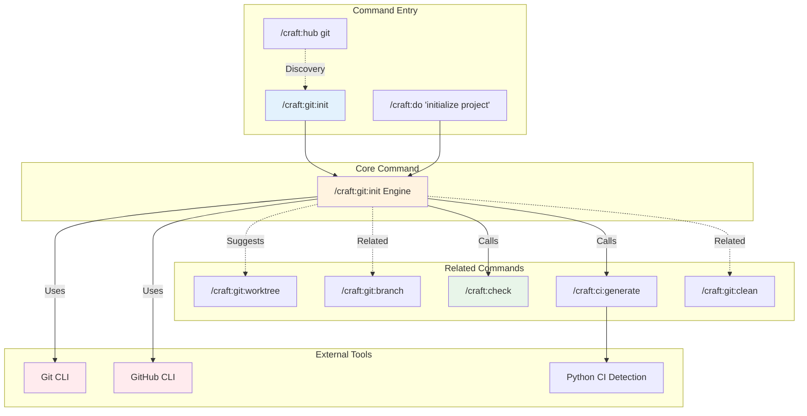

## State Machine

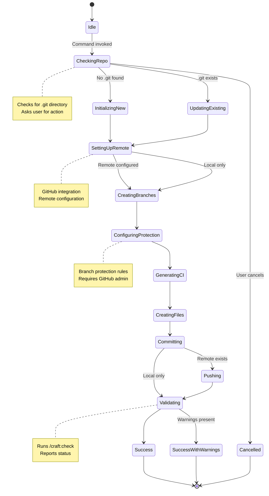

## File System Operations

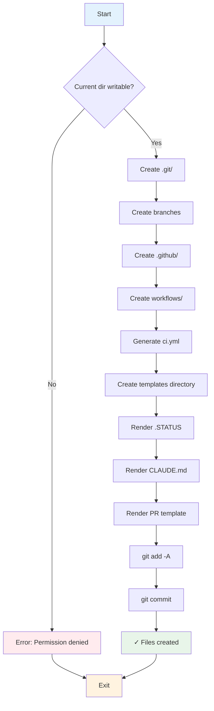

---

**Document Version:** 1.0
**Generated:** 2025-01-15
**Architecture:** /craft:git:init command
