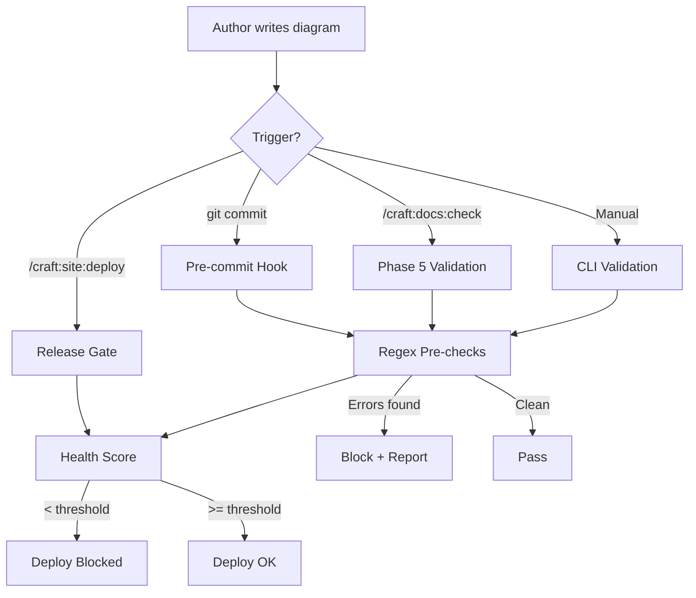
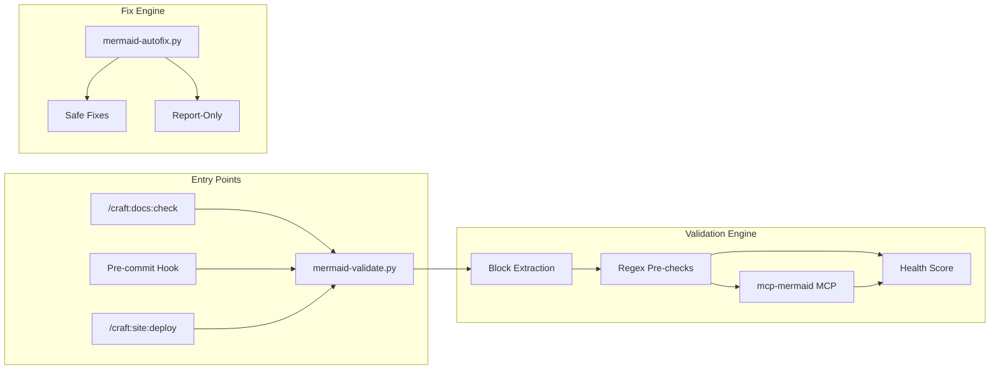
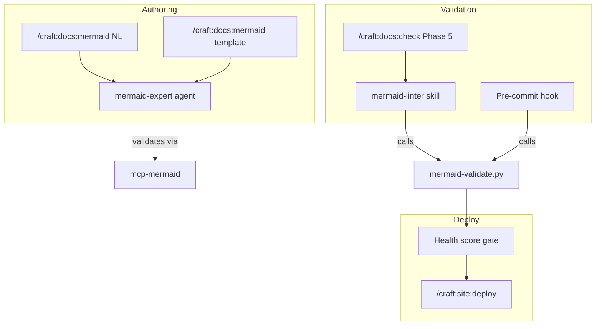

# Mermaid Validation Pipeline Architecture

How Mermaid diagram validation flows through the craft plugin, from authoring to deploy.

## Pipeline Overview



## Component Map



## Data Flow

### Block Extraction

```text
*.md files
  → scan for ```mermaid fences
  → track indent level for closing fence
  → emit MermaidBlock(file, line_number, content)
```

### Regex Pre-checks (5 rules)

| Rule | Severity | Pattern | Catches |
|------|----------|---------|---------|
| `leading-slash` | Error | `[/text]` | Parallelogram misparse |
| `lowercase-end` | Error | `[end]` | Keyword conflict |
| `unquoted-colon` | Warning | `[a:b]` | Parsing ambiguity |
| `br-tag` | Warning | `<br/>` | Deprecated syntax |
| `deprecated-graph` | Warning | `graph TD` | Outdated keyword |

### Health Score Calculation

```text
health = syntax_validity × 0.5
       + best_practices  × 0.3
       + rendering       × 0.2

Where:
  syntax_validity  = % blocks with 0 errors
  best_practices   = % blocks with 0 warnings
  rendering        = % blocks passing MCP render (defaults to syntax_validity)

Deduplication: issues grouped by (file, block_start_line) to prevent
inflation from multiple warnings per block.
```

## Scripts

| Script | Purpose | Typical Use |
|--------|---------|-------------|
| `scripts/mermaid-validate.py` | Extract + validate + score | CI, pre-commit, manual |
| `scripts/mermaid-autofix.py` | Safe auto-fixes + report | Cleanup before PR |
| `scripts/hooks/pre-commit-mermaid.sh` | Hook wrapper | Automatic on commit |

### CLI Flags

```text
mermaid-validate.py <paths...>
  --errors-only     Only errors (fast, for pre-commit)
  --json            Machine-readable output
  --health-score    Show composite score
  --gate [N]        Exit non-zero if score < N (default 80)

mermaid-autofix.py <paths...>
  --fix             Apply safe fixes (default: dry-run)
  --test            Run 12 built-in self-tests
```

## Integration Points



## Severity Model

**Two tiers** prevent noise while catching real issues:

- **Errors** block commits and deploys. Only patterns that cause visible rendering failures.
- **Warnings** are reported but don't block. Patterns that work but have better alternatives.

This design keeps the pre-commit hook fast (<1s) and avoids false-positive fatigue.
