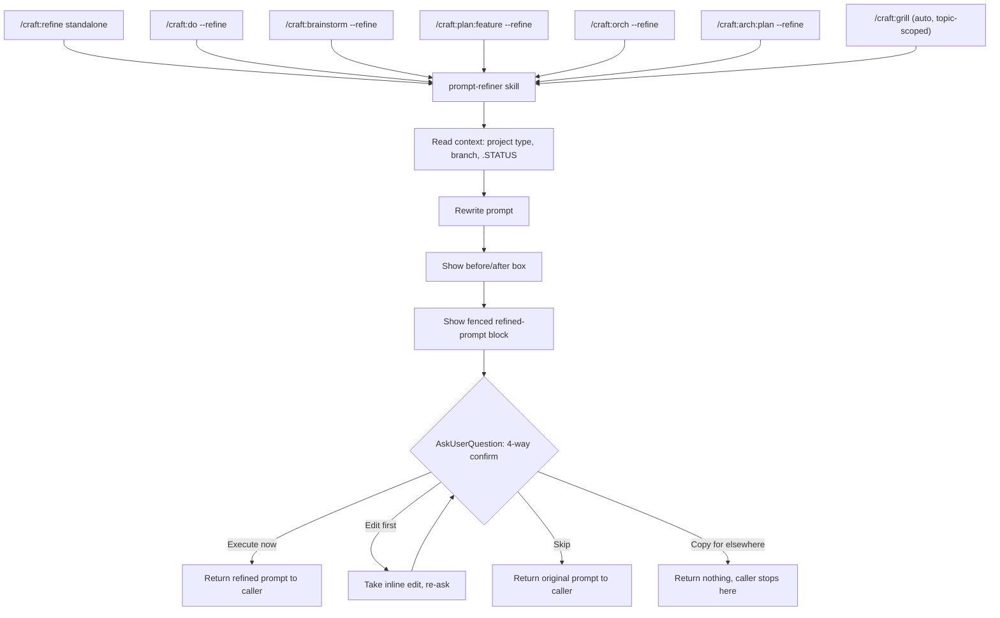
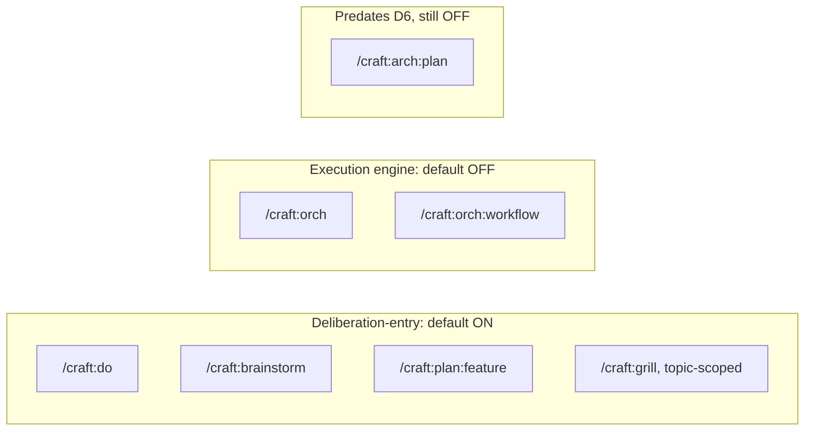

# `prompt-refiner` Architecture

How `--refine` and standalone `/craft:refine` share one canonical rewrite +
confirm flow across 6 entry points.

## Pipeline Overview

The ordering of K then L then M is load-bearing: both text blocks must render
as visible response content before the `AskUserQuestion` tool call — a prose
skill can't enforce ordering the way a hook can, so the instruction has to be
explicit rather than merely sequential (a 2026-07 confirmed bug was a question
appearing with nothing shown first, from collapsing K/L/M into one turn).

## Default-On/Off Map (D6, 2026-07-04)

Rule of thumb: if the command's job is *deciding what to do*, default ON. If
its job is *doing the already-decided thing*, default OFF.

## The 4-Way Confirm (locked 2026-07-17, supersedes the old 3-way Accept/Edit/Use-original)

| Option | Behavior |
|---|---|
| **Execute now** (Recommended when a clear action is implied) | Caller's normal downstream flow proceeds with the refined prompt |
| **Copy for elsewhere** | Universal short-circuit — the calling command's own flow must not start |
| **Edit first** | Inline edit (no `$EDITOR`), then re-ask |
| **Skip** | Proceed with the original, unrefined text — not an abort |

`--yes` / auto mode auto-accepts **Execute now**, skipping the picker
entirely — one flag both accepts prompt-refiner's rewrite and suppresses the
caller's own interactive loop.

## Why a Shim, Not 6 Reimplementations

Every entry point (`commands/refine.md`, and the `--refine` sections in
`do.md`, `brainstorm.md`, `orch.md`, `plan/feature.md`, `arch/plan.md`)
delegates to `skills/workflow/prompt-refiner/SKILL.md` — none reimplement the
rewrite or confirm logic. A caller-specific instruction only ever names what
"Copy for elsewhere" stops (that caller's own next step) — the confirm
vocabulary and ordering constraint live in exactly one place.

## Boundaries

- **Never executes the prompt or calls tools** — rewrite text only.
- **Never writes files** — context reads are read-only.
- **Never touches secrets/tokens.**
- **Deferred flags** (`--target`, `--terse`, `--n`, `--scope`, `--history`):
  investigated 2026-07-01, explicitly rejected for lack of confirmed demand —
  see [`docs/specs/BRAINSTORM-refine-flags-2026-07-01.md`](../specs/BRAINSTORM-refine-flags-2026-07-01.md).
  Revisit only if real usage friction shows up.
