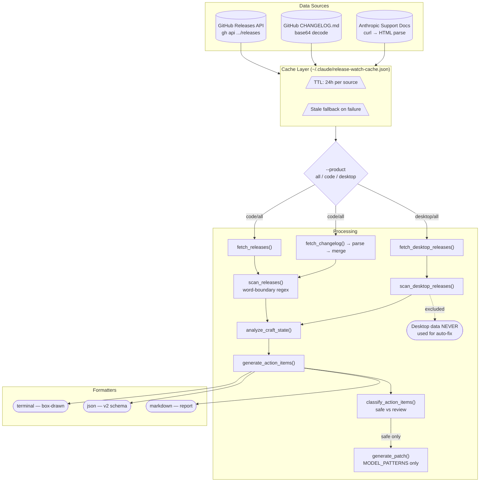

# Release Watch v2 — Architecture

**Script:** `scripts/release-watch.py` (1245 lines)
**Version:** 2 (JSON schema v2)
**Added:** v2.30.0

## Architecture Diagram



## Module Layout

```text
scripts/release-watch.py
  ├── Constants & Config
  │   ├── KEYWORD_CATEGORIES    7 categories, ~30 keywords
  │   ├── CATEGORY_MAP          keyword-cat → finding-cat
  │   └── MODEL_PATTERNS        12 patterns (incl. future-proof regex)
  │
  ├── Cache Layer
  │   ├── load_cache()          Read JSON from disk
  │   ├── save_cache()          Atomic write (tmpfile + rename)
  │   ├── is_fresh()            TTL check per source
  │   ├── get_cached()          Fresh → return, stale → None
  │   └── set_cached()          Write entry with timestamp
  │
  ├── Source: GitHub Releases API
  │   ├── fetch_releases()      gh api ?per_page=N (GET, not POST)
  │   ├── _filter_and_sort()    Version ordering, --since filter
  │   └── _version_gt()         Semver comparison
  │
  ├── Source: GitHub CHANGELOG.md
  │   ├── fetch_changelog()     gh api contents → base64 decode
  │   ├── parse_changelog()     ## headers → prefix categorization
  │   └── merge_changelog_..()  Enriches releases with CHANGELOG data
  │
  ├── Source: Anthropic Docs (Desktop)
  │   ├── fetch_desktop_..()    curl -sL (follows redirects)
  │   ├── _parse_desktop_html() HTMLParser → date-based entries
  │   └── scan_desktop_..()     Keyword scan (same as Code)
  │
  ├── Analyzer
  │   ├── scan_releases()       Word-boundary keyword matching
  │   ├── analyze_craft_state() Hardcoded models, agents, hooks
  │   └── generate_action_..()  Findings → actionable items
  │
  ├── Auto-Fix
  │   ├── classify_action_..()  safe (patch) vs review (report)
  │   └── generate_patch()      Unified diff for MODEL_PATTERNS
  │
  ├── Formatters
  │   ├── format_terminal()     Box-drawn output (╔══╗)
  │   ├── format_json()         JSON v2 (version: 2)
  │   └── format_markdown()     Section-based report
  │
  └── Main (CLI + orchestration)
```

## Data Sources

| Source | Product | Method | Timeout | Cache Key |
|--------|---------|--------|---------|-----------|
| GitHub Releases API | Code | `gh api` (GET) | 30s | `releases` |
| CHANGELOG.md | Code | `gh api` + base64 | 30s | `changelog` |
| Anthropic Support Docs | Desktop | `curl -sL` | 10s | `desktop_releases` |

### Why Not Releasebot.io?

Research (2026-02-26) confirmed releasebot.io has **no public API**:

- JSON endpoints: 404
- RSS feeds: 404 (require authentication)
- Decision: fetch upstream source directly from `support.claude.com`

## Cache Design

```text
~/.claude/release-watch-cache.json
{
  "releases": {
    "timestamp": 1740000000,
    "data": [...]
  },
  "changelog": {
    "timestamp": 1740000000,
    "data": "..."
  },
  "desktop_releases": {
    "timestamp": 1740000000,
    "data": [...]
  }
}
```

- **TTL:** 24 hours per source (independent expiry)
- **Atomic writes:** `tempfile.mkstemp()` + `os.rename()` (no partial reads)
- **Permissions:** `0o700` directory, `0o600` file
- **Stale fallback:** If live fetch fails and stale data exists, use it with warning
- **Flags:** `--refresh` forces all stale, `--no-cache` skips entirely

## Keyword Matching

Uses `\b` word-boundary regex to prevent false positives:

```python
re.search(rf'\b{re.escape(keyword)}\b', text, re.IGNORECASE)
```

| Input | Keyword | Match? | Reason |
|-------|---------|--------|--------|
| "new feature" | "new" | Yes | Standalone word |
| "renewable" | "new" | No | Word boundary prevents |
| "bug fix applied" | "fix" | Yes | Standalone word |
| "prefix notation" | "fix" | No | Word boundary prevents |

### Category Precedence

1. CHANGELOG prefix categories (highest — structured data)
2. Keyword scan categories (fallback — heuristic)

CHANGELOG prefixes: `Added→NEW`, `Fixed→FIXED`, `Changed→NEW`, `Deprecated→DEPRECATED`, `Removed→BREAKING`, `Breaking→BREAKING`

## Security Boundaries

| Rule | Enforcement |
|------|-------------|
| Desktop data never used for auto-fix | `classify_action_items()` filters by `source` field |
| Auto-fix generates `.patch` only | Never modifies files directly |
| Subprocess uses list-form | No shell injection (`subprocess.run([...])`) |
| Subprocess timeouts | 30s for GitHub API, 10s/15s for Desktop |
| Exit code always 0 | Advisory tool, not a CI gate |

## JSON v2 Schema

```json
{
  "version": 2,
  "product": "all",
  "releases_checked": 3,
  "latest_version": "v2.1.59",
  "findings": {
    "new": [...],
    "deprecated": [...],
    "breaking": [...],
    "fixed": [...]
  },
  "desktop": {
    "entries_checked": 20,
    "latest_date": "February 25, 2026",
    "findings": { "new": [], "deprecated": [], "breaking": [], "fixed": [] }
  },
  "craft_state": {
    "hardcoded_models": [],
    "agent_features": {},
    "hook_events": []
  },
  "action_items": []
}
```

**Backward compatibility:** `--product code --format json` produces output parseable by v1 consumers (all v1 keys preserved).

## CLI Reference

| Flag | Default | Description |
|------|---------|-------------|
| `--count N` | 3 | Number of Code releases to check |
| `--since VER` | — | Only releases after this version |
| `--format FMT` | terminal | Output: terminal, json, markdown |
| `--product PROD` | all | Track: all, code, desktop |
| `--refresh` | false | Force refresh cached data |
| `--no-cache` | false | Skip cache entirely |
| `--auto-fix` | false | Generate `.patch` for safe fixes |

## Test Coverage

37 tests across 7 test classes:

| Class | Tests | Focus |
|-------|-------|-------|
| TestReleaseWatch | 5 | E2E: help, JSON schema, count, findings, craft_state |
| TestCache | 8 | Creation, freshness, stale fallback, refresh/no-cache |
| TestChangelogParser | 8 | All prefix categories, multi-version, edge cases |
| TestWordBoundary | 5 | False positive prevention, standalone matches |
| TestDesktopSource | 5 | Source tagging, autofix exclusion, HTML parsing |
| TestAutoFix | 3 | Classification: breaking→review, model→safe |
| TestBackwardCompat | 3 | v1 JSON compat, v2 version field, product filter |
