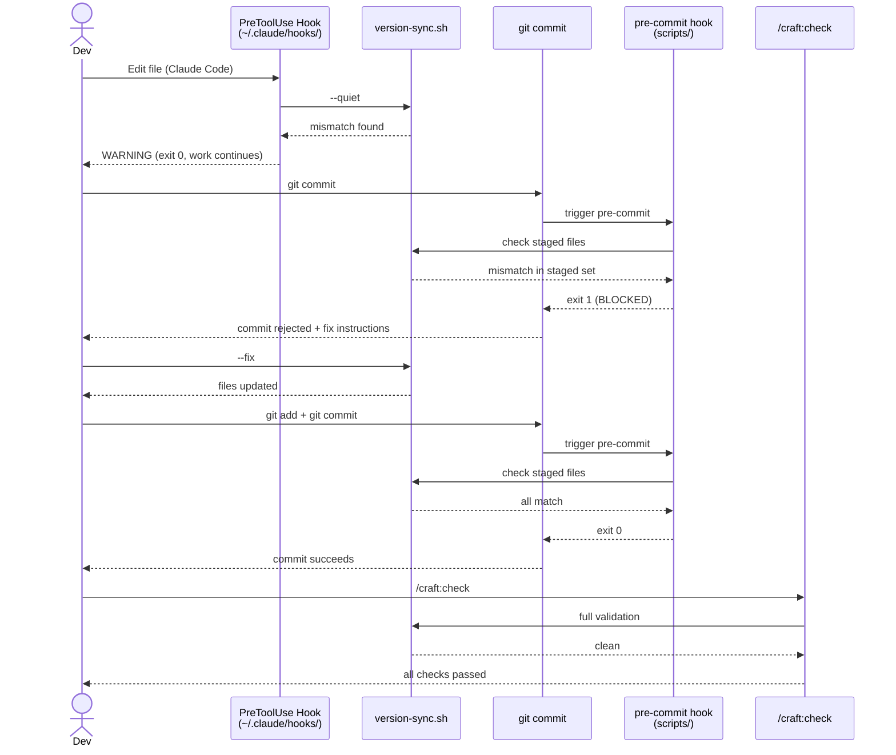

# Version Sync Architecture

## Overview

The version sync system prevents version drift across project files using a three-layer defense-in-depth pattern. Each layer catches mismatches at a different stage of the development lifecycle: during editing (soft warning), at commit time (hard block), and during pre-flight validation (contextual report).

**Key capability:** Version mismatches are caught before they reach CI, eliminating a common class of release failures.

## Design Goals

- **Defense in depth** - Three independent layers, any one of which can catch drift
- **Non-blocking early warnings** - Layer 1 warns without interrupting flow
- **Hard block at commit** - Layer 2 prevents mismatches from entering history
- **Context-aware reporting** - Layer 3 adjusts detail level based on validation context
- **Convention-based discovery** - Auto-detects source of truth without configuration
- **macOS compatible** - All pattern matching uses BSD `grep -oE`, not GNU `-oP`

## Architecture

### Three-Layer Overview

```
Edit/Write operation
    ↓
Layer 1: PreToolUse hook (soft warning, exit 0)
    ↓
git commit
    ↓
Layer 2: Pre-commit hook (hard block, exit 1 on mismatch)
    ↓
/craft:check / pre-PR / pre-release
    ↓
Layer 3: Validation integration (contextual report)
```

Each layer operates independently. A mismatch caught by Layer 1 still proceeds to Layer 2 if the user ignores the warning.

---

### Layer 1: PreToolUse Hook (Soft Warning)

**File:** `~/.claude/hooks/version-sync-hook.sh`

**Trigger:** Edit or Write operations during Claude Code sessions.

**Behavior:** Walks up the directory tree from the file being modified to locate the project root (identified by `.git` or `.claude-plugin/`), then runs `scripts/version-sync.sh --quiet` against that root. If a mismatch is detected, prints a warning to stderr and exits 0 — work continues unblocked.

**Why exit 0:** This layer is an early-warning system, not a gate. Blocking edits mid-session would interrupt the very workflow that fixes mismatches. The user may be in the process of updating multiple files to a new version; blocking after the first file would make the fix impossible.

**Example output:**

```
[version-sync] WARNING: version mismatch detected
  plugin.json: 2.22.0
  CLAUDE.md:   2.21.0
  package.json: 2.22.0
Run 'scripts/version-sync.sh --fix' to resolve.
```

**Implementation notes:**

- Hook is installed globally in `~/.claude/hooks/`, not per-project
- Project root walk stops at filesystem root with no false positive if no project found
- Uses `--quiet` flag to suppress output when versions are in sync (zero noise on clean state)

---

### Layer 2: Git Pre-Commit Hook (Hard Block)

**File:** `scripts/version-sync-precommit.sh`

**Installation:** Symlinked to `.git/hooks/pre-commit` during project setup.

**Trigger:** Every `git commit` that includes version-bearing files in the staged set.

**Behavior:** Extracts version strings from staged files using `git show ":$FILE"` (reads staged content, not working tree), compares against the resolved source of truth, and exits 1 if any mismatch is found. Commit is blocked with a human-readable error listing each mismatched file.

**Why read staged content:** Working tree may contain additional in-progress edits. The commit should be internally consistent — all staged files must agree on version. Reading staged content via `git show ":$FILE"` ensures the check applies to what will actually be committed.

**Example block output:**

```
[version-sync] COMMIT BLOCKED: version mismatch in staged files

  Source of truth: .claude-plugin/plugin.json → 2.22.0

  Mismatched files:
    CLAUDE.md         found: 2.21.0  expected: 2.22.0
    tests/test_*.py   found: 2.21.0  expected: 2.22.0

  Fix: scripts/version-sync.sh --fix
  Then: git add <files> && git commit
```

**Version extraction patterns (BSD grep -oE):**

```bash
# plugin.json
grep -oE '"version"[[:space:]]*:[[:space:]]*"[0-9]+\.[0-9]+\.[0-9]+"' | grep -oE '[0-9]+\.[0-9]+\.[0-9]+'

# CLAUDE.md
grep -oE 'v[0-9]+\.[0-9]+\.[0-9]+' | head -1

# Source constants
grep -oE 'PROJECT_VERSION[[:space:]]*=[[:space:]]*"[0-9]+\.[0-9]+\.[0-9]+"' | grep -oE '[0-9]+\.[0-9]+\.[0-9]+'
```

---

### Layer 3: /craft:check Integration (Validation)

**Trigger:** `/craft:check`, pre-PR validation, pre-release checks.

**Behavior:** Runs `scripts/version-sync.sh` as part of the standard validation suite. Reports with context-appropriate detail:

| Context | Detail Level | Behavior on Mismatch |
|---------|-------------|----------------------|
| Commit check | File list + versions | Warning in check output |
| PR validation | Full diff + fix command | Fails check, blocks PR recommendation |
| Release validation | Full diff + severity rating | Hard fail, blocks release |

**Why this layer exists:** Catches anything that bypassed Layers 1 and 2 — for example, files modified outside Claude Code sessions, manual `git commit --no-verify`, or files that don't trigger the PreToolUse hook pattern.

---

## Source of Truth Discovery

When `source_of_truth` is set to `"auto"` (the default), the system resolves the authoritative version file using a priority-ordered convention scan:

| Priority | File | Ecosystem |
|----------|------|-----------|
| 1 | `.claude-plugin/plugin.json` | Claude Code plugins |
| 2 | `package.json` | Node.js |
| 3 | `pyproject.toml` | Python |
| 4 | `DESCRIPTION` | R packages |
| 5 | `Cargo.toml` | Rust |

The first file found at project root wins. Version is extracted from the canonical field for each format (`version` for JSON/TOML, `Version:` for DESCRIPTION).

If no known manifest is found, version-sync exits 0 with a `[version-sync] skipped: no source of truth found` message — it does not fail on projects that opt out of versioning.

---

## What Gets Checked

**Manifest files** — any file in `version_files` config or auto-discovered via known patterns:

- `plugin.json`, `package.json`, `pyproject.toml`, `Cargo.toml`, `DESCRIPTION`
- `CHANGELOG.md` (header version line)

**CLAUDE.md version references** — inline version strings in the plugin header block:

```
**Current Version:** v2.22.0 | **Latest Release:** v2.22.0
```

**Source code constants** — project-specific version constants in Python, JS, or shell:

```python
PROJECT_VERSION = "2.22.0"
```

```bash
readonly VERSION="2.22.0"
```

**Test expectations** — hardcoded expected versions in test files:

```python
assert result["version"] == "2.22.0"
```

```bash
assert_equals "$VERSION" "2.22.0"
```

---

## Configuration

**File:** `.claude/release-config.json`

**Schema:**

```json
{
  "version_sync": {
    "enabled": true,
    "source_of_truth": "auto",
    "additional_files": [],
    "exclude_patterns": [],
    "monorepo_strategy": "root_is_truth"
  }
}
```

**Configuration fields:**

- `enabled` (bool): Enable/disable version sync across all layers
- `source_of_truth` (string): `"auto"` for convention-based discovery, or explicit path (e.g., `".claude-plugin/plugin.json"`)
- `additional_files` (array): Extra files to check beyond auto-discovered set (e.g., `["docs/VERSION", "src/version.ts"]`)
- `exclude_patterns` (array): Glob patterns to skip (e.g., `["docs/VERSION-HISTORY.md"]` to exclude changelog archives)
- `monorepo_strategy` (string): `"root_is_truth"` uses root manifest; `"per_package"` validates each package independently

**Minimal config (most projects):** No `.claude/release-config.json` needed — convention-based discovery works out of the box. Add config only to handle exceptions.

---

## Integration Points

### Workflow Diagram



### /release Integration

Version sync runs at two points in the release pipeline:

```
Step 1: Pre-release validation
   1.1: version-sync.sh (hard fail if mismatch)
   ↓
Step 2: Version bump
   2.1: Update source of truth
   2.2: version-sync.sh --fix (propagate to all files)
   2.3: Commit version files
   ↓
Step 3: Build + test
   ↓
Step 4: Create PR
   ↓
Step 5: CI monitoring (may auto-fix version_mismatch category)
```

If version-sync fails at Step 1, the release is blocked before any files are modified. This prevents partial-version states from entering the repository.

---

## macOS Compatibility

All version extraction uses BSD `grep -oE` (extended regex, print only match). GNU `grep -oP` (Perl regex) is not used anywhere in the version-sync system.

**Pattern translation examples:**

| GNU (-oP) | BSD (-oE) equivalent |
|-----------|---------------------|
| `\d+\.\d+\.\d+` | `[0-9]+\.[0-9]+\.[0-9]+` |
| `(?<="version": ")[\d.]+` | `"version".*"[0-9][^"]*"` + post-pipe |
| `\s+` | `[[:space:]]+` |

Multi-step extraction (extract field, then extract number from field) is preferred over single complex patterns for readability and cross-platform reliability.

---

## Troubleshooting

| Issue | Diagnosis | Fix |
|-------|-----------|-----|
| Hook fires on every edit | `--quiet` not working | Verify hook passes `--quiet` flag |
| Pre-commit fires on unrelated commits | Too broad file pattern | Tighten `additional_files` or add `exclude_patterns` |
| Source of truth not detected | No known manifest at root | Set `source_of_truth` to explicit path in config |
| Version extracted incorrectly | Pattern mismatch for format | Check extraction regex against actual file format |
| `--fix` updates wrong files | Stale file discovery cache | Run `scripts/version-sync.sh --list` to inspect discovered files |
| Hook not running in Claude Code | Hook not installed | Run `scripts/install-hooks.sh` |
| Pre-commit hook not running | Hook not symlinked | `ln -s ../../scripts/version-sync-precommit.sh .git/hooks/pre-commit` |

## Layer 4: Atomic Version Bump (bump-version.sh)

**File:** `scripts/bump-version.sh` + `scripts/bump-version-helper.py`

**Role:** The *fix* layer — while Layers 1-3 detect drift, Layer 4 prevents it by updating all 11 version-bearing files atomically in a single invocation.

**Modes:**

| Mode | Command | Effect |
|------|---------|--------|
| Full bump | `./scripts/bump-version.sh 2.28.0` | Version + counts across all files |
| Dry run | `./scripts/bump-version.sh 2.28.0 --dry-run` | Preview only |
| Counts only | `./scripts/bump-version.sh --counts-only` | Sync counts without version change |
| Verify | `./scripts/bump-version.sh --verify` | Check consistency (exit 0/1) |

**Architecture:**

```text
bump-version.sh
    |
    +-- bump-version-helper.py (JSON: plugin.json, marketplace.json, package.json)
    |
    +-- sed (text: CLAUDE.md, README.md, docs/index.md, docs/REFCARD.md,
    |         docs/DEPENDENCY-ARCHITECTURE.md, docs/reference/configuration.md,
    |         mkdocs.yml, .STATUS)
```

**Integration with release pipeline:** Step 3 of `/release` calls `bump-version.sh <version>` instead of manual file-by-file edits. The `--verify` mode is used by `pre-release-check.sh` as an additional consistency gate.

**Scoped replacements:** To avoid rewriting historical references (e.g., "NEW in v2.22.0"), text file updates use targeted patterns:

- `docs/index.md`: Only `version-X.Y.Z` badges, `Current version:` lines, and `Latest: vX.Y.Z` info box
- `docs/REFCARD.md`: Version badge, header lines, box interior `Version: X.Y.Z` and `vX.Y.Z:` summary
- `CLAUDE.md`: Only `Current Version:** vX.Y.Z` pattern
- `README.md`: Only `version-X.Y.Z` badge pattern

---

## Related Documentation

- CI monitoring: `docs/architecture/ci-monitoring.md`
- Branch guard: `docs/architecture/branch-guard.md`
- Release pipeline: `skills/release/SKILL.md`
- Configuration schema: `.claude/release-config.json`
- Version sync script: `scripts/version-sync.sh`
- Pre-commit hook: `scripts/version-sync-precommit.sh`
- Bump version script: `scripts/bump-version.sh`
- Bump version reference: `docs/reference/REFCARD-BUMP-VERSION.md`
