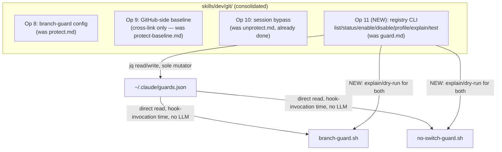

# BRAINSTORM — Branch-Protection Command Consolidation

**Date:** 2026-07-07 · **Focus:** arch · **Depth:** deep · **Topic:** consolidate the branch-protection CLI surface

## Why now

Branch protection in craft is split across 4 command files, 1 skill, 2 enforcement scripts, and 1
registry:

| Surface | File | Lines | Status |
|---|---|---|---|
| Registry CLI | `commands/git/guard.md` | 446 | standalone command |
| Local-hook config | `commands/git/protect.md` | 212 | standalone command |
| Session bypass | `commands/git/unprotect.md` | 138 | **already deprecated**, `replaced-by: skills/dev/git/` |
| GitHub-side | `commands/git/protect-baseline.md` | ~157 | standalone command |
| Git lifecycle | `skills/dev/git/SKILL.md` | — | owns protect/unprotect/guard-audit as Operations 8–10 |
| Enforcement | `scripts/branch-guard.sh` + `scripts/no-switch-guard.sh` | ~700+330 | two independent hooks |
| State | `~/.claude/guards.json` | — | flat registry both scripts read directly |

`unprotect.md` already points at the skill. This brainstorm exists because the other three
commands didn't follow — this session hit that split directly (needed `/craft:git:guard disable`,
which is unrelated in name and location to `protect`/`unprotect`, to unblock a live edit).

## Prior art — do not re-litigate

`docs/specs/SPEC-craft-guard-suite-2026-06-19.md` already considered and **rejected** unifying
`branch-guard.sh` and `no-switch-guard.sh`'s emission mechanisms: branch-guard emits `exit 2` +
stderr (`_confirm`'s ANSI teaching box + session-count verbosity escalation); no-switch-guard
emits `permissionDecision` JSON (`ask`/`announce`/silent). The two channels are mutually
exclusive per invocation, and unifying would flip ~100–105 safety-critical test assertions across
3 test files for no behavioral gain. **This consolidation is CLI/registry-surface only — it does
not touch either script's emission mechanism.**

## Decisions (expert questions, deep tier — 6 asked)

| # | Question | Decision | Why |
|---|---|---|---|
| 1 | Where does `guard.md`'s CLI live? | **Fold into `skills/dev/git/` as a new Operation** | Matches `unprotect.md`'s already-deprecated pattern; a third standalone command perpetuates the split |
| 2 | Does `protect-baseline.md` fold in too? | **No — keep separate, cross-link only** | The skill's own docs already treat GitHub-side as an independent protection layer (pre-commit → branch-guard → GitHub-side); collapsing blurs that |
| 3 | Does `guards.json` move under skill ownership? | **Yes — move under skill ownership** | (Diverges from the initial recommendation to leave it a flat file — see Open Question below on what "ownership" means when the scripts still need direct, LLM-independent read access) |
| 4 | Add an e2e dogfood test for the live tool-call path? | **Yes** | This session found the exact gap: unit tests + manual `echo json \| bash` passed, but whether the live Edit-tool PreToolUse gate visibly surfaces the confirm was never independently verified |
| 5 | Absorb no-switch-guard's `explain` dry-run pattern generally? | **Yes** | Replaces today's manual JSON-payload crafting (`echo '{...}' \| bash script.sh`) with a supported path |
| 6 | Delivery scope? | **Full grill → plan → subagent-driven-TDD cycle** | User escalated past the initial "SPEC + direct PR" recommendation — treat with the same rigor as the v2.40.0 Guard Suite build, since this touches enforcement-critical hooks across every repo on the machine |

## Follow-up (post-questions addition)

User added, before generation: **adversarial review to ground the new commands**, and **audit all
existing git commands for refactor opportunities** (not just the 4 branch-protection ones) — using
the **backend-designer** and **code-reviewer** skills/agents. Folded into the SPEC's Phase 2/3 below
and the Going-Deeper hand-off.

## Open question carried into the SPEC

Decision #3 says "move guards.json under skill ownership," but `branch-guard.sh` and
`no-switch-guard.sh` read the file directly at hook-invocation time — there is no LLM/skill in
that read path, and can't be (hooks fire synchronously, pre-tool-call). "Ownership" here can only
mean: the skill becomes the sole *documented and CLI-mediated* way to mutate the registry (no
hand-editing `guards.json` JSON directly, the way `/craft:git:guard`'s current implementation
already does via `jq`) — not a change to the read path itself. The SPEC should state this
explicitly so the grill phase doesn't chase an impossible "skill-mediated read" design.

## Architecture sketch

## Test-Plan Scaffolding

Change shape: new command/skill operation + cross-command data flow (registry) + existing
external dependency (jq) → tiers: `e2e` + `dogfood` + `unit` + `integration` + `count-cascade`
dogfood (command count changes: 3 commands collapse into skill operations, `guard.md` may become
a thin shim or be deleted).

- [ ] `unit` — registry read/write helpers (mute-expiry math, tier resolution) as isolated bash functions
- [ ] `integration` — Operation 11 CLI → `guards.json` mutation → `branch-guard.sh`/`no-switch-guard.sh` observe the change on next invocation
- [ ] `e2e` — **live tool-call path**: an actual `Edit`/`Bash` tool call on a protected branch surfaces the confirm prompt (closes the gap found this session)
- [ ] `dogfood` — run the new `explain`/dry-run subcommand against real historical commands from this session's transcript (the ones that should have confirmed and didn't)
- [ ] `count-cascade` — command count decreases if `guard.md`/`protect.md`/`protect-baseline.md` become thin shims or are deleted; update `bump-version.sh --counts-only` cascade

## Documentation

Per doc-scorer rubric (`commands/docs/sync.md`, threshold ≥3):

- [x] Guide update — `docs/guide/guard-suite.md` exists and references `guard.md`/`protect.md` directly; needs a rewrite pointing at the consolidated skill operations
- [x] Refcard — `commands/git/docs/refcard.md` lists the git command surface; needs the 3→1 collapse reflected
- [ ] Demo — N/A, score <3 (no new interactive UX beyond existing CLI patterns)
- [ ] Mermaid — architecture sketch above suffices; no additional diagram doc needed

## Next command

`--orch` (backend-designer + code-reviewer audit pass), then `/craft:grill` per the escalated
delivery-scope decision (#6), before a `superpowers:writing-plans` → subagent-driven-TDD build.
