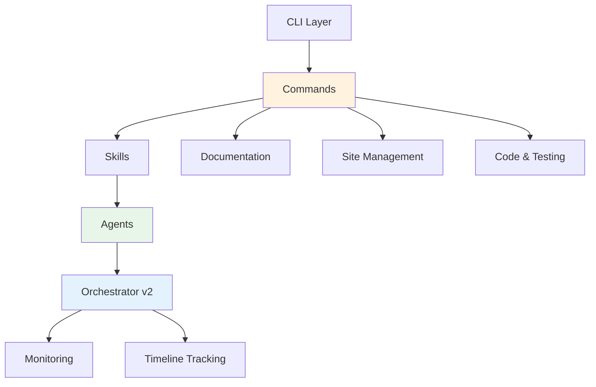

# Architecture Commands

⏱️ **5 minutes** • 🟡 Intermediate • ✓ System design and analysis

> **TL;DR** (30 seconds)
>
> - **What:** 4 commands for analyzing, planning, reviewing, and diagramming software architecture
> - **Why:** Understand your codebase structure, identify patterns, and plan improvements with AI assistance
> - **How:** Use `/craft:arch:analyze` for analysis, `/craft:arch:diagram` for visual diagrams
> - **Next:** Try `/craft:arch:analyze debug` to see your project's architecture patterns

Craft's architecture commands help you understand, document, and improve your codebase structure with AI-powered analysis and visualization.

---

## Commands Overview

| Command | Purpose | Time (default) |
|---------|---------|----------------|
| `/craft:arch:analyze` | Analyze architecture patterns | < 15s |
| `/craft:arch:diagram` | Generate architecture diagrams | < 30s |
| `/craft:arch:plan` | Plan architectural changes | < 60s |
| `/craft:arch:review` | Review architecture decisions | < 120s |

All commands support execution modes for different levels of detail.

---

## `/craft:arch:analyze` - Architecture Analysis

Analyze codebase architecture, patterns, dependencies, and structure.

### Quick Start

```bash
/craft:arch:analyze                 # Quick overview
/craft:arch:analyze debug           # Deep pattern analysis
/craft:arch:analyze optimize        # Performance architecture
/craft:arch:analyze release         # Full audit
```

### Modes

| Mode | Time | Focus |
|------|------|-------|
| **default** | < 15s | Quick overview, basic structure |
| **debug** | < 120s | Deep dive, all patterns, anti-patterns |
| **optimize** | < 180s | Performance hotspots, import analysis |
| **release** | < 300s | Full architectural audit with metrics |

### Analysis Areas

The command examines:

- **Structure:** Directory layout, module organization, separation of concerns
- **Dependencies:** Import graphs, coupling metrics, circular dependencies
- **Patterns:** MVC, microservices, layered architecture, design patterns
- **Data Flow:** How data moves through the system
- **Complexity:** Cyclomatic complexity, nesting depth, function sizes

### Example Output (Default Mode)

```
╭─ Architecture Overview ─────────────────────────────╮
│ Project: craft | Type: Claude Code Plugin          │
│ Structure: commands/ agents/ skills/ (74 commands) │
├─────────────────────────────────────────────────────┤
│ Commands: 9 categories (docs, site, code, etc.)    │
│ Agents: 8 (orchestrator-v2, docs-architect, etc.)  │
│ Skills: 21 (auto-triggered expertise)              │
├─────────────────────────────────────────────────────┤
│ Health: Excellent | Dependencies: Well-organized   │
╰─────────────────────────────────────────────────────╯
```

### Example Output (Debug Mode)

```
╭─ Architecture Analysis (Debug Mode) ────────────────╮
│ PATTERNS DETECTED                                   │
│ ✓ Strategy Pattern - command organization          │
│ ✓ Template Method - agent base classes             │
│ ✓ Factory Pattern - skill activation               │
│ ✓ Observer Pattern - orchestrator monitoring       │
│                                                     │
│ ANTI-PATTERNS                                       │
│ ⚠ None detected                                    │
│                                                     │
│ DEPENDENCIES                                        │
│ commands/ ──→ skills/ ──→ agents/                  │
│                └──→ orchestrator                    │
│                                                     │
│ QUALITY METRICS                                     │
│ Cyclomatic Complexity Avg: 4.2 (Good)              │
│ Max Function Size: 45 lines (Good)                 │
│ Circular Dependencies: 0 (Excellent)               │
╰─────────────────────────────────────────────────────╯
```

---

## `/craft:arch:diagram` - Generate Architecture Diagrams

Create visual architecture diagrams in Mermaid format.

### Quick Start

```bash
/craft:arch:diagram                    # Full system diagram
/craft:arch:diagram modules            # Module dependency graph
/craft:arch:diagram data-flow          # Data flow diagram
/craft:arch:diagram release            # Comprehensive diagrams
```

### Diagram Types

| Type | Description | Output |
|------|-------------|--------|
| **system** | High-level system overview | Component diagram |
| **modules** | Module dependency graph | Flowchart with imports |
| **data-flow** | How data moves through app | Sequence diagram |
| **classes** | Class relationships | Class diagram |
| **deployment** | Deployment architecture | Deployment diagram |

### Example Output

Generates mermaid diagrams like:



### Options

- `--type <diagram-type>` - Diagram type (system, modules, data-flow, etc.)
- `--output <file>` - Save to file (default: stdout)
- `--format <format>` - Output format (mermaid, png, svg)
- `--detail <level>` - Detail level (1=high-level, 3=detailed)

---

## `/craft:arch:plan` - Plan Architectural Changes

Plan and design architectural improvements with AI guidance.

### Quick Start

```bash
/craft:arch:plan "add caching layer"
/craft:arch:plan "migrate to microservices"
/craft:arch:plan "improve performance" debug
```

### What It Does

1. **Analyzes current architecture** using `/craft:arch:analyze`
2. **Generates improvement plan** with:
   - Recommended patterns
   - Implementation steps
   - Trade-offs and considerations
   - Migration path
3. **Creates diagrams** showing before/after architecture
4. **Estimates effort** and complexity

### Example Output

```
╭─ Architectural Plan: Add Caching Layer ─────────────╮
│                                                      │
│ CURRENT STATE                                        │
│ • Direct database access from API layer             │
│ • No caching mechanism                              │
│ • Response times: 200-500ms avg                     │
│                                                      │
│ PROPOSED ARCHITECTURE                                │
│ • Add Redis caching layer                           │
│ • Cache-aside pattern                               │
│ • TTL: 5 minutes for frequent queries               │
│                                                      │
│ IMPLEMENTATION PLAN                                  │
│ 1. Add Redis client to dependencies                 │
│ 2. Create cache abstraction layer                   │
│ 3. Update API endpoints with cache lookups          │
│ 4. Add cache invalidation on writes                 │
│ 5. Monitor cache hit rates                          │
│                                                      │
│ ESTIMATED IMPACT                                     │
│ • Response times: 200ms → 20ms (90% reduction)      │
│ • Database load: -70%                               │
│ • Effort: 2-3 days                                  │
│                                                      │
│ TRADE-OFFS                                           │
│ ✓ Pros: Faster, scalable, reduces DB load          │
│ ✗ Cons: Cache invalidation complexity, Redis dep   │
╰──────────────────────────────────────────────────────╯
```

---

## `/craft:arch:review` - Architecture Review

Get AI-powered review of architecture decisions and code structure.

### Quick Start

```bash
/craft:arch:review                     # Full codebase review
/craft:arch:review src/api/            # Review specific module
/craft:arch:review debug               # Deep review with suggestions
```

### Review Criteria

The review evaluates:

- **SOLID Principles:** Single responsibility, open-closed, etc.
- **Design Patterns:** Appropriate use of patterns
- **Separation of Concerns:** Clear boundaries between layers
- **Testability:** How easy it is to test
- **Maintainability:** Code organization and documentation
- **Scalability:** Can it handle growth?
- **Performance:** Potential bottlenecks

### Example Output

```
╭─ Architecture Review ────────────────────────────────╮
│ Overall Score: 92/100 (Excellent)                   │
├──────────────────────────────────────────────────────┤
│                                                      │
│ ✅ STRENGTHS                                         │
│ • Well-organized command structure                  │
│ • Clear separation: commands / skills / agents      │
│ • Excellent test coverage (83%)                     │
│ • Good use of design patterns                       │
│ • Comprehensive mode system                         │
│                                                      │
│ ⚠️  AREAS FOR IMPROVEMENT                            │
│ • Some commands have 200+ lines (consider split)    │
│ • Missing docstrings in 5 files                     │
│ • Could add more integration tests                  │
│                                                      │
│ 💡 RECOMMENDATIONS                                   │
│ 1. Extract common logic into base classes           │
│ 2. Add Architecture Decision Records (ADRs)         │
│ 3. Consider splitting large command files           │
│                                                      │
│ NEXT STEPS                                           │
│ → Run /craft:code:refactor to implement changes     │
│ → Use /craft:docs:api to improve documentation      │
╰──────────────────────────────────────────────────────╯
```

---

## Common Workflows

### Workflow 1: Understanding a New Codebase

```bash
# Step 1: Quick overview
/craft:arch:analyze

# Step 2: Visual diagram
/craft:arch:diagram system

# Step 3: Deep analysis
/craft:arch:analyze debug

# Step 4: Review quality
/craft:arch:review
```

### Workflow 2: Planning Major Refactor

```bash
# Step 1: Analyze current state
/craft:arch:analyze release

# Step 2: Create improvement plan
/craft:arch:plan "migrate to plugin architecture"

# Step 3: Generate before/after diagrams
/craft:arch:diagram modules

# Step 4: Review plan
/craft:arch:review debug
```

### Workflow 3: Performance Optimization

```bash
# Step 1: Find bottlenecks
/craft:arch:analyze optimize

# Step 2: Plan improvements
/craft:arch:plan "optimize performance"

# Step 3: Review changes
/craft:arch:review
```

---

## Integration with Other Commands

Architecture commands work well with:

| Command | Use Case |
|---------|----------|
| `/craft:code:refactor` | Implement architecture changes |
| `/craft:docs:api` | Document architecture decisions |
| `/craft:test:run` | Validate architecture changes |
| `/craft:check` | Pre-flight before major refactors |
| `/craft:do` | AI routes architecture tasks |

---

## Tips

!!! tip "Start Simple"
    Begin with `/craft:arch:analyze` default mode for a quick overview, then go deeper with debug/release modes.

!!! tip "Use Diagrams"
    Visual diagrams from `/craft:arch:diagram` are great for documentation and team discussions.

!!! tip "Review Before Planning"
    Run `/craft:arch:review` before `/craft:arch:plan` to understand current issues first.

!!! success "AI-Powered Insights"
    These commands use Claude's AI to provide context-aware suggestions specific to your codebase.

---

## Learn More

- [Code & Testing Commands](code.md) - Implementing changes
- [Documentation Commands](docs.md) - Documenting architecture
- [Visual Workflows](../workflows/index.md) - See architecture workflows in action
