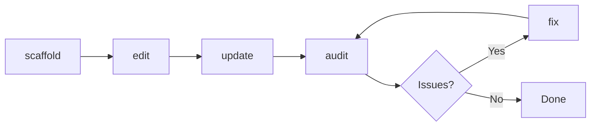
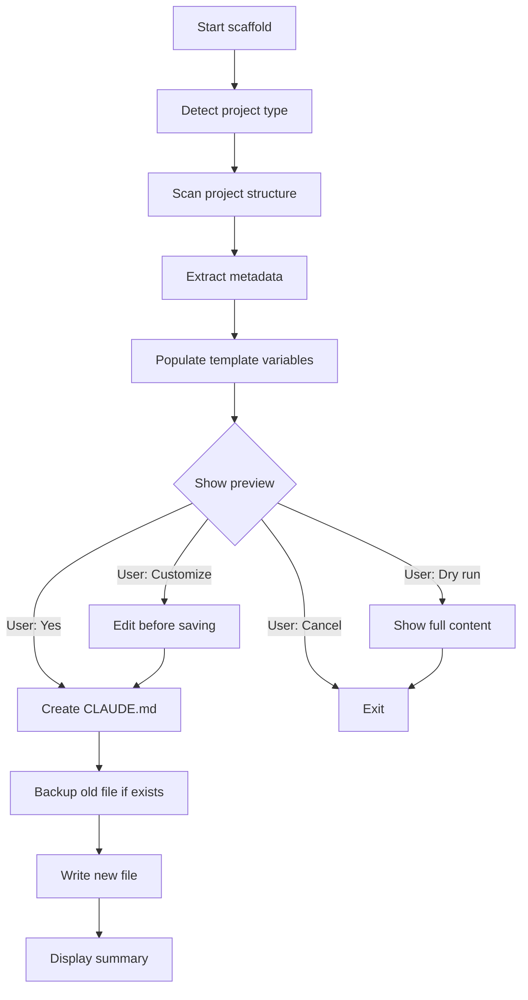
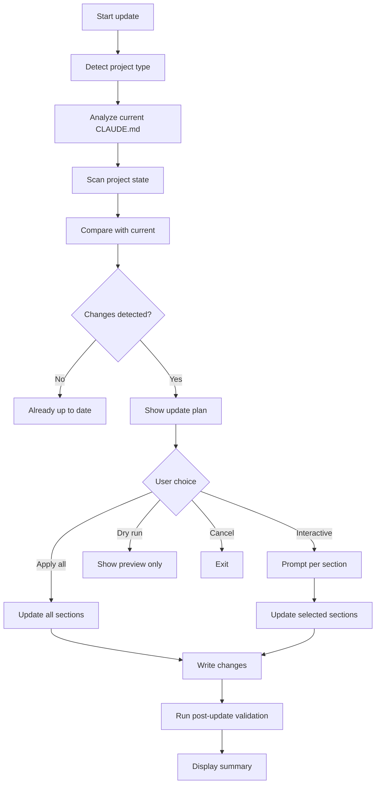
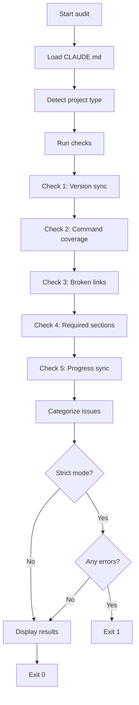
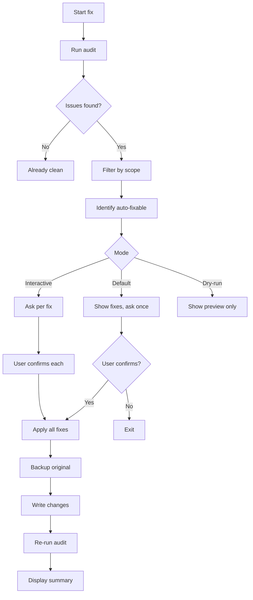
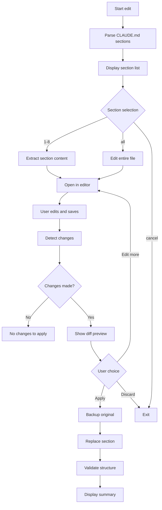

# CLAUDE.md Command Suite Reference

> **Complete reference** for the 5 claude-md commands that manage CLAUDE.md files.

**5 Commands** · **Show Steps First Pattern** · **Full Automation**

---

## Overview

The claude-md command suite provides complete lifecycle management for CLAUDE.md files:



### Command Categories

| Category | Commands | Purpose |
|----------|----------|---------|
| **Creation** | `scaffold` | Create from template |
| **Maintenance** | `update`, `edit` | Keep current |
| **Validation** | `audit`, `fix` | Ensure quality |

### Design Principles

All commands follow these patterns:

1. **Show Steps First** - Preview before executing
2. **Interactive by Default** - Ask for confirmation
3. **Dry-Run Support** - Test without applying
4. **Craft Integration** - Work with existing craft commands

---

## Command: scaffold

**Create CLAUDE.md from project-type template with auto-population.**

### Usage

```bash
# Auto-detect project type
/craft:docs:claude-md:scaffold

# Force specific template
/craft:docs:claude-md:scaffold plugin
/craft:docs:claude-md:scaffold teaching
/craft:docs:claude-md:scaffold r-package

# Overwrite existing
/craft:docs:claude-md:scaffold --force

# Preview without creating
/craft:docs:claude-md:scaffold --dry-run
```

### Workflow



### Project Type Detection

**Detection priority:**

1. Craft Plugin - `.claude-plugin/plugin.json` exists
2. Teaching Site - `_quarto.yml` + `course.yml` exist
3. R Package - `DESCRIPTION` + `NAMESPACE` exist

**Override detection:**

```bash
/craft:docs:claude-md:scaffold --type=plugin
```

### Templates

#### Plugin Template

**File:** `templates/claude-md/plugin-template.md`

**Auto-populated variables (18):**

| Variable | Source | Example |
|----------|--------|---------|
| `plugin_name` | plugin.json → name | "craft" |
| `version` | plugin.json → version | "2.9.0" |
| `tagline` | plugin.json → description | "Developer toolkit" |
| `command_count` | commands/ scan | 100 |
| `skill_count` | skills/ scan | 21 |
| `agent_count` | agents/ scan | 8 |
| `test_count` | tests/ scan | 847 |
| `command_table` | Generated from commands/ | Table of commands |
| `repo_url` | git remote | github.com/user/craft |
| `docs_url` | plugin.json → repository.docs | user.github.io/craft |

**Structure:**

- Quick Commands table
- Project Structure tree
- Git Workflow instructions
- Testing commands
- Key Files reference
- Troubleshooting tips
- Links section

#### Teaching Template

**File:** `templates/claude-md/teaching-template.md`

**Auto-populated variables (12):**

| Variable | Source | Example |
|----------|--------|---------|
| `course_name` | _quarto.yml → title | "Data Science 101" |
| `course_code` | course.yml → course_code | "DS-101" |
| `semester` | course.yml → semester | "Fall 2024" |
| `instructor` | course.yml → instructor | "Dr. Smith" |
| `week_count` | weeks/ directory count | 15 |
| `assignment_count` | assignments/ file count | 8 |
| `exam_count` | exams/ file count | 3 |

**Structure:**

- Course Information
- Weekly Structure
- Assignment Guidelines
- Quarto Workflow
- Publishing Instructions

#### R Package Template

**File:** `templates/claude-md/r-package-template.md`

**Auto-populated variables (15):**

| Variable | Source | Example |
|----------|--------|---------|
| `package_name` | DESCRIPTION → Package | "ggplot2" |
| `package_title` | DESCRIPTION → Title | "Create Graphics" |
| `version` | DESCRIPTION → Version | "3.4.0" |
| `r_version` | DESCRIPTION → Depends | "R (>= 3.5.0)" |
| `function_count` | R/ file count | 127 |
| `test_count` | tests/testthat file count | 345 |
| `vignette_count` | vignettes/ file count | 8 |
| `dependencies` | DESCRIPTION → Imports | "dplyr, tidyr" |

**Structure:**

- Package Information
- Development Workflow
- devtools commands
- roxygen2 patterns
- pkgdown configuration
- Testing with testthat

### Examples

**Example 1: Craft Plugin**

```bash
cd ~/projects/dev-tools/my-plugin

/craft:docs:claude-md:scaffold
```

**Output:**

```text
Project Type Detection

Detected indicators:
  .claude-plugin/plugin.json  (craft plugin)
  commands/ directory         (12 commands)
  skills/ directory           (3 skills)

Project type: craft-plugin
Template: plugin-template.md

Extracting variables...

From plugin.json:
  name: my-plugin
  version: 1.0.0
  description: My awesome plugin

From filesystem:
  commands: 12
  skills: 3
  agents: 1
  tests: 45

Auto-populated: 18/18 variables (100%)

Preview: CLAUDE.md (156 lines)

# CLAUDE.md - My Plugin

> My awesome plugin

**12 commands** · **3 skills** · **1 agent**

## Quick Commands

| Task | Shell | Craft |
|------|-------|-------|
| Run tests | `python3 -m pytest` | `/craft:test:run` |
...

  Proceed with file creation?
  > Yes - Create CLAUDE.md (Recommended)
    Customize - Edit before saving
    Dry run - Show full content
    Cancel - Exit

Choice: y

Created: CLAUDE.md (156 lines)

Summary:
  18 variables auto-populated
  0 TODOs (all fields filled)
  3 sections generated

Next steps:
  1. Review: cat CLAUDE.md
  2. Customize: /craft:docs:claude-md:edit
  3. Validate: /craft:docs:claude-md:audit
```

**Example 2: R Package**

```bash
cd ~/projects/r-packages/mypackage

/craft:docs:claude-md:scaffold
```

**Output:**

```text
Project Type Detection

Detected indicators:
  DESCRIPTION file            (R package)
  NAMESPACE file
  R/ directory                (23 functions)
  tests/testthat/            (67 tests)

Project type: r-package
Template: r-package-template.md

Extracting variables...

From DESCRIPTION:
  Package: mypackage
  Title: My R Package
  Version: 0.2.1
  Depends: R (>= 4.0.0)

From filesystem:
  functions: 23
  tests: 67
  vignettes: 2

Auto-populated: 15/15 variables (100%)

Preview: CLAUDE.md (134 lines)

# CLAUDE.md - mypackage

> My R Package

**Version:** 0.2.1 | **R:** >= 4.0.0 | **Functions:** 23

## Development Workflow

| Task | Command |
|------|---------|
| Load all | `devtools::load_all()` |
| Test | `devtools::test()` |
| Check | `devtools::check()` |
...

  Proceed with file creation?
  > Yes - Create CLAUDE.md (Recommended)
    Customize - Edit before saving
    Dry run - Show full content
    Cancel - Exit

Choice: y

Created: CLAUDE.md (134 lines)
```

### Options

| Flag | Default | Description |
|------|---------|-------------|
| `--type=<template>` | auto-detect | Force template type |
| `--force` / `-f` | false | Overwrite existing CLAUDE.md |
| `--dry-run` / `-n` | false | Preview without creating |

### See Also

- Tutorial: [New Project Setup](../../tutorials/claude-md-workflows.md#workflow-1-new-project-setup)
- Command: [edit](#command-edit) - Customize sections
- Command: [audit](#command-audit) - Validate result

---

## Command: update

**Sync CLAUDE.md with current project state, updating metrics and content.**

### Usage

```bash
# Full update (all sections)
/craft:docs:claude-md:update

# Specific section
/craft:docs:claude-md:update status
/craft:docs:claude-md:update commands
/craft:docs:claude-md:update architecture

# Update + optimize
/craft:docs:claude-md:update --optimize

# Preview changes
/craft:docs:claude-md:update --dry-run

# Interactive section selection
/craft:docs:claude-md:update --interactive
```

### Workflow



### What Gets Updated

**Core metrics (all project types):**

- Version number (from plugin.json/package.json/pyproject.toml/DESCRIPTION)
- Status and progress (from .STATUS file)

**Craft plugins:**

- Command count and new commands
- Skill count and new skills
- Agent count and new agents
- Test count
- Documentation completion percentage

**Teaching sites:**

- Week count
- Assignment count
- Exam count
- Course metadata (from course.yml)

**R packages:**

- Function count
- Test count
- Vignette count
- Dependencies (from DESCRIPTION)

### Update Plan Preview

```text
CLAUDE.md Update Plan

Project: craft (craft-plugin)
Mode: default

Changes Detected:

1. Version Mismatch
   Current: v2.8.1
   Actual:  v2.9.0
   Source:  .claude-plugin/plugin.json

2. New Commands (3)
   + /craft:docs:claude-md:audit
   + /craft:docs:claude-md:fix
   + /craft:docs:claude-md:scaffold

3. Test Count Update
   Current: 770 tests
   Actual:  847 tests (+77)

4. Documentation Status
   Current: 95% complete
   Actual:  98% complete (+3%)

Net Changes: +18 lines, -5 lines

  Proceed with these updates?
  > Yes - Apply all changes (Recommended)
    Interactive - Select sections
    Dry run - Preview without applying
    Cancel - Exit
```

### Interactive Mode

```bash
/craft:docs:claude-md:update --interactive
```

**Prompts per section:**

```text
Section 1/5: Project Status (version mismatch)
  Update v2.8.1 → v2.9.0?
  (y/n/skip): y

Section 2/5: Quick Commands (3 new commands)
  Add:
    - /craft:docs:claude-md:audit
    - /craft:docs:claude-md:fix
    - /craft:docs:claude-md:scaffold
  (y/n/skip): y

Section 3/5: Project Structure (no changes)
  (y/n/skip): skip

Section 4/5: Testing (test count changed)
  Update: 770 → 847 tests
  (y/n/skip): y

Section 5/5: Documentation (status changed)
  Update: 95% → 98%
  (y/n/skip): y

Applied 4/5 section updates
```

### Optimization Mode

```bash
/craft:docs:claude-md:update --optimize
```

**Applies condensation:**

```text
OPTIMIZATION APPLIED

Condensed sections:
  Quick Commands: Shortened verbose descriptions
  Project Structure: Grouped related directories
  Code examples: Removed obvious comments

Before: 287 lines
After: 231 lines (-56 lines, -19%)

Quality maintained:
  All essential info preserved
  All links still valid
  Structure unchanged
```

### Examples

**Example 1: After Adding Commands**

```bash
# Added 3 new commands
/craft:docs:claude-md:update
```

**Output:**

```text
CLAUDE.md Update Plan

Changes:
  1. New Commands (3)
     + /craft:new-feature
     + /craft:validate
     + /craft:analyze

  2. Command Count
     51 → 54 commands

Proceed? (y/n): y

Updated: CLAUDE.md
  Added 3 commands to Quick Commands table
  Updated command count

Post-Update Validation: PASSED
```

**Example 2: Version Bump**

```bash
# Bumped version in plugin.json
/craft:docs:claude-md:update status
```

**Output:**

```text
Updating section: status

Changes:
  Version: v1.0.0 → v1.2.0
  Progress: 60% → 85% (from .STATUS)

Applied changes to CLAUDE.md
```

### Options

| Flag | Default | Description |
|------|---------|-------------|
| `status\|commands\|architecture` | all | Specific section to update |
| `--optimize` / `-o` | false | Also condense verbose sections |
| `--dry-run` / `-n` | false | Preview without applying |
| `--interactive` / `-i` | false | Prompt for each section |
| `--validate` | true | Run audit after update |

### See Also

- Tutorial: [Maintenance Workflow](../../tutorials/claude-md-workflows.md#workflow-2-maintenance--updates)
- Command: [audit](#command-audit) - Validate after update
- Guide: [Interactive Commands](../../guide/interactive-commands.md)

---

## Command: audit

**Validate CLAUDE.md structure, content, and accuracy (read-only).**

### Usage

```bash
# Audit local CLAUDE.md
/craft:docs:claude-md:audit

# Strict mode (exit 1 on errors)
/craft:docs:claude-md:audit --strict

# Specific scope
/craft:docs:claude-md:audit errors
/craft:docs:claude-md:audit warnings
/craft:docs:claude-md:audit all
```

### Workflow



### Checks Performed

| Check | Severity | Description | Auto-Fixable |
|-------|----------|-------------|--------------|
| **Version sync** | Warning | CLAUDE.md version vs source file | Yes |
| **Command coverage** | Error | Missing or stale commands | Partial |
| **Broken links** | Error | Dead internal/external links | Yes |
| **Required sections** | Warning | Template sections missing | No |
| **Progress sync** | Warning | Progress vs .STATUS mismatch | Yes |

### Output Format

```text
AUDIT RESULTS

File: CLAUDE.md (242 lines)
Last modified: 2 weeks ago

─── Issues Found ─────────────────────────────

ERRORS (2):
  Line 45: Command `/craft:old-command` no longer exists
  Line 78: Broken link to docs/removed-guide.md

WARNINGS (3):
  Version mismatch: CLAUDE.md says v1.0.0, plugin.json says v1.2.0
  Progress drift: CLAUDE.md says 60%, .STATUS says 85%
  Missing commands: 3 new commands not documented
    - /craft:new-feature
    - /craft:validate
    - /craft:analyze

INFO (1):
  Optimization available: file length 242 lines (consider --optimize)

─────────────────────────────────────────────

Status: FAILED (2 errors, 3 warnings)

Next steps:
  1. Fix automatically: /craft:docs:claude-md:fix
  2. Update with new commands: /craft:docs:claude-md:update
  3. Re-audit: /craft:docs:claude-md:audit
```

### Severity Levels

**Errors (🔴):**

- Break validation, should be fixed before release
- Exit 1 in `--strict` mode
- Examples: Stale commands, broken links

**Warnings (⚠️):**

- Quality issues, recommended to fix
- Don't fail `--strict` mode
- Examples: Version mismatch, progress drift

**Info (📝):**

- Suggestions for improvement
- Don't affect validation status
- Examples: Optimization opportunities

### Strict Mode (CI Integration)

```bash
# In CI pipeline
/craft:docs:claude-md:audit --strict

# Exit codes:
#   0 - No errors (warnings OK)
#   1 - Has errors (fail build)
```

**GitHub Actions example:**

```yaml
- name: Validate CLAUDE.md
  run: |
    /craft:docs:claude-md:audit --strict
```

### Examples

**Example 1: Passing Audit**

```bash
/craft:docs:claude-md:audit
```

**Output:**

```text
AUDIT RESULTS

File: CLAUDE.md (242 lines)
Last modified: 5 minutes ago

Checks:
  Version sync
  Command coverage     (54/54 documented)
  Broken links         (0 found)
  Required sections    (8/8 present)
  Progress sync

Results:
  🔴 Errors:   0
  ⚠️ Warnings: 0
  📝 Info:     0

Status: PASSED
```

**Example 2: Issues Found**

```bash
/craft:docs:claude-md:audit
```

**Output:**

```text
AUDIT RESULTS

File: CLAUDE.md (287 lines)
Last modified: 3 weeks ago

ERRORS (1):
  Line 67: Command `/craft:deprecated` no longer exists

WARNINGS (2):
  Version: v1.0.0 vs v1.5.0 (plugin.json)
  Missing: 2 new commands not documented

INFO (1):
  File length: 287 lines (recommend --optimize)

Status: FAILED (1 error, 2 warnings)

Next steps:
  1. /craft:docs:claude-md:fix
  2. /craft:docs:claude-md:update
```

### Options

| Flag | Default | Description |
|------|---------|-------------|
| `errors\|warnings\|all` | all | Scope of checks |
| `--strict` | false | Exit 1 on errors (CI mode) |

### See Also

- Tutorial: [Maintenance Workflow](../../tutorials/claude-md-workflows.md#workflow-2-maintenance--updates)
- Command: [fix](#command-fix) - Auto-fix issues
- Guide: [Check Command Mastery](../../guide/check-command-mastery.md)

---

## Command: fix

**Auto-fix common CLAUDE.md issues found by audit.**

### Usage

```bash
# Fix errors only
/craft:docs:claude-md:fix

# Fix errors + warnings
/craft:docs:claude-md:fix warnings

# Fix everything auto-fixable
/craft:docs:claude-md:fix all

# Preview without applying
/craft:docs:claude-md:fix --dry-run

# Interactive confirmation
/craft:docs:claude-md:fix --interactive
```

### Workflow



### Auto-Fixable Issues

| Issue | Fix Action | Risk |
|-------|------------|------|
| Stale command | Remove from table | Low |
| Broken link | Remove reference | Low |
| Version mismatch | Update to source version | None |
| Progress drift | Sync from .STATUS | None |

### Manual-Only Issues

| Issue | Why Manual | Recommended Action |
|-------|------------|-------------------|
| Missing sections | Need content | Edit or scaffold |
| New commands | Need descriptions | Use `update` command |
| Template restructure | Structural change | Scaffold with `--force` |

### Fix Preview

```text
Auto-fixing issues...

Fix 1/5: Remove stale command reference
  Line 45: `/craft:old-command`
  Command no longer exists in commands/
  Action: Remove from Quick Commands table
  Status: READY

Fix 2/5: Remove broken link
  Line 78: docs/removed-guide.md
  File does not exist
  Action: Remove link reference
  Status: READY

Fix 3/5: Update version
  Current: v1.0.0
  Source:  v1.2.0 (from plugin.json)
  Action: Replace version number
  Status: READY

Fix 4/5: Sync progress
  Current: 60%
  Source:  85% (from .STATUS)
  Action: Update progress percentage
  Status: READY

Fix 5/5: Add new commands
  Missing: 3 commands
    - /craft:new-feature
    - /craft:validate
    - /craft:analyze
  Action: MANUAL (use /craft:docs:claude-md:update)
  Status: SKIPPED

Summary:
  4 auto-fixable
  1 requires manual action

  Apply these 4 fixes? (y/n):
```

### Interactive Mode

```bash
/craft:docs:claude-md:fix --interactive
```

**Prompts per fix:**

```text
Fix 1/4: Remove stale command
  Line 45: `/craft:old-command`
  Command no longer exists

  Apply this fix? (y/n/skip): y
  Status: APPLIED

Fix 2/4: Update version
  v1.0.0 → v1.2.0

  Apply this fix? (y/n/skip): y
  Status: APPLIED

Fix 3/4: Sync progress
  60% → 85%

  Apply this fix? (y/n/skip): skip
  Status: SKIPPED

Fix 4/4: Remove broken link
  Line 78: docs/removed-guide.md

  Apply this fix? (y/n/skip): y
  Status: APPLIED

Applied 3/4 fixes
Skipped 1 fix
```

### Examples

**Example 1: Default Mode**

```bash
/craft:docs:claude-md:fix
```

**Output:**

```text
Auto-fixing issues...

Fix 1/3: Remove stale command
  Line 45: /craft:old-command
  Status: FIXED

Fix 2/3: Update version
  v1.0.0 → v1.2.0
  Status: FIXED

Fix 3/3: Remove broken link
  Line 78: docs/removed.md
  Status: FIXED

Summary:
  3 fixed automatically
  0 require manual action
  0 skipped

Backup: .CLAUDE.md.backup

Post-Fix Validation:
  0 errors
  0 warnings

CLAUDE.md is now clean!

Next steps:
  1. Review: git diff CLAUDE.md
  2. Commit: git add CLAUDE.md && git commit -m "docs: fix CLAUDE.md issues"
```

**Example 2: Dry-Run Mode**

```bash
/craft:docs:claude-md:fix --dry-run
```

**Output:**

```text
DRY RUN: /craft:docs:claude-md:fix

Would apply 3 fixes:

1. Remove stale command (line 45)
   `/craft:old-command`

2. Update version
   v1.0.0 → v1.2.0

3. Remove broken link (line 78)
   docs/removed.md

Run without --dry-run to apply
```

### Backup and Restore

**Automatic backup:**

```bash
# Backup created before applying fixes
.CLAUDE.md.backup
```

**Manual restore:**

```bash
# If something went wrong
cp .CLAUDE.md.backup CLAUDE.md
```

### Options

| Flag | Default | Description |
|------|---------|-------------|
| `errors\|warnings\|all` | errors | Scope of fixes |
| `--dry-run` / `-n` | false | Preview without applying |
| `--interactive` / `-i` | false | Confirm each fix |

### See Also

- Tutorial: [Maintenance Workflow](../../tutorials/claude-md-workflows.md#workflow-2-maintenance--updates)
- Command: [audit](#command-audit) - Find issues
- Command: [update](#command-update) - Add new content

---

## Command: edit

**Edit specific sections of CLAUDE.md interactively.**

### Usage

```bash
# Interactive section selection
/craft:docs:claude-md:edit

# Edit specific section by name
/craft:docs:claude-md:edit "Quick Commands"
/craft:docs:claude-md:edit troubleshooting

# Replace entire section
/craft:docs:claude-md:edit "Testing" --replace

# Delete section
/craft:docs:claude-md:edit "Deprecated" --delete
```

### Workflow



### Section Detection

**Header levels:**

```markdown
# CLAUDE.md - Project Name    ← Title (ignored)

## Quick Commands               ← Section 1
...

## Project Structure            ← Section 2
...

## Git Workflow                 ← Section 3
...
```

**Section parsing:**

- Detects top-level headers (`##`)
- Subsections (`###`, `####`) included in parent
- Case-insensitive matching
- Fuzzy matching for selection

### Interactive Selection

```text
CLAUDE.md sections (8 total):

1. Quick Commands           (45 lines, 12 commands)
2. Project Structure        (38 lines, 5 directories)
3. Git Workflow             (52 lines, 3 subsections)
4. Development              (34 lines, 2 subsections)
5. Testing                  (28 lines, 1 subsection)
6. Troubleshooting          (41 lines, 5 items)
7. Integration              (29 lines, 2 subsections)
8. Links                    (15 lines, 4 links)

Which section to edit? (1-8, all, cancel): 6
```

### Edit Preview

**After editing in iA Writer:**

```text
Changes detected in section: Troubleshooting

Diff preview:

  ## Troubleshooting

  | Issue | Solution |
  |-------|----------|
  | Tests failing | Run /craft:test:debug |
  | Lint errors | Run /craft:code:lint debug |
+ | Slow tests | Use /craft:test:run optimize |
+ | Coverage gaps | Run /craft:code:coverage |
  ...

Change statistics:
  Lines added: 2
  Lines removed: 0
  Net change: +2 lines

  Apply these changes?
  > Yes - Apply to CLAUDE.md
    Edit more - Continue editing
    Discard - Abandon changes
    Cancel - Exit without applying
```

### Editor Selection

**Default editor:** iA Writer (via AppleScript)

**Alternative editors:**

```bash
# VS Code
/craft:docs:claude-md:edit -e code

# Sublime Text
/craft:docs:claude-md:edit -e sublime

# Cursor
/craft:docs:claude-md:edit -e cursor

# TextEdit (fallback)
/craft:docs:claude-md:edit -e textedit
```

### Operations

| Operation | Command | Description |
|-----------|---------|-------------|
| **Edit** | Default | Modify section content |
| **Replace** | `--replace` | Replace entire section |
| **Delete** | `--delete` | Remove section completely |

### Examples

**Example 1: Edit Troubleshooting**

```bash
/craft:docs:claude-md:edit
```

**Session:**

```text
Which section to edit? (1-8, all, cancel): 6

Selected: Section 6 - Troubleshooting (41 lines)

Opening in iA Writer...
[User edits section]
[User saves and returns]

Changes detected:
  +2 lines added
  -0 lines removed

Apply? (y/n): y

Applied changes to section: Troubleshooting
Updated: CLAUDE.md (257 → 259 lines)
Backup: .CLAUDE.md.backup
```

**Example 2: Replace Section**

```bash
/craft:docs:claude-md:edit "Testing" --replace
```

**Output:**

```text
Replacing section: Testing

Current content (28 lines) will be replaced.

Opening in editor...
[User writes new content]
[User saves]

Replaced section: Testing (28 → 35 lines)
```

**Example 3: Delete Section**

```bash
/craft:docs:claude-md:edit "Deprecated" --delete
```

**Output:**

```text
Delete section: Deprecated?

This will permanently remove:
  - Section header
  - All content (15 lines)
  - Cannot be undone (except via backup)

Confirm deletion? (y/n): y

Deleted section: Deprecated
Updated: CLAUDE.md (242 → 227 lines)
Backup: .CLAUDE.md.backup
```

### Backup and Restore

**Automatic backup before changes:**

```bash
.CLAUDE.md.backup
```

**Restore if needed:**

```bash
cp .CLAUDE.md.backup CLAUDE.md
```

### Options

| Flag | Default | Description |
|------|---------|-------------|
| `<section>` | interactive | Section name or number |
| `--replace` | false | Replace entire section |
| `--delete` | false | Remove section |
| `-e <editor>` | ia | Editor choice |

### See Also

- Tutorial: [Section Editing Workflow](../../tutorials/claude-md-workflows.md#workflow-3-section-editing)
- Command: [scaffold](#command-scaffold) - Create from template
- Reference: [Quick Reference](../../reference/REFCARD-CLAUDE-MD.md)

---

## Common Workflows

### New Project

```bash
/craft:docs:claude-md:scaffold
/craft:docs:claude-md:edit
/craft:docs:claude-md:audit
git add CLAUDE.md && git commit -m "docs: add CLAUDE.md"
```

**Time:** ~5 minutes

### Weekly Maintenance

```bash
/craft:docs:claude-md:audit
/craft:docs:claude-md:fix
/craft:docs:claude-md:update
git add CLAUDE.md && git commit -m "docs: update CLAUDE.md"
```

**Time:** ~3 minutes

### Pre-Release

```bash
/craft:docs:claude-md:update --optimize
/craft:docs:claude-md:audit --strict
/craft:docs:claude-md:fix all
git add CLAUDE.md && git commit -m "docs: prepare CLAUDE.md for release"
```

**Time:** ~2 minutes

### Quick Edit

```bash
/craft:docs:claude-md:edit
# Select section, edit, apply
git add CLAUDE.md && git commit -m "docs: update <section>"
```

**Time:** ~2 minutes

---

## Integration with Craft

### With /craft:check

```bash
# Pre-commit validation
/craft:check

# Includes CLAUDE.md audit automatically
```

### With /craft:git:worktree

```bash
# After creating worktree
git worktree add ~/.git-worktrees/project/feature-xyz -b feature/xyz dev
cd ~/.git-worktrees/project/feature-xyz

# Scaffold if missing
/craft:docs:claude-md:scaffold
```

### With /craft:docs:update

```bash
# Coordinate all documentation
/craft:docs:update          # Update docs
/craft:docs:claude-md:update # Update CLAUDE.md
```

---

## Troubleshooting

See the [Quick Reference](../../reference/REFCARD-CLAUDE-MD.md#troubleshooting) for common issues and solutions.

---

## See Also

- **Tutorial:** [CLAUDE.md Workflows](../../tutorials/claude-md-workflows.md)
- **Quick Reference:** [REFCARD-CLAUDE-MD](../../reference/REFCARD-CLAUDE-MD.md)
- **Guide:** [Interactive Commands](../../guide/interactive-commands.md)
- **Templates:** `templates/claude-md/`

---

**Version:** 1.0.0
**Last Updated:** 2026-01-29
**Craft Version:** v2.9.0+
