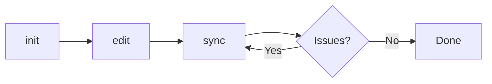
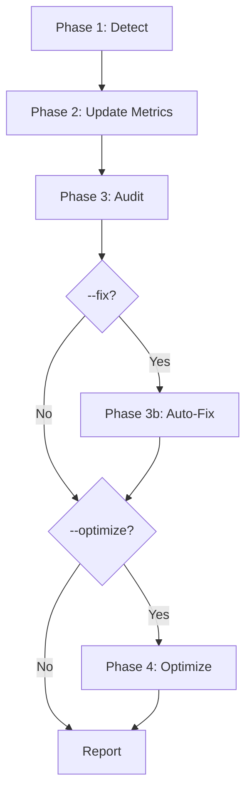

# CLAUDE.md Command Suite Reference

> **Complete reference** for the 3 claude-md commands that manage CLAUDE.md files.

**3 Commands** · **Budget Enforcement** · **Pointer Architecture** · **v2.12.0**

---

## Overview

The claude-md command suite provides complete lifecycle management for CLAUDE.md files with a lean 3-command design:



### Command Summary

| Command | Purpose | Key Flags |
|---------|---------|-----------|
| **init** | Create from lean template (< 150 lines) | `--type`, `--global`, `--force`, `--dry-run` |
| **sync** | 4-phase pipeline: detect → audit → fix → optimize | `--fix`, `--optimize`, `--global`, `--dry-run` |
| **edit** | Interactive editing with external editor | `--section`, `--editor`, `--global`, `--hints` |

### Design Principles

1. **Budget Enforcement** — Target < 150 lines for new CLAUDE.md files
2. **Pointer Architecture** — Reference detail files instead of duplicating content
3. **Show Steps First** — Preview before executing
4. **Global Support** — All commands support `--global` for `~/.claude/CLAUDE.md`

### v2.12.0 Migration (5→3 Commands)

| Old Command | New Command | Notes |
|-------------|-------------|-------|
| `scaffold` | **`init`** | Deprecation alias available until v2.13.0 |
| `update` | **`sync`** | Deprecation alias available until v2.13.0 |
| `audit` | **`sync`** | Now phase 2 of sync pipeline |
| `fix` | **`sync --fix`** | Now phase 3 of sync pipeline |
| `edit` | **`edit`** | Enhanced with `--global` flag |

---

## Command: init

**Create CLAUDE.md from lean project-type template with auto-population.**

Replaces the old `scaffold` command. Enforces < 150 line budget using lean templates and pointer architecture.

### Usage

```bash
# Auto-detect project type
/craft:docs:claude-md:init

# Specify project type
/craft:docs:claude-md:init --type plugin
/craft:docs:claude-md:init --type teaching
/craft:docs:claude-md:init --type r-package

# Target global CLAUDE.md
/craft:docs:claude-md:init --global

# Preview without creating
/craft:docs:claude-md:init --dry-run

# Overwrite existing
/craft:docs:claude-md:init --force
```

### Arguments

| Flag | Alias | Default | Description |
|------|-------|---------|-------------|
| `--type` | | auto-detect | Template type: `plugin`, `teaching`, `r-package` |
| `--force` | `-f` | false | Overwrite existing CLAUDE.md |
| `--dry-run` | `-n` | false | Preview template without creating |
| `--global` | `-g` | false | Target `~/.claude/CLAUDE.md` |

### What It Does

1. **Detect** project type from filesystem indicators
2. **Scan** project structure for metadata (version, counts, repo URL)
3. **Populate** lean template with discovered values (< 150 lines)
4. **Preview** generated CLAUDE.md for approval
5. **Create** file after confirmation
6. **Validate** with post-creation audit

### Available Templates

| Type | Detection | Auto-populated Fields | Target Lines |
|------|-----------|----------------------|--------------|
| **plugin** | `.claude-plugin/plugin.json` | name, version, counts, repo_url | ~120 |
| **teaching** | `_quarto.yml` + `course.yml` | course info, weeks, assignments | ~100 |
| **r-package** | `DESCRIPTION` + `Package:` | package info, version, functions | ~110 |

### Pointer Architecture

Templates end with a References section containing pointers to detail files:

```markdown
## References

-> Release history: [VERSION-HISTORY.md](docs/VERSION-HISTORY.md)
-> Architecture: [ARCHITECTURE.md](docs/ARCHITECTURE.md)
-> Contributing: [CONTRIBUTING.md](CONTRIBUTING.md)
-> Command reference: [COMMANDS.md](docs/COMMANDS.md)
```

This keeps CLAUDE.md lean while Claude can still access full details by following pointers.

---

## Command: sync

**Sync CLAUDE.md with project state — update metrics, audit, fix, optimize.**

Replaces the old `update`, `audit`, and `fix` commands with a unified 4-phase pipeline.

### Usage

```bash
# Full sync (detect + audit)
/craft:docs:claude-md:sync

# Sync with auto-fix
/craft:docs:claude-md:sync --fix

# Sync with budget optimization
/craft:docs:claude-md:sync --optimize

# Full pipeline (fix + optimize)
/craft:docs:claude-md:sync --fix --optimize

# Sync specific section only
/craft:docs:claude-md:sync --section commands

# Preview changes
/craft:docs:claude-md:sync --dry-run

# Target global CLAUDE.md
/craft:docs:claude-md:sync --global
```

### Arguments

| Flag | Alias | Default | Description |
|------|-------|---------|-------------|
| `--fix` | | false | Auto-fix issues found during audit |
| `--optimize` | `-o` | false | Enforce line budget, move bloat to detail files |
| `--dry-run` | `-n` | false | Preview changes without applying |
| `--global` | `-g` | false | Target `~/.claude/CLAUDE.md` |
| `--section` | `-s` | all | Specific section: `status`, `commands`, `testing`, `all` |

### 4-Phase Pipeline



**Phase 1: Detect** — Scan project for current state (version, command counts, test results)

**Phase 2: Update Metrics** — Update stale numbers in CLAUDE.md (command counts, test counts, version)

**Phase 3: Audit** — Validate completeness and accuracy (5 checks, 3 severity levels)

**Phase 4: Optimize** (optional) — Enforce line budget, classify sections (P0/P1/P2), move bloat to detail files

### Audit Checks

| Check | Severity | What It Validates |
|-------|----------|-------------------|
| Version accuracy | Error | Version matches plugin.json |
| Command counts | Error | Counts match filesystem |
| Section completeness | Warning | Required sections present |
| Link validity | Warning | Internal links resolve |
| Anti-pattern detection | Info | Identifies common CLAUDE.md issues |

### Anti-Patterns Detected

- Duplicated content (same info in multiple sections)
- Stale release notes (old versions still in "Recent" section)
- Missing pointer references (detail files not linked)
- Over-budget sections (single section > 30% of total lines)

---

## Command: edit

**Interactive section-by-section CLAUDE.md editing with external editor.**

### Usage

```bash
# Open in default editor (iA Writer)
/craft:docs:claude-md:edit

# Edit specific section
/craft:docs:claude-md:edit --section "Git Workflow"

# Use different editor
/craft:docs:claude-md:edit --editor code

# Edit global CLAUDE.md
/craft:docs:claude-md:edit --global

# Open without optimization hints
/craft:docs:claude-md:edit --no-hints

# Edit then optimize
/craft:docs:claude-md:edit --optimize
```

### Arguments

| Flag | Alias | Default | Description |
|------|-------|---------|-------------|
| `--section` | | auto-detect | Specific section to edit |
| `--editor` | `-e` | ia | Editor: `ia`, `code`, `sublime`, `cursor` |
| `--optimize` | `-o` | false | Suggest optimizations after editing |
| `--hints` | | true | Add TODO optimization comments |
| `--no-hints` | | false | Open without annotations |
| `--global` | `-g` | false | Target `~/.claude/CLAUDE.md` |

### Workflow

1. **Analyze** current CLAUDE.md structure
2. **Annotate** with optimization hints (unless `--no-hints`)
3. **Open** in external editor via AppleScript
4. **Wait** for user to save and close
5. **Validate** changes after editing
6. **Optimize** if `--optimize` flag set

---

## Utilities

The command suite is powered by these Python modules:

| Module | Lines | Purpose |
|--------|-------|---------|
| `utils/claude_md_common.py` | 43 | Shared path resolution (`resolve_claude_md_path`) |
| `utils/claude_md_sync.py` | 1,465 | 4-phase sync pipeline with anti-pattern detection |
| `utils/claude_md_optimizer.py` | 1,030 | Section classification (P0/P1/P2), bloat detection, budget enforcement |
| `utils/claude_md_auditor.py` | 320 | 5 validation checks, 3 severity levels |
| `utils/claude_md_fixer.py` | 280 | 4 auto-fix methods |
| `utils/claude_md_detector.py` | 450 | 6 project types, version extraction |
| `utils/claude_md_template_populator.py` | 380 | 18+ template variable substitution |

### Pre-commit Integration

```bash
# scripts/claude-md-budget-check.sh
# Pure shell — checks CLAUDE.md line count against budget
# Configured in .pre-commit-config.yaml
```

---

## Common Workflows

### New Project Setup

```bash
/craft:docs:claude-md:init          # Create from template
/craft:docs:claude-md:edit          # Customize sections
/craft:docs:claude-md:sync          # Validate
```

### After Feature Work

```bash
/craft:docs:claude-md:sync --fix    # Update counts, fix issues
```

### Before Release

```bash
/craft:docs:claude-md:sync --fix --optimize   # Full pipeline
```

### Global CLAUDE.md

```bash
/craft:docs:claude-md:init --global           # Create ~/.claude/CLAUDE.md
/craft:docs:claude-md:sync --global           # Sync global file
/craft:docs:claude-md:edit --global           # Edit global file
```

---

## Related

- [CLAUDE.md Workflows Tutorial](../../tutorials/claude-md-workflows.md)
- [CLAUDE.md Quick Reference](../../reference/REFCARD-CLAUDE-MD.md)
- [Feature Release Notes](../../FEATURE-RELEASE-CLAUDE-MD.md)
- [Spec: v3 Optimization](../../specs/SPEC-claude-md-v3-optimization-2026-02-04.md)

---

*Version: v2.12.0 | Last Updated: 2026-02-05*
