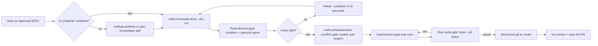

# /craft:orchestrate:drive

> **Drive an approved SPEC to completion via the native `/goal` turn-loop, with a real verify gate — stops at verified green and prints the PR command.**

---

## Synopsis

```bash
/craft:orchestrate:drive [spec] [flags]
```

**Quick examples:**

```bash
# Preview the derived /goal condition + preconditions (zero side effects)
/craft:orchestrate:drive --dry-run

# Drive the newest spec to green
/craft:orchestrate:drive

# Drive a specific spec, bounded to 40 turns
/craft:orchestrate:drive docs/specs/SPEC-feature.md --max-turns 40
```

---

## drive vs `--swarm`

> **drive vs `/craft:orchestrate --swarm`:** `drive` is a spec-anchored
> `/goal` turn-loop (iterate until a condition holds, real verify
> arbitrates). `--swarm` is free-form fan-out-and-converge across isolated
> worktrees. Use `drive` when you have an approved spec and want
> autonomous completion; use `--swarm` for parallel independent tasks.

---

## Flags

| Argument / Flag | Required | Default | Purpose |
|---|---|---|---|
| `spec` (positional) | no | newest `docs/specs/SPEC-*.md` or ORCHESTRATE-referenced | Spec to drive. |
| `--dry-run` / `-n` | no | false | Print condition + plan + precond report; no goal set. |
| `--yes` / `-y` | no | false | Skip the condition-confirm gate. |
| `--max-turns <N>` | no | 25 | Turn bound folded into the condition's stop clause. |
| `--no-auto` | no | false | Don't enable auto mode (user approves tools per turn). |
| `--agents <n>` | no | 1 | Max concurrent file-scoped subagents per turn. |
| `--condition "<text>"` | no | derived | Override the synthesized condition entirely. |

---

## User journey



---

## Stops at verified green

`drive` never opens a PR. When the `/goal` condition clears, the
`drive-engine` skill runs the project's **actual** verify command plus
`git status --short` — a green-looking transcript alone is not enough. On
verified green it stops and prints the exact `gh pr create --base dev`
command for you to run.

---

## See Also

- `/craft:orchestrate` — free-form multi-agent orchestration (`--swarm`)
- `drive-engine` skill — the dispatch + verify body this command calls
- `plan-orchestrator` skill — produce an ORCHESTRATE file from a spec
