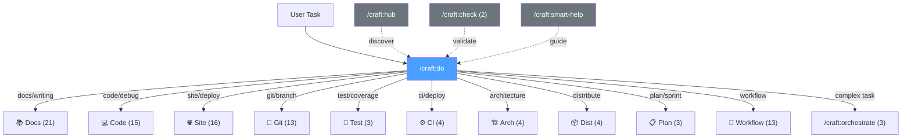

# Commands Overview

> **TL;DR** (30 seconds)
>
> - **What:** 107 commands organized into 17 categories covering the full development lifecycle
> - **Why:** One plugin handles your entire development workflow from docs to deployment
> - **How:** Use `/craft:hub` to discover all commands by category
> - **Next:** Start with `/craft:do` for AI-powered task routing or `/craft:check` for pre-flight validation

Craft provides **107 commands** for full-stack development workflows.

## Command Routing



## Command Categories

### 🎯 Smart and Discovery (8)

Universal commands with AI-powered routing:

- `/craft:do <task>` — Universal task router
- `/craft:check [--for]` — Pre-flight checks (+`gen-validator`)
- `/craft:orchestrate <task> [mode]` — Enhanced orchestrator (+`plan`, `resume`)
- `/craft:hub` — Command discovery
- `/craft:smart-help` — Context-aware help
- `/craft:discovery-usage` — Discovery engine guide

### 📚 Documentation Commands (21)

Smart documentation generation and validation:

- Super Commands: `update`, `sync`, `check`, `check-links`
- CLAUDE.md: `init`, `sync`, `edit`
- Specialized: `api`, `changelog`, `guide`, `demo`, `mermaid`, `website`

[Learn more →](docs.md)

### 🌐 Site Commands (16)

Full documentation site management:

- `/craft:site:create` — Wizard with 8 ADHD-friendly presets
- Navigation and audit: `nav`, `audit`, `consolidate`
- Management: `status`, `update`, `deploy`, `build`, `publish`

[Learn more →](site.md)

### 💻 Code Commands (15)

Development workflow tools:

- Linting: `/craft:code:lint [mode]`
- Debugging: `/craft:code:debug`
- Refactoring: `/craft:code:refactor`
- CI: `ci-local`, `ci-fix`
- Analysis: `deps-check`, `deps-audit`, `coverage`, `command-audit`
- Monitoring: `release-watch`, `desktop-watch`

[Learn more →](code.md)

### 🧪 Testing Commands (3)

- `/craft:test [category]` — Unified test runner
- `/craft:test:gen` — Auto-detect project and generate tests
- `/craft:test:template` — Manage Jinja2 test templates

[Learn more →](test.md)

### 🔀 Git Commands (13)

Version control and worktree management:

- Worktrees: `worktree`, `branch`, `clean`
- Sync: `sync`, `git-recap`, `status`
- Safety: `protect`, `unprotect`, `init`
- Docs: `safety-rails`, `undo-guide`, `learning-guide`, `refcard`

[Learn more →](git.md)

### ⚙️ CI Commands (4)

Continuous integration automation:

- `/craft:ci:detect` — Smart project type detection
- `/craft:ci:generate` — Generate GitHub Actions workflows
- `/craft:ci:validate` — Validate existing workflows
- `/craft:ci:status` — Cross-repo CI dashboard

### 📦 Other Categories

- **Architecture** (4): `analyze`, `diagram`, `plan`, `review`
- **Distribution** (4): Marketplace, Homebrew (formula+cask), PyPI, curl installers — [Learn more →](dist.md)
- **Planning** (3): `feature`, `sprint`, `roadmap`
- **Workflow** (13): Brainstorming, task management, focus mode, spec review
- **Utilities** (2): Teaching config parser, semester progress

## Mode System

Many commands support execution modes:

| Mode | Time | Description |
|------|------|-------------|
| `default` | <10s | Quick checks |
| `debug` | <120s | Verbose output with suggestions |
| `optimize` | <180s | Parallel execution, performance focused |
| `release` | <300s | Comprehensive audit |

**Example:**

```bash
/craft:code:lint optimize    # Fast parallel linting
/craft:test debug        # Verbose test output
```

## Quick Navigation

| I want to... | Use this command |
|--------------|------------------|
| Generate docs | `/craft:docs:update` |
| Create a site | `/craft:site:create` |
| Run tests | `/craft:test` |
| Manage git worktrees | `/craft:git:worktree` |
| Check before commit | `/craft:check` |
| Get help | `/craft:help` |
| Discover commands | `/craft:hub` |

---

## Interactive Command Behavior

Four key commands use the **"Show Steps First" pattern**:

### /craft:check - Pre-Flight Validation

```bash
/craft:check

# Shows plan → Asks to proceed → Runs checks
# --dry-run flag, --mode selection, --skip flags
```

[Learn more →](check.md) | [Cookbook recipe](../cookbook/common/check-code-quality-before-commit.md) | [Quick reference](../reference/REFCARD-CHECK.md)

### /craft:orchestrate - Multi-Agent Coordination

```bash
/craft:orchestrate "complex task"

# Shows plan → Asks for mode → Confirms → Runs with checkpoints
# Interactive mode selection (default/wave/phase)
```

[Learn more →](orchestrate.md) | [Tutorial](../tutorials/interactive-orchestration.md) | [Modes compared](../tutorials/orchestrator-modes-compared.md)

### /craft:git:worktree - Parallel Development

```bash
/craft:git:worktree feature/new-feature

# Creates worktree → Auto-generates ORCHESTRATE.md + SPEC.md
# Scope detection and auto-setup
```

[Learn more →](git/worktree.md) | [Tutorial](../tutorials/TUTORIAL-worktree-setup.md) | [Quick reference](../reference/REFCARD-GIT-WORKTREE.md)

### /craft:docs:update - Documentation Generator

```bash
/craft:docs:update

# Detects changes → Shows plan → Confirms → Generates → Validates
# --post-merge flag for automated 5-phase pipeline
```

[Learn more →](docs/update.md) | [Tutorial](../tutorials/TUTORIAL-post-merge-pipeline.md) | [Quick reference](../reference/REFCARD-DOCS-UPDATE.md)

---

## Quick Wins for New Users

**⚡ 30 seconds:**

```bash
/craft:hub        # Discover all commands by category
```

**⚡ 2 minutes:**

```bash
/craft:check      # Validate your project before commit
```

[Cookbook recipe →](../cookbook/common/check-code-quality-before-commit.md)

**⚡ 3-5 minutes:**

```bash
/craft:docs:update --post-merge    # Update docs after merging
```

[Cookbook recipe →](../cookbook/common/post-merge-documentation.md)

**⚡ 5-7 minutes:**

```bash
/craft:orchestrate "your task"     # Multi-step workflow with mode selection
```

[Cookbook recipe →](../cookbook/common/use-interactive-orchestration.md)

**⚡ 8-10 minutes:**

```bash
/craft:git:worktree feature/name   # Setup parallel development
```

[Cookbook recipe →](../cookbook/common/setup-parallel-worktrees.md)

---

## Learning Path

### Level 1: Essentials (First 30 minutes)

1. **Discover commands:** `/craft:hub`
2. **Get help:** `/craft:help`
3. **Quick check:** `/craft:check`
4. **Smart routing:** `/craft:do "simple task"`

### Level 2: Workflows (Next 2 hours)

1. **Documentation:** `/craft:docs:update`
2. **Testing:** `/craft:test`
3. **Git worktrees:** `/craft:git:worktree setup`
4. **Orchestration:** `/craft:orchestrate "multi-step task"`

### Level 3: Advanced (Ongoing)

1. **Site creation:** `/craft:site:create`
2. **CI/CD setup:** `/craft:ci:generate`
3. **Architecture analysis:** `/craft:arch:analyze`
4. **Distribution:** `/craft:dist:homebrew`

**Resources:**

- [Cookbook & Examples](../cookbook/index.md) - Task-focused recipes
- [Tutorials](../tutorials/index.md) - Step-by-step guides
- [Guides](../guide/getting-started.md) - Comprehensive documentation

---
