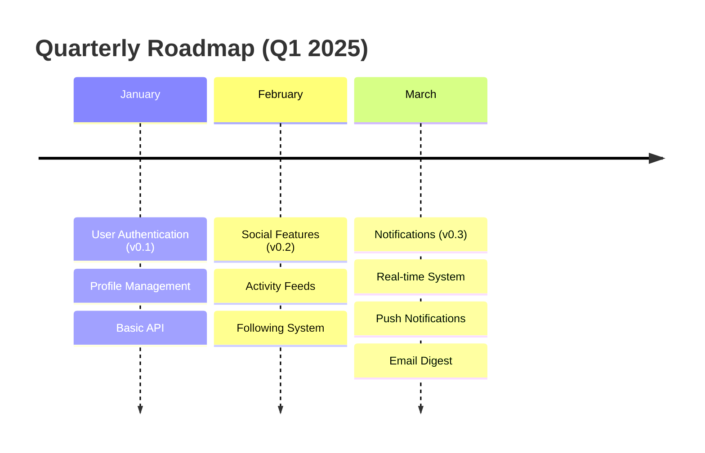

# Planning Commands

⏱️ **15 minutes** • 🟡 Intermediate • ✓ Project planning and roadmaps

> **TL;DR** (30 seconds)
> - **What:** 3 commands for feature planning, sprint organization, and roadmap creation
> - **Why:** Break down features into tasks, organize team capacity, and visualize long-term project direction
> - **How:** Use `/craft:plan:feature` to plan individual features, `/craft:plan:sprint` for iteration planning, `/craft:plan:roadmap` for timeline visualization
> - **Next:** Try `/craft:plan:feature "your feature description"` to see a structured plan

Craft's planning commands help you organize work, estimate effort, identify dependencies, and communicate project direction with AI-powered task breakdown and timeline visualization.

---

## Commands Overview

| Command | Purpose | Time (default) | Focus |
|---------|---------|----------------|-------|
| `/craft:plan:feature` | Feature breakdown and scoping | < 60s | User stories, tasks, acceptance criteria |
| `/craft:plan:sprint` | Sprint planning and capacity | < 90s | Prioritization, team capacity, goals |
| `/craft:plan:roadmap` | Long-term roadmap creation | < 120s | Milestones, phases, timeline visualization |

All commands support flexible scoping (MVP/full/enterprise) and multiple output formats.

---

## `/craft:plan:feature` - Feature Planning

Break down features into actionable tasks with estimates, dependencies, and acceptance criteria.

### Quick Start

```bash
/craft:plan:feature "user profile page with avatar upload"
/craft:plan:feature "search functionality" --scope mvp
/craft:plan:feature "payment integration" --include-tests
/craft:plan:feature "notifications" --format github --output PLAN.md
```

### Options

| Option | Values | Default | Purpose |
|--------|--------|---------|---------|
| `--scope` | mvp, full, enterprise | full | Planning scope |
| `--format` | markdown, jira, github | markdown | Output format |
| `--output` | filename | stdout | Save to file |
| `--include-tests` | boolean | false | Include test planning |

### What It Does

1. **Analyzes feature request** and project context
2. **Creates user stories** in "who, what, why" format
3. **Breaks into tasks** with time estimates (hours)
4. **Identifies dependencies** and blocking items
5. **Lists risks** and mitigation strategies
6. **Defines acceptance criteria** for completion

### Example: MVP Scope

```bash
/craft:plan:feature "user authentication" --scope mvp
```

**Output:**

```
Feature Plan: User Authentication (MVP)
━━━━━━━━━━━━━━━━━━━━━━━━━━━━━━━━━━━━━━━━━━━━━━━━━━━

User Stories:
  1. As a user, I want to create an account so I can access the app
  2. As a user, I want to log in with email/password
  3. As a user, I want to reset my password if I forget it

Tasks:

  Backend (10 hours)
  ├── [ ] Create user model and database (2h)
  ├── [ ] Implement password hashing (1h)
  ├── [ ] Build sign-up API endpoint (2h)
  ├── [ ] Build login API endpoint (2h)
  ├── [ ] Implement session management (2h)
  └── [ ] Add password reset flow (1h)

  Frontend (8 hours)
  ├── [ ] Create sign-up form component (2h)
  ├── [ ] Create login form component (2h)
  ├── [ ] Add form validation (1h)
  ├── [ ] Implement error handling (1h)
  ├── [ ] Add password reset modal (2h)

  Testing (3 hours)
  ├── [ ] Write backend tests (2h)
  └── [ ] Write frontend tests (1h)

Dependencies:
  - Database must be set up first
  - Auth system is blocking social features

Risks:
  ⚠ Password reset email delivery might fail
  ⚠ Rate limiting needed for login attempts
  ⚠ Password complexity requirements TBD

Acceptance Criteria:
  ✓ User can sign up with valid email/password
  ✓ User can log in with correct credentials
  ✓ Session persists across page refresh
  ✓ User can reset password via email link
  ✓ Invalid credentials show clear error
  ✓ All tests pass (> 90% coverage)

Total Estimate: 21 hours (2.5-3 days)
Effort Level: ⚡ Low-Medium
```

### Example: Full Scope

```bash
/craft:plan:feature "user profile management" --scope full --include-tests
```

**Output:**

```
Feature Plan: User Profile Management (Full)
━━━━━━━━━━━━━━━━━━━━━━━━━━━━━━━━━━━━━━━━━━━━

User Stories:
  1. As a user, I want to view my complete profile
  2. As a user, I want to upload and customize my avatar
  3. As a user, I want to edit my personal information
  4. As a user, I want to manage privacy settings
  5. As a user, I want to see my activity history
  6. As a user, I want to manage connected accounts

Tasks:

  Backend (18 hours)
  ├── [ ] Create profile schema with all fields (2h)
  ├── [ ] Build profile retrieval endpoint (1h)
  ├── [ ] Build profile update endpoint (2h)
  ├── [ ] Implement avatar upload handler (2h)
  ├── [ ] Add image optimization/resizing (2h)
  ├── [ ] Build activity logging system (3h)
  ├── [ ] Implement privacy settings (2h)
  ├── [ ] Add connected accounts management (2h)

  Frontend (14 hours)
  ├── [ ] Create profile view page (3h)
  ├── [ ] Build avatar upload widget (2h)
  ├── [ ] Create edit profile form (3h)
  ├── [ ] Implement privacy controls (2h)
  ├── [ ] Build activity history view (2h)
  ├── [ ] Create account connections UI (2h)

  Infrastructure (4 hours)
  ├── [ ] Set up S3 bucket for avatars (1h)
  ├── [ ] Configure CDN with cache invalidation (2h)
  ├── [ ] Set up image processing queue (1h)

  Testing (8 hours)
  ├── [ ] Write backend API tests (3h)
  ├── [ ] Write frontend component tests (2h)
  ├── [ ] Integration tests (2h)
  ├── [ ] Load test image uploads (1h)

Dependencies:
  - User authentication must be complete
  - S3 bucket setup needed before upload
  - Image processing library selection

Risks:
  ⚠ Image upload file size limits
  ⚠ CDN cache invalidation for avatar changes
  ⚠ Privacy settings complexity
  ⚠ Large file upload performance

Acceptance Criteria:
  ✓ User can view complete profile with all fields
  ✓ Avatar upload works (jpg, png, max 10MB)
  ✓ Images auto-resize and optimize
  ✓ Avatar displays in header, profile, comments
  ✓ User can edit all profile information
  ✓ Privacy settings control visibility
  ✓ Activity history shows recent actions
  ✓ Connected accounts can be added/removed
  ✓ All tests pass (> 85% coverage)
  ✓ Avatar CDN serves cached optimized images

Total Estimate: 44 hours (5-6 days)
Effort Level: 🔧 Medium
```

### Export Formats

**GitHub Format:**
```bash
/craft:plan:feature "search" --format github --output search-plan.md
# Creates GitHub issue template with task list
```

**Jira Format:**
```bash
/craft:plan:feature "search" --format jira
# Creates epic/story structure for Jira import
```

---

## `/craft:plan:sprint` - Sprint Planning

Plan team capacity, prioritize backlog items, and create sprint goals with dependencies mapped.

### Quick Start

```bash
/craft:plan:sprint                          # Plan next sprint
/craft:plan:sprint --duration 7             # 1-week sprint
/craft:plan:sprint --capacity 80            # Set team capacity
/craft:plan:sprint --goal "Complete auth"   # Set sprint goal
/craft:plan:sprint --from github            # Import from GitHub
```

### Options

| Option | Values | Default | Purpose |
|--------|--------|---------|---------|
| `--duration` | 7, 14, 21 | 14 | Sprint length in days |
| `--capacity` | hours | auto-detect | Available team hours |
| `--goal` | text | auto-detect | Sprint goal statement |
| `--from` | github, jira, file | auto | Import work items |
| `--output` | filename | stdout | Save sprint plan |

### What It Does

1. **Gathers pending work** from issues, PRs, and backlog
2. **Estimates capacity** based on team availability
3. **Prioritizes items** by value and dependencies
4. **Assigns to sprint** respecting capacity
5. **Creates sprint goal** summarizing focus
6. **Maps dependencies** and risks

### Example Output

```bash
/craft:plan:sprint --duration 14 --capacity 80 --goal "User authentication and profile"
```

**Output:**

```
Sprint Plan: Sprint 25 (Jan 6-19)
━━━━━━━━━━━━━━━━━━━━━━━━━━━━━━━━━━━━━━━━

Sprint Goal:
  Complete user authentication, profile management, and core API endpoints
  for public beta launch (v0.1.0)

Team Capacity: 80 hours available
Sprint Duration: 14 days (2 weeks)

COMMITTED ITEMS (64 hours = 80% capacity)

High Priority [40 hours]
├── #142 User authentication (email/password)     16h ⚡ Core blocker
├── #143 User profile management                  14h ⚡ Core blocker
└── #144 Basic API documentation                  10h 📚 Essential

Medium Priority [24 hours]
├── #145 Email notifications                       8h ⏰ Nice-to-have
├── #146 Activity logging                          8h 📊 Analytics
└── #147 Search functionality                      8h 🔍 Planned v0.2

STRETCH GOALS (16 hours = 20% capacity)
├── #148 Two-factor authentication setup           8h 🔐 Security
└── #149 API rate limiting                         8h ⚡ Performance

Sprint Metrics:
  Total Story Points: 34
  Committed Points: 28 (82%)
  Stretch Points: 6 (18%)
  Velocity: ~28 points/sprint (trend)

Dependencies & Blockers:
  🔴 #142 (Auth) blocks #143, #145, #146
  🟡 #144 (Docs) needs #142 + #143 complete
  ℹ️  #149 (Rate limits) external API review needed

Risks:
  ⚠ OAuth provider integration may take longer than estimated
  ⚠ Email service reliability in staging
  ⚠ Team member time off (Wed 1/10)

Team Assignments (Placeholder):
  Frontend:  #143, #145, #147
  Backend:   #142, #144, #146, #149
  DevOps:    #144 (infra tasks)

Daily Standup:
  Time: 10:00 AM
  Duration: 15 minutes
  Format: What completed? What's blocking? Help needed?

Sprint Board:
  To Do:      8 items
  In Progress: 0 items
  Testing:    0 items
  Done:       0 items

Next Sprint (Sprint 26):
  Estimated: #148, #149, and v0.2 features
```

### 1-Week Sprint Example

```bash
/craft:plan:sprint --duration 7 --capacity 40
```

**Output:**
```
Sprint Plan: Sprint 26 (Dec 9-15)
━━━━━━━━━━━━━━━━━━━━━━━━━━━━

Sprint Goal: Bugfix and performance optimization sprint

Team Capacity: 40 hours (1 person)

Committed Items:
  #201 Fix login page layout         4h
  #202 Optimize database queries     6h
  #203 Add error logging             4h
  #204 Update dependencies           4h
  #205 Code review cleanup           4h
  #206 Performance profiling         4h

(40 hours total - 100% capacity)

Metrics: 6 items, high focus, low risk
```

---

## `/craft:plan:roadmap` - Roadmap Creation

Generate project roadmaps with milestones, phases, timelines, and feature grouping.

### Quick Start

```bash
/craft:plan:roadmap                         # 6-month roadmap
/craft:plan:roadmap --horizon 3             # Quarterly (3-month)
/craft:plan:roadmap --format mermaid        # Generate diagram
/craft:plan:roadmap --output ROADMAP.md     # Save to file
/craft:plan:roadmap --update                # Update existing
```

### Options

| Option | Values | Default | Purpose |
|--------|--------|---------|---------|
| `--horizon` | 1-12 | 6 | Planning horizon (months) |
| `--format` | markdown, mermaid, html | markdown | Output format |
| `--output` | filename | stdout | Save roadmap to file |
| `--update` | boolean | false | Update existing ROADMAP.md |
| `--include-risks` | boolean | true | Include risk analysis |

### What It Does

1. **Analyzes project state** and planned features
2. **Organizes into phases** with realistic timelines
3. **Creates milestones** for major releases
4. **Groups features** by theme
5. **Maps dependencies** across phases
6. **Estimates timelines** based on effort

### Example: 6-Month Roadmap

```bash
/craft:plan:roadmap --horizon 6 --output ROADMAP.md
```

**Output:**

```
Project Roadmap: 6-Month Plan (Jan-Jun 2025)
━━━━━━━━━━━━━━━━━━━━━━━━━━━━━━━━━━━━━━━━━

PHASE 1: Foundation (January 2025)
├── Milestone: v0.1 - Core Platform Launch
│   └── Target: Jan 31
│
│   User Authentication        ████████░░ 80% (2 weeks left)
│   ├── Email/password signup
│   ├── Session management
│   └── Password reset flow
│
│   Profile Management         ██████░░░░ 60% (3 weeks left)
│   ├── User profiles
│   ├── Avatar upload
│   └── Edit information
│
│   Basic API                  ██████████ 100% ✓ Complete
│   ├── REST endpoints
│   ├── Rate limiting
│   └── Documentation

Timeline: ▓▓▓░░░░░░░░░░░░░ 20% complete
Status: On track for Jan 31 launch

---

PHASE 2: Core Features (Feb-Mar 2025)
├── Milestone: v0.2 - Social Features (Target: Feb 28)
│   Social Connections         ░░░░░░░░░░ 0%
│   ├── Follow/unfollow users
│   ├── Friend requests
│   └── Friend management
│
│   Activity Stream            ░░░░░░░░░░ 0%
│   ├── User activity feed
│   ├── Post comments
│   └── Like/reaction system
│
├── Milestone: v0.3 - Notifications (Target: Mar 31)
│   Real-time Notifications    ░░░░░░░░░░ 0%
│   ├── Web socket setup
│   ├── Push notifications
│   └── Notification center

Timeline: ▓░░░░░░░░░░░░░░░░░ 5% (planning phase)
Status: Detailed planning in Sprint 26

---

PHASE 3: Monetization (Apr 2025)
├── Milestone: v0.4 - Premium Features (Target: Apr 30)
│   Payment Integration        ░░░░░░░░░░ 0%
│   ├── Stripe setup
│   ├── Subscription billing
│   └── Premium features unlock
│
│   Advertising System         ░░░░░░░░░░ 0%
│   ├── Ad placement API
│   ├── Revenue tracking
│   └── Admin dashboard

Timeline: ░░░░░░░░░░░░░░░░░░ 0% (future planning)
Status: In roadmap, not scheduled yet

---

PHASE 4: Scale (May-Jun 2025)
├── Milestone: v1.0 - Enterprise Ready (Target: Jun 30)
│   Team/Organization         ░░░░░░░░░░ 0%
│   ├── Team management
│   ├── Role-based access
│   └── Organization settings
│
│   Advanced Analytics         ░░░░░░░░░░ 0%
│   ├── User metrics
│   ├── Performance analytics
│   └── Custom reports
│
│   Security & Compliance      ░░░░░░░░░░ 0%
│   ├── Two-factor auth
│   ├── Audit logs
│   └── Data export/delete

Timeline: ░░░░░░░░░░░░░░░░░░ 0% (future planning)
Status: Enterprise roadmap, TBD

---

Key Dependencies:
  • v0.1 must complete before v0.2
  • Payment requires legal review (2-3 weeks)
  • Enterprise security audit needed before v1.0

Critical Risks:
  ⚠ Q1 holidays may delay v0.1 by 1-2 weeks
  ⚠ Third-party OAuth reliability TBD
  ⚠ Payment provider choice not finalized
  ⚠ Enterprise customer feedback missing

Timeline Visualization:

       Jan      Feb      Mar      Apr      May      Jun
       |        |        |        |        |        |
  ├────┼────────┼────────┼────────┼────────┼────────┤
  [v0.1]
       [   v0.2    ]
                    [v0.3]
                         [  v0.4  ]
                              [ v1.0 (enterprise) ]

Next Actions:
  1. Finalize Phase 1 delivery (2 weeks)
  2. Start Phase 2 planning (Jan 24)
  3. Begin OAuth provider evaluation
  4. Schedule payment provider research
```

### Quarterly Roadmap

```bash
/craft:plan:roadmap --horizon 3 --format mermaid
```

**Output (Mermaid):**



### HTML Format with Styling

```bash
/craft:plan:roadmap --horizon 6 --format html --output roadmap.html
```

Creates interactive HTML roadmap with:
- Collapsible sections
- Progress bars
- Dependency visualization
- Hover-over details
- Print-friendly styling

---

## Common Workflows

### Workflow 1: Plan and Deliver a Feature

```bash
# Step 1: Plan the feature
/craft:plan:feature "search functionality" --scope mvp --include-tests

# Step 2: Create feature branch
/craft:git:branch feature/search

# Step 3: Assign to sprint
/craft:plan:sprint --goal "Add search to v0.2"

# Step 4: Work through tasks
# (implement, test, review)

# Step 5: Verify against acceptance criteria
/craft:test:run

# Step 6: Merge and celebrate
git merge feature/search
```

### Workflow 2: Plan Full Sprint Cycle

```bash
# Monday: Plan sprint
/craft:plan:sprint --duration 7 --capacity 40 --output SPRINT-PLAN.md

# Daily: Quick check
/craft:plan:sprint # View current sprint status

# Friday: Review
git log --oneline | head -20
/craft:test:run --summary

# Next Monday: Retro and replan
/craft:plan:sprint --duration 7  # Next sprint
```

### Workflow 3: Create Quarterly Roadmap

```bash
# Create initial roadmap
/craft:plan:roadmap --horizon 3 --output Q1-ROADMAP.md

# Generate visual
/craft:plan:roadmap --horizon 3 --format mermaid --output Q1-ROADMAP.md

# Share with stakeholders
# (commit and push)

# Update as priorities change
/craft:plan:roadmap --update
```

### Workflow 4: Enterprise Scoping (MVP → Full → Enterprise)

```bash
# Step 1: MVP scope - minimum viable
/craft:plan:feature "payment integration" --scope mvp

# Step 2: Full scope - production ready
/craft:plan:feature "payment integration" --scope full

# Step 3: Enterprise scope - advanced features
/craft:plan:feature "payment integration" --scope enterprise

# Step 4: Choose appropriate scope based on timeline
/craft:plan:sprint --goal "Deliver payment (full scope)"
```

---

## Integration with Other Commands

Planning commands work best with:

| Command | Use Case |
|---------|----------|
| `/craft:do` | AI routes planning tasks with task suggestions |
| `/craft:arch:plan` | Architecture needed before feature planning |
| `/craft:code:refactor` | Implement planned features |
| `/craft:test:run` | Validate task completion |
| `/craft:docs:sync` | Keep documentation aligned with roadmap |
| `/craft:git:branch` | Create feature branches from plans |
| `/craft:check` | Verify sprint goals before delivery |

---

## Tips

!!! tip "Start with MVP"
    Begin with `--scope mvp` to understand minimum viable scope, then expand to full/enterprise as needed.

!!! tip "Break It Down"
    Feature plans are most useful when tasks are < 4 hours each. Break down larger tasks further.

!!! tip "Link Dependencies"
    Identify blocking items early with `--include-tests` to account for testing time in estimates.

!!! tip "Regular Roadmap Updates"
    Update your roadmap monthly with `--update` as priorities change and dependencies shift.

!!! tip "Use Format Export"
    Export plans as GitHub issues (`--format github`) to integrate with your workflow.

!!! success "Capacity Planning"
    Always plan sprints at 80% capacity, leaving 20% for unexpected issues and interruptions.

!!! success "Track Metrics"
    Review velocity trends across sprints to improve estimation accuracy over time.

---

## Learn More

- [Architecture Commands](arch.md) - Plan architecture before features
- [Code & Testing Commands](code.md) - Implement planned tasks
- [Distribution Commands](dist.md) - Release planned milestones
- [Git Commands](git.md) - Manage feature branches
- [Visual Workflows](../workflows/index.md) - See planning workflows in action
