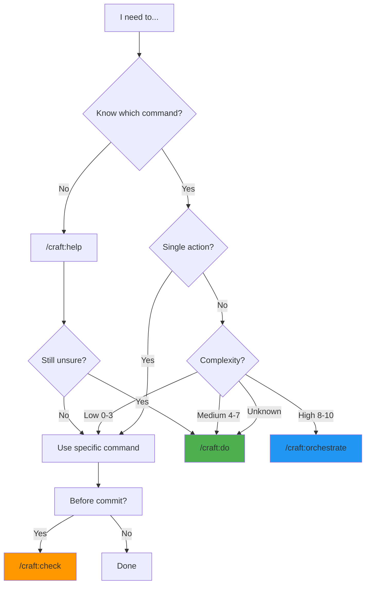

# Smart Commands

Universal AI-powered commands for intelligent task routing. These commands use complexity scoring (0-10 scale) to automatically route tasks to the most appropriate handler.

## /craft:do

**Purpose:** Universal command that routes tasks to the best workflow automatically using AI-powered complexity analysis.

**Usage:**

```bash
/craft:do "add user authentication"
/craft:do "optimize database queries"
/craft:do "create API documentation"
```

**How it works:**

The AI analyzes your request and:

1. **Scores complexity** (0-10 scale using 7 factors)
2. **Routes intelligently:**
   - **Simple (0-3):** Direct command execution
   - **Medium (4-7):** Single specialized agent
   - **Complex (8-10):** Multi-agent orchestration
3. **Executes** the workflow
4. **Reports** results with next steps

### Complexity Scoring

Tasks are scored on 7 factors (each 0-2 points):

| Factor | Weight | Examples |
|--------|--------|----------|
| **Scope** | 0-2 | Single file (0) → Multiple services (2) |
| **Dependencies** | 0-2 | None (0) → Cross-project (2) |
| **Risk** | 0-2 | Low (0) → Breaking changes (2) |
| **Coordination** | 0-2 | Solo (0) → Multiple teams (2) |
| **Uncertainty** | 0-2 | Clear (0) → Research needed (2) |
| **Technical Depth** | 0-2 | Simple (0) → Novel algorithms (2) |
| **Time Estimate** | 0-2 | <1 hour (0) → Multiple days (2) |

**Total Score:** 0-14 (normalized to 0-10)

### Real-World Examples

**Example 1: Simple Task (Score: 2)**

```bash
/craft:do "lint markdown files"

# Analysis:
# - Scope: Single file type (0)
# - Dependencies: None (0)
# - Risk: None (0)
# - Coordination: Solo (0)
# - Uncertainty: Clear (0)
# - Technical: Simple (1)
# - Time: <5 min (1)
# Total: 2/14 = 1.4 → Score: 2

# Routing: Direct command
# Executes: /craft:docs:lint
```

**Example 2: Medium Task (Score: 6)**

```bash
/craft:do "add JWT authentication with refresh tokens"

# Analysis:
# - Scope: Multiple files (backend + middleware) (1)
# - Dependencies: New JWT library (1)
# - Risk: Security implications (1)
# - Coordination: Solo but needs review (1)
# - Uncertainty: Standard pattern (0)
# - Technical: Moderate (crypto, tokens) (1)
# - Time: 2-4 hours (1)
# Total: 6/14 = 4.3 → Score: 6

# Routing: Single agent
# Delegates to: backend-architect agent
```

**Example 3: Complex Task (Score: 9)**

```bash
/craft:do "prepare v2.0 release with tests, docs, changelog, and PR"

# Analysis:
# - Scope: Multiple systems (code, tests, docs, CI) (2)
# - Dependencies: All subsystems (2)
# - Risk: Production deployment (2)
# - Coordination: Multiple reviewers (1)
# - Uncertainty: Regression testing (1)
# - Technical: Integration complexity (1)
# - Time: Multiple hours (2)
# Total: 11/14 = 7.9 → Score: 9

# Routing: Multi-agent orchestration
# Delegates to: orchestrator-v2 with release mode
```

### When to Use /craft:do vs Direct Commands

**Use /craft:do when:**

- ✅ You're unsure which command to use
- ✅ Task spans multiple categories
- ✅ You want automatic complexity assessment
- ✅ Task might need orchestration

**Use direct commands when:**

- ✅ You know exactly what to run
- ✅ Single, well-defined action
- ✅ Maximum speed (no routing overhead)

**Example Decision Tree:**

```bash
# ❌ Don't use /craft:do for simple, known actions:
/craft:do "run tests"              # Overkill
/craft:test                        # Better

# ✅ Use /craft:do for multi-step or unclear tasks:
/craft:do "prepare code review"    # Good - complex workflow
/craft:do "fix CI failures"        # Good - diagnostic needed
```

## /craft:orchestrate

**Purpose:** Enhanced orchestrator v2 with interactive mode selection, wave checkpoints, and subagent monitoring.

**Features:**

- Interactive mode selection (default/wave/phase)
- Plan preview before execution
- Wave checkpoints for review
- Confirmation prompts at each stage

**Usage:**

```bash
# Interactive (prompts for mode)
/craft:orchestrate "implement auth"

# Explicit mode
/craft:orchestrate "implement auth" --mode=wave

# Control commands
/craft:orchestrate status          # Agent dashboard
/craft:orchestrate timeline        # Execution timeline
/craft:orchestrate continue        # Resume session
```

### Mode Selection (v2.9.0)

When you run `/craft:orchestrate` without specifying a mode, you'll see:

```
╭─ Task Analysis ──────────────────────────────╮
│ Task: implement authentication with JWT      │
│ Complexity: 8/10 (high)                       │
│ Estimated agents: 3                           │
│ Estimated time: 2-4 hours                     │
╰───────────────────────────────────────────────╯

Select orchestration mode:

1. default - Sequential execution (one step at a time)
   Best for: Simple multi-step tasks
   Time: Moderate

2. wave - Parallel waves with checkpoints
   Best for: Independent parallel tasks
   Time: Faster

3. phase - Sequential phases with validation
   Best for: Complex dependent tasks
   Time: Comprehensive

Which mode? (1/2/3)
```

### Mode Comparison

| Mode | Execution | Parallelization | Checkpoints | Best For |
|------|-----------|-----------------|-------------|----------|
| **default** | Sequential | None | After each step | Simple tasks, 2-4 steps |
| **wave** | Parallel waves | High | After each wave | Independent subtasks |
| **phase** | Sequential phases | Medium | After each phase | Complex dependencies |

### Example Workflows

**Example 1: Default Mode (Simple Multi-Step)**

```bash
/craft:orchestrate "update docs and commit"

# Mode: default (auto-selected for simple task)
# Steps:
# 1. Run /craft:docs:update
# 2. Stage changes
# 3. Create commit
# 4. Done

# Time: 2-3 minutes
```

**Example 2: Wave Mode (Parallel Work)**

```bash
/craft:orchestrate "update all tutorials for v2.9.0"

# Mode: wave (selected interactively)
# Wave 1 (parallel):
#   - Update tutorial 1 (docs-architect)
#   - Update tutorial 2 (docs-architect)
#   - Update tutorial 3 (docs-architect)
#   - Update tutorial 4 (docs-architect)
# Checkpoint: Review all 4 updates
# Wave 2 (sequential):
#   - Rebuild docs site
#   - Validate links
# Done

# Time: 5-7 minutes (vs 15-20 sequential)
```

**Example 3: Phase Mode (Complex Dependencies)**

```bash
/craft:orchestrate "add OAuth2 authentication"

# Mode: phase (selected for complexity)
# Phase 1: Design
#   - Security review
#   - API design
#   Checkpoint: Review design docs
#
# Phase 2: Implementation
#   - Backend code
#   - Database migrations
#   Checkpoint: Code review
#
# Phase 3: Testing
#   - Unit tests
#   - Integration tests
#   Checkpoint: All tests pass
#
# Phase 4: Documentation
#   - API docs
#   - Tutorial
#   Done

# Time: 2-4 hours
```

### Wave Checkpoints (v2.9.0)

After each wave completes, you'll see:

```
╭─ Wave 1 Checkpoint ──────────────────────────╮
│ All 4 agents completed successfully          │
│                                               │
│ Results:                                      │
│ • tutorial-1.md updated (342 lines changed)   │
│ • tutorial-2.md updated (187 lines changed)   │
│ • tutorial-3.md updated (256 lines changed)   │
│ • tutorial-4.md updated (198 lines changed)   │
│                                               │
│ Continue to wave 2? (y/n/adjust)              │
╰───────────────────────────────────────────────╯
```

**Options:**

- **y** - Continue to next wave
- **n** - Stop here (useful if you want to review changes)
- **adjust** - Modify plan for remaining waves

## /craft:check

**Purpose:** Pre-flight checks before commits, PRs, or releases with interactive step preview.

**Features:**

- "Show Steps First" pattern - see the plan before running
- `--dry-run` flag - preview without executing
- `--mode` selection (default vs thorough)
- `--skip` flags - skip specific checks
- ✨ Interactive confirmation

**Usage:**

```bash
# Most common (shows plan, asks to proceed)
/craft:check

# Preview mode (show plan without running)
/craft:check --dry-run

# Mode selection
/craft:check --mode=default     # Quick (<10s)
/craft:check --mode=thorough    # Comprehensive (<5min)

# Skip specific checks
/craft:check --skip=tests       # Skip test execution
/craft:check --skip=lint,docs   # Skip multiple checks
```

### "Show Steps First" Pattern (v2.9.0)

When you run `/craft:check`, you'll see the plan before execution:

```
╭─ Pre-Flight Validation Plan ─────────────────╮
│ Mode: default                                 │
│ Estimated time: 5-10 seconds                  │
├───────────────────────────────────────────────┤
│                                               │
│ Steps to run:                                 │
│                                               │
│ 1. Code Quality (2s)                          │
│    • markdownlint (24 rules)                  │
│    • python linting (ruff)                    │
│                                               │
│ 2. Quick Tests (3s)                           │
│    • Unit tests (fast subset, ~200 tests)     │
│                                               │
│ 3. Basic Validation (2s)                      │
│    • Config files                             │
│    • Required files                           │
│                                               │
│ Skipping (not in default mode):               │
│   ⊘ Full test suite                           │
│   ⊘ Coverage analysis                         │
│   ⊘ Link validation                           │
│                                               │
├───────────────────────────────────────────────┤
│ Proceed with these checks? (y/n/switch-mode)  │
╰───────────────────────────────────────────────╯
```

### Common Scenarios

**Scenario 1: Before Committing**

```bash
# Quick validation (default mode)
/craft:check

# What runs:
# ✓ Lint markdown (2s)
# ✓ Run quick tests (3s)
# ✓ Check config files (1s)
# Total: ~6 seconds

# If all pass:
git add .
git commit -m "feat: add new feature"
git push
```

**Scenario 2: Before Creating PR**

```bash
# Comprehensive validation (thorough mode)
/craft:check --mode=thorough

# What runs:
# ✓ All linters with strict rules (15s)
# ✓ Full test suite (45s)
# ✓ Coverage threshold check (10s)
# ✓ Link validation (30s)
# ✓ Dependency audit (20s)
# ✓ Build verification (40s)
# Total: ~2.5 minutes

# If all pass:
gh pr create --base dev
```

**Scenario 3: Before Release**

```bash
# Same as PR, but with release checklist
/craft:check --mode=thorough

# Additional manual checks:
# - Changelog updated?
# - Version bumped?
# - Migration guide needed?
# - Breaking changes documented?
```

### Mode Comparison

| Mode | Time | Checks | Use Case |
|------|------|--------|----------|
| **default** | <10s | Lint, quick tests, basic validation | Before commit |
| **thorough** | <300s | Full suite, coverage, links, deps | Before PR, before release |

**Checks by Mode:**

| Check | Default | Thorough |
|-------|---------|----------|
| Code linting | ✓ Basic | ✓ Strict |
| Unit tests | ✓ Fast subset | ✓ Full suite |
| Integration tests | ✗ | ✓ |
| Coverage analysis | ✗ | ✓ 85%+ |
| Link validation | ✗ | ✓ |
| Dependency audit | ✗ | ✓ |
| Build verification | ✗ | ✓ |

### Skip Flags

```bash
# Skip tests (useful for docs-only changes)
/craft:check --skip=tests

# Skip lint and docs (focus on tests)
/craft:check --skip=lint,docs

# Available skip options:
# --skip=lint        Skip code/markdown linting
# --skip=tests       Skip test execution
# --skip=docs        Skip documentation validation
# --skip=build       Skip build verification
# --skip=deps        Skip dependency audit
```

## /craft:help

**Purpose:** Context-aware help and suggestions for your project.

**Usage:**

```bash
/craft:help                     # General suggestions
/craft:help testing             # Deep dive into testing
/craft:help documentation       # Docs-specific help
/craft:help check               # Command-specific help
```

**Features:**

- Analyzes your project structure
- Suggests relevant commands
- Provides context-specific guidance
- Links to documentation
- Shows examples for your project type

**Example Output:**

```bash
/craft:help

# Context detected: Python project with pytest

Suggested Commands:
  /craft:test                  # Run your pytest suite
  /craft:code:lint             # Check with ruff + black
  /craft:check                 # Pre-commit validation

Common Workflows:
  1. Before commit:
     /craft:check

  2. Add new feature:
     /craft:do "add user authentication"

  3. Prepare PR:
     /craft:check --mode=thorough

Learn More:
  - Cookbook: /docs/cookbook/
  - Tutorials: /docs/tutorials/
  - Commands: /craft:hub
```

---

## Smart Command Comparison

| Command | Purpose | When to Use | Complexity Handled |
|---------|---------|-------------|-------------------|
| `/craft:do` | Universal router | Unsure which command to use | All (0-10) |
| `/craft:orchestrate` | Multi-agent coordination | Complex multi-step tasks | High (8-10) |
| `/craft:check` | Validation | Before commit/PR/release | N/A (validation) |
| `/craft:help` | Guidance | Need suggestions | N/A (informational) |

### Decision Flow



### Best Practices

**DO:**

- ✅ Use `/craft:do` for multi-faceted tasks
- ✅ Use `/craft:check` before every commit
- ✅ Use `/craft:orchestrate` for complex workflows
- ✅ Use `/craft:help` when learning the system

**DON'T:**

- ❌ Use `/craft:do` for simple, known commands
- ❌ Skip `/craft:check` before committing
- ❌ Use `/craft:orchestrate` for single-step tasks
- ❌ Guess - use `/craft:help` instead

---

## Related Documentation

**Guides:**

- [Interactive Commands Guide](../guide/interactive-commands.md) - "Show Steps First" pattern
- [Check Command Mastery](../guide/check-command-mastery.md) - Complete check guide
- [Complexity Scoring Algorithm](../guide/complexity-scoring-algorithm.md) - How routing works

**Tutorials:**

- [Interactive Orchestration](../tutorials/interactive-orchestration.md) - Mode selection guide
- [Smart Routing Tutorial](../tutorials/smart-routing-tutorial.md) - Using /craft:do effectively

**Reference:**

- [Interactive Commands Reference](../reference/REFCARD-INTERACTIVE-COMMANDS.md) - Quick reference
- [Check Command Reference](../reference/REFCARD-CHECK.md) - Comprehensive check docs

**Cookbook:**

- [Check Code Quality Before Commit](../cookbook/common/check-code-quality-before-commit.md) - 2-min recipe
- [Use Interactive Orchestration](../cookbook/common/use-interactive-orchestration.md) - 5-7 min recipe

---

**Last Updated:** 2026-01-29 (v2.9.0)
**Features:** Smart routing, interactive modes, wave checkpoints, "Show Steps First" pattern
