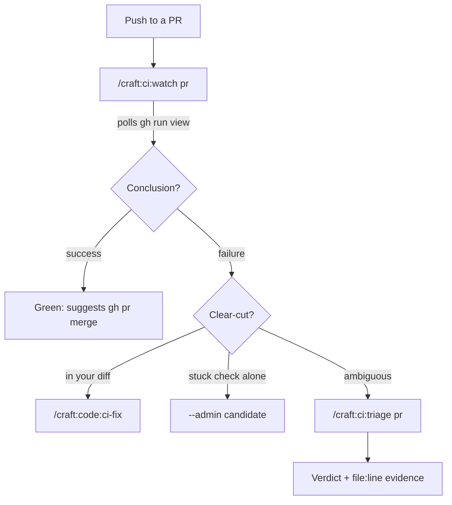

# CI Triage & Watch

⏱️ **5 minutes** • 🟢 Beginner • ✓ Complete guide

> **TL;DR** (30 seconds)
>
> - **What:** Two CI commands shipped in v2.37.0 — `/craft:ci:watch` (poll a run, route the next action) and `/craft:ci:triage` (classify a red check, recommend a fix).
> - **Why:** Turns the manual "is this failure mine or pre-existing?" reasoning from every release into one command, with `file:line` evidence.
> - **How:** `watch` a PR to completion → it suggests *merge* (green) or hands off to `triage` (red) → triage gives a verdict + recommendation.
> - **Next:** [CI status dashboard](../commands/ci/status.md) · [code:ci-fix](../commands.md#craftcodeci-fix)

Two complementary commands. **`watch` is the poller; `triage` is the analyst.**

## The CI loop, end to end



## `/craft:ci:watch` — poll, then route

Give it a PR number, a commit SHA, or a run-id (defaults to the current branch's
latest run). It polls `gh run view --json status` every 15s until the run
completes — **not** `gh pr checks`, which exits 8 while checks are in progress.

```bash
/craft:ci:watch 156          # watch PR #156 to completion
/craft:ci:watch --bg         # print a copy-paste background-poll snippet, exit now
/craft:ci:watch --json       # {run_id, workflow, conclusion, next_action}
```

On completion it routes the **next action**:

- **Green** → suggests the merge (feature→dev), or `/craft:ci:status --post-release` for a main-bound run.
- **Red** → does lightweight inline triage for the two clear-cut cases (failure in your diff → `code:ci-fix`; a single stuck `Validate Plugin Structure` while everything else passes → `--admin` candidate), and forwards anything ambiguous to `ci:triage`.

`--bg` is the answer to "I don't want to babysit this run" — it emits a
self-contained snippet with the run-id already substituted, so you can paste it
into any terminal and get the conclusion when it lands.

## `/craft:ci:triage` — classify a red check

When the cause isn't obvious, triage fetches the failed log, diffs the error
sites against your PR's changed files, and renders a verdict:

```bash
/craft:ci:triage             # triage the current branch's open PR
/craft:ci:triage 156         # a specific PR
/craft:ci:triage --json      # structured per-check verdicts + summary
```

| Verdict | Meaning | Recommendation |
|---------|---------|----------------|
| **DIFF-CAUSED** | every error site is in your diff | Fix it, re-push |
| **PRE-EXISTING** | error sites are outside your diff | `--admin` may be justified — confirm first |
| **INFRA-FLAKE** | rate-limit / runner / timeout, no file sites | Re-run: `gh run rerun <id> --failed` |
| **PARTIAL** | some diff-owned, some not | Fix the diff-owned ones, re-evaluate |

The verdict always prints the matched `file:line` evidence — it's an auditable
recommendation, never a bare assertion. The classifier strips ANSI codes,
recognises an empty log as an infra issue, and treats `.github/workflows/*.yml`
(rarely in a feature diff) as pre-existing.

## Why two commands?

`watch` runs *before* you know the outcome — it waits and makes the easy calls.
`triage` runs *after* a red result when you need the deep, evidence-backed
classification. Watch forwards the hard cases to triage so you never guess at
`--admin`.

## See Also

- [`/craft:ci:status`](../commands/ci/status.md) — cross-repo CI dashboard + `--post-release` verification
- [Recipe: Triage a red PR](../cookbook/recipes/triage-a-red-pr.md)
- `--admin` merge criteria — only when the failure is unrelated to the diff
