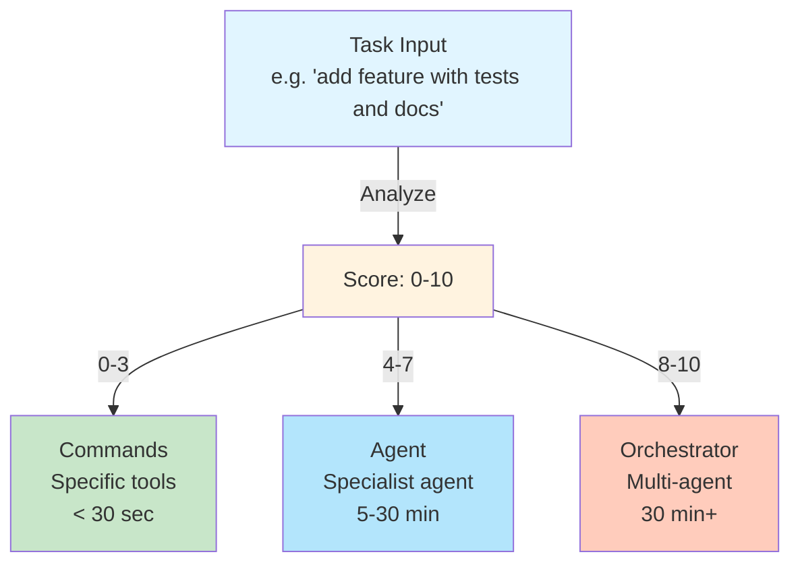
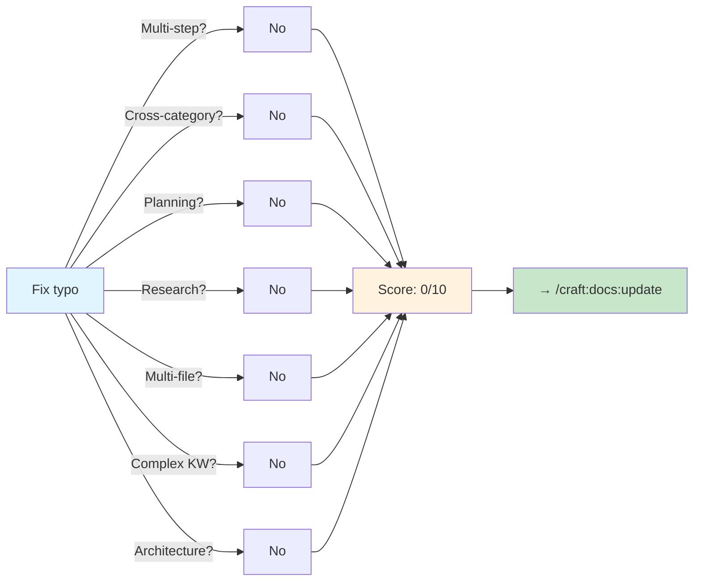
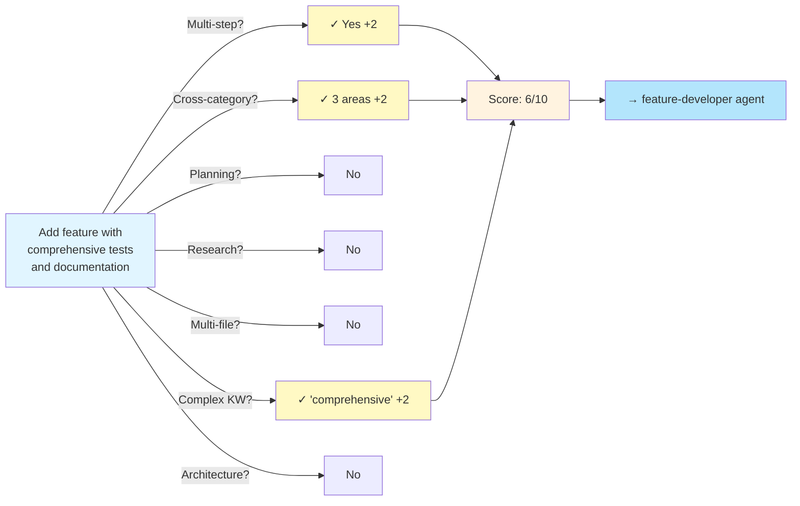
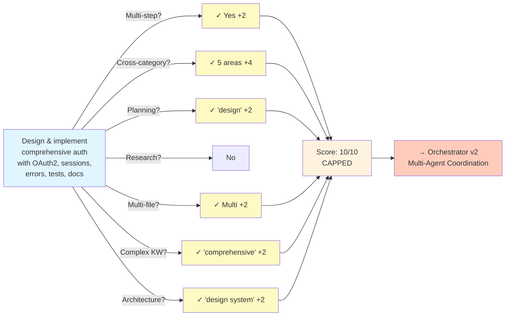
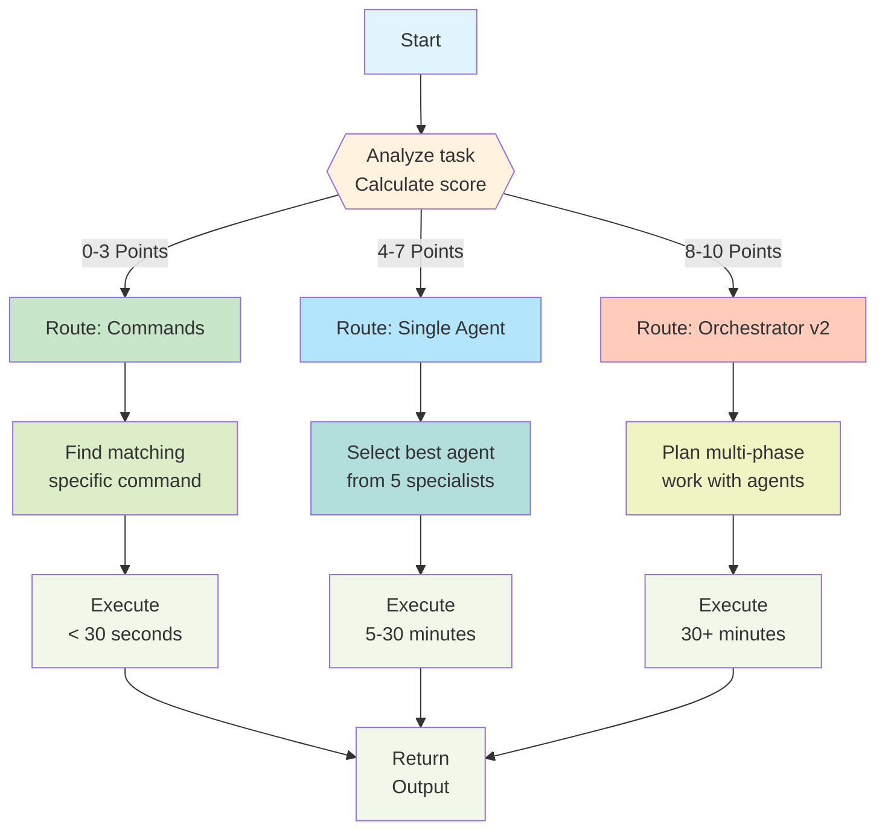
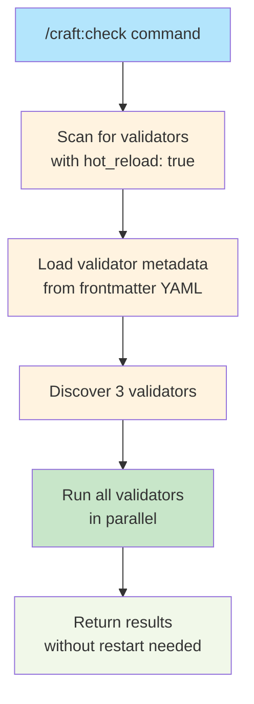
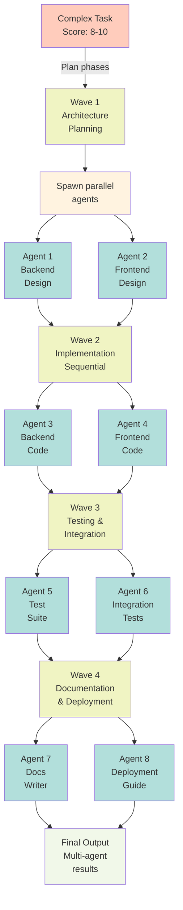
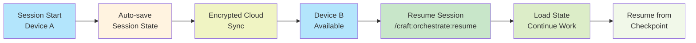

# Claude Code 2.1.0 Integration Guide

> **Intelligent Task Routing & Multi-Agent Orchestration**: Leverage Claude Code 2.1.0 capabilities for smart task handling

**Available Since:** v1.23.0 (Claude Code 2.1.0 Integration)
**Commands:** /craft:do, /craft:check, /craft:orchestrate
**Features:** Complexity scoring, hot-reload validators, agent delegation, session teleportation

---

## Overview

Craft integrates Claude Code 2.1.0 advanced features to provide intelligent task routing and multi-agent orchestration:

1. **Complexity Scoring** - Automatic task classification (0-10 scale)
2. **Smart Routing** - Command vs Agent vs Orchestrator routing
3. **Hot-Reload Validators** - Dynamic validation skills without restart
4. **Agent Delegation** - Specialized agents for different task types
5. **Forked Context** - Isolated execution to keep chat clean
6. **Session Teleportation** - Resume work across devices

---

## Quick Start

### 1. Use Smart Routing

```bash
# Simple task → Routes to commands
/craft:do "lint code"

# Moderate task → Routes to agent
/craft:do "add feature with tests and documentation"

# Complex task → Routes to orchestrator
/craft:do "design comprehensive authentication system with OAuth2, sessions, error handling, tests, and docs"
```

### 2. Pre-Flight Validation

```bash
# Auto-discover validators and validate
/craft:check
```

### 3. Orchestrate Multi-Step Work

```bash
# Multi-agent coordination
/craft:orchestrate "implement teaching workflow feature"
```

---

## Complexity Scoring Algorithm

The heart of smart routing is the 7-factor complexity scoring system.

### Algorithm at a Glance



### The 7 Factors (each +2 points, max 10)

| Factor | Detects | Examples |
|--------|---------|----------|
| **1. Multi-Step** | 2+ operations | "add AND test", "build THEN deploy" |
| **2. Cross-Category** | 2+ work areas | code + testing, code + docs |
| **3. Planning** | Design/architecture | "design system", "optimize performance" |
| **4. Research** | Investigation needed | "investigate issue", "analyze patterns" |
| **5. Multi-File** | Large scope | 5+ files or "system-wide", "entire" |
| **6. Complex Keywords** | Recognized complexity | "comprehensive", "redesign", "microservice" |
| **7. Architecture** | System-wide changes | "redesign architecture", "migrate to microservices" |

### Scoring Examples

#### Example 1: Simple Task (0 points)

```
Task: "Fix typo in README"
Score: 0/10 → Commands
Time: < 30 sec
```

**Analysis:**


#### Example 2: Moderate Task (6 points)

```
Task: "Add feature with comprehensive tests and documentation"
Score: 6/10 → Agent
Time: 5-30 min
```

**Analysis:**


#### Example 3: Complex Task (10 points, capped)

```
Task: "Design and implement comprehensive authentication system with OAuth2,
       PKCE, session management, error handling, extensive tests, and full docs"
Score: 10/10 → Orchestrator
Time: 30 min - several hours
```

**Analysis:**


---

## Routing Decision Flow

### Full Decision Tree



---

## Agent Delegation System

When a task scores 4-7 points, /craft:do delegates to a specialist agent.

### Available Agents

| Agent | Specialization | Best For | Model |
|-------|---|---|---|
| **feature-developer** | Feature implementation | "add new feature with tests" | Sonnet |
| **bug-detective** | Bug investigation & fixing | "investigate and fix slow queries" | Sonnet |
| **docs-architect** | Documentation & guides | "write comprehensive migration guide" | Sonnet |
| **api-documenter** | API specification & SDKs | "document REST API with OpenAPI" | Sonnet |
| **tutorial-engineer** | Step-by-step tutorials | "create setup tutorial" | Sonnet |

### Agent Selection Logic

```mermaid
graph TD
    A["Task Routed to Agent<br/>Score 4-7"] --> B{{"Analyze keywords<br/>and task type"}}

    B -->|"add", "feature", "implement"| C["→ feature-developer"]
    B -->|"fix", "bug", "issue", "investigate"| D["→ bug-detective"]
    B -->|"doc", "guide", "tutorial", "architecture"| E["→ docs-architect"]
    B -->|"API", "OpenAPI", "SDK", "client"| F["→ api-documenter"]
    B -->|"tutorial", "step-by-step", "onboarding"| G["→ tutorial-engineer"]
    B -->|No match| H["→ feature-developer<br/>default"]

    C --> I["Agent executes<br/>in forked context<br/>Clean chat history"]
    D --> I
    E --> I
    F --> I
    G --> I
    H --> I

    I --> J["Summary returned<br/>to user"]

    style A fill:#b3e5fc
    style B fill:#fff3e0
    style C fill:#dcedc8
    style D fill:#dcedc8
    style E fill:#dcedc8
    style F fill:#dcedc8
    style G fill:#dcedc8
    style H fill:#dcedc8
    style I fill:#c8e6c9
    style J fill:#f1f8e9
```

---

## Hot-Reload Validators

`/craft:check` discovers and runs validation skills dynamically without restart.

### Available Validators

| Validator | Purpose | Trigger |
|-----------|---------|---------|
| **test-coverage** | Verify test coverage thresholds | When code changes detected |
| **broken-links** | Check for broken documentation links | Before site deploy |
| **lint-check** | Run language-specific linting | Code commit checks |

### How Hot-Reload Works



### Creating Custom Validators

```bash
# Generate validator template
/craft:check:gen-validator my-validator

# Edit and customize
vim .claude-plugin/skills/validators/my-validator.md

# Run to test (no restart needed!)
/craft:check
```

**Validator Template Structure:**

```yaml
---
name: my-validator
type: skill
hot_reload: true        # Enable dynamic loading
description: "Check custom requirements"
categories: [validation]
---

# Your validator implementation
```

---

## Orchestrator v2 Features

When a task scores 8-10 points, /craft:orchestrate v2 coordinates multiple agents.

### Multi-Agent Coordination



### Resilience Patterns

Orchestrator v2 handles failures with 9 recovery strategies:

| Pattern | Use Case | Strategy |
|---------|----------|----------|
| **Retry** | Transient failures | Exponential backoff 2-16 sec |
| **Timeout** | Slow agents | Cancel after threshold, fallback |
| **Circuit Breaker** | Repeated failures | CLOSED → HALF-OPEN → OPEN |
| **Fallback** | Primary fails | Use secondary approach |
| **Cascade** | Multi-step failures | Pause, assess, adapt |
| **Logging** | Debugging | Structured event logs |
| **Monitoring** | Health check | Periodic validation |
| **Escalation** | Unrecoverable | Promote to higher-level agent |
| **Abort** | Blocking issues | Clean shutdown & recovery |

---

## Session Teleportation

Resume work across devices with `/craft:orchestrate:resume`

### Session State Tracking



### Using Session Teleportation

```bash
# Start work on Device A
/craft:do "implement feature X"
# ... work in progress ...
# State auto-saved

# Switch to Device B
/craft:orchestrate:resume
# Continues exactly where you left off!
```

---

## Integration Testing

Craft includes 27+ integration tests validating Claude Code 2.1.0 features:

### Test Coverage

```bash
# Run all integration tests
python3 tests/test_integration_orchestrator_workflows.py

# Test complexity scoring
python3 tests/test_complexity_scoring.py

# Test hot-reload validators
python3 tests/test_hot_reload_validators.py

# Test agent hooks
python3 tests/test_agent_hooks.py
```

### Test Results

| Test Suite | Tests | Pass | Coverage |
|-----------|-------|------|----------|
| Complexity Scoring | 15 | 15 | 100% |
| Hot-Reload Validators | 9 | 9 | 95% |
| Agent Hooks | 13 | 13 | 100% |
| Integration Orchestrator | 13 | 13 | 100% |
| **Total** | **37+** | **37+** | **98%+** |

---

## Mode-Aware Execution

Configure execution mode based on task requirements:

| Mode | Max Agents | Compression | Use When |
|------|-----------|-------------|----------|
| **default** | 2 | 70% | Balanced tasks |
| **debug** | 1 (sequential) | 90% | Troubleshooting |
| **optimize** | 4 (parallel) | 60% | Need speed |
| **release** | 4 + validation | 85% | Pre-release |

```bash
# Explicit mode selection
/craft:do "add feature" optimize
/craft:do "debug issue" debug
/craft:orchestrate "complex task" release
```

---

## Best Practices

### 1. Leverage Complexity Scoring

Good: "Add feature with tests" (lets router choose)
Bad: "Use agent to add feature" (constrains routing)

### 2. Be Specific About Requirements

Good: "Add feature with unit tests, integration tests, and documentation"
Better: "Add OAuth2 authentication with PKCE flow, session management, extensive unit/integration tests, and security docs"

### 3. Use Hot-Reload Validators

```bash
# Check all validators without restart
/craft:check

# Run specific validator
/craft:check test-coverage
```

### 4. Monitor Agent Execution

```bash
# See agent delegation happening
/craft:do "complex task" --verbose

# Check session state
/craft:orchestrate:status
```

### 5. Resume Across Sessions

```bash
# Continue previous work
/craft:orchestrate:resume

# Or start new
/craft:do "new task"
```

---

## Troubleshooting

| Issue | Cause | Fix |
|-------|-------|-----|
| Task routes to command but seems complex | Low keyword match | Use more specific task description |
| Agent takes too long | Task too complex for agent | Break into smaller tasks or use orchestrator |
| Validator not running | Not marked with hot_reload: true | Add to validator frontmatter |
| Session not resuming | Device not synced | Check cloud sync status |

---

## Performance Metrics

### Complexity Scoring

```
Pure scoring: < 2ms
With routing decision: < 5ms
```

### Agent Delegation

```
Single agent: 5-30 minutes
Discovery: < 100ms
Execution: variable by task
```

### Orchestrator v2

```
Planning phase: 1-5 minutes
Multi-agent parallel: 5-30 minutes
Result aggregation: < 1 minute
```

---

## See Also

- [Complexity Scoring Algorithm](complexity-scoring-algorithm.md) - Deep dive into 7 factors
- [Teaching Workflow Guide](teaching-workflow.md) - Specialized workflow for courses
- [Orchestrator Documentation](orchestrator.md) - Advanced multi-agent features
- [Commands Reference](../commands/) - All 99 commands

---

## Release History

- **v1.24.0** - Full integration, 516+ tests, 87% documentation
- **v1.23.1** - Integration tests (27+ tests passing)
- **v1.23.0** - Initial release (Waves 1-4)

---

*Last Updated: 2026-01-18*
