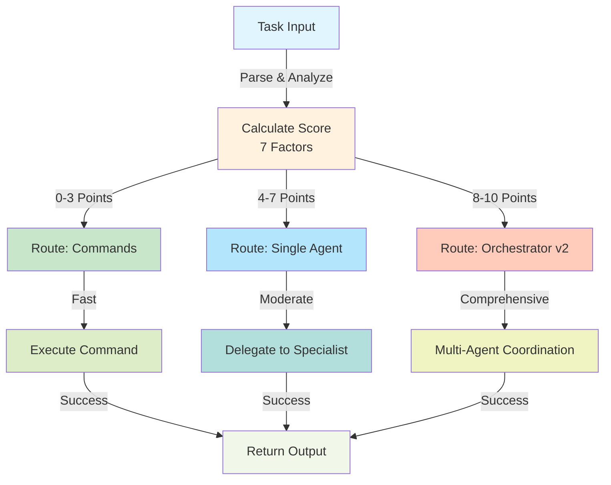
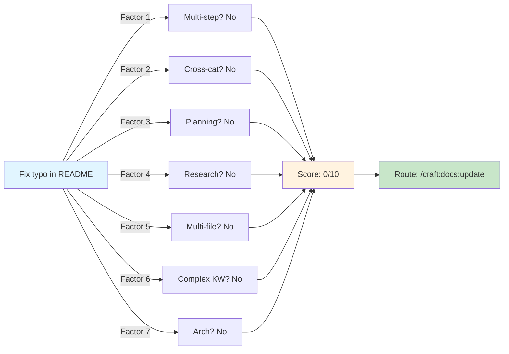
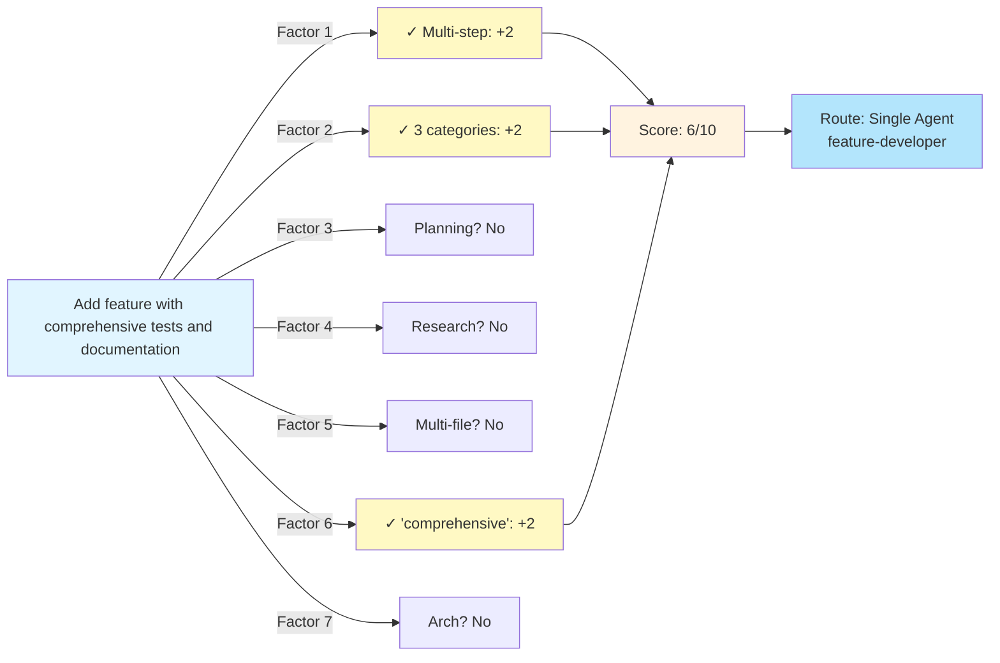
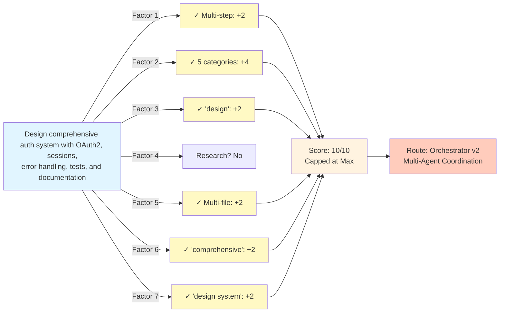
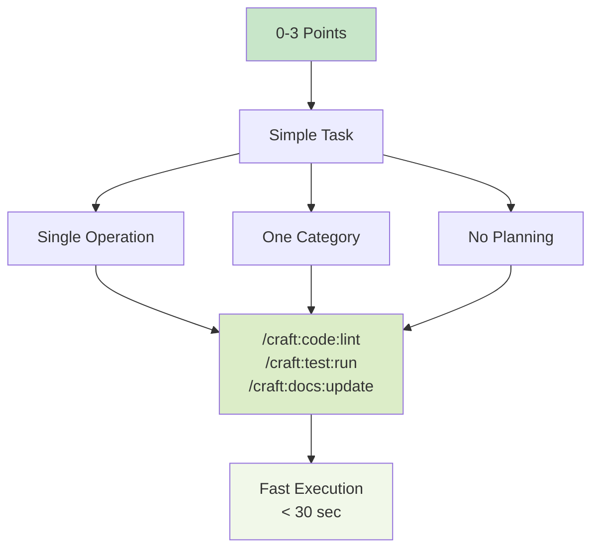
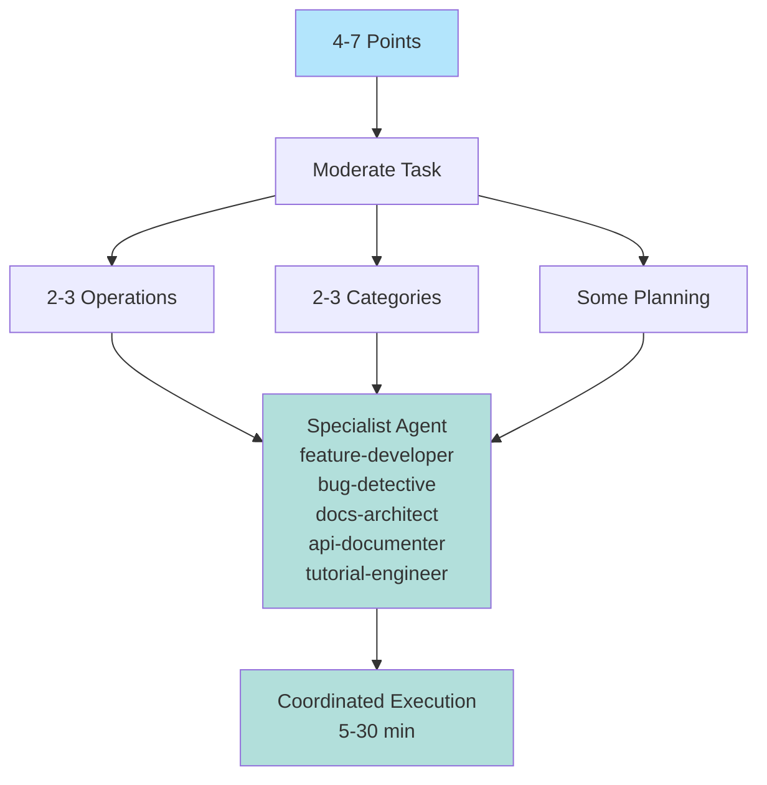
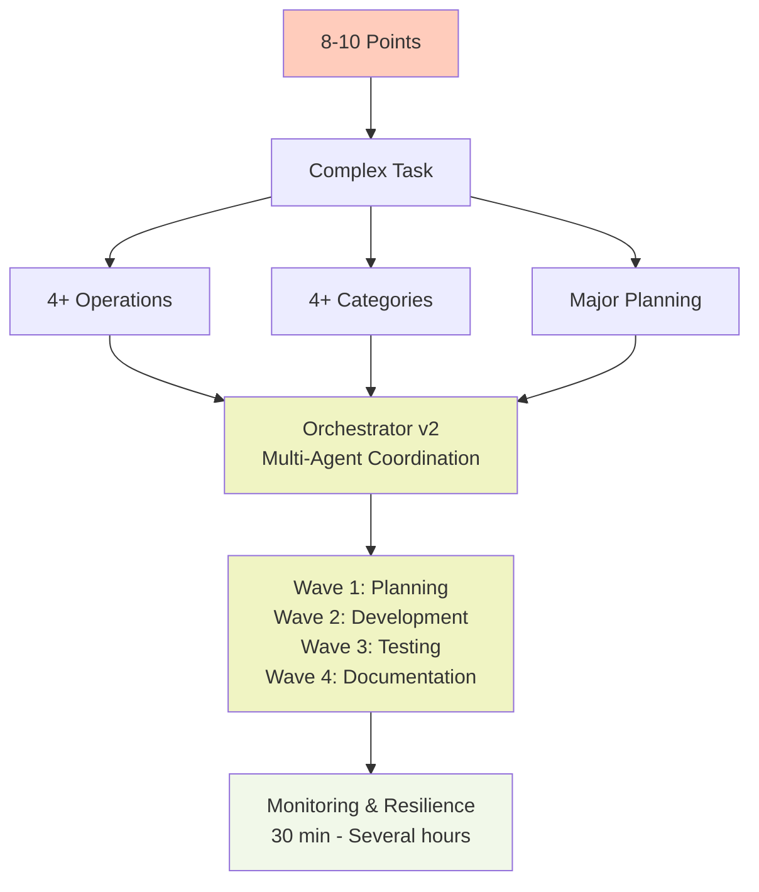
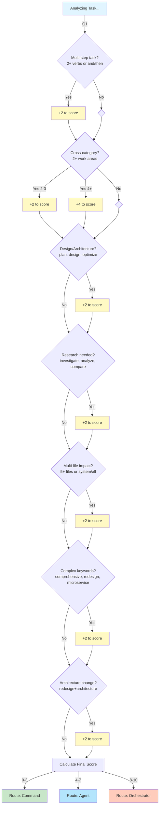

# Complexity Scoring Algorithm Guide

> **Smart Task Routing**: How Craft automatically routes tasks to commands, agents, or orchestrator

**Feature:** Available in `/craft:do` since v1.23.0 (Claude Code 2.1.0 integration)
**Algorithm:** 7-factor scoring system
**Scale:** 0-10 (simple → complex)
**Routing Zones:** 0-3 (commands) | 4-7 (agents) | 8-10 (orchestrator)

---

## Overview

The complexity scoring algorithm analyzes task descriptions to automatically choose the best execution route:

```
Task Input → Score 0-10 → Route (Command/Agent/Orchestrator)
```

This eliminates manual decision-making and ensures optimal resource allocation.

---

## Algorithm Architecture

### Visual Flow: Task Routing Decision Tree



---

## 7-Factor Scoring System

Each factor adds **+2 points** (max 10, factors are independent):

### Factor 1: Multi-Step Task (+2 points)

**Detects:** Tasks requiring multiple distinct operations

**Indicators:**
- 2+ action verbs: "lint **and** test"
- Explicit sequencing: "build, **then** deploy"
- Multi-part description: "lint**,** test**,** build"

**Examples:**
- "format code" → 0 points
- "format code and test" → +2 points
- "format code, test, build" → +2 points

### Factor 2: Cross-Category Task (+2 points)

**Detects:** Tasks spanning multiple work areas

**Categories Recognized:**
- Code (implement, refactor, fix, feature)
- Testing (test, coverage, validate)
- Documentation (doc, readme, comment)
- CI/CD (pipeline, workflow, deploy)
- Architecture (design, system, pattern)
- Security (auth, oauth, token)
- Database (migration, schema, query)
- Error Handling (exception, validation)

**Examples:**
- "add feature" → 0 points (1 category)
- "add feature with tests" → +2 points (code + testing)
- "add feature, tests, and docs" → +4 points (3 categories)

**Bonus:** Tasks spanning 4+ categories get additional +2 points

### Factor 3: Requires Planning (+2 points)

**Detects:** Tasks needing architecture or design phase

**Keywords:**
- Design, architecture, strategy, flow
- Pattern, structure, framework
- Optimize, performance, scalability
- Migration, redesign, restructure

**Examples:**
- "add button" → 0 points
- "design authentication system" → +2 points
- "refactor architecture" → +2 points

### Factor 4: Requires Research (+2 points)

**Detects:** Tasks needing investigation or exploration

**Keywords:**
- Research, investigate, explore
- Analyze, study, review, understand
- How to, compare, evaluate

**Examples:**
- "fix typo" → 0 points
- "investigate performance issue" → +2 points
- "research best practices" → +2 points

### Factor 5: Multi-File Changes (+2 points)

**Detects:** Broad-impact changes across many files

**Indicators:**
- Mentions of 5+ specific files: `foo.py`, `bar.js`, etc.
- Scope keywords: system, module, package, entire, all
- Cross-cutting: multiple, across, throughout, ecosystem

**Examples:**
- "fix typo in one file" → 0 points
- "refactor multiple modules" → +2 points
- "update entire system" → +2 points

### Factor 6: Inherently Complex Keywords (+2 points)

**Detects:** Tasks with recognized complexity keywords

**Keywords:**
- Comprehensive, optimize, redesign
- Microservice, authentication, migration
- Scalable, performance, robust

**Examples:**
- "add field" → 0 points
- "optimize performance" → +2 points
- "comprehensive refactoring" → +2 points

### Factor 7: Major Architectural Changes (+2 points)

**Detects:** System-wide architectural overhauls

**Patterns Recognized:**
- "redesign" + "architecture"
- "redesign" + "system"
- "refactor" + "architecture"
- "migrate" + "architecture"

**Examples:**
- "fix bug" → 0 points
- "redesign architecture" → +2 points
- "migrate to microservices architecture" → +2 points

---

## Scoring Examples

### Example 1: Simple Task (Score: 0)

**Task:** "Fix typo in README"

**Analysis:**
- 1 verb (fix) → No multi-step
- 1 category (docs) → No cross-category
- No planning keywords → No planning
- No research keywords → No research
- 0 files → No multi-file
- No complex keywords → No complexity
- No architectural pattern → No architecture

**Score: 0/10 → Route: Commands**



### Example 2: Moderate Task (Score: 4)

**Task:** "Add feature with comprehensive tests and documentation"

**Analysis:**
- 3 verbs (add, tests, documentation) → +2 multi-step
- 3 categories (code, testing, docs) → +2 cross-category
- No explicit planning → 0
- No research → 0
- No multi-file → 0
- "comprehensive" keyword → +2 complexity
- No architectural pattern → 0

**Score: 6/10 → Route: Agent**



### Example 3: Complex Task (Score: 9)

**Task:** "Design and implement comprehensive authentication system with OAuth2, PKCE, session management, error handling, extensive tests, and full documentation"

**Analysis:**
- 4+ verbs (design, implement, tests, docs) → +2 multi-step
- 5 categories (code, auth, error-handling, testing, docs) → +4 (2 for cross-cat, +2 bonus)
- "design" keyword → +2 planning
- No explicit research → 0
- Comprehensive scope → +2 multi-file
- "comprehensive" + "implementation" → +2 complexity
- "design" + "system" pattern → +2 architecture

**Score: 10/10 (capped) → Route: Orchestrator**



---

## Routing Zones Explained

### Zone 1: Commands (0-3 points)

**When to Use:** Simple, single-purpose tasks

**Characteristics:**
- Single operation (no "and" or "then")
- One work category (code OR test OR docs, not multiple)
- No planning/research needed
- Affects single file or small scope

**Route To:** Specific CLI commands

**Examples:**
- "lint code"
- "run tests"
- "format documentation"
- "fix typo"

**Time:** < 30 seconds



### Zone 2: Agent (4-7 points)

**When to Use:** Moderate tasks with multiple components

**Characteristics:**
- Multi-step operation (design + build, or test + docs)
- 2-3 work categories
- Some planning or research involved
- Moderate scope (5-20 files affected)

**Route To:** Specialized agent (feature-developer, bug-detective, docs-architect, etc.)

**Examples:**
- "add feature with tests"
- "refactor module and update docs"
- "investigate and fix bug with tests"
- "design API and create client SDK"

**Time:** 5-30 minutes
**Reasoning:** Single agent can handle multiple aspects better than individual commands, but not complex enough for full orchestration



### Zone 3: Orchestrator (8-10 points)

**When to Use:** Complex, multi-phase tasks

**Characteristics:**
- 4+ operations (design, implement, test, document, deploy)
- 4+ work categories
- Major planning or architectural work
- Large scope (20+ files, multiple systems)

**Route To:** Orchestrator v2 (multi-agent coordination)

**Examples:**
- "Design and implement comprehensive authentication system with OAuth2, sessions, tests, and docs"
- "Redesign system architecture with microservices, API, CI/CD, and full test coverage"
- "Add new feature across entire ecosystem with tests, docs, and deployment"

**Time:** 30 minutes - several hours
**Reasoning:** Requires parallel multi-agent coordination with tight integration



---

## Factor Decision Flow

### Quick Decision Guide



---

## Integration with /craft:do

The complexity scorer is integrated into `/craft:do` to automate routing:

```bash
/craft:do "add authentication with OAuth2, sessions, and comprehensive tests"
```

**Process:**
1. Parse task description
2. Calculate 7-factor score
3. Determine routing zone (0-3, 4-7, or 8-10)
4. Execute via chosen route (command, agent, or orchestrator)

**Output Example:**
```
Task: "add authentication with OAuth2, sessions, and comprehensive tests"
Score: 8/10
Factors: Multi-step (+2), Cross-category code/security/testing (+4), Planning (+2)
Routing: Orchestrator v2 (multi-agent coordination)
```

---

## Testing the Algorithm

### Run Complexity Scorer Tests

```bash
python3 tests/test_complexity_scoring.py
```

**Test Coverage:**
- 15 unit tests
- 100% coverage of scoring factors
- Boundary testing (0, 3, 7, 10 points)
- Real-world examples

### Manual Testing

```bash
python3 utils/complexity_scorer.py
```

**Output:** Test cases with scores and routing decisions

---

## Design Principles

1. **Independent Factors:** Each factor is evaluated independently; multiple factors can trigger
2. **Capped at 10:** Maximum score is 10 (multiple factors can exceed this)
3. **Keyword-Based:** Uses regex and keyword matching (no external ML dependencies)
4. **Conservative Routing:** Prefer agent/orchestrator over commands when uncertain
5. **Explainability:** Always returns which factors contributed to score

---

## Evolution & Tuning

**v1.20.0:** Initial 5-factor algorithm
**v1.23.0:** Enhanced with complexity keywords factor
**v1.24.0:** Added major architectural changes factor (7 total)

**Tuning Strategy:**
- Adjust keyword lists based on user feedback
- Monitor false positives (task routed too high)
- Monitor false negatives (task routed too low)
- Test against real craft usage patterns

---

## Next Steps

1. Use `/craft:do` with various task descriptions
2. Review suggested routing (is it appropriate?)
3. Provide feedback if routing seems off
4. Check execution results (did the right tool get used?)

---

## See Also

- `/craft:do` command documentation
- Orchestrator v2 architecture
- Agent delegation system
- Task complexity detection

---

*Last Updated: 2026-01-18*
