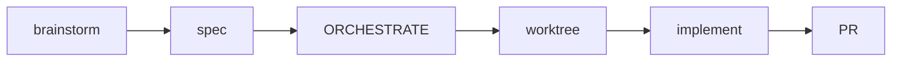

# Getting Started with Craft

⏱️ **10 minutes** • 🟡 Intermediate • ✓ Complete guide

> **TL;DR** (30 seconds)
>
> - **What:** Complete guide to installing and using craft's 48 commands, 41 skills, and 2 agents
> - **Why:** Master the full-stack toolkit to automate your entire development workflow
> - **How:** Install plugin → verify with `/craft:hub` → start with `/craft:do "task"`
> - **Next:** Read about [Skills & Agents](../skills-agents.md) to understand AI automation

Complete guide to using the craft plugin for Claude Code.

## Installation

!!! abstract "Progress: Step 1/5"
    Installing craft - choose your method

### Method 1: Marketplace (Recommended)

```bash
claude plugin add github:Data-Wise/craft
```

Works on all platforms with a single command. See [Marketplace Distribution Guide](marketplace-distribution.md) for details.

### Method 2: Homebrew (macOS)

```bash
brew tap data-wise/tap
brew install craft
```

See [Homebrew Installation Guide](homebrew-installation.md) for details on updates and troubleshooting.

### Method 3: Symlink (Development)

```bash
ln -s ~/projects/dev-tools/craft ~/.claude/plugins/craft
```

## Verify Installation

!!! abstract "Progress: Step 2/5"
    Verify everything works

```bash
/craft:hub
```

You should see all 48 commands listed.

## Your First Commands

!!! abstract "Progress: Step 3/5"
    Try these essential commands

### 1. Universal Task Execution

```bash
/craft:do "add user authentication"
```

The AI routes your task automatically.

### 2. Pre-Flight Checks

Before committing code:

```bash
/craft:check
```

Before creating a PR:

```bash
/craft:check --for pr
```

Before releasing:

```bash
/craft:check --for release
```

### 3. Documentation

Update all documentation:

```bash
/craft:docs:update
```

Check for stale docs:

```bash
/folio:docs:sync
```

## Complex Feature Workflow

!!! abstract "Progress: Step 4/6"
    Learn the full pipeline for multi-phase features

For features that need planning, orchestration, and isolated development:



**Step-by-step:**

```bash
# 1. Brainstorm the feature
/brainstorm d:8 "user authentication with OAuth"
# → Saves BRAINSTORM-auth.md, optionally captures spec

# 2. Create orchestration + worktree from spec
/craft:plan docs/specs/SPEC-auth.md
# → Generates ORCHESTRATE-auth.md
# → Creates worktree at ~/.git-worktrees/<project>/feature-auth

# 3. Work in the worktree
cd ~/.git-worktrees/<project>/feature-auth
claude  # Read ORCHESTRATE file, implement phase by phase

# 4. Finish and create PR (dev/git skill — ask naturally)
# "finish this worktree"
```

!!! tip "When to Use This Pipeline"
    Use the full pipeline for multi-phase features with specs. For quick features, just ask "create a worktree for feature/name" (`dev/git` skill).

## Periodic Repo Triage

Once a repo has accumulated open issues and finished/stale feature
branches, ask naturally to batch-groom them: **"triage the repo"** or
**"what needs attention here"** (`repo-triage` skill). It:

1. Checks every open GitHub issue's premise against current code
   (reuses `/craft:git:issue-check`'s classifier — never a duplicate).
2. Finds stale worktrees, then merged/squash-merged branches (in that
   order, so no branch is ever locked by a worktree it's about to flag).
3. Groups related items (a branch and its worktree count as one), asks
   for confirmation before closing/deleting anything, and sorts whatever's
   left into grill-ready (open design question), plan-ready (clear next
   action), or defer.

Nothing is ever deleted or closed without an explicit confirm in the same
run. See [`skills/orchestration/repo-triage/SKILL.md`](https://github.com/Data-Wise/craft/blob/dev/skills/orchestration/repo-triage/SKILL.md).

## Understanding the System

!!! abstract "Progress: Step 5/6"
    Learn the 3-layer architecture

Craft has three levels of automation:

1. **Commands** (89 total) - Direct actions
2. **Skills** (21 total) - Auto-triggered expertise
3. **Agents** (8 specialized) - Long-running tasks

When you use `/craft:do`, the system determines which combination to use.

## Next Steps

!!! abstract "Progress: Step 6/6 - Complete!"
    Continue your journey

- [Skills & Agents](../skills-agents.md) - Understanding the AI system
- [Orchestrator](orchestrator.md) - Advanced mode-aware execution
- [Commands Overview](../commands/overview.md) - Explore all commands
