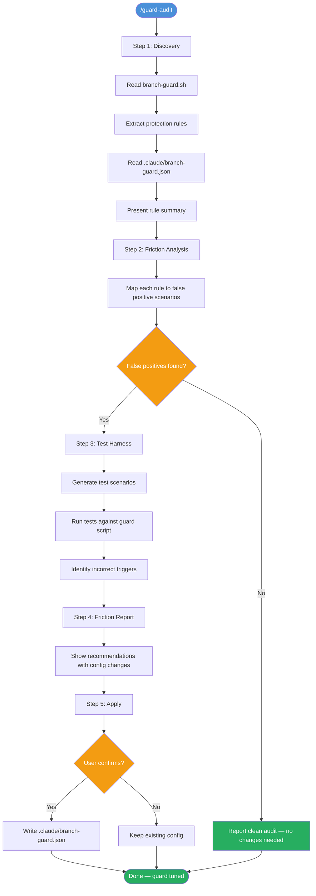
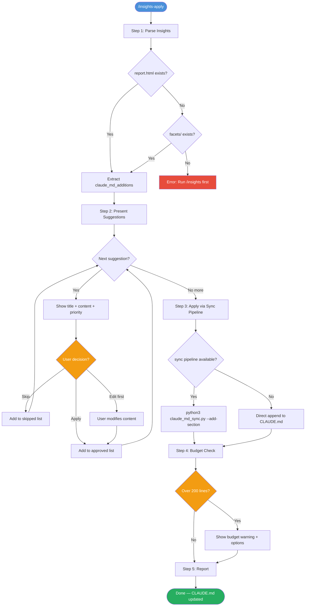
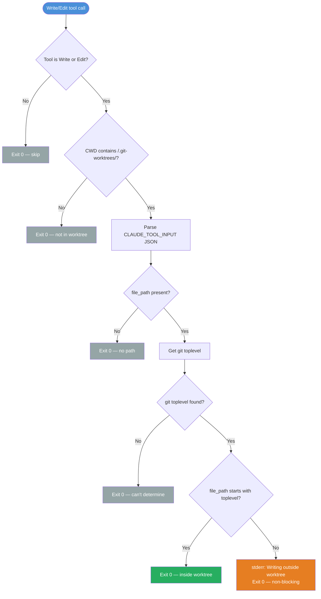
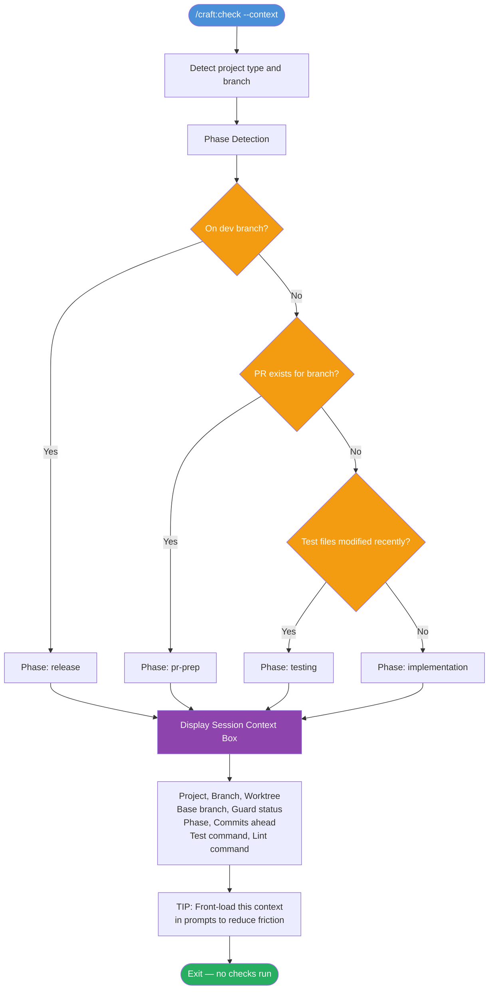
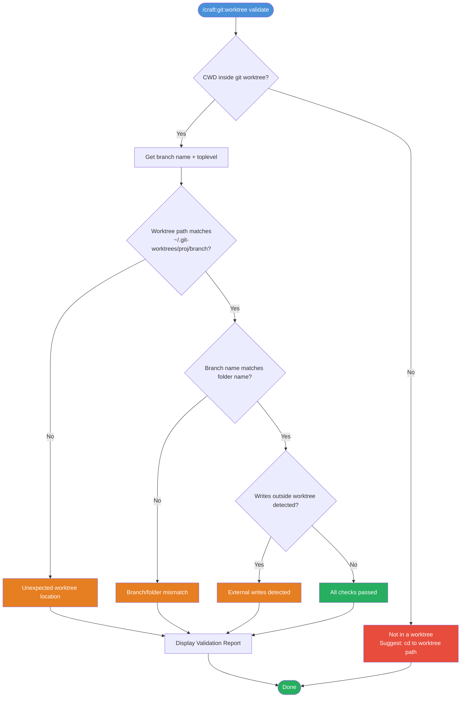
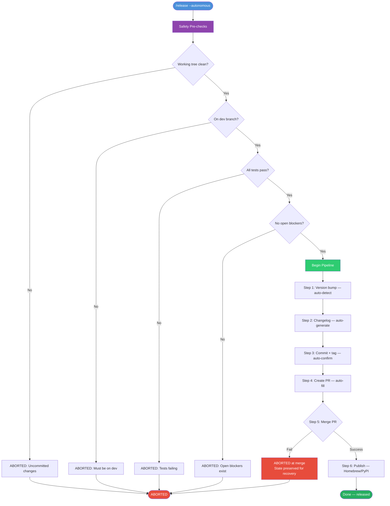
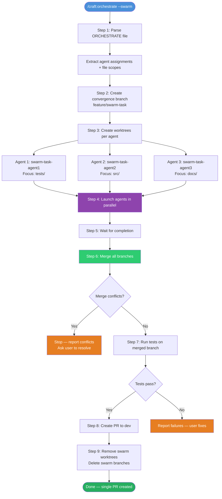

# Insights-Driven Improvements Guide (v2.18.0)

> **TL;DR**: 2 new skills, 4 enhanced commands, 1 safety hook — all designed to close the feedback loop between usage patterns and workflow configuration.

## Overview

v2.18.0 adds features that emerged from analyzing real craft usage patterns:

| Feature | Type | Purpose |
|---------|------|---------|
| Guard Audit | New skill | Tune branch guard to reduce false positives |
| Insights Apply | New skill | Apply session learnings to CLAUDE.md |
| PreToolUse Hook | New hook | Warn on writes outside current worktree |
| `--context` flag | Enhanced check | Show session context without running validators |
| `validate` action | Enhanced worktree | Health-check current worktree environment |
| `--autonomous` flag | Enhanced release | Unattended release pipeline |
| `--swarm` flag | Enhanced orchestrate | Isolated worktree per agent |

---

## New Skills

### Guard Audit (`/guard-audit`)

A read-only 5-step pipeline that analyzes your `branch-guard.sh` for false positives — rules that block legitimate work. It discovers all protection rules, tests them against realistic scenarios, generates a friction report, and proposes JSON config changes. It never modifies the guard script itself.

**When to use:** After the guard blocks something it shouldn't, or periodically to tune sensitivity.

**Key principle:** The guard script is the "engine" and `.claude/branch-guard.json` is the "tuning knobs." This skill only adjusts the knobs.



---

### Insights Apply (`/insights-apply`)

Bridges the gap between `/insights` (which analyzes your usage patterns) and your global `~/.claude/CLAUDE.md`. Parses the insights report, extracts `claude_md_additions` suggestions, presents each for review (apply/skip/edit), applies via the sync pipeline, and enforces the 200-line budget.

**When to use:** After running `/insights` and seeing suggestions you want to persist.

**Key principle:** Targets global CLAUDE.md only — insights are cross-project patterns, not project-specific.



---

## New Hook

### PreToolUse Hook (`pretooluse.py`)

A non-blocking safety net that runs on every Write/Edit call. If you're working in a git worktree and a file operation targets a path outside that worktree, it prints a stderr warning. Always exits 0 — it warns but never blocks.

**Key principle:** The fast-path (not in worktree or not Write/Edit) returns immediately with zero overhead. Only calls `git rev-parse` when actually in a worktree.



**Performance:** Fast path ~45ms, worktree path ~60ms.

---

## Enhanced Commands

### `/craft:check --context` — Context-Only Mode

Skips all validators and outputs a session context summary instead. Auto-detects your dev phase (implementation/testing/pr-prep/release) based on commits ahead, PR existence, and test file recency.

**When to use:** At the start of a session to understand where you left off, or to front-load context into prompts.



---

### `/craft:git:worktree validate` — Worktree Health Check

Verifies your current worktree environment is healthy: you're actually in a worktree, the path matches conventions, the branch name matches the folder name, and no writes are targeting outside the worktree.

**When to use:** After switching to a worktree, or when something feels "off" about the environment.



---

### `/release --autonomous` — Unattended Release Pipeline

Runs the full release pipeline with zero user prompts. Pre-validates safety (clean tree, on dev, tests pass, no blockers), then auto-confirms every checkpoint. If any step fails, it aborts and preserves state for recovery.

**When to use:** In CI/CD pipelines, or when you're confident the release is ready and want zero interaction.

**Tip:** Always preview first with `--autonomous --dry-run`.



---

### `/craft:orchestrate --swarm` — Isolated Worktree Agents

Instead of forking agent contexts in the same directory (risking file conflicts), creates a separate git worktree per agent with its own branch. Agents work in parallel with complete isolation, then branches merge into a convergence branch.

**When to use:** Parallel feature implementation where agents would conflict on the same files.

**Requirement:** An ORCHESTRATE file with per-agent file scopes.



---

## Suggested Workflows

### Workflow 1: New Session Kickoff

Orient yourself at the start of every session.

```bash
/craft:check --context            # See phase + branch + guard status
/craft:git:worktree validate      # Confirm you're in the right place
```

### Workflow 2: Guard Tuning

After the guard blocks something it shouldn't.

```bash
/guard-audit                      # Discover + analyze + propose config
/craft:check                      # Verify nothing broke
```

### Workflow 3: Learning Loop

Periodic — incorporate session learnings into your CLAUDE.md.

```bash
/insights                         # Generate usage report
/insights-apply                   # Extract + review + apply to CLAUDE.md
/craft:docs:claude-md:sync        # Validate CLAUDE.md consistency
```

### Workflow 4: Parallel Feature Implementation

For large features that can be split across isolated agents.

```bash
/craft:orchestrate --swarm "implement feature"  # Isolated agents in worktrees
/craft:orchestrate status                       # Monitor progress
```

### Workflow 5: Unattended Release

When you're confident the release is ready.

```bash
/release --autonomous --dry-run   # Preview the plan
/release --autonomous             # Execute with zero prompts
```

### Workflow 6: Full Pre-Commit Pipeline

Before every commit.

```bash
/craft:git:worktree validate      # Right place?
/craft:check                      # All green?
# commit                          # Ship it
```

---

## See Also

- [Branch Guard Smart Mode Guide](branch-guard-smart-mode.md) — How the guard works
- [Check Command Mastery](check-command-mastery.md) — All check modes and flags
- [Worktree Advanced Patterns](worktree-advanced-patterns.md) — Multi-worktree management
- [Version History](../VERSION-HISTORY.md) — v2.18.0 release notes
- [Quick Reference](../REFCARD.md) — All commands at a glance
