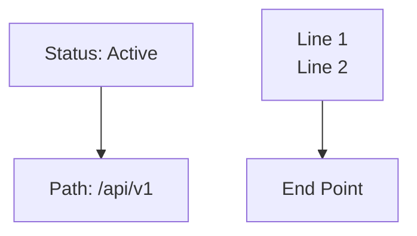

# Mermaid Diagram Authoring Guide

End-to-end guide for creating, validating, and deploying Mermaid diagrams in the craft docs pipeline.

## Quick Start

```bash
# Create from template
/craft:docs:mermaid workflow

# Create from description
/craft:docs:mermaid "CI pipeline: lint, test, build, deploy"

# Validate all diagrams
python3 scripts/mermaid-validate.py docs/

# Auto-fix safe issues
python3 scripts/mermaid-autofix.py docs/ --fix

# Check health score
python3 scripts/mermaid-validate.py docs/ --health-score
```

## Creating Diagrams

### From Templates

Six production-ready templates are available:

| Template | Direction | Best For |
|----------|-----------|----------|
| `dependency` | LR | Package relationships |
| `workflow` | TD | Process flows with decisions |
| `architecture` | TB | System component diagrams |
| `comparison` | LR | Before/after, option A vs B |
| `sequence` | - | API interactions over time |
| `state` | - | State machine transitions |

```bash
/craft:docs:mermaid workflow           # Get workflow template
/craft:docs:mermaid all --output docs/diagrams/templates.md
```

### From Natural Language

Describe your diagram in plain English:

```bash
/craft:docs:mermaid "show the release pipeline from dev to main"
/craft:docs:mermaid "auth flow with OAuth2 showing token refresh" --validate
/craft:docs:mermaid "microservice architecture with API gateway" --preview
```

The `--validate` flag checks syntax via mcp-mermaid. The `--preview` flag renders to SVG and opens in browser.

## Syntax Safety Rules

These rules prevent the most common rendering failures:

### Error-Level (Block Commit/Deploy)

| Rule | Bad | Good | Why |
|------|-----|------|-----|
| Leading slash | `A[/text]` | `A["/text"]` | Misinterpreted as parallelogram |
| Lowercase end | `B[end]` | `B[End]` | Conflicts with Mermaid keyword |

### Warning-Level (Reported, Don't Block)

| Rule | Example | Fix |
|------|---------|-----|
| Unquoted colon | `[Status: OK]` | `["Status: OK"]` |
| BR tags | `[First<br/>Second]` | `["First<br/>Second"]` or markdown strings |
| Deprecated graph | `graph TD` | `flowchart TD` |

## Validation Pipeline

### Pre-commit Hook

Runs automatically on every commit that touches `.md` files:

- Checks **errors only** (fast, no MCP dependency)
- Catches `[/text]` and `[end]` patterns
- Skips files without mermaid blocks (zero overhead)

### `/craft:docs:check` (Phase 5)

Full validation with health score:

```bash
/craft:docs:check                      # Full check including mermaid
/craft:docs:check --no-mermaid         # Skip mermaid phase
```

### Release Gate

```bash
python3 scripts/mermaid-validate.py docs/ --gate       # Default threshold: 80
python3 scripts/mermaid-validate.py docs/ --gate 90    # Custom threshold
```

## Health Score

Composite quality metric (0-100):

```text
health = syntax_validity * 0.5 + best_practices * 0.3 + rendering_success * 0.2
```

| Score | Level | Release Gate |
|-------|-------|-------------|
| >= 90 | Good | Pass |
| >= 80 | Warning | Pass (default) |
| < 80 | Fail | Blocked |

Check current score:

```bash
python3 scripts/mermaid-validate.py docs/ commands/ skills/ --health-score
```

## Auto-Fix Engine

Safe automatic fixes for common patterns:

```bash
# Preview what would change (default)
python3 scripts/mermaid-autofix.py docs/

# Apply fixes
python3 scripts/mermaid-autofix.py docs/ --fix

# Run built-in self-tests
python3 scripts/mermaid-autofix.py --test
```

### Safe Fixes (Applied Automatically)

| Pattern | Before | After |
|---------|--------|-------|
| Leading slash | `[/text]` | `["/text"]` |
| Lowercase end | `[end]` | `[End]` |
| Unquoted colon | `[a:b]` | `["a:b"]` |
| BR tag quoting | `[A<br/>B]` | `["A<br/>B"]` |
| Deprecated graph | `graph TD` | `flowchart TD` |

### Report-Only (Needs Human Review)

- Long node text (>20 chars) — suggest abbreviation
- Orphaned nodes — suggest connection
- Complex horizontal layouts (LR with >5 nodes) — suggest TD

## Best Practices

### Layout Direction

- **Use `flowchart TD`** for complex diagrams (>5 nodes, branches, decisions)
- **Use `flowchart LR`** only for simple linear flows (<5 nodes)
- **Use `flowchart` over `graph`** — clearer intent, same behavior

### Text Length

| Element | Max Length |
|---------|-----------|
| Node labels (single line) | 15-20 chars |
| Edge labels | 10 chars |
| Subgraph titles | 20 chars |

### Common Abbreviations

| Full | Abbreviated |
|------|-------------|
| `Authentication Service` | `Auth Service` |
| `Configuration Manager` | `Config Mgr` |
| `~/.git-worktrees/project/branch` | `~/.git-wt/.../branch` |
| `automatically creates` | `creates` |

### Always Quote Special Characters



## MCP Server

The mcp-mermaid server provides full syntax validation and SVG rendering. Configured in `.mcp.json`:

```json
{
  "mcpServers": {
    "mcp-mermaid": {
      "command": "npx",
      "args": ["-y", "mcp-mermaid"]
    }
  }
}
```

## Tools Reference

| Tool | Purpose |
|------|---------|
| `/craft:docs:mermaid` | Templates, NL creation, validation, preview |
| `/craft:docs:check` | Phase 5: Mermaid Validation + health score |
| `mermaid-linter` skill | Validation rules and best practices |
| `mermaid-expert` agent | MCP-powered diagram generation |
| `scripts/mermaid-validate.py` | CLI: extract, validate, health score, gate |
| `scripts/mermaid-autofix.py` | CLI: auto-fix safe patterns |
| `scripts/hooks/pre-commit-mermaid.sh` | Pre-commit hook |
