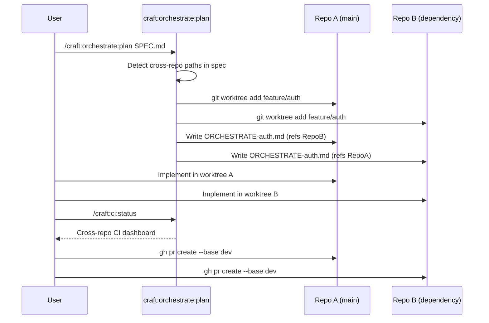

# Multi-Repo Workflow Guide

> **TL;DR** — When a feature spans multiple repositories, craft detects cross-repo paths in your spec and creates paired worktrees automatically. Each repo gets a scoped ORCHESTRATE file. You develop in parallel, monitor with `/craft:ci:status`, and create linked PRs in each repo.

---

## Overview

Most features live in a single repository. But when you maintain a plugin that integrates with a dependent library, a shared configuration package, or a companion CLI tool, you often need synchronized changes across repos — and keeping them in sync manually is error-prone.

Craft's cross-repo coordination workflow handles this automatically:

1. Write a spec that references paths in multiple repos
2. Run `/craft:orchestrate:plan SPEC.md` — craft detects the cross-repo paths and creates paired worktrees
3. Develop in each worktree in parallel, with ORCHESTRATE files that reference each other
4. Monitor CI across all repos with `/craft:ci:status`
5. Create PRs in each repo, linking them to each other

**What this is NOT:** This is not a monorepo tool. Each repository remains independent with its own git history, CI pipelines, and release cadence. Craft only coordinates the development workflow across them.

---

## When to Use Cross-Repo Coordination

Use this workflow when:

- **A feature requires API changes in a library AND consuming updates in the app** — e.g., adding a new auth provider requires changes to `auth-core` and `web-app`
- **Multiple repos share a common interface** — e.g., a plugin spec changes in `craft` and must be implemented in `craft-extensions`
- **Synchronized releases are required** — the changes must ship together or neither ships
- **One repo is a dependency of another** — version pinning means you need changes in both before either is testable end-to-end

**You do NOT need this workflow when:**

- Changes are in one repo only (use the standard worktree workflow)
- Repos are related but changes are independent (create separate features per repo)
- Repos are already in a monorepo (use multi-worktree patterns instead — see [Worktree Advanced Patterns](worktree-advanced-patterns.md))

---

## Spec Syntax for Auto-Detection

Craft detects cross-repo coordination intent when your spec references paths in multiple project directories. Use standard filesystem paths in the spec body — craft scans for `~/projects/` path patterns.

**Single-repo spec (no detection):**

```markdown
## Files to modify
- `src/auth/login.py`
- `tests/test_auth.py`
```

**Cross-repo spec (detected):**

```markdown
## Repos affected
- `~/projects/dev-tools/auth-core/` — Add OAuth2 provider support
- `~/projects/dev-tools/web-app/` — Consume new OAuth2 provider

## Files to modify
### auth-core
- `src/providers/oauth2.py` — New provider class
- `tests/test_oauth2.py` — Provider tests

### web-app
- `src/auth/config.py` — Register OAuth2 provider
- `src/views/login.html` — Add OAuth2 button
```

When craft sees two or more `~/projects/<owner>/<repo>/` paths, it switches to cross-repo mode.

**Naming convention for the feature branch:**

The branch name must be identical across all repos. Use a descriptive feature name without repo-specific prefixes:

- `feature/oauth2-provider` — correct: same name in both repos
- `feature/auth-core-oauth2-provider` — wrong: repo-specific prefix prevents coordination

---

## What `orchestrate:plan` Does on Detection

When `/craft:orchestrate:plan SPEC.md` detects cross-repo paths, it runs this sequence:

1. **Identifies all repos** referenced in the spec
2. **Verifies each repo exists** at the referenced path (exits with an error if not)
3. **Creates a worktree in each repo** at `~/.git-worktrees/<repo>/<feature-name>` branching from `dev`
4. **Writes a scoped ORCHESTRATE file** to each worktree — each file describes only that repo's work, but references the other repos
5. **Reports the worktree paths** — you get a list of directories to open, one per repo
6. **Stops** — implementation happens in separate sessions, one per repo

Example output:

```
Cross-repo coordination detected: 2 repositories

Repo A: auth-core
  Worktree: ~/.git-worktrees/auth-core/feature-oauth2-provider
  Branch:   feature/oauth2-provider
  ORCHESTRATE: ORCHESTRATE-oauth2-provider.md ✓

Repo B: web-app
  Worktree: ~/.git-worktrees/web-app/feature-oauth2-provider
  Branch:   feature/oauth2-provider
  ORCHESTRATE: ORCHESTRATE-oauth2-provider.md ✓

Next steps:
  Session 1: cd ~/.git-worktrees/auth-core/feature-oauth2-provider
  Session 2: cd ~/.git-worktrees/web-app/feature-oauth2-provider
```

---

## Paired Worktrees with Bidirectional ORCHESTRATE Refs

Each worktree gets its own ORCHESTRATE file. The files are scoped — they describe only the work for that repo — but include a cross-reference section so you always know what's happening in the paired repo.

**ORCHESTRATE-oauth2-provider.md in `auth-core`:**

```markdown
# ORCHESTRATE: oauth2-provider (auth-core)

## This repo: auth-core
Branch: feature/oauth2-provider
Worktree: ~/.git-worktrees/auth-core/feature-oauth2-provider

## Paired repo: web-app
Branch: feature/oauth2-provider
Worktree: ~/.git-worktrees/web-app/feature-oauth2-provider
ORCHESTRATE: ORCHESTRATE-oauth2-provider.md

## Implementation plan (auth-core scope)
...auth-core-specific tasks...

## Coordination notes
- Complete auth-core implementation first
- web-app depends on the OAuth2Provider class being stable before integration
- PR in auth-core should be merged to dev before web-app PR is created
```

**ORCHESTRATE-oauth2-provider.md in `web-app`:**

```markdown
# ORCHESTRATE: oauth2-provider (web-app)

## This repo: web-app
Branch: feature/oauth2-provider
Worktree: ~/.git-worktrees/web-app/feature-oauth2-provider

## Paired repo: auth-core
Branch: feature/oauth2-provider
Worktree: ~/.git-worktrees/auth-core/feature-oauth2-provider
ORCHESTRATE: ORCHESTRATE-oauth2-provider.md

## Implementation plan (web-app scope)
...web-app-specific tasks...

## Coordination notes
- Depends on auth-core PR being merged first
- Once auth-core's OAuth2Provider is on dev, update pyproject.toml dependency
```

The cross-reference means you never have to remember where the paired worktree is — it is always in the ORCHESTRATE file.

---

## Branch Name Enforcement

All repos in a cross-repo feature must use **the same branch name**. This is enforced at worktree creation time.

Craft derives the branch name from the spec filename. `SPEC-oauth2-provider-2026-02-20.md` produces `feature/oauth2-provider`.

If you try to create a worktree with a different branch name in a repo that already has a paired worktree registered, craft will warn you:

```
Warning: Repo web-app already has a paired worktree for this feature
  Registered branch: feature/oauth2-provider
  Requested branch:  feature/web-app-oauth2

Use the same branch name to maintain cross-repo coordination.
```

**Why this matters:** When you run `/craft:ci:status` or link PRs, craft uses the branch name to identify which PRs across repos belong to the same feature. Inconsistent names break the cross-repo dashboard.

---

## Sequence Diagram



---

## `ci:status` Cross-Repo Dashboard

Once you have worktrees open and pushes in flight, `/craft:ci:status` can show a cross-repo view.

Run it from either worktree — craft detects paired repos from the ORCHESTRATE file:

```
/craft:ci:status
```

**Example output:**

```
CI Status — feature/oauth2-provider

auth-core  (feature/oauth2-provider)
  ✅ Tests       passed 2m ago   (3 workflows)
  ✅ Lint        passed 2m ago
  🔄 Build       running...

web-app  (feature/oauth2-provider)
  ✅ Tests       passed 5m ago   (2 workflows)
  ⚠️  Type Check  1 warning       src/auth/config.py:42
  ✅ Build       passed 5m ago

Overall: 1 workflow still running — check back in ~1 minute
```

The dashboard aggregates CI from both repos. You do not need to switch browser tabs or remember repo URLs.

**Filtering to a single repo:**

```bash
/craft:ci:status --repo auth-core
```

---

## Coordinating PRs

When you are ready to open PRs, create one per repo. The key is linking them so reviewers understand the dependency relationship.

**Step 1: Create the PR in the dependency repo first**

```bash
cd ~/.git-worktrees/auth-core/feature-oauth2-provider

gh pr create --base dev \
  --title "feat: add OAuth2 provider support" \
  --body "$(cat <<'EOF'
## Summary
- New `OAuth2Provider` class in `src/providers/oauth2.py`
- Provider registration hook in auth config

## Cross-repo coordination
This PR is part of a paired feature with **web-app**.
- web-app PR: (link once created)
- Merge order: auth-core → web-app

## Test plan
- [ ] Unit tests for OAuth2Provider
- [ ] Integration test with mock OAuth server
EOF
)"
```

**Step 2: Create the PR in the consuming repo, link back**

```bash
cd ~/.git-worktrees/web-app/feature-oauth2-provider

# Get the auth-core PR number
AUTH_CORE_PR=$(gh pr view --repo Data-Wise/auth-core --json number -q .number)

gh pr create --base dev \
  --title "feat: integrate OAuth2 provider" \
  --body "$(cat <<'EOF'
## Summary
- Register OAuth2 provider from auth-core
- Add OAuth2 button to login view

## Cross-repo coordination
Depends on: Data-Wise/auth-core#${AUTH_CORE_PR}
Merge order: auth-core PR must be merged first.

## Test plan
- [ ] Update auth-core dependency to include OAuth2Provider
- [ ] End-to-end login flow with OAuth2
EOF
)"
```

**Step 3: Update the auth-core PR with the web-app link**

```bash
AUTH_CORE_PR=<number>
WEB_APP_PR=<number>

gh pr edit "$AUTH_CORE_PR" --repo Data-Wise/auth-core \
  --body "$(gh pr view "$AUTH_CORE_PR" --repo Data-Wise/auth-core --json body -q .body | \
    sed "s|(link once created)|Data-Wise/web-app#${WEB_APP_PR}|")"
```

**Merge order:**

Always merge in dependency order. The library/provider repo merges first. The consuming repo merges second, after updating its dependency version if applicable:

```bash
# After auth-core PR merges to dev:
cd ~/.git-worktrees/web-app/feature-oauth2-provider

# If version-pinned: bump auth-core version in pyproject.toml / package.json / etc.
# Then push the update
git add pyproject.toml
git commit -m "chore: bump auth-core to include OAuth2Provider"
git push origin feature/oauth2-provider
```

---

## Practical Example: End-to-End

Here is a complete walkthrough for adding a new data export format to a plugin ecosystem with two repos: `craft` (the plugin) and `craft-formats` (format library).

**Spec file: `SPEC-csv-export-2026-02-20.md`**

```markdown
## Repos affected
- `~/projects/dev-tools/craft/` — Add /craft:export:csv command
- `~/projects/dev-tools/craft-formats/` — Add CSV format handler
```

**Step 1: Plan**

```bash
cd ~/projects/dev-tools/craft
/craft:orchestrate:plan specs/SPEC-csv-export-2026-02-20.md
```

Craft creates:

- `~/.git-worktrees/craft/feature-csv-export/` — branch `feature/csv-export`
- `~/.git-worktrees/craft-formats/feature-csv-export/` — branch `feature/csv-export`

**Step 2: Implement in craft-formats (Session 1)**

```bash
# New terminal session
cd ~/.git-worktrees/craft-formats/feature-csv-export
# Implement CSVHandler class
git add .
git commit -m "feat: add CSV format handler"
git push origin feature/csv-export
```

**Step 3: Implement in craft (Session 2)**

```bash
# New terminal session
cd ~/.git-worktrees/craft/feature-csv-export
# Implement /craft:export:csv command using CSVHandler
git add .
git commit -m "feat: add /craft:export:csv command"
git push origin feature/csv-export
```

**Step 4: Monitor CI**

```bash
cd ~/.git-worktrees/craft/feature-csv-export
/craft:ci:status
# Shows CI for both repos
```

**Step 5: Create PRs**

```bash
# craft-formats first
cd ~/.git-worktrees/craft-formats/feature-csv-export
gh pr create --base dev --title "feat: add CSV format handler"

# craft second, with cross-link
cd ~/.git-worktrees/craft/feature-csv-export
gh pr create --base dev --title "feat: add /craft:export:csv command" \
  --body "Depends on: Data-Wise/craft-formats#<PR number>"
```

---

## Cleaning Up

After both PRs are merged:

```bash
# Remove worktrees
git worktree remove ~/.git-worktrees/craft/feature-csv-export
git worktree remove ~/.git-worktrees/craft-formats/feature-csv-export

# Delete remote branches (from each repo)
cd ~/projects/dev-tools/craft
git push origin --delete feature/csv-export

cd ~/projects/dev-tools/craft-formats
git push origin --delete feature/csv-export
```

Or use craft's worktree cleanup command from each repo:

```bash
/craft:git:worktree clean
```

---

## Troubleshooting

### Craft did not detect cross-repo paths

Check that your spec uses `~/projects/<name>/` path format. Relative paths like `../other-repo/` are not detected.

### Worktree creation failed in one repo

If `dev` branch is out of date in one repo:

```bash
cd ~/projects/dev-tools/<repo>
git fetch origin dev
git checkout dev
git pull origin dev
# Then re-run orchestrate:plan
```

### CI status shows wrong branch

Verify the branch name is identical in both repos:

```bash
cd ~/.git-worktrees/auth-core/feature-oauth2-provider
git branch --show-current  # Should match:

cd ~/.git-worktrees/web-app/feature-oauth2-provider
git branch --show-current
```

### One repo's tests depend on the other repo's unreleased code

This is the hardest case. Options:

1. **Mock the dependency** in tests — use a mock/stub for the unreleased interface
2. **Publish a pre-release** — tag a beta on the dependency repo and pin to it during development
3. **Use path dependencies** — if the package manager supports it (e.g., `pip install -e ../auth-core/`)

---

## Summary

| Concept | What it means |
|---------|---------------|
| Cross-repo detection | Spec contains `~/projects/` paths to 2+ repos |
| Paired worktrees | One worktree per repo, same branch name |
| ORCHESTRATE files | Scoped per repo, reference each other |
| Branch enforcement | All repos use `feature/<name>` — identical |
| CI dashboard | `/craft:ci:status` aggregates across repos |
| PR coordination | Create in dependency order, link PRs to each other |

---

## Related

- [Worktree Advanced Patterns](worktree-advanced-patterns.md) — Parallel worktrees within a single repo
- [Git Worktree Setup Tutorial](../tutorials/TUTORIAL-worktree-setup.md) — Getting started with worktrees
- [Orchestrate Pipeline Guide](pipeline-orchestrate-guide.md) — Full orchestration reference
- [/craft:ci:status](../commands/ci/status.md) — CI status command reference
- [/craft:git:worktree](../commands/git/worktree.md) — Worktree command reference
