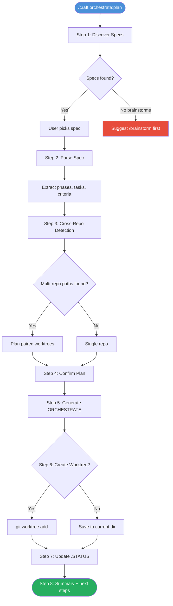

# Orchestrate Pipeline Guide (v2.21.0)

> **TL;DR**: 2 new commands, 2 brainstorm enhancements, consistent worktree types across all docs — connecting the full workflow from brainstorm to PR.

## Overview

v2.21.0 adds the missing pipeline connecting brainstorming to implementation:

```text
brainstorm → spec → ORCHESTRATE → worktree → implement → PR
```

| Feature | Type | Purpose |
|---------|------|---------|
| `/craft:orchestrate:plan` | New command | Spec → ORCHESTRATE → worktree pipeline |
| `/craft:insights` | New command | Session friction reports from facets data |
| Brainstorm Step 6 | Enhancement | Offer ORCHESTRATE creation after spec capture |
| Brainstorm Step 1.8 | Enhancement | Surface insights before brainstorming |
| Worktree Types | Documentation | Consistent 4-type taxonomy everywhere |

---

## New Commands

### `/craft:orchestrate:plan` — Spec to Worktree Pipeline

Discovers specs, parses phases, generates ORCHESTRATE files, and creates worktrees — all in one flow.

**When to use:** After brainstorming produces a spec, or when you have a spec and want to start implementation.

```bash
# Interactive: scan for specs and choose
/craft:orchestrate:plan

# Direct: specify spec path
/craft:orchestrate:plan docs/specs/SPEC-auth-2026-02-15.md

# ORCHESTRATE only (no worktree)
/craft:orchestrate:plan docs/specs/SPEC-auth.md --output orchestrate-only
```

**8-Step Execution:**



**Generated ORCHESTRATE files include:**

- Phase overview with effort estimates
- Per-phase task checklists
- Friction Prevention section (auto-populated from insights if available)
- Acceptance criteria from the spec
- Commit strategy
- Verification commands (auto-detected from project type)
- Session instructions for starting work

---

### `/craft:insights` — Session Insights Report

Aggregates session data from `~/.claude/usage-data/facets/` to identify friction patterns and suggest improvements.

**When to use:** Periodically to review usage patterns, or before creating ORCHESTRATE files.

```bash
# Default: terminal report, last 30 days
/craft:insights

# HTML report for sharing
/craft:insights --format html

# Last 7 days, specific project
/craft:insights --since 7 --project craft
```

**Report includes:**

- Session count and date range
- Goal categories (feature dev, bug fix, docs, etc.)
- Friction patterns with counts and types
- Top friction details
- Outcome distribution (success/partial/abandoned)
- CLAUDE.md suggestions with priority levels

**Friction Type Mapping:**

| Friction Type | Guardrail Rule |
|--------------|----------------|
| `wrong_approach` | Verify CWD is the worktree before starting |
| `context_loss` | Read ORCHESTRATE file on session start |
| `tool_misuse` | Use /craft:do for routing, not manual commands |
| `test_failure` | Run tests after each phase, not just at the end |
| `config_drift` | Run validate-counts after structural changes |

---

## Brainstorm Enhancements

### Step 6: Create Orchestration? (after spec capture)

After brainstorming produces a spec (Step 5.5), you're now offered:

1. **ORCHESTRATE + worktree** — Full pipeline: generate ORCHESTRATE file and create worktree
2. **ORCHESTRATE only** — Generate file in current directory
3. **Skip** — Keep the spec, orchestrate later

This connects the brainstorm output directly to the implementation workflow.

### Step 1.8: Insights Integration (before brainstorming)

Before questions begin, insights are checked for relevant past patterns:

- Shows friction summary if related sessions exist
- Surfaces prior approaches on the same topic
- Auto-adds "Known Risks" to spec generation

Skips silently when no insights data exists.

---

## Worktree Types

A consistent 4-type taxonomy used across all documentation:

| Type | Created By | Lifetime | Branch Pattern | ORCHESTRATE |
|------|-----------|----------|---------------|-------------|
| **Manual** | `/craft:git:worktree create` | Long-lived | `feature/*` | Optional |
| **Pipeline** | `/craft:orchestrate:plan` or brainstorm | Long-lived | `feature/*` | Always |
| **Swarm** | `/craft:orchestrate --swarm` | Short-lived | `swarm-*` | Reads existing |
| **Cross-Repo** | Pipeline (multi-repo spec) | Long-lived | `feature/*` (same name) | Scoped per-repo |

**Decision guide:**

| Scenario | Use |
|----------|-----|
| Quick fix, single file | Manual worktree |
| Feature with spec and phases | Pipeline worktree |
| Parallel implementation, file conflicts | Swarm worktrees |
| Changes spanning multiple repos | Cross-repo worktrees |

---

## Insights Lifecycle

The full flow from sessions to workflow improvements:

```mermaid
graph TD
    S[Sessions] --> F[Facets Data]
    F --> I[/craft:insights]
    I --> R1[CLAUDE.md Rules]
    I --> R2[ORCHESTRATE Friction Prevention]
    I --> R3[Brainstorm Context]
    R1 --> B[Better Sessions]
    R2 --> B
    R3 --> B
    B --> S
```

---

## Suggested Workflows

### Workflow 1: Full Pipeline (Brainstorm to PR)

```bash
# 1. Brainstorm the feature
/craft:workflow:brainstorm "add user authentication"

# 2. Save as spec (prompted automatically)
# → Saves to docs/specs/SPEC-auth-2026-02-15.md

# 3. Create orchestration (prompted in Step 6)
# → Generates ORCHESTRATE-auth.md + creates worktree

# 4. Start implementation
cd ~/.git-worktrees/craft/feature-auth
claude
# → "Read ORCHESTRATE-auth.md and start Phase 1"
```

### Workflow 2: From Existing Spec

```bash
# Already have a spec? Go directly to orchestration
/craft:orchestrate:plan docs/specs/SPEC-dashboard.md
```

### Workflow 3: Insights-Driven Planning

```bash
# 1. Check friction patterns
/craft:insights --project craft

# 2. Create ORCHESTRATE — friction prevention auto-populated
/craft:orchestrate:plan docs/specs/SPEC-feature.md
# → ORCHESTRATE includes guardrails from insights
```

---

## See Also

- [Quick Reference](../REFCARD.md) — All commands at a glance
- [Insights Improvements Guide](insights-improvements-guide.md) — v2.18.0 insights features
- [Worktree Tutorial](../tutorials/TUTORIAL-worktree-setup.md) — Step-by-step worktree guide
- [Orchestrator Guide](orchestrator.md) — Multi-agent orchestration
- [Version History](../VERSION-HISTORY.md) — v2.21.0 release notes
