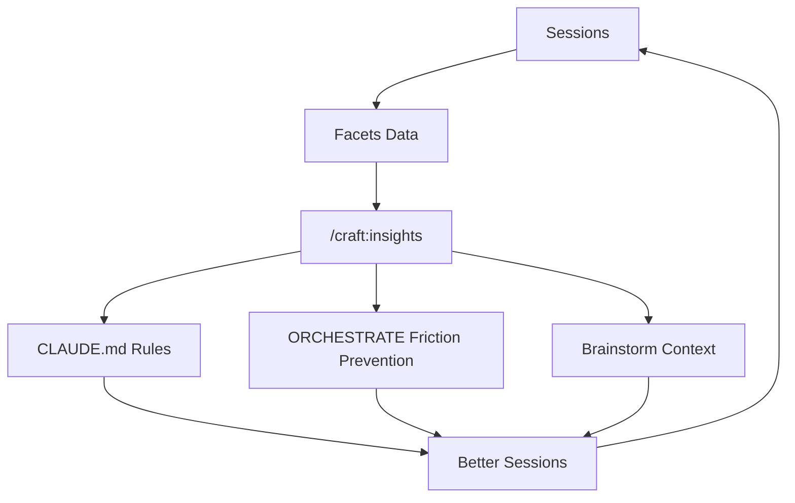

# Orchestrate Pipeline Guide (v2.21.0+, grill added v2.43.0)

> **TL;DR**: divergent (`brainstorm`) generates options; convergent (`grill`) interrogates a spec/plan until every branch is resolved; `orchestrate:plan` turns the locked result into a worktree; `orchestrate` (or a background-dispatch agent) implements it. Four commands, one direction.

## Overview

The full workflow connecting an idea to a merged PR:

```text
brainstorm → spec → [grill] → ORCHESTRATE → worktree → implement → PR
```

`grill` is the step most likely to be skipped by habit — it's optional for well-scoped, low-ambiguity work, but load-bearing for anything with unresolved judgment calls (see "When to grill" below). Skipping it doesn't block the pipeline; it just means `orchestrate:plan` inherits whatever ambiguity the spec still has.

| Feature | Type | Purpose |
|---------|------|---------|
| `/craft:workflow:brainstorm` | Command | **Divergent** — generates options, captures a SPEC |
| `/craft:grill` | Command | **Convergent** — interrogates a spec/plan/topic one question at a time until every branch is resolved; captures a `GRILL-*.md` ledger |
| `/craft:orchestrate:plan` | Command | Spec (+ optional grill ledger) → ORCHESTRATE → worktree pipeline |
| `/craft:orchestrate:workflow` | Command | Coded fixed-control-flow program → schema-gated, resumable ([guide](../commands/orchestrate-workflow.md)) |
| `/craft:insights` | Command | Session friction reports from facets data |
| Brainstorm Step 6 | Enhancement | Offer ORCHESTRATE creation after spec capture |
| Brainstorm Step 1.8 | Enhancement | Surface insights before brainstorming |
| Worktree Types | Documentation | Consistent 4-type taxonomy everywhere |

---

## `/craft:grill` — Interrogate Before Building

**Convergent counterpart to brainstorm.** Where brainstorm expands the option space and ends in a captured SPEC, grill takes that SPEC (or a bare plan, ORCHESTRATE file, or diff) and stress-tests it one question at a time — `AskUserQuestion` calls, not the batched menus brainstorm uses — until every branch of the design is resolved or explicitly deferred.

**When to grill:**

| Situation | Grill first? |
|---|---|
| Spec has open judgment calls (naming, scope boundary, which of 2+ approaches) | Yes — resolve them here, not mid-implementation |
| Spec will be handed to an unattended/background agent that can't pause to ask | Yes — background agents are one-shot; unresolved ambiguity becomes a guess |
| Small, well-scoped, single clear approach | Optional — `orchestrate:plan` works directly from the SPEC |
| Bug fix, mechanical refactor | Skip — no design space to interrogate |

**Output:** `docs/specs/GRILL-<topic>-<date>.md` — its own file, never rewriting the brainstorm SPEC's body (only an idempotent one-line back-link is added to the SPEC). Contains a Decision Ledger (each resolved branch, with reasoning) and an Open Questions section for anything explicitly deferred.

**Handoff:** one-directional, same as brainstorm — `grill` never executes. It hands the locked `GRILL-*.md` forward to `/craft:orchestrate:plan`, which reads both the SPEC and the grill ledger together.

```bash
# After brainstorm captures a SPEC with unresolved design questions
/craft:grill docs/specs/SPEC-auth-2026-02-15.md

# Bare topic, no SPEC yet (grill sketches a skeleton first, then interrogates it)
/craft:grill "should we split the auth module into two services"
```

---

## New Commands

### `/craft:orchestrate:plan` — Spec to Worktree Pipeline

> The canonical behavior lives in the `plan-orchestrator` skill
> (`skills/orchestration/plan-orchestrator/SKILL.md` in the repo — not part of this site's nav);
> `/craft:orchestrate:plan` is a thin shim over it (`deprecated: true` / `replaced-by`). The flow
> below still describes the behavior accurately — it's just implemented in the skill now.

Discovers specs, parses phases, generates ORCHESTRATE files, and creates worktrees — all in one flow.

**When to use:** After brainstorming produces a spec, or when you have a spec and want to start implementation.

```bash
# Interactive: scan for specs and choose
/craft:orchestrate:plan

# Direct: specify spec path
/craft:orchestrate:plan docs/specs/SPEC-auth-2026-02-15.md

# ORCHESTRATE only (no worktree)
/craft:orchestrate:plan docs/specs/SPEC-auth.md --output orchestrate-only

# ORCHESTRATE + worktree + dispatch to a background Agent from this session
/craft:orchestrate:plan docs/specs/SPEC-auth.md --output orchestrate-dispatch
```

**8-Step Execution:**


**Generated ORCHESTRATE files include:**

- Phase overview with effort estimates
- Per-phase task checklists
- Friction Prevention section (auto-populated from insights if available)
- Acceptance criteria from the spec
- Commit strategy
- Verification commands (auto-detected from project type)
- Session instructions for starting work

#### `orchestrate-dispatch` vs. STOP-new-session — when to use which

Both modes give you the same self-containment guarantee (a durable `ORCHESTRATE-<topic>.md` that's
complete enough to execute standalone). They differ in **who executes it and from where**:

| | STOP-new-session (`orchestrate-worktree` / `orchestrate-only`) | `orchestrate-dispatch` |
|---|---|---|
| Execution | Fresh human session, `cd` into worktree, new `claude` process | Background `Agent` call, dispatched from the live planning session |
| Token cost | Higher — new session cold-starts (reloads CLAUDE.md, system prompt) | Lower — no cold start, reuses the planning session's already-loaded context |
| Attention cost | Higher — you personally open/babysit a new terminal per feature | Lower — background agent notifies on completion, no babysitting |
| Safety guarantee | Structural — a new session *cannot* depend on live-conversation-only context | Same guarantee, but requires the extra mechanisms below since a background agent can't pause to ask |
| Traceability | Durable ORCHESTRATE file | Same durable file, plus the dispatching session's own review-gate re-check |
| Extra safety machinery | None needed | Confirm-before-dispatch gate, concurrency cap, failure/hang detection, resumability |

**Use `orchestrate-dispatch` when:** you're actively planning multiple independent features in one
session and want to fan work out without paying the token/attention cost of N cold-started
sessions — the pattern this mode formalizes (see the plan-orchestrator skill's `orchestrate-dispatch`
subsection for the full mechanics: confirm gate, self-containment prompt, concurrency cap, hang
detection, resumability).

**Use STOP-new-session when:** you want the strongest possible safety guarantee (a session that
structurally cannot leak live-conversation context), you're not actively multi-tasking across
features, or the spec is complex/high-ambiguity enough that a human should be present to steer it
interactively rather than dispatching it unattended.

---

### `/craft:insights` — Session Insights Report

Aggregates session data from `~/.claude/usage-data/facets/` to identify friction patterns and suggest improvements.

**When to use:** Periodically to review usage patterns, or before creating ORCHESTRATE files.

```bash
# Default: terminal report, last 30 days
/craft:insights

# HTML report for sharing
/craft:insights --format html

# Last 7 days, specific project
/craft:insights --since 7 --project craft
```

**Report includes:**

- Session count and date range
- Goal categories (feature dev, bug fix, docs, etc.)
- Friction patterns with counts and types
- Top friction details
- Outcome distribution (success/partial/abandoned)
- CLAUDE.md suggestions with priority levels

**Friction Type Mapping:**

| Friction Type | Guardrail Rule |
|--------------|----------------|
| `wrong_approach` | Verify CWD is the worktree before starting |
| `context_loss` | Read ORCHESTRATE file on session start |
| `tool_misuse` | Use /craft:do for routing, not manual commands |
| `test_failure` | Run tests after each phase, not just at the end |
| `config_drift` | Run validate-counts after structural changes |

---

## Brainstorm Enhancements

### Step 6: Create Orchestration? (after spec capture)

After brainstorming produces a spec (Step 5.5), you're now offered:

1. **ORCHESTRATE + worktree** — Full pipeline: generate ORCHESTRATE file and create worktree
2. **ORCHESTRATE only** — Generate file in current directory
3. **Skip** — Keep the spec, orchestrate later

This connects the brainstorm output directly to the implementation workflow.

### Step 1.8: Insights Integration (before brainstorming)

Before questions begin, insights are checked for relevant past patterns:

- Shows friction summary if related sessions exist
- Surfaces prior approaches on the same topic
- Auto-adds "Known Risks" to spec generation

Skips silently when no insights data exists.

---

## Worktree Types

A consistent 4-type taxonomy used across all documentation:

| Type | Created By | Lifetime | Branch Pattern | ORCHESTRATE |
|------|-----------|----------|---------------|-------------|
| **Manual** | `/craft:git:worktree create` | Long-lived | `feature/*` | Optional |
| **Pipeline** | `/craft:orchestrate:plan` or brainstorm | Long-lived | `feature/*` | Always |
| **Swarm** | `/craft:orchestrate --swarm` | Short-lived | `swarm-*` | Reads existing |
| **Cross-Repo** | Pipeline (multi-repo spec) | Long-lived | `feature/*` (same name) | Scoped per-repo |

**Decision guide:**

| Scenario | Use |
|----------|-----|
| Quick fix, single file | Manual worktree |
| Feature with spec and phases | Pipeline worktree |
| Parallel implementation, file conflicts | Swarm worktrees |
| Changes spanning multiple repos | Cross-repo worktrees |

---

## Insights Lifecycle

The full flow from sessions to workflow improvements:



---

## Suggested Workflows

### Workflow 1: Full Pipeline (Brainstorm to PR)

```bash
# 1. Brainstorm the feature
/craft:workflow:brainstorm "add user authentication"

# 2. Save as spec (prompted automatically)
# → Saves to docs/specs/SPEC-auth-2026-02-15.md

# 3. Grill it if design questions remain (skip for well-scoped specs)
/craft:grill docs/specs/SPEC-auth-2026-02-15.md
# → Saves to docs/specs/GRILL-auth-2026-02-15.md, back-linked from the SPEC

# 4. Create orchestration (prompted in Step 6, or run orchestrate:plan directly)
# → Generates ORCHESTRATE-auth.md + creates worktree
# → orchestrate:plan reads the SPEC and, if present, the GRILL ledger

# 5. Start implementation
cd ~/.git-worktrees/craft/feature-auth
claude
# → "Read ORCHESTRATE-auth.md and start Phase 1"
```

### Workflow 2: From Existing Spec

```bash
# Already have a spec, no open design questions? Go directly to orchestration
/craft:orchestrate:plan docs/specs/SPEC-dashboard.md

# Spec has unresolved judgment calls? Grill first
/craft:grill docs/specs/SPEC-dashboard.md
/craft:orchestrate:plan docs/specs/SPEC-dashboard.md
```

### Workflow 3: Insights-Driven Planning

```bash
# 1. Check friction patterns
/craft:insights --project craft

# 2. Create ORCHESTRATE — friction prevention auto-populated
/craft:orchestrate:plan docs/specs/SPEC-feature.md
# → ORCHESTRATE includes guardrails from insights
```

---

## See Also

- [Quick Reference](../REFCARD.md) — All commands at a glance
- [Insights Improvements Guide](insights-improvements-guide.md) — v2.18.0 insights features
- [Worktree Tutorial](../tutorials/TUTORIAL-worktree-setup.md) — Step-by-step worktree guide
- [Orchestrator Guide](orchestrator.md) — Multi-agent orchestration
- `/craft:grill` (`skills/orchestration/...` — see `commands/grill.md`) — convergent interrogation before `orchestrate:plan`
- [Version History](../VERSION-HISTORY.md) — v2.21.0 release notes; grill added v2.43.0
