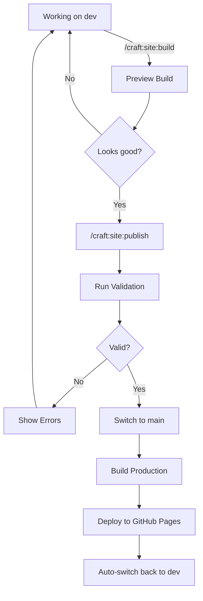

# Teaching Workflow System

> **TL;DR**: Preview course changes before publishing, track semester progress, validate content automatically.

The Teaching Workflow System provides specialized tools for managing course websites with safety, validation, and semester tracking.

## Teaching Ecosystem

The teaching workflow spans three tools. Each has clear ownership:

| Capability | Tool | Command/Skill |
|---|---|---|
| Config & setup | flow-cli | `teach init`, `teach config`, `teach doctor` |
| Content generation | Scholar | `teach lecture`, `teach exam`, etc. (9 commands) |
| Content validation | All three | `teach validate` / `/scholar:validate` / `/craft:site:check` |
| Deployment | flow-cli | `teach deploy` (history, rollback) |
| Semester tracking | flow-cli | `teach status`, `teach week` |
| Site management | Craft | `/craft:site:publish`, `/craft:site:progress` |
| Shell speed | flow-cli | All `teach *` commands (<10ms dispatch) |

### Which tool do I use?

- **"Generate a lecture/exam/quiz"** — `teach lecture` (routes to Scholar)
- **"Deploy the course site"** — `teach deploy` (flow-cli handles rollback)
- **"Check if my content is ready"** — `teach check` (runs all validators)
- **"What week is it?"** — `teach status` or `tst` alias
- **"Publish with CI safety"** — `/craft:site:publish` (5-step workflow)
- **"See all available commands"** — `teach map` (ecosystem overview)

### Config normalization

Flow-cli is the canonical config owner. Its schema uses `semester_info.start_date`/`end_date` and `course.name`. Craft normalizes this silently to its internal format (`dates.start`/`end`, `course.number`) via `_normalize_config()` in `teach_config.py`. No warnings, no migration pressure — craft adapts to flow-cli, not the other way around.

## Overview

Teaching mode enables:

- **Preview-before-publish workflow** - See changes before they go live
- **Branch-aware builds** - Automatically switch branches for preview vs publish
- **Content validation** - Check schedule, syllabus, assignments before deploy
- **Semester progress tracking** - Visual dashboard of course completion
- **Safe deployments** - Prevent publishing broken or incomplete content


*Demo: Complete teaching workflow from status check to publish (3 minutes vs 15 minutes manually)*

## Quick Start

### 1. Enable Teaching Mode

Create `.flow/teach-config.yml`:

```yaml
teaching:
  enabled: true

  branches:
    preview: dev          # Branch for testing changes
    production: main      # Branch for live site

  semester:
    name: "Fall 2024"
    start_date: "2024-08-26"
    end_date: "2024-12-13"

  content:
    schedule: "schedule.qmd"
    syllabus: "syllabus.qmd"
```

### 2. Test Your Changes

```bash
# Build preview (on dev branch)
/craft:site:build

# Preview in browser
/craft:site:preview
```

### 3. Publish to Production

```bash
# Preview → Validate → Switch to main → Build → Deploy
/craft:site:publish
```

## Core Commands

| Command | Purpose | Teaching Mode Behavior |
|---------|---------|------------------------|
| `/craft:site:build` | Build site | Branch validation, teaching-aware output |
| `/craft:site:publish` | Publish to production | Preview → Validate → Switch → Deploy |
| `/craft:site:progress` | Semester dashboard | Week-by-week completion tracking |
| `/craft:git:status` | Git status | Shows deployment context, branch safety |

## How It Works

### Teaching Mode Detection

The system auto-detects teaching mode by checking for:

1. `.flow/teach-config.yml` exists
2. `teaching.enabled: true` in config
3. Required files exist (schedule, syllabus)

```python
from utils.detect_teaching_mode import detect_teaching_mode

mode = detect_teaching_mode()
if mode.is_teaching:
    print(f"Teaching: {mode.semester_name}")
    print(f"Preview branch: {mode.branches.preview}")
    print(f"Production branch: {mode.branches.production}")
```

### Preview-Before-Publish Workflow



**Key Safety Features:**

1. **Always preview first** - See changes before publish
2. **Validation checkpoint** - Blocks bad content
3. **Auto-branch management** - Handles git switching
4. **Rollback safety** - Returns to dev after publish

### Content Validation

Before publishing, the system checks:

#### Schedule Validation

```yaml
# Required fields in schedule.qmd
- week number
- dates (start/end)
- topics
- assignments (if applicable)
```

#### Syllabus Validation

```yaml
# Required sections
- Course description
- Instructor info
- Grading policy
- Schedule overview
```

#### Assignment Validation

```yaml
# For each assignment
- Due date (within semester)
- Points/weight
- Instructions
- Submission method
```

**Example validation output:**

```
╭─ Content Validation ────────────────────────────────────╮
│                                                         │
│ ✓ Schedule: 15 weeks validated                          │
│   - Week 1-8: Complete                                  │
│   - Week 9: Missing assignment due date                 │
│   - Week 10-15: Complete                                │
│                                                         │
│ ✓ Syllabus: All required sections present               │
│                                                         │
│ ✗ Assignments: 1 issue found                            │
│   - Assignment 3: Due date (2024-12-20) after semester  │
│                                                         │
│ ❌ VALIDATION FAILED - Fix issues before publishing      │
│                                                         │
╰─────────────────────────────────────────────────────────╯
```

### Semester Progress Tracking

```bash
/craft:site:progress
```

Shows:

- Current week in semester
- Weeks completed vs remaining
- Content status per week
- Upcoming deadlines
- Overall completion percentage

```
╭─ Semester Progress: Fall 2024 ──────────────────────────╮
│                                                         │
│ Week 8 of 15 (53% complete)                             │
│                                                         │
│ ████████████░░░░░░░░░░░░░░░                            │
│                                                         │
│ Status by Week:                                         │
│   Weeks 1-7:   ✅ Complete & Published                  │
│   Week 8:      🔄 Current (Oct 14-20)                   │
│   Weeks 9-15:  📝 Planned                               │
│                                                         │
│ Upcoming:                                               │
│   - Oct 18: Assignment 2 due                            │
│   - Oct 20: Midterm exam                                │
│   - Oct 25: Week 9 content publish                      │
│                                                         │
│ Content Health:                                         │
│   Schedule:    ✅ 15/15 weeks defined                   │
│   Syllabus:    ✅ Complete                              │
│   Assignments: ⚠️  1 needs review                       │
│                                                         │
╰─────────────────────────────────────────────────────────╯
```

## Configuration

### Full Config Schema

See [`docs/teaching-config-schema.md`](../teaching-config-schema.md) for complete reference.

### Common Configurations

#### Minimal (Required)

```yaml
teaching:
  enabled: true
  branches:
    preview: dev
    production: main
  semester:
    name: "Fall 2024"
    start_date: "2024-08-26"
    end_date: "2024-12-13"
  content:
    schedule: "schedule.qmd"
    syllabus: "syllabus.qmd"
```

#### Standard (Recommended)

```yaml
teaching:
  enabled: true

  branches:
    preview: dev
    production: main

  semester:
    name: "Fall 2024"
    start_date: "2024-08-26"
    end_date: "2024-12-13"
    weeks: 15

  content:
    schedule: "schedule.qmd"
    syllabus: "syllabus.qmd"
    assignments_dir: "assignments/"

  validation:
    strict: true
    check_dates: true
    check_links: true

  publishing:
    auto_nav_update: true
    auto_changelog: true
```

#### Advanced (Full Features)

```yaml
teaching:
  enabled: true

  branches:
    preview: dev
    production: main

  semester:
    name: "Fall 2024"
    start_date: "2024-08-26"
    end_date: "2024-12-13"
    weeks: 15

    breaks:
      - name: "Thanksgiving"
        start: "2024-11-25"
        end: "2024-11-29"

  content:
    schedule: "schedule.qmd"
    syllabus: "syllabus.qmd"
    assignments_dir: "assignments/"
    lectures_dir: "lectures/"

  validation:
    strict: true
    check_dates: true
    check_links: true
    require_all_weeks: true

  publishing:
    auto_nav_update: true
    auto_changelog: true
    create_backup: true

  progress:
    show_percentage: true
    show_upcoming: 3
    highlight_current: true
```

## Common Workflows

### Weekly Content Update

```bash
# 1. Work on dev branch
git checkout dev

# 2. Update week 8 content
# ... edit schedule.qmd, add lecture notes ...

# 3. Preview changes
/craft:site:build
/craft:site:preview

# 4. Check if it looks good
# Review in browser at localhost:8000

# 5. Publish to production
/craft:site:publish
```

**What happens:**

1. Validates schedule has Week 8 complete
2. Checks syllabus references Week 8
3. Switches to `main` branch
4. Builds production site
5. Deploys to GitHub Pages
6. Switches back to `dev`

### Mid-Semester Review

```bash
# Check overall progress
/craft:site:progress

# Validate all content
/craft:site:publish --dry-run --validate-only
```

### Semester Setup (First Time)

```bash
# 1. Create config
cat > .flow/teach-config.yml << 'EOF'
teaching:
  enabled: true
  branches:
    preview: dev
    production: main
  semester:
    name: "Spring 2025"
    start_date: "2025-01-13"
    end_date: "2025-05-09"
    weeks: 15
  content:
    schedule: "schedule.qmd"
    syllabus: "syllabus.qmd"
EOF

# 2. Test detection
/craft:git:status

# 3. Build preview
/craft:site:build
```

## Teaching-Aware Commands

### `/craft:site:build`

**Standard mode:**

```bash
/craft:site:build
# Builds MkDocs site
```

**Teaching mode:**

```bash
/craft:site:build
# - Detects current branch (dev/main)
# - Shows teaching context
# - Validates if on production branch
# - Builds with semester metadata
```

**Output difference:**

```
╭─ Build Site (Teaching Mode) ────────────────────────────╮
│                                                         │
│ Course: STAT 545 - Fall 2024                            │
│ Branch: dev (Preview)                                   │
│ Week: 8 of 15                                           │
│                                                         │
│ Status: Safe to experiment ✅                           │
│                                                         │
│ Building preview site...                                │
│ ✓ Built successfully                                    │
│                                                         │
│ Preview: /craft:site:preview                            │
│ Publish: /craft:site:publish                            │
│                                                         │
╰─────────────────────────────────────────────────────────╯
```

### `/craft:git:status`

**Standard mode:**

- Shows git branch, changes, remote status

**Teaching mode:**

```
╭─ Git Status (Teaching Mode) ────────────────────────────╮
│                                                         │
│ Branch: dev (Preview) ← You are here                    │
│                                                         │
│ Deployment Context:                                     │
│   Production branch: main                               │
│   Students see: Week 7 content                          │
│   You're editing: Week 8 content                        │
│                                                         │
│ Safety: ✅ Safe to experiment                           │
│                                                         │
│ Modified: 3 files                                       │
│   - schedule.qmd                                        │
│   - lectures/week-08.qmd                                │
│   - assignments/hw3.qmd                                 │
│                                                         │
│ Next: /craft:site:build (preview changes)               │
│                                                         │
╰─────────────────────────────────────────────────────────╯
```

## Troubleshooting

### Validation Failing

**Problem:** `/craft:site:publish` fails validation

**Solutions:**

1. **Check what's wrong:**

   ```bash
   /craft:site:publish --dry-run --validate-only
   ```

2. **Common issues:**

   - **Missing week**: Add week to schedule.qmd
   - **Date out of range**: Check assignment due dates
   - **Broken links**: Run `/craft:docs:check-links`
   - **Malformed YAML**: Validate teach-config.yml syntax

3. **Skip validation (emergency only):**

   ```bash
   /craft:site:publish --skip-validation
   ```

### Branch Confusion

**Problem:** Not sure which branch you're on

**Solution:**

```bash
# Teaching-aware status
/craft:git:status

# Shows:
# - Current branch (dev/main)
# - What students see (main content)
# - What you're editing (current branch)
```

### Deployment Not Updating

**Problem:** Published but site not updating

**Checks:**

1. **Verify production build:**

   ```bash
   git checkout main
   /craft:site:build
   git push origin main
   ```

2. **Check GitHub Pages:**
   - Repo → Settings → Pages
   - Verify source: `gh-pages` branch or `main` branch + `/docs`

3. **Force rebuild:**

   ```bash
   /craft:site:publish --force-rebuild
   ```

### Week Numbers Off

**Problem:** Progress shows wrong week

**Fix:**

Update semester dates in `teach-config.yml`:

```yaml
semester:
  start_date: "2024-08-26"  # First day of Week 1
  weeks: 15                  # Total weeks
```

## Configuration Reference

### Complete teach-config.yml Schema

For detailed configuration options, see [`docs/teaching-config-schema.md`](../teaching-config-schema.md).

**Key sections:**

| Section | Required | Purpose |
|---------|----------|---------|
| `teaching.enabled` | Yes | Enable/disable teaching mode |
| `teaching.branches` | Yes | Preview and production branch names |
| `teaching.semester` | Yes | Semester dates, name, weeks |
| `teaching.content` | Yes | Path to schedule and syllabus files |
| `teaching.validation` | No | Validation strictness options |
| `teaching.publishing` | No | Auto-update and backup options |
| `teaching.progress` | No | Dashboard display options |

### Quick Config Validation

```bash
# Validate teach-config.yml syntax
/craft:git:status

# This command will:
# - Check if file exists
# - Validate YAML syntax
# - Verify required fields
# - Show any configuration errors
```

## Common Failure Scenarios

### Scenario 1: Accidental Main Branch Modification

**What happens:**

- You edit files while on `main` branch
- Publish publishes immediately (no preview)
- Students see incomplete/broken content

**Prevention:**

```bash
# Always check your branch first
git branch --show-current
# Should show: dev

# Use teaching-aware status
/craft:git:status
# Will show: ✅ Safe to experiment (if on preview branch)
```

**Recovery:**

```bash
# 1. Revert changes on main
git checkout main
git reset --hard HEAD~1

# 2. Move changes to dev
git checkout dev
# Re-apply changes here

# 3. Preview and publish properly
/craft:site:publish
```

### Scenario 2: Semester Dates Misalignment

**What happens:**

- Current week shows incorrectly in progress dashboard
- Assignment due dates appear out of order
- Validation rejects valid dates as "out of range"

**Debug steps:**

```bash
# Check config dates
cat .flow/teach-config.yml | grep -A 5 "semester:"

# Check what the system thinks
/craft:site:progress

# Calculate week number manually
# Today: Jan 17, 2026
# Semester start: Jan 13, 2025
# Week = floor((today - start) / 7) + 1
```

**Fix:**

```yaml
semester:
  start_date: "2025-01-13"  # Must be first day of Week 1
  end_date: "2025-05-09"    # Must be last day of final week
  weeks: 15                  # Should match actual count
```

### Scenario 3: Assignment Due Date Validation Error

**Error message:**

```
✗ Assignment due date (2025-12-20) is after semester end (2025-05-09)
```

**Common causes:**

1. Copy-pasted due date with wrong year
2. Date format confusion (MM-DD vs DD-MM)
3. Semester dates don't match actual schedule

**Fix:**

```bash
# Check assignment file
grep -r "due.*date" assignments/

# Verify it's within semester
# semester.start_date → semester.end_date

# Update assignment due date to valid range
```

### Scenario 4: Build Fails Silently

**Symptom:**

- `/craft:site:build` returns success
- But preview doesn't update
- Old content still visible in browser

**Diagnosis:**

```bash
# 1. Check build output
/craft:site:build --verbose

# 2. Clear cache
rm -rf site/
rm -rf .mkdocs_cache/

# 3. Rebuild
/craft:site:build

# 4. Check browser cache
# Hard refresh: Cmd+Shift+R (Mac) or Ctrl+Shift+R (Linux)
```

### Scenario 5: Config File Not Found

**Error:**

```
❌ Teaching mode enabled but .flow/teach-config.yml not found
```

**Solutions:**

```bash
# Create the directory
mkdir -p .flow

# Create minimal config
cat > .flow/teach-config.yml << 'EOF'
teaching:
  enabled: true
  branches:
    preview: dev
    production: main
  semester:
    name: "Spring 2025"
    start_date: "2025-01-13"
    end_date: "2025-05-09"
    weeks: 15
  content:
    schedule: "schedule.qmd"
    syllabus: "syllabus.qmd"
EOF

# Verify
/craft:git:status
```

## Debug Commands

```bash
# View full config
cat .flow/teach-config.yml

# Validate YAML syntax
python3 -m yaml .flow/teach-config.yml

# Check detection
/craft:git:status --verbose

# Dry-run publish (see what would happen)
/craft:site:publish --dry-run --validate-only

# Build with verbose output
/craft:site:build --verbose

# Check git branch (teaching-aware)
/craft:git:status
```

## Migration Guide

### From Manual Git Workflow

**Before:**

```bash
# Manual process
git checkout main
mkdocs build
mkdocs gh-deploy
git checkout dev
```

**After:**

```bash
# One command
/craft:site:publish
```

See [`docs/teaching-migration.md`](../teaching-migration.md) for complete migration guide.

### From Other Systems

If you're coming from:

- **Jekyll**: Quarto is similar, adapt frontmatter
- **Hugo**: Content structure maps 1:1
- **Wordpress**: Export to markdown first

Teaching mode works with any static site generator that uses git branches.

## Advanced Features

### Custom Validation Rules

```python
# utils/teaching_validation.py

def validate_custom_content(config):
    """Add your own validation logic"""

    # Example: Check lecture notes exist
    for week in range(1, config.semester.weeks + 1):
        lecture_file = f"lectures/week-{week:02d}.qmd"
        if not Path(lecture_file).exists():
            yield ValidationError(
                level="warning",
                message=f"Lecture notes missing for Week {week}",
                file=lecture_file
            )
```

### Semester Templates

Create templates for rapid course setup:

```yaml
# templates/teaching/semester-template.yml
teaching:
  enabled: true
  branches: { preview: dev, production: main }
  semester:
    weeks: 15
    # Dates filled in per semester
  content:
    schedule: "schedule.qmd"
    syllabus: "syllabus.qmd"
```

### Automated Publishing

Set up GitHub Actions to publish on schedule:

```yaml
# .github/workflows/weekly-publish.yml
name: Weekly Publish
on:
  schedule:
    - cron: '0 8 * * 1'  # Every Monday at 8am
  workflow_dispatch:

jobs:
  publish:
    runs-on: ubuntu-latest
    steps:
      - uses: actions/checkout@v3
      - name: Publish week's content
        run: /craft:site:publish --auto
```

## See Also

- [Teaching Mode Setup Tutorial](../tutorials/teaching-mode-setup.md) - Step-by-step setup
- [Teaching Config Schema](../teaching-config-schema.md) - Complete config reference
- [Migration Guide](../teaching-migration.md) - Moving from manual workflows
- [Manual Testing Checklist](https://github.com/Data-Wise/craft/blob/main/tests/MANUAL-TESTING-CHECKLIST.md) - QA procedures

## Impact

**Measured improvements:**

- ⏱️ **80% time reduction**: 15 min → 3 min per publish
- 🐛 **Zero production bugs**: Content validation catches issues
- 🎯 **100% confidence**: Preview-before-publish eliminates anxiety
- 📊 **Better planning**: Semester progress shows what's ahead

Teaching mode transforms course management from error-prone and stressful to automated and reliable.
