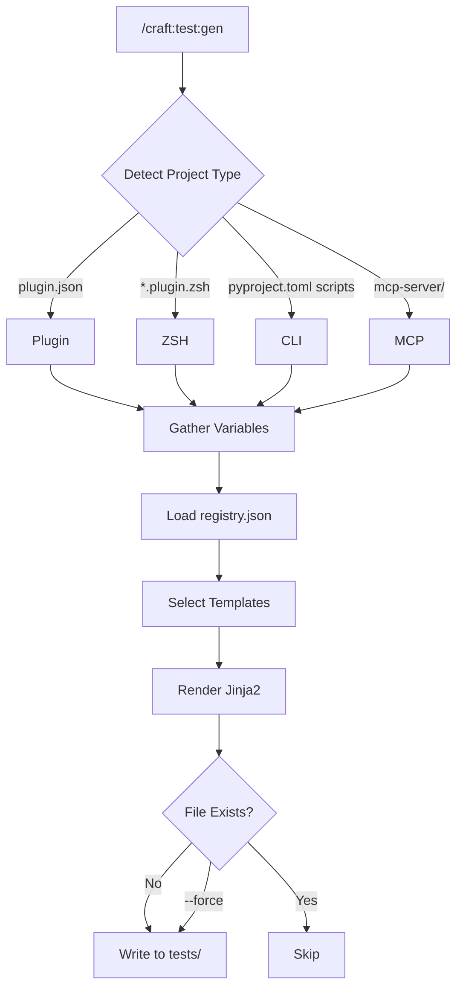
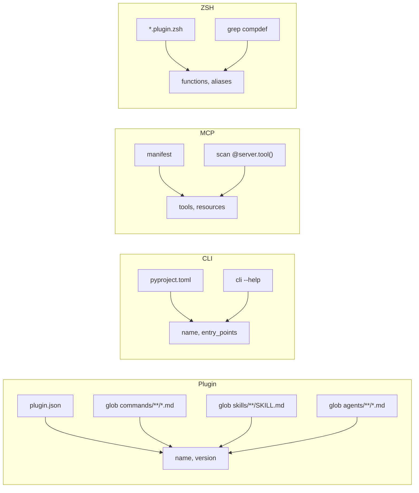
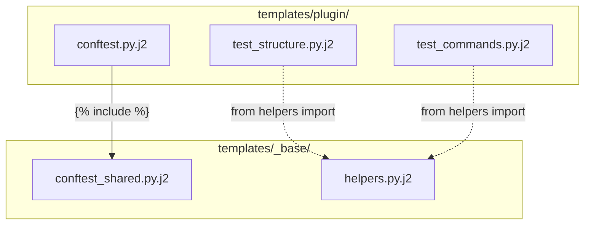

<!-- markdownlint-disable MD046 -->
# Test Architecture Guide

> **How the unified test system works: template engine, project detection, tier system, and CI integration**

---

## Overview

The test system has three layers:

```text
┌─────────────────────────────────────────────────┐
│  /craft:test           Unified runner            │
│  /craft:test:gen       Test generator            │
│  /craft:test:template  Template manager          │
├─────────────────────────────────────────────────┤
│  templates/            Jinja2 templates          │
│  registry.json         Detection + metadata      │
├─────────────────────────────────────────────────┤
│  pyproject.toml        Markers + config          │
│  tests/conftest.py     Shared fixtures           │
│  tests/helpers.py      Shared utilities          │
└─────────────────────────────────────────────────┘
```

---

## Tier System

Tests are categorized into tiers using pytest markers defined in `pyproject.toml`:

| Tier | Marker | Speed | What It Tests |
|------|--------|-------|--------------|
| `unit` | `@pytest.mark.unit` | < 1s each | Pure functions, no I/O or subprocess |
| `integration` | `@pytest.mark.integration` | < 10s each | Subprocess calls, filesystem, external tools |
| `e2e` | `@pytest.mark.e2e` | < 60s each | Full workflows against real project |
| `smoke` | `@pytest.mark.smoke` | < 2 min total | Fast subset for quick validation |

Every test file has a module-level `pytestmark` assignment:

```python
import pytest

pytestmark = [pytest.mark.unit, pytest.mark.hub]
```

This enables two-dimensional filtering: tier + domain.

### Domain Markers

Domain markers describe *what* a test covers (orthogonal to tier):

`hub`, `claude_md`, `branch_guard`, `orchestrator`, `teaching`, `commands`, `structure`, `docs`, `badge`, `brainstorm`, `release`, `marketplace`, `formatting`, `dependency`, `site`

---

## Project Type Detection

The test generator auto-detects project type by checking for sentinel files:

| Type | Detection Rule | Description |
|------|---------------|-------------|
| `plugin` | `.claude-plugin/plugin.json` | Claude Code plugin |
| `zsh` | `*.plugin.zsh` | ZSH plugin |
| `cli` | `pyproject.toml` with `[project.scripts]` | Python/Node CLI |
| `mcp` | `mcp-server/` directory | MCP server |

Detection is defined in `templates/registry.json` and evaluated in order. The first match wins.

---

## Template System

### Directory Structure

```text
templates/
├── _base/                   # Shared partials
│   ├── conftest_shared.py.j2
│   ├── helpers.py.j2
│   └── bash_header.sh.j2
├── plugin/                  # Claude Code plugin templates
│   ├── test_structure.py.j2
│   ├── test_commands.py.j2
│   ├── test_skills.py.j2
│   ├── test_agents.py.j2
│   ├── test_content.py.j2
│   ├── test_lifecycle.py.j2
│   └── conftest.py.j2
├── zsh/                     # ZSH plugin templates
├── cli/                     # Python/Node CLI templates
├── mcp/                     # MCP server templates
└── registry.json            # Metadata + detection rules
```

### Registry Schema

`registry.json` maps each project type to its detection rules, templates, and required variables:

```json
{
  "types": {
    "plugin": {
      "detect": [".claude-plugin/plugin.json"],
      "test_dir": "tests",
      "templates": {
        "test_structure": {"tier": ["smoke", "unit"], "output": "test_structure.py"},
        "test_commands": {"tier": ["unit"], "output": "test_commands.py"}
      },
      "variables": {
        "project_name": {"source": "plugin.json:name"},
        "commands": {"source": "find:commands/**/*.md"}
      }
    }
  }
}
```

### Template Rendering Flow



### Variable Gathering per Type



### Template Include Chain



---

## Rendering Engine

The rendering engine lives in `utils/test_generator.py` and exposes 4 public functions:

```python
from utils.test_generator import generate_tests

# Full generation with dry-run
result = generate_tests(Path("."), dry_run=True)
# Returns: {project_type, variables, files, output_dir, written, skipped}

# Force project type
result = generate_tests(Path("."), project_type="plugin")

# Custom output directory
result = generate_tests(Path("."), output_dir=Path("my-tests/"))
```

The engine uses a dual-path `FileSystemLoader` so templates can include shared partials:

```python
loader = FileSystemLoader([
    "templates/plugin/",  # Type-specific templates
    "templates/",         # Shared _base/ partials
])
```

---

## Shared Infrastructure

### tests/helpers.py

Extracted from 9+ test files that had duplicated utilities:

- `CheckResult` — Transitional dataclass for structured results
- `read_file()` — Safe file reading with encoding
- `extract_frontmatter()` — Parse YAML frontmatter from command files
- `init_repo()` — Create a temporary git repo with branches
- `run_hook()` — Pipe JSON to hook scripts for testing
- Path constants: `PLUGIN_DIR`, `SCRIPTS_DIR`, `COMMANDS_DIR`, `TESTS_DIR`

### tests/conftest.py

Shared pytest fixtures available to all test files:

- `craft_root` — Path to project root
- `commands_dir` — Path to commands directory
- `scripts_dir` — Path to scripts directory
- `temp_dir` — Fresh temporary directory per test
- `temp_plugin_dir` — Temporary plugin structure with plugin.json
- `temp_git_repo` — Initialized git repo with main branch and initial commit

---

## CI Integration

### Running in CI

```yaml
# GitHub Actions example
- name: Run tests
  run: |
    python3 -m pytest tests/ -m "unit or integration" \
      --tb=short -q --maxfail=10
```

### Recommended CI Strategy

| Stage | Command | Purpose |
|-------|---------|---------|
| PR checks | `/craft:test smoke` | Fast validation (< 2 min) |
| Pre-merge | `/craft:test "unit or integration"` | Thorough check (< 5 min) |
| Release | `/craft:test release` | Full suite + coverage |

---

## See Also

- [Test Commands Reference](test-commands.md) — Full argument and flag reference
- [Testing Quickstart](../tutorials/testing-quickstart.md) — Step-by-step getting started
- [Migration Guide](test-migration.md) — Old commands to new commands
