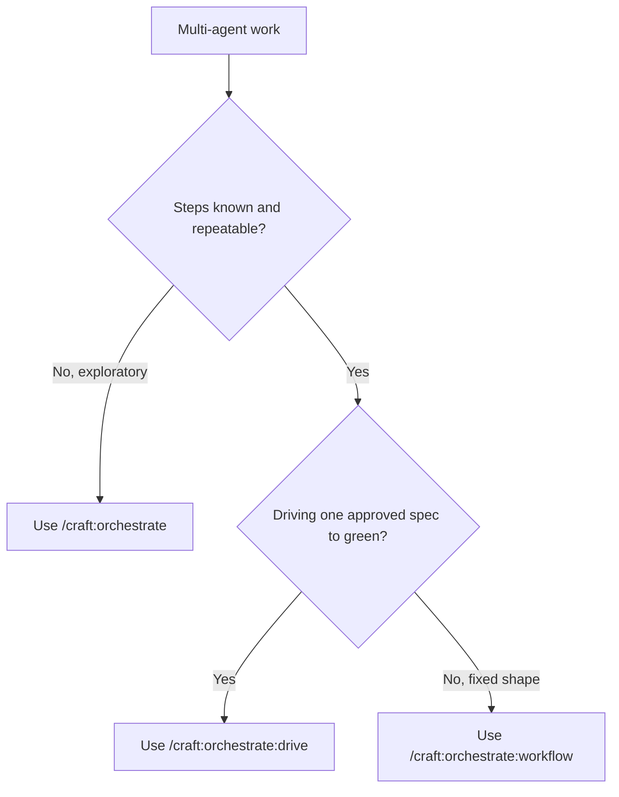

# Help: /craft:orchestrate:workflow

## What it does

Executes a **coded, fixed-control-flow workflow** — `parallel` / `pipeline` /
`loop` / `verify` — where the control flow is fixed in the definition and only
the *count* of agents in a `parallel` stage flexes to upstream data. Each agent
emits schema-gated JSON; outputs are cached by run-ID for resumable replay.

## When to use — and when not

**Use it when** the work has a known, repeatable shape: decompose → cover N →
verify M → synthesize. You want determinism (a reproducible wave plan),
structural contracts between stages, and the ability to `--resume`.

**Don't use it for** exploratory work where you can't predict the steps — reach
for `/craft:orchestrate` (LLM improvises each turn). For driving a single
approved spec to green, use `/craft:orchestrate:drive`.

### Which orchestrate mode?



## Quick start

```bash
# 1. Always preview first — zero side effects
/craft:orchestrate:workflow --dry-run

# 2. Review the wave plan (stages, fan-out width, ceiling), then run for real
/craft:orchestrate:workflow
```

## Reading the dry-run plan

`--dry-run` prints one line per wave. Statically-unknown fan-out width is shown
symbolically (`xN`) — never a fabricated number — because data-driven width is
only known at runtime:

```
DRY RUN: code-review-sweep  (run-wide ceiling: 16)
  1. decompose: agent -> task-analyzer
  2. cover: parallel xN over ${decompose.dimensions} -> reviewer
  3. verify: parallel xN over ${cover[].findings}, fan 2 -> verifier
  4. synthesize: agent -> docs-architect
```

## Failure semantics

| Situation | Behavior |
|-----------|----------|
| One agent's **structural** schema miss | Fails just that branch (structured marker); run continues, `synthesize` gets partials. |
| **Empty fan-out** (`over` → `[]`) | **Hard error** naming the upstream stage — never silently skipped. |
| A **semantic** (plausibility) concern | Advisory warning, surfaced in the manifest, **never blocks**. |
| A **`verify`** stage | Runs the project's real command; **exit status is authoritative** — a green transcript is not enough. |

## Resuming a run

```bash
# Re-run only the stages whose cache key changed (and everything downstream)
/craft:orchestrate:workflow --resume <run-id>
```

The run cache lives in `.craft/workflow-runs/<run-id>/` (gitignored):
per-agent output JSON, a human-readable `manifest.json`, and `semaphore.count`.

## See also

- `/craft:orchestrate:workflow` command reference
- `/craft:orchestrate:drive` — drive an approved SPEC to green
- Tutorial: `TUTORIAL-orchestrate-workflow.md`
