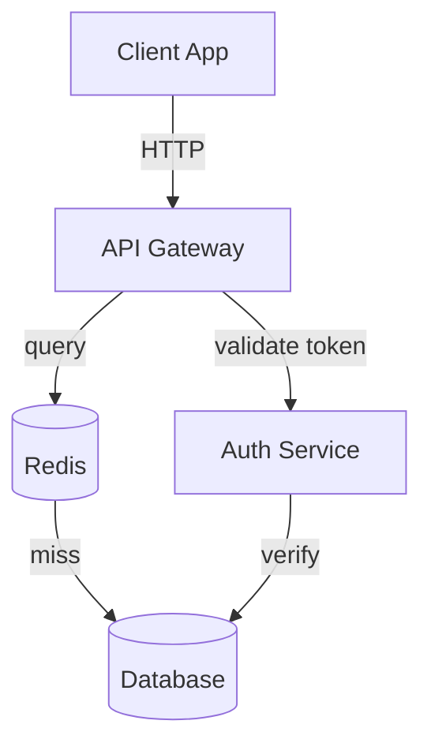

# Craft Command Examples - Real-World Usage Patterns

Practical examples and real-world usage patterns for all Craft commands.

**Version**: v1.24.0 | **Last Updated**: 2026-01-17

---

## Table of Contents

- [Quick Reference by Use Case](#quick-reference-by-use-case)
- [Root Commands](#root-commands)
- [Architecture Examples](#architecture-examples)
- [Code Examples](#code-examples)
- [Git Workflow Examples](#git-workflow-examples)
- [Documentation Examples](#documentation-examples)
- [Testing Examples](#testing-examples)
- [Site Management Examples](#site-management-examples)
- [Advanced Workflows](#advanced-workflows)

---

## Quick Reference by Use Case

### I want to...

| Goal | Command | Notes |
|------|---------|-------|
| **Quick sanity check** | `/craft:check` | Validates everything |
| **Get help** | `/craft:hub` | Interactive discovery |
| **Find next action** | `/craft:workflow:next` | Smart suggestions |
| **Add a feature** | `/craft:plan:feature "name"` then `/craft:git:worktree create` | Planned approach |
| **Quick linting** | `/craft:code:lint` | Default mode |
| **Run tests** | `/craft:test:run` | Quick smoke tests |
| **Detailed testing** | `/craft:test:run release` | Full suite with coverage |
| **Publish docs** | `/craft:site:publish` | Build + deploy |
| **Release new version** | `/craft:code:release` | Full workflow |
| **Get unstuck** | `/craft:workflow:stuck --problem "..."` | Guided help |

---

## Root Commands

### /craft:do - Smart Task Routing

```bash
# Simple feature request
/craft:do "add user authentication"

# With explicit mode selection
/craft:do "refactor database layer" optimize

# Override complexity scoring
/craft:do "fix typo in comment" simple

# Preview routing decision
/craft:do "add API endpoint" --dry-run
```

**Output Example**:
```
TASK ANALYSIS

Request: add user authentication
Complexity Score: 7/10 (moderate)
Recommended Agents: orchestrator-v2
Suggested Subtasks:
  1. Design authentication architecture
  2. Implement OAuth 2.0 integration
  3. Add unit tests for auth flow
  4. Document authentication API

Estimated Duration: 4-6 hours

Routing to: orchestrator-v2 with 3 parallel agents
```

---

### /craft:check - Pre-flight Validation

```bash
# Complete validation
/craft:check

# Only check code quality
/craft:check code

# Check and auto-fix all fixable issues
/craft:check --fix

# Preview fixes without applying
/craft:check --dry-run --fix

# Only check tests and git status
/craft:check tests git
```

**Output Example**:
```
PRE-FLIGHT VALIDATION

CODE QUALITY
  ✓ No linting errors (eslint)
  ⚠ 2 unused variables detected
  ✓ Complexity: all functions < 10 ABC

TESTS
  ✓ 142 tests passing
  ✓ Coverage: 87% (exceeds 80% threshold)
  ⚠ 1 test timeout warning (> 5s)

GIT STATUS
  ✓ On dev branch (correct)
  ✓ 3 commits ahead of origin
  ⚠ 2 uncommitted changes (fixable)

DOCUMENTATION
  ✓ All exported functions documented
  ✓ README up to date

SUMMARY: ✓ Ready to commit (2 warnings)
```

---

### /craft:hub - Command Discovery

```bash
# Interactive menu
/craft:hub

# Browse category
/craft:hub test

# Search by keyword
/craft:hub "add tests"

# Detailed help
/craft:hub docs:api --verbose
```

**Output Example**:
```
CRAFT COMMAND HUB

MAIN MENU
┌─ Code (12 commands) ............................... /craft:code:*
│  ├─ /craft:code:lint - Code style checks
│  ├─ /craft:code:test-gen - Generate test stubs
│  └─ ... more
├─ Tests (7 commands) ............................... /craft:test:*
├─ Documentation (19 commands) ....................... /craft:docs:*
└─ ... more categories

Press UP/DOWN to browse
Type to search
q to quit
```

---

### /craft:orchestrate - Multi-Agent Coordination

```bash
# Basic orchestration
/craft:orchestrate "add OAuth authentication"

# With mode selection
/craft:orchestrate "refactor payment system" optimize

# Check status
/craft:orchestrate status

# Resume interrupted task
/craft:orchestrate resume task-abc123

# Monitor live
/craft:orchestrate status live
```

**Output Example**:
```
ORCHESTRATOR v2.1 - OPTIMIZE MODE

TASK: Add OAuth authentication
Complexity: 8/10 (complex)

SPAWNING AGENTS
  [AGENT-1: architect] Designing OAuth 2.0 flow...
  [AGENT-2: code] Implementing provider integration...
  [AGENT-3: test] Creating test suite...
  [AGENT-4: docs] Writing authentication guide...

PROGRESS
  ████░░░░░░ 40% | ETA: 2h 15m

AGENT STATUS
  architect: ✓ design complete (45 min)
  code: 🟡 implementing (60% done)
  test: 🟡 writing tests (30% done)
  docs: ⏳ queued

Run: /craft:orchestrate task-123 status --live
```

---

## Architecture Examples

### /craft:arch:analyze - System Analysis

```bash
# Analyze current project
/craft:arch:analyze

# Analyze specific directory
/craft:arch:analyze src/

# With optimization mode
/craft:arch:analyze src/ optimize

# Save report
/craft:arch:analyze --output architecture-report.md
```

**Output Example**:
```
ARCHITECTURE ANALYSIS

Project Type: Node.js/TypeScript
Structure: Layered (presentation → service → repository)

COMPONENTS
  ├─ API Layer (routes/)
  │  ├─ auth.ts (254 lines)
  │  ├─ users.ts (312 lines)
  │  └─ posts.ts (189 lines)
  ├─ Service Layer (services/)
  ├─ Repository Layer (repositories/)
  └─ Models (models/)

PATTERNS DETECTED
  ✓ Dependency injection
  ✓ Service locator
  ⚠ Mixed concerns in controllers

RECOMMENDATIONS
  1. Extract validation logic to middleware
  2. Add error boundary pattern
  3. Implement circuit breaker for external APIs

Complexity Score: 6.5/10 (moderate)
```

---

### /craft:arch:diagram - Generate Diagrams

```bash
# System architecture diagram
/craft:arch:diagram

# Data flow diagram
/craft:arch:diagram dataflow

# Class structure diagram
/craft:arch:diagram class

# With output file
/craft:arch:diagram sequence --output workflow.mmd
```

**Output Example** (Mermaid):


---

### /craft:arch:plan - Feature Planning

```bash
# Plan microservices migration
/craft:arch:plan "migrate to microservices"

# With timeline
/craft:arch:plan "add real-time notifications" urgent

# With specific scope
/craft:arch:plan "implement API caching layer" normal
```

**Output Example**:
```
ARCHITECTURAL PLAN

Feature: Add real-time notifications
Timeline: Urgent (2-3 weeks)
Complexity: 8/10

APPROACH: Event-driven architecture with WebSockets

PHASES
Phase 1: Foundation (Week 1)
  ✓ Set up WebSocket server
  ✓ Implement event bus
  ✓ Database schema changes

Phase 2: Integration (Week 2)
  ✓ Connect real-time service
  ✓ Add client-side listeners
  ✓ Integration tests

Phase 3: Polish (Week 2-3)
  ✓ Performance optimization
  ✓ E2E testing
  ✓ Documentation

ESTIMATED EFFORT
  Backend: 40 hours
  Frontend: 30 hours
  Testing: 20 hours
  Total: 90 hours (2.25 dev-weeks)

RISKS
  1. WebSocket performance under load
  2. Real-time data consistency
  3. Browser compatibility

MITIGATIONS
  1. Load testing and optimization
  2. Message queue for durability
  3. Fallback to polling
```

---

## Code Examples

### /craft:code:lint - Style & Quality Checks

```bash
# Quick lint
/craft:code:lint

# Debug mode with detailed output
/craft:code:lint debug

# Lint specific directory
/craft:code:lint src/

# Preview fixes without applying
/craft:code:lint --dry-run --fix

# Full release validation
/craft:code:lint release

# Auto-fix all issues
/craft:code:lint --fix
```

**Output Example**:
```
CODE LINTING

Mode: default | Time: 8.2s

STYLE ISSUES (3)
  ⚠ src/auth.ts:45:5 - Missing docstring
  ⚠ src/db.ts:12:0 - Unused import 'moment'
  ⚠ src/utils.ts:99:15 - Line too long (102 chars > 100)

QUALITY ISSUES (1)
  ✗ src/index.ts:1-50 - Function complexity: 12 (max: 10)

SECURITY (0)
  ✓ No security issues detected

SUMMARY
  Errors: 1
  Warnings: 3
  Fixable: 2

Fix with: /craft:code:lint --fix
```

---

### /craft:code:test-gen - Generate Tests

```bash
# Generate unit tests for all files
/craft:code:test-gen

# Generate for specific file
/craft:code:test-gen unit src/auth.ts

# Integration tests
/craft:code:test-gen integration

# E2E tests
/craft:code:test-gen e2e
```

**Output Example**:
```
GENERATING TEST STUBS

Type: unit
Source: src/auth.ts

DETECTED FUNCTIONS
  1. authenticateUser(email, password) → Promise<Token>
  2. validateToken(token) → boolean
  3. refreshToken(token) → Promise<Token>
  4. logoutUser(token) → Promise<void>

GENERATING TESTS
  ✓ Created: tests/unit/auth.test.ts
  ✓ Created: tests/fixtures/auth-fixtures.ts
  ✓ Generated: 12 test stubs

Next: Edit tests/unit/auth.test.ts and implement test bodies
```

---

### /craft:code:demo - Record Demos

```bash
# Record GIF demo
/craft:code:demo scripts/demo-auth.sh

# Convert to asciinema
/craft:code:demo scripts/demo.sh asciinema

# Speed up playback
/craft:code:demo scripts/demo.sh gif --speed 1.5

# Save to specific location
/craft:code:demo scripts/demo.sh --output docs/demo.gif
```

---

### /craft:code:coverage - Test Coverage

```bash
# Check coverage
/craft:code:coverage

# With threshold
/craft:code:coverage --threshold 85

# HTML report
/craft:code:coverage --report html

# JSON for CI
/craft:code:coverage --report json > coverage.json
```

**Output Example**:
```
TEST COVERAGE REPORT

Overall Coverage: 87%

FILE COVERAGE
  ✓ src/auth.ts - 94% (8 uncovered)
  ✓ src/users.ts - 91% (5 uncovered)
  ✓ src/posts.ts - 78% (22 uncovered)
  ⚠ src/utils.ts - 72% (28 uncovered)

STATEMENT: 87%
BRANCH: 82%
FUNCTION: 89%
LINE: 87%

Threshold: 80% ✓ PASSING

Uncovered lines:
  src/utils.ts: 45, 46, 47, 48 (error handling)
  src/posts.ts: 120-135 (legacy code)
```

---

### /craft:code:refactor - Automated Refactoring

```bash
# Rename function across codebase
/craft:code:refactor "rename getCwd to getCurrentWorkingDirectory"

# Preview changes
/craft:code:refactor "rename getCwd to getWorkingDirectory" --dry-run

# Extract method
/craft:code:refactor "extract method processUserData" src/user-service.ts

# Skip test running during refactor
/craft:code:refactor "move UserService to src/services/" --no-test
```

**Output Example**:
```
REFACTORING: Rename getCwd to getCurrentWorkingDirectory

Scanning codebase...
Found: 23 occurrences in 8 files

IMPACT ANALYSIS
  Files affected: 8
  Tests that will run: 12
  Complexity: Medium

PREVIEW
  src/utils.ts: 5 replacements
  src/cli.ts: 3 replacements
  src/config.ts: 2 replacements
  ... (18 more)

Apply with: /craft:code:refactor "rename getCwd to getCurrentWorkingDirectory" --fix
Or review with: /craft:code:refactor "..." --dry-run
```

---

### /craft:code:release - Version Release

```bash
# Automatic version detection
/craft:code:release

# Specific version
/craft:code:release 2.0.0

# Preview steps
/craft:code:release --dry-run

# Skip tests for hotfix
/craft:code:release 1.0.1 --skip-tests
```

**Output Example**:
```
RELEASE WORKFLOW

Current Version: 1.2.3
Next Version: 1.3.0 (minor bump)

RELEASE CHECKLIST
  ✓ All tests passing (87% coverage)
  ✓ No uncommitted changes
  ✓ Branch: main
  ✓ Up to date with origin

RELEASE STEPS
  1. Update version in package.json
  2. Generate changelog
  3. Commit: "chore: release v1.3.0"
  4. Create git tag: v1.3.0
  5. Push to origin
  6. Create GitHub release
  7. Publish to npm

ESTIMATED TIME: 2-3 minutes

Proceed? (yes/no)
```

---

## Git Workflow Examples

### /craft:git:init - Repository Setup

```bash
# Initialize with defaults
/craft:git:init

# Monorepo template
/craft:git:init monorepo

# Minimal setup
/craft:git:init minimal

# Without git hooks
/craft:git:init --no-hooks
```

---

### /craft:git:worktree - Parallel Development

```bash
# First-time setup
/craft:git:worktree setup

# Create worktree for feature branch
/craft:git:worktree create feature/auth

# List all worktrees
/craft:git:worktree list

# Clean up merged worktrees
/craft:git:worktree clean

# Complete and create PR
/craft:git:worktree finish
```

**Workflow Example**:
```bash
# Start new feature in separate checkout
/craft:git:worktree create feature/auth
cd ~/.git-worktrees/craft/feature-auth

# Work on feature
npm start
npm test

# When done
/craft:git:worktree finish
# Creates PR automatically

# Meanwhile, work on something else in main repo
cd /original/craft
/craft:git:worktree create feature/docs
```

---

### /craft:git:sync - Keep In Sync

```bash
# Sync with defaults (pull + rebase)
/craft:git:sync

# Preview changes
/craft:git:sync --dry-run

# Merge instead of rebase
/craft:git:sync --no-rebase

# Force sync (dangerous!)
/craft:git:sync --force
```

---

### /craft:git:branch - Branch Management

```bash
# Create feature branch
/craft:git:branch create feature/auth

# Create hotfix branch
/craft:git:branch create hotfix/security-patch --type hotfix

# List all branches
/craft:git:branch list

# Delete merged branch
/craft:git:branch delete old-feature

# Rename branch
/craft:git:branch rename old-name new-name
```

---

## Documentation Examples

### /craft:docs:api - Generate API Docs

```bash
# Generate OpenAPI spec
/craft:docs:api

# Generate Swagger spec
/craft:docs:api swagger

# Save to file
/craft:docs:api openapi --output api-spec.yaml

# Include security schemes
/craft:docs:api --with-security
```

**Output Example** (OpenAPI 3.1):
```yaml
openapi: 3.1.0
info:
  title: Auth API
  version: 1.0.0
servers:
  - url: https://api.example.com
paths:
  /auth/login:
    post:
      summary: Authenticate user
      requestBody:
        required: true
        content:
          application/json:
            schema:
              type: object
              properties:
                email: {type: string}
                password: {type: string}
      responses:
        200:
          description: Success
          content:
            application/json:
              schema:
                $ref: '#/components/schemas/Token'
```

---

### /craft:docs:changelog - Generate Changelog

```bash
# From last release
/craft:docs:changelog

# Between specific versions
/craft:docs:changelog --from v1.0.0 --to v1.2.0

# JSON format for automation
/craft:docs:changelog --format json

# Save to file
/craft:docs:changelog --output CHANGELOG.md
```

**Output Example**:
```markdown
# Changelog

## [1.2.0] - 2026-01-15

### Added
- OAuth 2.0 authentication support
- Real-time notifications with WebSockets
- Dependency audit command

### Fixed
- Race condition in token refresh
- Memory leak in WebSocket handler
- Incorrect error messages

### Changed
- Updated dependencies to latest versions
- Improved error handling

## [1.1.0] - 2025-12-20

### Added
- API documentation generation
- Test coverage reporting

...
```

---

### /craft:docs:check-links - Validate Links

```bash
# Check internal links only
/craft:docs:check-links

# Include external URLs
/craft:docs:check-links --external

# Auto-fix broken links
/craft:docs:check-links --fix

# Save report
/craft:docs:check-links --report json > links.json
```

---

### /craft:docs:guide - Generate Guides

```bash
# Generate getting started guide
/craft:docs:guide "getting started"

# Intermediate level
/craft:docs:guide "advanced testing" intermediate

# Expert level
/craft:docs:guide "deployment and devops" advanced
```

---

## Testing Examples

### /craft:test:run - Run Tests

```bash
# Quick smoke tests
/craft:test:run

# Full test suite
/craft:test:run release

# Debug mode
/craft:test:run debug

# Specific test file
/craft:test:run tests/auth.test.ts

# Filter by test name
/craft:test:run --filter "authentication"

# Parallel execution
/craft:test:run optimize
```

**Output Example**:
```
TEST EXECUTION

Mode: release | Workers: 4
Time limit: 5 minutes

RUNNING TESTS
  ✓ tests/unit/auth.test.ts (142ms)
    ✓ Should authenticate user (45ms)
    ✓ Should validate token (23ms)
    ✓ Should refresh token (34ms)
    ✓ Should reject invalid token (40ms)
  ✓ tests/unit/users.test.ts (178ms)
  ⏳ tests/integration/db.test.ts (running...)

COVERAGE
  Statements: 87%
  Branches: 82%
  Functions: 89%
  Lines: 87%

SUMMARY: 156/156 passing (2.4s)
```

---

### /craft:test:watch - Watch Mode

```bash
# Watch all tests
/craft:test:watch

# Watch specific pattern
/craft:test:watch --filter auth

# With coverage
/craft:test:watch --coverage
```

---

## Site Management Examples

### /craft:site:init - Create Site

```bash
# MkDocs site
/craft:site:init

# Hugo site
/craft:site:init hugo

# With theme
/craft:site:init mkdocs --theme material
```

---

### /craft:site:build - Build Site

```bash
# Development build
/craft:site:build

# Production build
/craft:site:build --production

# With minification
/craft:site:build --production --minify
```

---

### /craft:site:deploy - Deploy Site

```bash
# GitHub Pages
/craft:site:deploy

# Netlify
/craft:site:deploy netlify

# Vercel
/craft:site:deploy vercel

# Preview first
/craft:site:deploy --dry-run
```

---

### /craft:site:publish - Build + Deploy

```bash
# One-command publish
/craft:site:publish

# Skip build (if already built)
/craft:site:publish --skip-build
```

---

## Advanced Workflows

### Complete Feature Development Workflow

```bash
# 1. Plan feature
/craft:plan:feature "Add two-factor authentication" --timeline normal

# 2. Create isolated worktree
/craft:git:worktree create feature/2fa

# 3. Generate tests first (TDD)
/craft:code:test-gen unit src/auth/totp.ts

# 4. Implement feature
# ... write code ...

# 5. Check everything
/craft:check

# 6. Run all tests
/craft:test:run release

# 7. Validate code
/craft:code:lint release

# 8. Generate docs
/craft:docs:api --output api-spec.yaml

# 9. Complete and create PR
/craft:git:worktree finish
```

---

### Complete Release Workflow

```bash
# 1. Plan release
/craft:check
/craft:test:run release

# 2. Validate everything
/craft:code:lint release
/craft:code:coverage --threshold 85

# 3. Build and test locally
/craft:code:ci-local

# 4. Create release
/craft:code:release

# 5. Deploy
/craft:site:publish

# 6. Verify in production
# ... manual testing ...

# 7. Recap accomplishments
/craft:workflow:recap --detail
```

---

### Debugging a Complex Issue

```bash
# 1. Get unstuck
/craft:workflow:stuck --problem "Tests failing intermittently"

# 2. Debug specific test
/craft:test:debug "should process payment"

# 3. Check code quality
/craft:code:debug "npm start"

# 4. Analyze architecture
/craft:arch:review --detailed

# 5. Get next steps
/craft:workflow:next
```

---

## Shell Integration

### Alias Examples

```bash
# Add to ~/.zshrc or ~/.bashrc
alias cc='/craft:check'
alias ct='/craft:test:run'
alias cl='/craft:code:lint'
alias cs='/craft:git:status'
alias cw='cd ~/.git-worktrees/craft'
```

Usage:
```bash
cc          # Run /craft:check
ct release  # Run /craft:test:run release
cl --fix    # Run /craft:code:lint --fix
cs          # Run /craft:git:status
```

---

## Performance Tips

### Quick Validation (< 30s)
```bash
/craft:check                    # < 30s
/craft:code:lint                # < 10s
/craft:git:status               # < 5s
```

### Normal Development (1-5 min)
```bash
/craft:test:run                 # ~2 min
/craft:code:coverage            # ~1 min
/craft:docs:check-links         # ~2 min
```

### Full Pre-Release (5-30 min)
```bash
/craft:test:run release         # ~5 min
/craft:code:lint release        # ~3 min
/craft:code:coverage --threshold 90  # ~1 min
/craft:site:build --production  # ~5 min
```

---

**Last Updated**: January 17, 2026 | **Version**: v1.24.0
