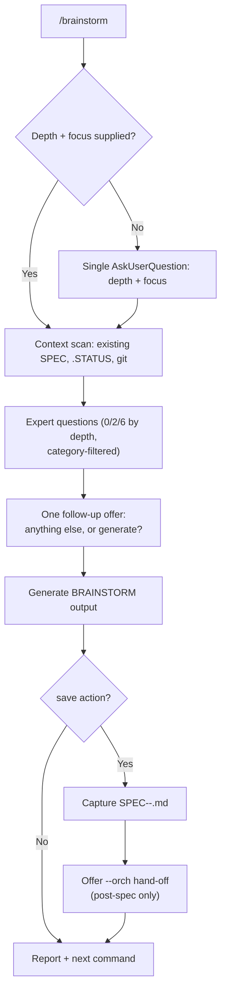

# Brainstorm Quick Reference Card

> At-a-glance reference for `/workflow:brainstorm`

---

## Syntax

```
/brainstorm [depth] [focus] [action] [-C|--categories "cats"] "topic"
```

Depth and focus, if omitted, are asked together in a single `AskUserQuestion`
call (the only depth+focus decision point). There is no colon notation and
no `max`/`m` tier.

## Depth Layer

| Depth | Expert Questions | Time |
|-------|-------------------|------|
| quick | 0 | < 1 min |
| default | 2 | < 5 min |
| deep | 6 | < 10 min |

No per-invocation count override (`d:5`, `m:12`) — `deep` is the ceiling. Use
the post-question follow-up offer ("anything else before I generate this?")
to add more instead.

## Focus Layer

| Focus | Shapes output |
|-------|----------------|
| `feat` | User stories, requirements-first |
| `arch` | Mermaid diagram, technical approach |
| `ux` | User-facing scope, success criteria |
| `api` | API endpoints, technical + requirements |
| `ui` | Visual/interaction scope |
| `ops` | Technical approach, risks, timeline |

## Action Layer

| Action | Effect |
|--------|--------|
| `save` | Captures a `docs/specs/SPEC-<topic>-<date>.md` in addition to the BRAINSTORM file |

## Category Override (`-C` / `--categories`)

Default categories are focus-driven (table below). Override with a
comma-separated list to limit expert questions regardless of focus:

| Category | Covers |
|----------|--------|
| `req` | requirements |
| `users` | target users / audience |
| `scope` | what's in / out of scope |
| `tech` | technical approach, stack |
| `timeline` | sequencing, milestones |
| `risks` | risks, edge cases, failure modes |
| `existing` | existing code/patterns to reuse or replace |
| `success` | success criteria |
| `all` | every category (default at `deep` when `-C` omitted) |

Default categories by focus:

| Focus | Default categories |
|-------|---------------------|
| `feat` | req, users, scope, success |
| `arch` | tech, risks, existing, scope |
| `api` | tech, req, success |
| `ux` | users, scope, success |
| `ops` | tech, risks, timeline |
| (auto/unset) | req, users, tech, success |

---

## Flow



Two decision points total: **(1)** depth+focus (skippable via arguments),
**(2)** the one follow-up offer. No milestone re-prompting, no per-depth
escape-hatch menu.

---

## No In-Skill Agent Delegation

The pre-redesign version launched background agents directly from a "max"
depth tier, duplicating `orchestrator-v2`'s wave checkpoints/model
routing/confirmation safeguards without them, and referencing agent type
names that didn't exist. This was removed. The current skill does not spawn
subagents itself — after `save`, it offers a hand-off to the orchestrator via
the existing `--orch` flag / `plan-orchestrator` skill /
`/craft:orchestrate:plan <spec-path>`.

---

## Common Patterns

```bash
# Fastest path
/brainstorm quick "topic"

# Balanced (default depth+focus menu)
/brainstorm "topic"

# Skip the menu
/brainstorm deep feat "topic"

# Focused deep dive (category override)
/brainstorm deep feat -C req,tech "topic"

# Full spec capture
/brainstorm deep feat save "topic"

# Orchestrated hand-off (post-spec)
/brainstorm deep arch save "topic" --orch=optimize
```

---

*See also: [Power User Tutorial](../tutorials/TUTORIAL-brainstorm-power-user.md)*
