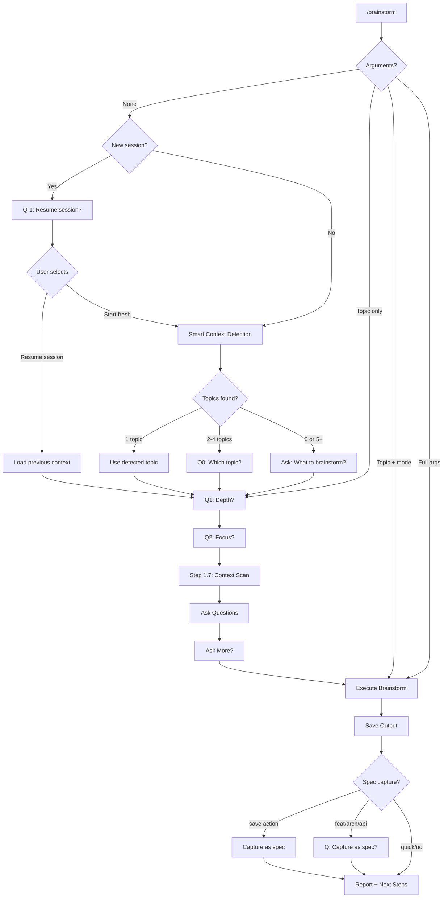
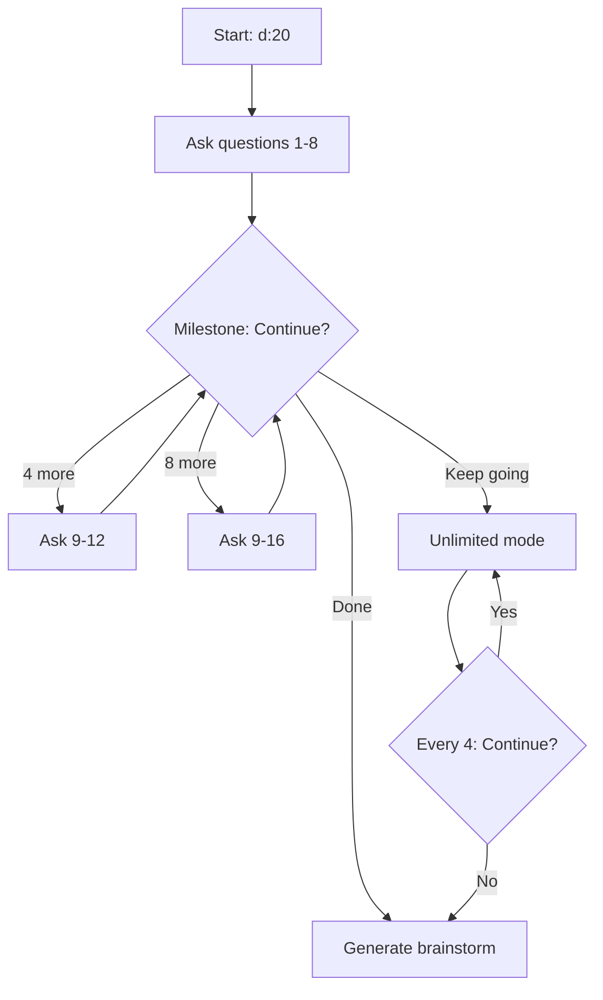

# Brainstorm Quick Reference Card

> At-a-glance reference for `/workflow:brainstorm`

---

## Syntax

```
/brainstorm [depth:count] [focus] [action] [-C|--categories "cats"] "topic"
```

## Depth Layer

| Full | Short | Count | Time |
|------|-------|-------|------|
| (default) | - | 2 | < 5 min |
| quick | q | 0 | < 1 min |
| deep | d | 8 | < 10 min |
| max | m | 8 | < 30 min |

Custom: `d:5`, `m:12`, `q:0`

## Focus Layer

| Full | Short | Single |
|------|-------|--------|
| feature | feat | f |
| architecture | arch | a |
| ux | ux | x |
| api | api | b |
| ui | ui | u |
| ops | ops | o |

## Action Layer

| Full | Short | Single |
|------|-------|--------|
| save | save | s |

## Category Shortcuts

| Short | Full |
|-------|------|
| req | requirements |
| usr | users |
| scp | scope |
| tech | technical |
| time | timeline |
| risk | risks |
| exist | existing |
| ok | success |
| all | all categories |

---

## Mode Selection Flowchart



## Milestone Flow (d:20 example)



## v2.4.0 Colon Notation Flow

```
ColonArgs["d:5, m:12, q:3"] --> parse_depth_with_count()
  --> (depth_mode, question_count)
```

## v2.4.0 Categories Flag Flow

```
-C req,tech --> parse_categories()
  --> Filter question bank
  --> Selected questions
```

---

## Agent Delegation (Max Mode)

| Focus | Agents |
|-------|--------|
| feature | product-strategist |
| architecture | backend-architect, database-architect |
| design | ux-ui-designer |
| backend | backend-architect, security-specialist |
| frontend | frontend-specialist, performance-engineer |
| devops | devops-engineer |

---

## Common Patterns

```bash
# Fastest path
/brainstorm q "topic"

# Balanced (default)
/brainstorm "topic"

# Focused deep dive
/brainstorm d:5 f -C req,tech "topic"

# Full spec capture
/brainstorm d f s "topic"

# Maximum analysis
/brainstorm m a s "topic"

# Orchestrated
/brainstorm "topic" --orch=optimize
```

---

*See also: [Power User Tutorial](../tutorials/TUTORIAL-brainstorm-power-user.md) | [Question Bank](../specs/SPEC-brainstorm-question-bank.md)*
