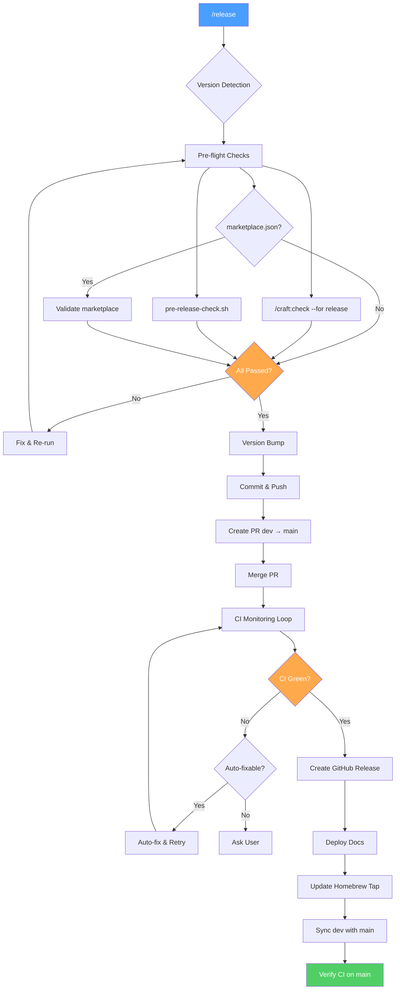

# Quick Reference: Release Pipeline

**End-to-end release automation** — version detection, pre-flight checks, PR creation, merge, GitHub release.

**Version:** 2.22.0 | **Skill:** `skills/release/SKILL.md` | **NEW:** CI monitoring loop (Step 6.5)

---

## Quick Decision Tree

```text
Ready to release?
│
├─ Just want to see what would happen?
│   └─ /release --dry-run
│
├─ Know the version already?
│   └─ /release v2.18.0
│
├─ Want auto-suggested version?
│   └─ /release (analyzes commits)
│
├─ Not on dev branch?
│   └─ git checkout dev first
│
└─ Feature work still in progress?
    └─ Finish and merge to dev first
```

---

## Pipeline Steps at a Glance

| Step | Action | Side Effects |
|------|--------|-------------|
| 1 | Detect version | Read-only |
| 2a | `/craft:check --for release` | Read-only (full CI mirror) |
| 2b | `pre-release-check.sh` | Read-only (metadata) |
| 2c | Marketplace validation | Read-only |
| 3 | Bump version | Modifies files |
| 4 | Commit and push | Creates commit, pushes |
| 5 | Create release PR | Creates PR (dev to main) |
| 6 | Merge PR | Merges to main |
| **6.5** | **CI monitoring loop** | **Polls, diagnoses, retries (NEW v2.22.0)** |
| 7 | Create GitHub release | Creates tag and release |
| 8 | Post-release | Deploys docs, syncs dev |
| 8.5 | Update Homebrew tap | Modifies tap formula |

### Release Pipeline Flow



---

## Dry-Run Mode

```text
/release --dry-run    # or: /release -n
```

Shows the full action plan without executing anything. No commits, PRs, tags, or deploys.

**Risk level:** HIGH

---

## Version Detection Priority

| Priority | Source | Project Type |
|----------|--------|-------------|
| 1 | `.claude-plugin/plugin.json` | Craft plugins |
| 2 | `package.json` | Node projects |
| 3 | `pyproject.toml` | Python projects |
| 4 | `DESCRIPTION` | R packages |
| 5 | Latest git tag | Fallback |

---

## Semver Suggestion

| Commits Since Last Release | Suggested Bump |
|---------------------------|---------------|
| Only `fix:`, `chore:`, `docs:` | **patch** (x.y.Z) |
| Any `feat:` | **minor** (x.Y.0) |
| Any `!:` or `BREAKING CHANGE` | **major** (X.0.0) |

---

## Marketplace Integration

The release pipeline automatically handles marketplace distribution:

| Step | Action | What It Does |
|------|--------|-------------|
| 2c | `claude plugin validate .` | Validates marketplace.json if present |
| 3 | Version bump | Updates `metadata.version` and `plugins[0].version` |
| 8.5 | Tap auto-update | Updates Homebrew formula with new SHA256 |

**Step 3 uses `bump-version.sh`** (single command replaces manual edits):

```bash
./scripts/bump-version.sh <version>
# Updates all 11 files atomically: 3 JSON + 8 text
# See: docs/reference/REFCARD-BUMP-VERSION.md
```

**Files bumped in Step 3:**

| File | Fields |
|------|--------|
| `plugin.json` | `version`, description counts |
| `marketplace.json` | `metadata.version`, `plugins[0].version`, description counts |
| `package.json` | `version`, description counts |
| `CLAUDE.md` | Version string, bold counts |
| `README.md` | Version badge, bold counts |
| `docs/index.md` | Version badge, count strings |
| `docs/REFCARD.md` | Header version |
| `mkdocs.yml` | Version + counts in site_description |
| `.STATUS` | Version line, count string |

---

## CI Monitoring Loop (NEW v2.22.0)

After merge (Step 6.5), the release pipeline automatically monitors CI:

```text
Poll → Diagnose → Fix/Ask → Retry (up to 3x)
```

**Two-Tier Fix Strategy:**

| Category | Action | Examples |
|----------|--------|---------|
| Auto-fix | Fix and retry silently | version_mismatch, lint_failure, changelog_format |
| Ask-first | Pause and ask user | test_failure, security_audit, build_failure |

**Configuration:** `.claude/release-config.json`

```json
{
  "ci_timeout": 600,
  "ci_max_retries": 3,
  "ci_poll_interval": 30,
  "ci_auto_fix_categories": ["version_mismatch", "lint_failure", "changelog_format"],
  "ci_ask_before_fix": ["test_failure", "security_audit", "build_failure"]
}
```

**Script:** `scripts/ci-monitor.sh` — Returns structured JSON on stdout, progress on stderr.

---

## Common Flags

| Flag | Effect |
|------|--------|
| `--dry-run` / `-n` | Preview only, no execution |
| `v2.18.0` | Use this specific version |
| (no args) | Auto-detect and suggest version |

---

## Error Recovery

| Problem | Solution |
|---------|----------|
| Pre-flight fails | Fix issues, re-run |
| PR body triggers branch guard | Rephrase to avoid literal command strings |
| Branch protection blocks merge | `--admin` with user confirmation |
| Tag already exists | Delete stale tag, retry |
| Docs deploy fails | `mkdocs build` to check errors first |

---

## Critical Rules

- **NEVER** use `--delete-branch` on release PRs (head is `dev`)
- **ALWAYS** use `--merge` (not `--squash` or `--rebase`) for release PRs
- **ALWAYS** confirm version with user before bumping
- **ALWAYS** use specific `git add <files>`, never `git add -A`

---

## See Also

- [Release Checklist](https://github.com/Data-Wise/craft/blob/dev/skills/release/references/release-checklist.md) - Per-project-type checklists
- [Release Workflow](../workflows/release-workflow.md) - Full workflow documentation
- [Release Pipeline Tutorial](../tutorials/TUTORIAL-release-pipeline.md) - Step-by-step guide
- [Branch Guard Reference](REFCARD-BRANCH-GUARD.md) - Branch protection during releases
