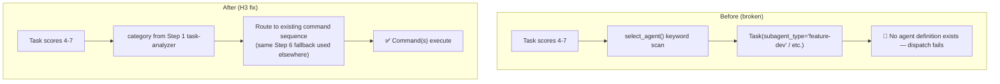
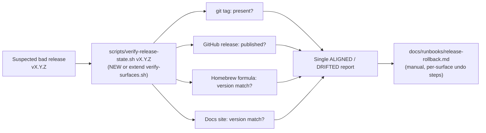

# BRAINSTORM: Craft Review Follow-ups (G1, H3, M1/M10)

**Topic:** 3 open decisions carried over from this session's adversarial review of craft's
branch-guard, release-pipeline, and command-routing subsystems (all mechanical findings
already fixed and committed on `dev`: H1, H2, H4, H5-H7, M2, M3, M4, M5, M7, M8-closed).
**Depth:** default (2 expert questions) · **Focus:** architecture
**Date:** 2026-07-06
**Status:** draft

---

## G1 — Stray `Chat-Instructions-v1.3.0.md` at repo root

**Finding:** a 293-line "Stat-Wise" Chat-surface persona/config document sits untracked at
craft's repo root. Zero connection to craft's own conventions (`CLAUDE.md`'s Project
Structure table documents only `commands/`, `skills/`, `agents/`, `tests/`, `scripts/`,
`utils/`, `.claude-plugin/` as root-level content) or to any craft initiative. Duplicates
content that already exists in the user's global `~/.claude/CLAUDE.md` / research-session
rules.

### Options considered

| Option | Effort | Trade-off |
|---|---|---|
| **Delete** | trivial | Cleanest — nothing in craft references it; the canonical copy lives in `~/.claude/` already. |
| Relocate to `~/projects/research/` or a Chat-surface-specific home | small | Preserves the file if it has value outside `~/.claude/`, but craft still isn't the right home for it — just moves the "where does this live" question elsewhere. |
| Leave as-is (git-ignore it) | trivial | Doesn't answer the question, just hides the untracked-file noise from `git status` going forward. |

### Recommendation

**Delete.** No craft file references it, its content is already the global `~/.claude/CLAUDE.md`'s
job, and it doesn't fit any documented root-level content type. Low-risk, one-line action —
this doesn't need a design decision, just your confirmation to remove it (not done in this
brainstorm; deletion is destructive and wasn't pre-authorized).

---

## H3 — `do.md` routes to 4 nonexistent agents

**Finding:** `commands/do.md`'s Score 4-7 delegation path (`select_agent()`, lines 916-947)
names `feature-dev`, `backend-architect`, `bug-detective`, `code-quality-reviewer` as
`subagent_type` values. None has a backing definition anywhere in craft's 8 real agents
(`agents/orchestrator.md`, `agents/orchestrator-v2.md`, 6 under `agents/docs/*`). A task
scoring 4 (e.g. "add OAuth login") routes to a dispatch call that has no agent to receive it.

### Decision locked (via expert question)

**Remove agent delegation from this path; fall through to command sequencing.**

Rationale: none of craft's 8 real agents are general-purpose feature/bug/quality/architecture
triage agents — `orchestrator`/`orchestrator-v2` are multi-agent coordinators, not single-intent
specialists, and the 6 `docs/*` agents are docs-specific. Forcing a fit onto the wrong tool
(Option 2 in the table below) or building 4 new agents from scratch (Option 3) both cost more
than the actual gap: `do.md` already has working command-sequencing paths for every category
(Feature/Bug/Quality/Docs/Test/Release/Architecture) via its Step 6 fallback — that fallback
just needs to become the *only* path for Score 4-7, not a fallback behind a broken agent call.

| Option | Effort | Trade-off |
|---|---|---|
| **Remove delegation, fall through to commands** (chosen) | small | Deletes ~30 lines of dead dispatch logic; Score 4-7 tasks get the same command-sequencing treatment Score 1-3 and 8+ already get elsewhere in `do.md`. No new agents to build or maintain. |
| Wire to craft's existing 8 agents | medium | Reuses built infrastructure, but every mapping would be a forced fit (no real agent does "detect and fix a bug" or "review code quality" as its actual job) — solves the crash but not the design mismatch. |
| Build 4 new specialist agents | large | Matches the original intent exactly, but is genuinely new product surface — 4x the agent-definition, testing, and long-term maintenance burden for a category of task `do.md`'s existing command routing already handles. |

### Architecture: before / after



This also closes **M6** (the two independent, disagreeing intent-classifiers inside `do.md`)
as a side effect: deleting `select_agent()`'s own keyword re-scan means Score 4-7 tasks use
the *same* `category` Step 1 already computed, instead of re-deriving intent a second,
inconsistent way.

---

## M1 / M10 — No rollback path for a bad release or a mid-bump crash

**Finding (M1):** `bump-version.sh` updates 13 files with `set -e` as its only failure
control — no transaction, no backup, no staging area. A crash on file 7/13 leaves the tree
silently half-bumped.
**Finding (M10):** no rollback/unrelease script exists anywhere in `scripts/`. Reverting a
bad tag, GitHub release, Homebrew formula, or docs-site deploy is entirely manual, across up
to 3 repos (craft, homebrew-tap, GitHub Pages), with `commands/code/release.md`'s only nod
being the generic "have a rollback plan" line.

### Decision locked (via expert question)

**Runbook + one automated verify step — not full scripted rollback, not runbook-only.**

Rationale: a rollback script that's wrong is its own incident (silently un-tagging the wrong
commit, deleting a live Homebrew formula version, etc.) — the highest-effort option is also
the highest-risk one for a process that (per `.STATUS` history) runs maybe once every few
weeks and has never yet needed a real rollback. But "purely manual, nothing written down" is
also a real gap: the *first* thing a bad release needs is a fast, reliable answer to "how far
did this actually propagate" (tag pushed? GitHub release published? Homebrew formula
updated? docs site deployed?) before any human decides what to undo and how. A single
read-only verify script answers that fast; the actual undo steps per surface stay manual and
documented, where human judgment on a live incident is still appropriate.

| Option | Effort | Trade-off |
|---|---|---|
| Documented runbook only | small | Cheapest fix for "nothing is written down," but still leaves a human guessing which surfaces already changed before they can act. |
| **Runbook + one automated verify step** (chosen) | medium | The verify script (`scripts/verify-surfaces.sh` already exists and does something adjacent — check whether it can be extended rather than duplicated) turns "did this propagate" from manual multi-repo checking into one command; undo itself stays manual/reviewed. |
| Full scripted rollback | large | Highest value if bad releases were common; given they aren't, the risk of a rollback script itself causing damage outweighs the convenience today. |

### Architecture: verify-step flow



**Reuse check before building:** `scripts/verify-surfaces.sh` (referenced in `orch.md`'s
former Step 13.6 per `.STATUS` history) already checks cross-surface alignment post-release —
confirm during implementation whether this is the same check re-purposed for a *suspected-bad*
release, or a genuinely distinct read path, before writing new code.

---

## Recommended Next Step

**Get a code + architecture review before implementing any of these** (per your explicit ask
this brainstorm) — none of the 3 decisions above have been implemented yet, only decided. Once
implementation PRs exist for H3 (do.md simplification) and M1/M10 (verify script + runbook),
run `/code-review` (implementation-level: logic, dead-code removal correctness, test coverage)
and `/craft:arch:review` (architecture-level: does the verify-script reuse `verify-surfaces.sh`
correctly, does removing `select_agent()` leave any other caller stranded) before merging —
do not skip straight from this brainstorm to a PR.

1. G1 → confirm delete, then a one-line `rm` (destructive — needs your explicit go-ahead).
2. H3 → implement the "remove delegation, fall through to commands" fix in `do.md`.
3. M1/M10 → decide whether to extend `verify-surfaces.sh` or write a new script, then implement + write the runbook.
4. **Before merging any of the above:** `/code-review` + `/craft:arch:review`.

---

## Test-Plan Scaffolding

| Item | Tiers | Rationale |
|---|---|---|
| G1 (delete stray file) | N/A — no code path, pure file removal | Docs/file-only change, nothing to test. |
| H3 (`do.md` simplification) | `e2e` + `dogfood` | Flag/prose-shaped change to an existing command's routing logic — no new parser. |
| M1/M10 (verify script + runbook) | `e2e` + `dogfood` + `unit` | New script (`+ new parser or script` tier per the inference rule) checking 4 independent surfaces — unit-testable per-surface, e2e-testable end to end. |

```bash
# TODO(author): delete if not contract-bearing
# H3: do.md Score 4-7 routes to command sequencing, never to a
# subagent_type with no backing agent definition.
test_do_score_4_7_no_agent_dispatch() {
  # plant a Score-4 task, assert no Task(subagent_type=...) call for the
  # 4 removed names, assert command(s) from the category fallback ran
  :
}
```

```bash
# TODO(author): delete if not contract-bearing
# M1/M10: verify-release-state reports DRIFTED when Homebrew formula
# version doesn't match the just-tagged release version (planted defect).
test_verify_release_state_detects_formula_drift() {
  :
}
```

## Documentation Scaffolding

Per the doc-scorer rubric (`commands/docs/sync.md`, threshold ≥3):

- [x] **Guide update** — `commands/code/release.md`'s "have a rollback plan" line should
  point at the new runbook once it exists (score: touches a documented command's behavior).
- [ ] Refcard — N/A, score < 3 (no new command surface, `do.md`'s existing flags unchanged).
- [ ] Demo — N/A, score < 3 (internal routing/tooling change, not a user-facing feature).
- [x] **Mermaid** — both diagrams above should move into the eventual implementation PR's
  docs (architecture decision records or the runbook itself), not stay brainstorm-only.
